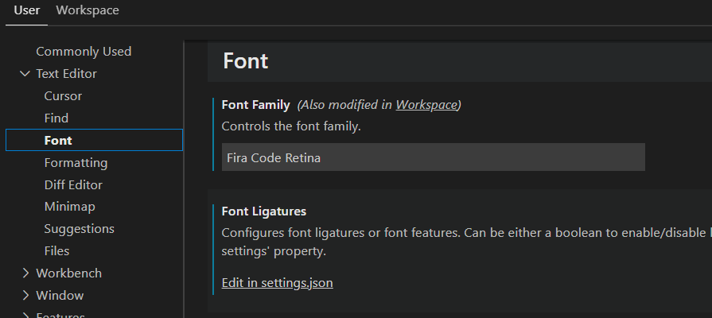
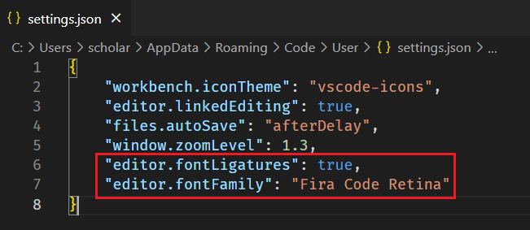

# VScode

# 调整菜单栏、侧边栏

File ===> Preferences ===> settings 下的Workspace，进入window项找到Zoom Level，修改为`1.3`。

进入`VSCode-win32-x64-1.69.2_2\resources\app\out\vs\workbench`目录下找到workbench.desktop.main.css文件，打开并找使用搜索功能查找`.part>.content{font-size:`，修改为18px即可。

# markdown插件

markdown preview enhanced

**markdown all in one**

paste image

picgo：图床上传

# 字体

Fira Code：[Fira Code仓库](https://github.com/tonsky/FiraCode/)，下载字体并安装，然后重启电脑。

设置字体：修改Font Family，然后在Font Ligatures处进入settings.json修改。

