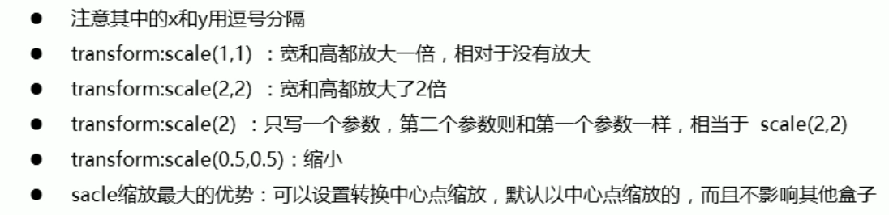
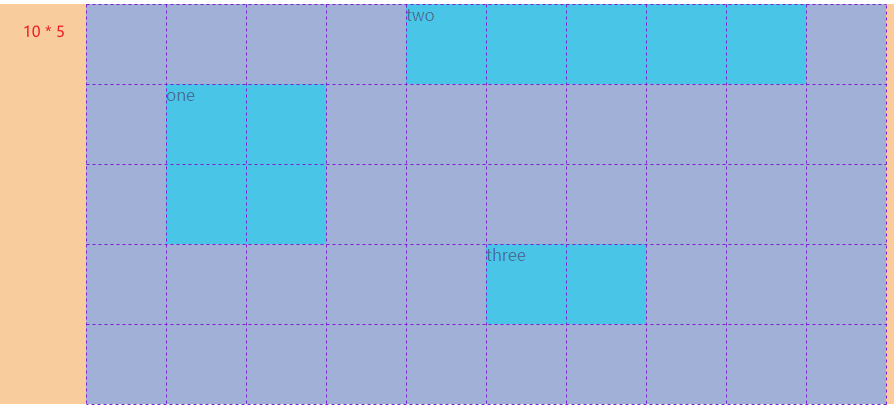
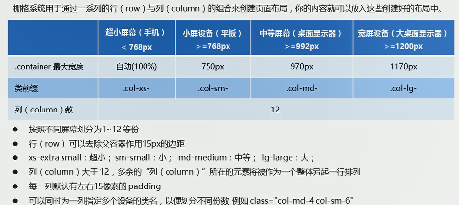
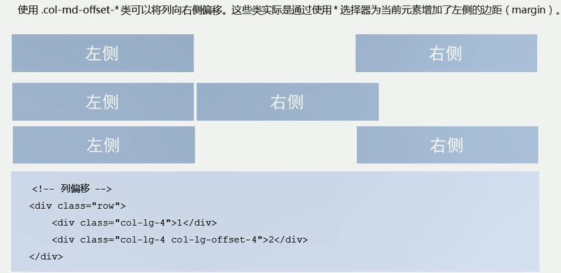
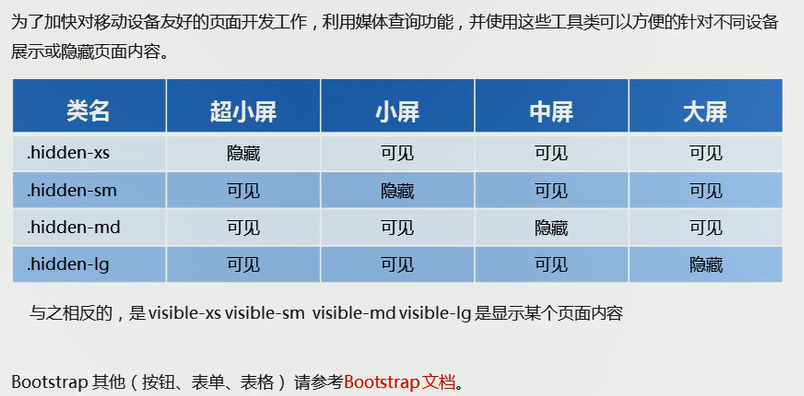

# CSS基础

## css的引入

外部样式：

```html
<link rel="stylesheet" type="text/css" href="" media="all" />  
<!-- 规范： 不要为css引入指定type，且不要用/来闭合标签-->
<link rel="stylesheet" href="" media="all" >  
```

内部样式：head标签内的style标签里的css样式。

内联样式（行内样式）：标签内通过style属性来设置元素的样式。

```html
<!-- 标签图片引入 -->
<link rel="shortcut icon" href="https://www.bilibili.com/favicon.ico?v=1">
```

## 选择器

### 标签选择器

以HTML标签作为选择器——元素选择器。

```html
<h1>good luck</h1>
h1 {
	color: red;
}
```

### 类选择器

> 语法格式：`.classname` （.加上类名）

使用时要为元素赋予**class属性和值**，如果要为元素的class属性设置多个属性值时则要**用空格隔开**。

```html
<h1 class="classA classB">good luck</h1>
.classA.classB {
	color: red;
}
```

句法：

- **`.类名{属性：值；......}`**                             选择含有该classname的元素
- **`.类名.类名{属性：值；......}`**                    选择同时有该两个class属性值的元素，不区分先后顺序
- **`元素选择符.类名{属性：值；......}`**            选择含有该class属性值的元素
- **`元素选择符.类名.类名{属性：值；......}`**   选择同时含有这两个class值的元素

### ID选择器

> 语法格式：**#+ID值**（#是一个散列字元，也叫井号、哈希字符、哈希记号、三连棋棋盘）

使用时要为元素设置ID属性和值。

```html
<h1 id="c">hello</h1>
#c {
	color: red;
}
```

句法：

- **`#ID {属性：值；......}`**    
- **`元素选择符#ID{属性：值；......}`**        选择含有该ID属性值的该元素

注意：ID选择符不能串在一起使用，因为ID属性值不能是以空格分隔的列表，其他和类选择符基本一致。

### 属性选择器

**简单属性选择器：**只确认到某个或多个属性本身

```html
<h1 class="h_col">continue</h1>

<!-- 基于一个属性的选择器：选择h1元素中含有class属性的元素 -->
h1[class] {
	color: red;
}
<!-- 基于多个属性的选择器：选择同时含有class和title的img元素 -->
img[class][title] {
	color: red;
}
<!-- 结合通配符，选择所有含有title属性的元素 -->
*[title] {
	font-weight: bold;
}
```

**精确属性值选择器：**精确到一个或多个属性值的具体值

```html
<h1 class="h_col1 h_col2">continue</h1>

h1[class="h_col1 h_col2"] {
	color: red;
}
img[class="my_img"][title="一张图片"] {
	font-weight: bold;
}
```

**部分匹配属性值选择器：**模糊匹配，选择到属性值本身包含某一部分特定值的

| 形式                      | 说明                                                         |
| ------------------------- | ------------------------------------------------------------ |
| **[attribute\|="val"]**   | 选择的元素本身有attribute属性且属性值<br>以`val`或`val-`开头 |
| **[attribute~="val"]**    | 选择的元素有attribute属性，且属性值是**包含val的一组词**     |
| **[attribute*="val"]**    | 某个属性值包含子串val                                        |
| **[attribute^="val"]**    | 属性值以val开头                                              |
| **[attribute$="val"]**    | 属性值以val结尾                                              |
| **[attribute$=".pdf" i]** | 加上i之后，将会不区分大小写                                  |


### 复合选择器

群组选择器（并集选择器、分组选择器）：选中多个元素多多个元素进行统一设置，不同元素间以`,`隔开。

```css
h1,h2,h3,h4,h5,h6 {
    color: red;
}
.one, p, #test {
    color:red;
}
```

后代选择器：针对存在父子关系或祖辈关系的元素，选择某个元素的后代。

```html
<h1><em>后代选择器：</em>针对存在父子关系或祖辈关系的元素，<span>选择某个元素的后代。</span></h1>
<!-- h1的后代em -->
h1 em {
	color: red;
}
<!-- h1的后代em和span -->
h1 em, h1 span {
	color: red;
}
```

子（子元素）选择器：只针对父子关系的元素，选择到某个元素的子代元素。

```html
<h1><em>子（子元素）选择器：</em>只针对父子关系的元素，选择到某个元素的子代元素。</h1>
h1 > em {
	color: red;
}
```

紧邻同胞元素选择器：选择同属一个父元素的子代元素，并且这两个子代元素必须紧邻。

```html
<div>
    <h1>紧邻同胞</h1>
    <p>紧邻同胞元素选择器：选择同属一个父元素的子代元素，并且这两个子代元素必须紧邻。</p>
    <p>是h1同胞但不紧邻</p>
</div>
<!-- 选择到h1后的紧跟着的第一个p -->
h1 + p {
	color: red;
}
```

后代选择器、子（子元素）选择器、紧邻同胞元素选择器可以一起结合使用，例如：

```css
html > body table + ul { 
    margin-top: 1.5em;
}
```

选择后续同胞选择器：选择某个元素后同属一个父元素的元素。

```html
<div>
	<h2>后续同胞</h2>
	<h1>后续同胞</h1>
	<p>紧邻同胞元素选择器：选择同属一个父元素的子代元素，并且这两个子代元素必须紧邻。</p>
	<p>是h1同胞但不紧邻</p>
</div>
<!-- 两个p都在h2后面并且都同属一个父元素，所以h2后面所有的p都会被选中 -->
h2 ~ p {
    color: red;
}
```


### 伪类选择器

伪类的效果是把某种幽灵类应用到伪类依附的元素上，**它为所依附的元素设定某种幽灵类**。举例如下：

```html
p:first-child {......} <!-- 为依附的p设定幽灵类 -->
<!-- 以上类似于以下 -->
<div>
	<p class="first-child">它为所依附的元素设定某种幽灵类</p>
</div>
```

**拼接伪类：**CSS允许把不互相排斥的伪类拼接在一起。

```html
<a href="#">链接</a>
<!-- 鼠标悬停链接上时的样式设置 -->
a:visited:hover {
	color: aquamarine;
}
```

**结构伪类：**指代文本中的标记结构。

| 伪类                     | 选择结构                                                     |
| ------------------------ | ------------------------------------------------------------ |
| **:root**                | 页面根元素——html                                             |
| **:empty**               | 选择没有任何子代、没有文本节点或空白的元素<br>p:empty {display: none;}  禁止显示空段落 |
| **:only-child**          | 选择完全没有同胞的元素<br>img:only-child {......}     img在其父类中是唯一一个元素，“独生子女” |
| **:only-of-type**        | 选择同胞中唯一一种元素类型的元素<br>img:only-of-type {......}    img这种类型在其父类中是只有一个的，可以有其他同胞元素 |
| **:first-child**         | 第一个子元素<br>li:first-child {......}   选择第一个li元素   |
| **:last-child**          | 最后一个子元素                                               |
| **:first-of-type**       | 选择某种元素类型的第一个子代元素                             |
| **:last-of-type**        | 选择某种元素类型的最后一个子代元素                           |
| **:nth-child(n)**        | 选择某种元素的第n个子元素（n是从0~无穷的整数）<br>:nth-child(1) 和 :first-child 等效<br>括号内可以填入表达式，an+b或an-b，a、b是具体数，n代表0~无穷 |
| **:nth-last-child(n)**   | 以倒序的方式来选择                                           |
| **:nth-of-type(n)**      | 选择某种类型元素的第n个元素                                  |
| **:nth-last-of-type(n)** | 以倒序的方式来选择                                           |


**动态伪类：**多用于超链接。

| 超链接伪类   | 说明     |
| ------------ | -------- |
| **:link**    | 未访问   |
| **:visited** | 已经访问 |

| 用户操作伪类 | 说明                                                         |
| ------------ | ------------------------------------------------------------ |
| **:focus**   | 当前获得输入焦点的元素<br>例如键盘输入                       |
| **:hover**   | 鼠标指针放置其上的元素<br>例如鼠标悬停于超链接上             |
| **:active**  | 由用户输入而激活的元素<br>例如用户单击超链接时按下鼠标的那段时间 |

**UI状态伪类：**根据用户界面元素（多是表单元素）的当前状态引用样式

| 用户界面（user-interface）状态伪类 | 说明                                       |
| ---------------------------------- | ------------------------------------------ |
| **:enabled**                       | 指接受输入的元素                           |
| **:disabled**                      | 指不接受输入的元素                         |
| **:checked**                       | 指用户或文档默认选中的单选按钮或复选框元素 |
| **:indeterminate**                 |                                            |
| **:default**                       | 指默认选中的单选按钮、复选框或选项         |
| **:valid**                         |                                            |
| **:invalid**                       |                                            |
| **:in-range**                      |                                            |
| **:out-of-range**                  |                                            |
| **:required**                      | 指必需输入的输入框                         |
| **:optional**                      |                                            |
| **:read-write**                    | 指可由用户输入的输入框                     |
| **:read-only**                     | 指不能由用户输入的输入框                   |


### 伪元素选择器

在文档中插入虚构的元素，这个元素在文档树中是找不到的，因此是伪元素。需要注意的是，伪元素选择器只能出现在所有选择器的最后，创建的元素属于行内元素，权重为1。

| 伪元素             | 说明                                               |
| ------------------ | -------------------------------------------------- |
| **::first-letter** | 装饰任何非行内元素的首字母或开头的标点符号和首字母 |
| **::first-line**   | 选择文档元素的首行文本                             |
| **::before**       | 前置元素                                           |
| **::after**        | 后置元素                                           |

```css
h2::before {
    content: "";
    ......
}
h2:after {
    content: "The End";
}
```

应用场景：通过伪元素来实现字体图标、在图像链接上添加半透明黑幕、用于清除浮动等。

**【注意】创建的是元素内部的内容的前置或后置元素。**

## 字体

font-style：italic是斜体，normal是不倾斜。

复合属性：`font: font-style font-weight  font-size/line-height font-family;`

1. 按上面顺序书写，属性间以空格隔开，说明：`font：正斜 粗细 大小/行高 字体`。
2. 复合写法中不需要设置的属性值可以省略（会使用默认值），但font-size、font-family必须存在。

`@font-face {}`：用于引入自定义字体。

```css
@font-face {
    font-family: "xxx"; /* 引入的字体族的描述，以便引用 */
    src: url(),url(),...; /* 源和备用源 */
    /*src: url() format(),url() format(),...; format()告诉代理所用字体的格式，还能为不带常规拓展名的字体文件制定格式*/ 
}
```

format的值有：

1. embedded-opentype：eot格式。
2. opentype：otf格式。
3. svg：svg格式。
4. truetype：ttf格式。
5. woff：woff格式。


## 文本属性

文本的外观，比如文本的颜色、对齐文本、装饰文本、文本缩进、行间距等。

- color：文本颜色，规范建议使用十六进制的RGB颜色值，字母小写，颜色可以缩写时使用缩写。
- text-align：横向对齐，left（默认）、right、center，影响的是行内、行内块元素。
- vertical-align：纵向对齐，只能用于行内元素和置换元素。（baseline（默认）、bottom、middle、top、text-top等）
- text-decoration：装饰文本，给文本添加下划线、删除线、上划线等，none（默认）、underline（下划线）、overline（上划线）、line-through（删除线）。
- text-indent：文本缩进，通常是将段落的首行缩进，数值，单位px或em等，em是相对单位，相对当前元素（font-size）的1个文字的大小，如果当前元素没有设置font-size，则相对父元素。
- text-transform：文本大小写转换。
- line-height：行高（行间距），行间距由上间距、文本高度、下间距组成，值、像素，行高不加单位时指当前元素的多少倍。
- text-shadow：文字阴影，只有四个值，`text-shadow: rgb(x,x,x) 水平偏移量 垂直偏移量 模糊半径;`（和盒子阴影的前四个值是一样的）。


## 鼠标光标形状

`cursor`样式，用于设置鼠标光标在元素上时显示的样式，其值如下：

1. `default`：默认值，通常是箭头。
2. `pointer`：小手。
3. `text`：工字型，就像字母i的大写形式。
4. `move`：十字箭头光标，提示用户此处可移动。


## 元素显示模式

元素显示模式：元素以什么方式进行显示；掌握元素的显示方式阔以有助于对元素的使用。

分类：块元素、行内元素、行内块元素。

**block——块元素特点：**

1. 独占一行；
2. 高度、宽度、内边距、外边距可以控制；
3. 宽度默认是父级宽度的100%，高度如果没有设置则按照其里面内容的高度；
4. 是一个容器及盒子，里面可以放行内元素、块元素（文字类的除外，比如p）。

HTML 中的块级元素：

```html
<div>、<dl>、<dd>、<ul>、<ol>、<li>、<h1>~<h6>、<hr>、<p>、<footer>、<header>、<form>、<section>、<table>
<address>、<article>、<aside>、<blockquote>、<fieldset>、<figcaption>、<figure>、<pre>
```

**inline——行内元素特点：**

1. 一行可显示多个行内元素。
2. 宽度、高度直接设置无效；默认宽度为其本身内容宽度。
4. 内容只能是容纳文本或其他行内元素。
5. a标签内不能再放a标签，a标签内可以放块级元素，但给a转换为块元素更安全。

**inline-block——行内块元素：**

img、input、td，同时具有块元素和行内元素的一些特点：

1. 一行可显示多个，两个行内块元素间存在间隙，很难控制这个间隙。
2. 默认宽度为其本身内容的宽度。
3. 高度、宽度、内边距、外边距可以控制。

不同模式间的转换：`display:block | inline | inline-block`。

## 元素透明度

`opacity`：值为0-1之间的数字，1表示不透明，其会使元素整体透明，包括里面的内容（文字、图片等）。

## 背景

背景颜色：background-color：transparent（透明的）或颜色值。

背景图片：background-image：url()。

背景平铺：background-repeat：repeat（默认）、no-repeat、repeat-x、repeat-y。

背景位置：background-position：x y。

- x坐标、y坐标，x和y可以使用精确单位或方位名词（top、bottom、right、left、center），如果只指定一个方位名词，另一个忽略，此时忽略的是默认居中。
- 如果是精确单位，第一个一定是x坐标，第二个一定是y坐标。
- 如果只指定一个数值，那么这个数值一定是x坐标，另一个默认center。
- 如果精确单位和方位名词混合使用，第一个一定是x坐标，第二个一定是y坐标。

背景大小：background-size，值为关键字（cover、contain、auto）或数值（百分比、em、px等）。

- `background-size: 一个值;`，值指定图片的宽度，图片的高度隐式的为 auto 。
- `background-size: 值1 值2;`，第一个值指定图片的宽度，第二个值指定图片的高度。
- `background-size: 值1, 值2;`，设置多重背景的图片大小

背景固定：background-attachment：scroll（随内容滚动，默认）、fixed（背景固定）。

```css
/* 复合写法 */
background：背景颜色 背景图片地址 背景平铺 背景图像滚动 背景图片位置;
background：背景颜色 背景图片地址 背景平铺 背景图像滚动 背景图片位置/背景大小;
/* 示例：background: color image repeat position/size */
background：red url() no-repeat scroll center center/400px 400px;
```

css3，ie9+才支持：背景色半透明：`background-color：rgba(0, 0, 0, .8);`，a是alpha。


## CSS三大特性

### 优先级

解决使用不同选择符选择了相同的元素下的样式冲突问题。（选择器的优先性）

如果选择器相同（特指度相同），那就是层叠；选择器不同时则根据权重判断，权重大的将会覆盖权重小的。各选择器权重如下：

- 通配符*：`0,0,0,0`；继承或者连结符（>、+等）是没有特指度的，连0都没有。
- 元素选择器：`0,0,0,1`。
- 类、属性选择、伪类选择器：`0,0,1,0`。
- ID选择器：`0,1,0,0`。
- 行内样式style=""：`1,0,0,0`。
- `!important`，表示最重要， 权重是无穷大但对特指度没有任何影响，用于样式属性值最后并以空格隔开。

复合选择器的权重叠加：权重会叠加但不会有进位，权重比较是从左往右一个个数对应比较。

`0,0,1,1`大于`0,0,0,1`，`0,0,1,0`大于`0,0,0,13`，以此类推。

### 继承性

继承：某些样式不仅能应用到所指元素上，还应用到元素的后代上。（特例：body元素定义了背景样式但html没有定义，此时背景样式会向上传递给html元素）

border、大多数盒模型属性不会被继承；**text-、font-、line-这些开头的可以继承，以及color属性**。（line-height：可以不加单位，不加单位时表倍数，当前元素的倍数。）

常用的css可继承的属性：

- font：组合字体

- font-family：规定元素的字体系列

- font-weight：设置字体的粗细

- font-size：设置字体的尺寸

- font-style：定义字体的风格

- text-indent：文本缩进

- text-align：文本水平对齐

- line-height：行高

- color：文本颜色

- visibility：元素可见性

- 光标属性：cursor


### 层叠性

层叠性主要解决样式冲突问题，相同选择器设置相同的样式（值不同），此时一个样式就会覆盖另一个冲突的样式。（相同权重的样式会发生覆盖）

重叠性原则：就近原则，哪个离body结构近哪个就执行，注意**只是覆盖冲突的样式，并不是全部覆盖**。（如果是不同css文件中的样式起冲突呢？一般都不会出现不同文件下的样式冲突，因为样式文件都对应一个结构）。

---

**css样式优先级是：**浏览器缺省 < 外部样式表（引入的css文件） < 内部样式表（`<style>`标签内的样式） < 内联（行内）样式（标签中style属性声明的样式）。

完整的优先级：浏览器缺省 < 外部样式表(css文件) < 外部样式表类选择器 < 外部样式表类派生选择器 < 外部样式表ID选择器 < 外部样式表ID派生选择器 < 内部样式表(`<style>`标签内的样式) < 内部样式表类选择器 < 内部样式表类派生选择器 < 内部样式表ID选择器 < 内部样式表ID派生选择器 < 内联样式(style=”)；共12个优先级。


## 盒模型

行内元素、块元素、行内块元素都存在盒模型，行内元素不支持宽和高，但仍可设置padding、margin、border。


### width height：宽高

width、height无法应用到行内非置换元素。

盒子模型有两个，标准盒模型和替代盒模型：

- 标准盒模型（box-sizing：content-box）（默认的）：width和height是指content的大小（整个盒子的大小为border+padding+content）。
- 替代盒模型（box-sizing：border-box）：width和 height则是指整个盒子的大小（整个盒子的大小为border+padding+content）。
- 指定了width和height时，它俩一个是content不变（标准盒模型），一个是盒子大小不会变（替代盒模型）。
- 盒模型类型不能进行继承，默认的是标准盒模型。

子元素可以将width、height设置为百分比来对父元素的宽高进行继承，注意无论父元素是哪种盒模型，继承的都是content的宽高。子元素是块级元素时，默认继承父元素的width。

### **border：**边框

border：border-width border-style border-color；简写没有顺序要求，规范这样写。

border-style：solid(实线) dashed(虚线) dotted(点线)。

border-top：宽 样式 颜色。

border-collapse：collapse；把相邻边框合并在一起。

圆角边框：`border-radius：半径;`；(椭)圆与边框的交集形成圆角效果，值为半径或百分比（百分比时表示的是以各边的百分之多少来取值作为椭圆的长轴、短轴的一半，然后得到的椭圆再与边框交集，从而得到圆弧）。


### **padding：**内边距

padding-x：值；x：left、top、bottom、right；

padding：5px；上下左右都是5px；

padding：5px 10px；上下是5px，左右是10px；

padding：5px 10px 15px；上、右、下，左的复值使用右的；

padding：top right bottom left；四个值，上右下左的顺序；

总结：如果没有指定值某个方位的值，则按照上-下、左-右的关系来确定，padding的值的顺序按照顺时针排放（上右下左）。


### **margin：**外边距

margin-x：值；x：left、top、bottom、right；和padding基本一致。

margin：0 auto；块级元素必须设置了宽度才能实现水平居中。行内块、行内元素居中对齐则是给父元素使用text-align：center；

关于外边距的问题：

1. 解决**相邻元素垂直外边距的合并：**尽量只给一个盒子加margin值；
2. 浮动的元素没有内外边距合并问题；
3. **嵌套块元素垂直外边距的塌陷：**
   - 
4. **总结：上下相邻或嵌套的块级盒子会垂直方向上发生外边距合并（浮动的元素不会）。**

清除网页元素的内外边距：

```css
* {
    padding: 0;
    margin: 0;
}
```

注意：行内元素为了照顾兼容性，尽量只设置左右内外边距，不要设置上下内外边距。

### box-shadow：盒子阴影

CSS3新增盒子阴影：`box-shadow：h-shadow v-shadow blur spread color inset;`

| 值       | 描述                                                         |
| -------- | ------------------------------------------------------------ |
| h-shadow | 必须，水平偏移量，允许负值                                   |
| v-shadow | 必须，垂直偏移量，允许负值                                   |
| blur     | 可选，模糊半径                                               |
| spread   | 可选，阴影扩大（在原来盒子大小之上扩大多少）<br>默认的阴影大小为盒子大小 |
| color    | 可选，阴影颜色                                               |
| inset    | 可选，将阴影改为内部阴影<br>（outset-外部阴影、inset-内部）  |

盒子阴影不占用空间，不会影响其他的盒子。

```css
.box-shadow-test {
      height: 200px;
      width: 200px;
      margin: 100px auto;
      /* transform: rotate(45deg); */
      border-radius: 200px 0 0 0;
      box-shadow:
      /*参数依次为：颜色、水平阴影位置、垂直阴影位置、模糊距离、阴影大小*/
         #f44336 -2px -2px 0 1px, 
         #ff9800 -4px -4px 0 3px,
         #ffeb3b -6px -6px 0 5px, 
         #8bc34a -8px -8px 0 7px, 
         #00bcd4 -10px -10px 0 9px,
         #2196f3 -12px -12px 0 11px,
         #9c27b0 -14px -14px 0 13px; 
}
```


## html与body

1. html元素的宽与高取决于浏览器的宽高。html元素是块级元素，根据块级元素的性质，html默认宽度是占一行的，也就是浏览器窗口的宽度。**如果没给html设置高度，那么默认的高度就是有它里面包含的内容高度所决定的**，如果给html设置了`height:100%`，那么它的高度就是浏览器窗口的高度。
2. html元素默认设置了`overflow:auto`的css样式，在需要的时候就会显示滚动条。也就是它里面的内容高度超过了浏览器窗口的高度，不管html有没有加上高度，都会出现滚动条。
3. body元素默认的定位是position:static，基于 **设置了定位的元素是参考该元素最近的、且设置了非static定位属性的父元素来定位 **的原则，那么所有定位子元素（父元素没设置定位属性）的定位都是相对于html元素的坐标系统。
4. body相对于html元素，因此将body的宽度设置为百分比值时将是相对于html的宽度——即浏览器可视区域宽度。
5. 在几乎所有的现代浏览器中，页面跟浏览器窗口的偏移量是通过给body元素设置margin属性，而不是给html元素设置padding属性。我给html设置了padding也是起作用的。
6. 如果不设置html元素的背景色，那么body的背景色将会传递给根节点，此时整个页面背景色都将是body设置的背景色的颜色。


## 浮动

### 概述

标准流（文档标准流）：简单来说标准流就是浏览器按照各种元素标签排版布局中默认的状态，浏览器在渲染代码的时候是从左往右、从上到下开始渲染，元素也是从左往右、从上往下的流式排列。（也就是没有被其他排版浮动和定位相关的CSS属性干扰的就叫标准流，**块级元素无论宽有没有一行的长度都会独占一行**）。

**浮动元素特性：**脱离文档流、浮动的盒子不再保留原来的位置、浮动元素一行中显示且顶端对齐、具有行内块特性。

**使用：**浮动初衷就是为了解决文字环绕的；浮动元素经常与标准流父级元素搭配使用；浮动元素不会压住它下面标准流的文字或图片。

**注意：**

1. 浮动元素的兄弟元素尽量都要浮动，如果某一个块级元素不浮动那么其后面浮动的元素将在新的一行上显示。
2. 浮动的元素影响的是其后面的兄弟元素的标准流，不会影响前面的。（也就是说，浮动的元素除了不压住其后面标准流的文字和图片之外，也不会压住其前面的非浮动块级元素，）

### 清除浮动

**清除浮动：**（清除浮动对父元素的影响）

- 清除浮动的本质就是清除浮动元素造成的影响，为了解决**父元素因为子级元素浮动引起的内部高度为0的问题**；因此如果父元素有高度就不需要清除。
- 清除浮动后，父元素就会根据浮动的子盒子自动检测高度。（清除元素的左浮动，那就会根据左浮动盒子来检测高度，其他同理）
- 清除浮动的策略是闭合浮动，就是让父盒子闭合出口和入口，不让子盒子出来。

清除浮动的方法：

1. 额外标签法（隔墙法），W3C推荐的做法：在最后一个浮动的元素的后面添加一个清除了浮动的块级元素。（不常用）

   ```html
   style {
   	.float1 { float: left; }
   	.clear { clear: both; }
   }
   <div>
       <div class="float1"></div>
       <div class="float1"></div>
       <div class="float1"></div>
       <div class="clear"></div>
   </div>
   ```

   

2. 父级添加overflow属性，将其属性值设为hidden、auto或scroll。（代码简单但无法显示溢出的部分）（较常用）

3. 父级添加after伪元素（额外标签法的升级版）。（没有增加标签，结构更简单，但需要考虑版本兼容）（推荐使用）

   ```css
   .clearfix:after {	
   	content: "";
   	display: block;
   	height: 0;
   	clear: both;
   	visibility: hidden;
   }
   .clearfix {   /* IE6、7 专用 */
   	*zoom: 1;
   }
   ```

   

4. 父级添加双伪元素。（推荐使用）

   ```css
   .clearfix:before, 
   .clearfix:after {	
   	content: "";
   	display: table;
   }
   .clearfix:after {	
   	clear: both;
   }
   .clearfix {   /* IE6、7 专用 */
   	*zoom: 1;
   }
   ```

## BFC

**概念：**BFC（Block Formatting Context），块格式化上下文，指一个独立的渲染区域，或者说是一个隔离的独立容器。（一个独立的封闭空间，不会影响到其外面的内容。）

可以形成BFC的元素有：

1. 浮动元素，float；
2. 绝对定位元素，position；
3. 元素的display为（inline-block、table-cell、table-caption、flex）中的一个；
4. 元素的overflow除visible以外的值（hidden、auto、scroll）；
5. 根元素body；html。

**特性：**

1. 内部的box会在垂直方向上一个接一个放置。
2. 垂直方向上的距离由margin决定。
3. BFC的区域不会和浮动（float）的元素的区域重叠。
4. 计算BFC的高度，浮动元素也参与计算。
5. BFC盒子与其子元素不会存在margin塌陷问题。
6. BFC就是页面上的一个独立容器，容器里面的子元素不会影响外面的元素。


## 四种定位

定位，常用于盒子自由地在某个**盒子内**移动或将其固定在**屏幕中**某个位置（可再覆盖在盒子上层）。

四种定位：

1. `position：static`：静态定位，默认的定位方式，相当于没有偏移量的定位。
2. `position：relative`：相对定位，相对于本身原来的位置来设置偏移量进行定位（原有位置继续占有，不会脱离标准流）。
3. `position：absolute`：
   - 绝对定位，相对于祖先元素进行定位（如果没有祖先元素或祖先元素没有定位，则相对于浏览器进行定位）。
   - 如果祖先元素有定位（相对、绝对、固定定位），则以最近的有定位的祖先元素为参考点来偏移。
   - 绝对定位会脱离标准流，原有位置不再保留占有。
4. `position：fixed`：固定定位，**将元素固定于浏览器可视区域**。
   - 以浏览器可视窗口为参照点，跟父元素没有关系，不会随滚动条滚动。
   - **脱离标准流，可以看作是特殊的绝对定位。**
5. `position：stickey`：粘滞定位，以可视窗口为参考，当粘滞元素滑动到指定位置后就会粘滞在指定位置而不再随内容的滚动而滚动，既不脱离文档流也不会改变盒子性质，占有位置，当黏性元素的父元素不在可视区后其也会消失。粘滞定位其起作用的要求如下：（可以看作是相对与固定定位的结合）
   - 父元素不能overflow:hidden或者overflow:auto属性。
   - 必须添加top、bottom、right、left其中一个才有效。
   - 父元素的高度不能低于sticky元素的高度。
   - sticky元素仅在其父元素内生效，当其父元素区域滚动出了可视区后，该黏性元素也随之消失。


定位要结合top、bottom、left、right四个属性使用，这四个属性表示偏移量，是相对于元素边线的偏移量。

子绝父相：子级使用绝对定位，父级要用相对定位。（子级绝对定位，脱离标准流，不会影响其他盒子的位置）


叠放顺序：`z-index`：正、负、0、auto（默认），数值越大越位于前面。

绝对定位与固定定位的特殊性：

- 行内元素添加了绝对定位或固定定位，可直接设置宽高。（这两个都脱离了标准流，相当于行内块）
- 块级元素添加了绝对定位或固定定位，如果不设置宽高，则默认是内容大小。
- 绝对定位或固定定位都脱离标准流，不会触发外边距合并问题。
- 绝对定位或固定定位会压住它下面的标准流的所有内容，浮动则不会压住文字或图片。


## 显示与隐藏

让一个元素在页面中显示或隐藏。

1. display：是显式隐藏，使用none属性值，block属性值还有显示元素的意思。
2. visibility：是显式隐藏，visible（元素可视）、hidden（元素隐藏），隐藏后继续占有原来的位置。
3. overflow：是隐式隐藏，溢出隐藏，visible、hidden、scroll（总是有滚动条）、auto（在溢出的时候出现滚动条）。


## CSS高级技巧

### 精灵图

精灵图（sprites）：为了有效地减少请求的次数，提高访问速度

- 把多张小背景图整合到一张大背景图中，主要针对背景图使用。
- 移动大背景图，得到小的背景图。
- 一般背景图都是往左往上移动，是负值。

### 字体图标

字体图标iconfont的使用：展示的是图标，本质是文字，常用于结构样式简单的小图标

1. 下载后得到一个字体文件的压缩包，解压后把fonts文件夹放到页面的根目录；
2. 用CSS引入字体文件，用`@font-face`字体声明；
3. 打开解压后得到的index.html，找到需要的字体图标，复制右下角的小方框；
4. 粘贴复制的小方框到指定的位置，再修改引入位置的字体族，字体图标引入成功。

字体图标下载网站：

1. icomoon字体库：[Icon Font & SVG Icon Sets ❍ IcoMoon](https://icomoon.io/)；
2. 阿里巴巴的：[iconfont-阿里巴巴矢量图标库](https://www.iconfont.cn/)。

追加字体图标：

- 如果需要重新追加图标，可使用解压包文件里的selection.json上传到图标下载网站；
- 然后添加新的图标再生成字体文件，下载字体压缩包，解压后用新的fonts替换原来的fonts文件夹。

### css 画三角

```css
.box {
    width: 0;
    height: 0;
    line-height: 0;
    font-size: 0;
    border: 50px solid transparent;
    border-left-color: pink;
}
```

### CSS用户界面样式

1. 鼠标样式-光标形状——`cursor: `
   - default，默认属性值，小白箭头。
   - pointer，小手。
   - move，移动。
   - text，文本。
   - not-allow，禁止。
2. 轮廓线：表单有默认的蓝色轮廓线，如果要去掉默认的，给表单添加`outline：0;` 或 `outline：none;` 样式即可。

3. 文本域：默认的文本域是可以拖拽的，使用 `resize：none;` 样式可以防止拖拽。


### vertical-align属性应用

vertical-align属性经常用于设置图片或者表单（行内块元素）和文字垂直对齐；vertical-align属性**只适用于行内元素和行内块元素**。

- baseline：基线对齐，默认的对齐方式，元素放置在父元素的基线上。
- top：元素顶端与行中最高元素的顶端对齐。
- middle：元素放置于父元素的中部。
- bottom：元素顶端与行中最低元素的顶端对齐。

图片底部会有一个空白缝隙，原因是**行内块元素会和文字的基线对齐**，解决办法：

1. 给图片添加vertical-align：middle或top或bottom。（提倡使用）
2. 把图片转为块元素。

vertical-align属性的应用：

1. 文本框与表单按钮无法对齐（按钮都是默认是基线对齐）。
2. 图片也是默认基线对齐，如果遇到图片与某些元素没对齐那可以考虑调整对齐方式。
3. 使用图片撑开div等，底部会有空隙，可设置vertical-align来去掉。（也是因为图片是基于基线对齐，而如果使用图片撑开盒子，那么底部就会预留出一点位置，此时图片的底部对齐的就是基线，预留的位置是给可能存在的文字的）
4. 结合line-heigh使img垂直居中。

### 省略号显示溢出文本

单行文本溢出的省略号代替：

```html
<div>单行文本溢出部分使用省略号代替</div>
div {
	width: 180px;
	height: 90px;
	background-color: aqua;
	margin: 0 auto;
	/* 强制在一行内显示文本 */
	white-space: nowrap;
	/* 溢出隐藏 */
	overflow: hidden;
	/* 超出部分使用省略号代替 */
	text-overflow: ellipsis;
}
```

多行文本溢出的省略号代替：（有较大兼容性问题，适用于webkit浏览器和移动端（移动端大部分是webkit内核））（了解）

```css
/* 溢出隐藏 */
overflow: hidden;
/* 超出部分使用省略号代替 */
text-overflow: ellipsis;
display: -webkit-box;
/* 限制一个块内的文本行数 */
-webkit-line-clamp: 2; 
/* 设置或检索伸缩盒对象的子元素的排列方式 */
-webkit-box-orient: vertical;
```

多行文本的更推荐由后台人员来实现。

### 常见布局技巧

**1、margin负值：**

- margin负值会向左移动，可用于实现盒子的边框的重叠。（重叠的边框，当使用`a:hover	`来设置边框颜色时，这时会出现某一边被其他的盒子边框覆盖的情况，这时如果当前元素都没有加定位那就可以加相对定位，如果都已经有定位了那就使用`z-index`来提层）


**2、文字围绕浮动元素：**浮动元素不会压住文字


```html
<div class="box">
    <div class="pic">
        
    </div>
    <p>大家好大家好大家好大家好大家好大家好大家好大家好(๑╹◡╹)ﾉ”</p>
</div>
```

```css
* {margin: 0;padding: 0;}
.box {width: 300px;height: 100px;background-color: #00a4ff;margin: 30px auto 0;}
.pic img{float: left;width: 100px;height: 100px;margin-right: 20px;}
```

**3、行内块元素运用：**行内块元素间有间隔，使用`text-align`可以将行内元素、行内块元素进行居中对齐。


```html
<div class="nav-page">
    <a href="#" class="before">&lt;&lt;上一页</a>
    <a href="#">2</a>
    <a href="#">3</a>
    <a href="#">4</a>
    <a href="#">5</a>
    <a href="#">...</a>
    <a href="#" class="after">&gt;&gt;下一页</a>
    到第
    <input type="text" class="">
    页
    <button>确定</button>
</div>
```

```css
* {margin: 0;padding: 0;}
.nav-page {text-align: centmargin-top: 30px;}
.nav-page a {display: inline-block;width: 36px;height: 36px;line-height: 36px;text-decoration: none;text-align: center;font-size: 14px;color: whitesmoke;background-color: tomato;}
.nav-page .before, 
.nav-page .after {width: 85px;}
.nav-page input {width: 45px;height: 36px;text-align: center;border: 1px solid #ccc;outline: none;
}
.nav-page button {width: 60px;height: 36px;border: 1px solid #ccc;background-color: #ccc;}
```

**4、CSS三角的运用：**


```html
<div class="box">
    <span class="miaosha">$1650
        <i></i>
    </span>
    <span class="price">$5650</span>
</div>
```

```css
.box {width: 160px;height: 24px;border: 1px solid red;margin: auto;}
.box .miaosha {display: inline-block;position: relative;width: 90px;height: 100%;color: #fff;text-align: center;font-weight: 600;background-color: red;}
.box .miaosha i {position: absolute;top: 0;right: 0;border-color: transparent #fff transparent transparent;border-style: solid;border-width: 24px 10px 0 0;}
.box .price {color: gray;text-decoration: line-through;}
```


## 其他

### 浏览器前缀


### 图片格式


### SEO优化—TDK

TDK：title、description、keywords。

```html
<title>Title</title> <!-- 网页标题 -->
<meta name="description" content=""> <!-- 网页描述标签 -->
<meta name="keywords" content=""> <!-- 网页关键字标签 -->
```

### SEO优化—logo

1. logo所在盒子先放一个h1标签。
2. h1里面放一个a标签，logo图标是该标签的背景图。
3. a标签的文字是网站名称，文字可以用`font-size`或`overflow`来实现隐藏。

### ico图标

```html
<link rel="shortcut icon" href="favicon.ico" type="image/x-icon">
```


## 表格

table标签的一个属性——**border-collapse**，其属性值作用如下：

1. `seperate`：边框之间分离。
2. `collapse`：两两相临边框合并。

```html
<div class="box">
    <table>
        <caption><h4>这是一个表格</h4></caption>
        <thead>
        <tr>
            <th>序号</th>
            <th>姓名</th>
            <th>年龄</th>
            <th>性别</th>
            <th>家乡</th>
        </tr>
        </thead>
        <tbody>
        <tr>
            <td>1</td>
            <td>王曼</td>
            <td>22</td>
            <td>女</td>
            <td>台湾省</td>
        </tr>
        </tbody>
    </table>
</div>
```

```css
.box {
        width: 600px;
        margin: 100px auto;
    }
    table {
        border-collapse: collapse;
        text-align: center;
    }
    th,td {
        width: 90px;
        border: 1px solid #000;
    }
```

## 媒体查询

媒体查询media query：（应该从小尺寸的写到大尺寸的）

```css
@media mediatype and|not|only (media feature) { /* not、only */
    css样式
} 
/* 媒体类型：screen（屏幕，手机、平板、电脑等）、print（打印机）、all（所有） */
/* 媒体特性： max-width、min-width、width等，这几个指定宽度*/
```

```css
@media screen and (max-width: 760px) {
    当屏幕宽度不大于760px时执行的css样式代码
}
/* screen 和 and 不能省略 数值单位不能省略 */
@media screen and (min-width: 320px) {
    当屏幕宽度不小于760px时执行的css样式代码
}
```

通过媒体查询引入资源：link标签的media属性

```css
<link rel="stylesheet" media="媒体类型 关键字 (媒体特性)" href=""/>

<link rel="stylesheet" media="screen and (max-width: 320px)" href=""/>
```

# CSS规范

[CSS 代码的书写规范、顺序 | DeveWork](https://devework.com/css-written-specifications.html)（[CSS 代码的书写规范、顺序 - 云+社区 - 腾讯云 (tencent.com)](https://cloud.tencent.com/developer/article/1025155)）。

1. 位置—布局定位相关：display、position、top、right、z-index、float、clear、visibility、overflow等。
2. 大小—盒模型相关：width、height、padding、margin等。
3. 文本：font、line-height、letter-spacing、color、text-align等。
4. 背景边框：background、border等。
5. 其他-其他操作：animation、transition等（动画、变换、背景渐变、阴影等）。

[代码规范 | Aotu.io - 前端代码规范](https://guide.aotu.io/docs/css/code.html)

样式文件头：

```css
@charset "UTF-8";
```

样式代码风格：

```css
.style{
    display: block;
    width: 50px;
}
```

选择器：

```apl
尽量少用通用选择器 *
不使用 ID 选择器
不使用无具体语义定义的标签选择器
```

每个选择占一行：

```css
.jdc, 
.jdc_logo, 
.jdc_hd {
    color: #ff0;
}
```

颜色值 `rgb()` `rgba()` `hsl()` `hsla()` `rect()` 中不需有空格，且取值不要带有不必要的 0。

```css
.jdc {
    color: rgba(255,255,255,.5);
}
```

css属性值需要用到引号时，统一使用单引号。

样式书写顺序：

```css
1.布局定位属性：display / position / float / clear / visibility / overflow
2.自身属性：width / height / margin / padding / border / background
3.文本属性：color / font / text-decoration / text-align / vertical-align / white- space / break-word
4.其他属性（CSS3）：content / cursor / border-radius / box-shadow / text-shadow / background:linear-gradient …
```

```css
.jdc {
    display: block;
    position: relative;
    float: left;
    width: 100px;
    height: 100px;
    margin: 0 10px;
    padding: 20px 0;
    font-family: Arial, 'Helvetica Neue', Helvetica, sans-serif;
    color: #333;
    background: rgba(0,0,0,.5);
    -webkit-border-radius: 10px;
    -moz-border-radius: 10px;
    -o-border-radius: 10px;
    -ms-border-radius: 10px;
    border-radius: 10px;
}
```

# PC端

## PC布局

基本布局模式：页面布局的三大核心：盒子模型、浮动、定位；网页布局的本质就是用CSS摆放盒子（把盒子摆放到相应位置）。CSS提供了三种传统的布局方式（简单地说就是盒子的排列顺序是咋样的），实际开发中一个页面都包含这三种布局（移动端中还有新的布局方式）：

1. 普通流（标准流/文档流）：标签按照默认的方式进行排列。
   - 块元素独占一行（div、hr、p、h、ul、ol、dl、from、table）。
   - 行内元素从左到右自动排列，一行满了会自动换行（span、i、a、em）。
2. 浮动。
3. 定位。

网页布局原则：

1. 网页布局第一准则：多个块级元素纵向排列找标准流，多个块级元素横向排列找浮动。

2. 网页布局第二准则：先设置盒子大小，之后设置盒子的位置。 
3. 为了约束浮动元素位置，我们网页布局一般采取的策略时：**先用标准流排列上下位置，内部子元素采用浮动排列左右位置**。浮动布局注意事项如下：
   - 要遵守网页布局第一准则。
   - 如果一个元素浮动了，其余的兄弟元素也要浮动。

页面布局整体思路：（版心、上下、左右）

1. 确定页面版心（可视区、主体区域）。
2. 分析页面的上下布局（行模块）。（多个块级元素纵向排列找标准流，多个块级元素横向排列找浮动）
3. 然后分析左右结构（行模块的列模块）。（列模块经常使用浮动布局，先确定列大小，再确定列位置（网页布局第二准则））
4. 遵循的逻辑：
   - 制作HTML结构（遵循先有结构，后有样式）。
   - 理清楚布局结构再写代码。

**页面编写总结：理清布局，自上向下、自左向右、由整体到局部（由外而内），先结构后样式，一步步进行操作。**

导航栏：实际开发使用li+a的做法。


## 样式初始化

```css
/* 有些样式有默认的margin、padding，会影响 */
* {
    margin: 0;
    padding: 0;
    border-sizing: border-box;
}
```

**初始化css模板：**

```css
* {
    margin: 0;
    padding: 0;
}
em,i {
    font-style: normal;
}
li {
    list-style: none;
}
img {
    border: 0;
    vertical-align: middle;
}
button {
    cursor: pointer;
}
a {
    color: #666;
    text-decoration: none;
}
a:hover {
    color: #c81623;
}
button,input {
    font-family:Microsoft YaHei,Heiti SC,tahoma,arial,Hiragino Sans GB,"\5B8B\4F53",sans-serif;
    border: 0;
    outline: none;
}
body{
    -webkit-font-smoothing:antialiased;
    background-color:#fff;
    font:12px/1.5 Microsoft YaHei,Heiti SC,tahoma,arial,Hiragino Sans GB,"\5B8B\4F53",sans-serif;
	color:#666;
}
.hide,.none{
    display:none;
}
.clearfix:after{
    visibility:hidden;clear:both;display:block;content:".";height:0
}
.clearfix{
    *zoom:1
}
```

# 转换、过渡、动画

## transform-转换

transform，CSS3，用于设置元素的位移（translate）、旋转（rotate）、缩放（scale）等。

### 2D转换

平移：`transform: translate(X,Y);`或`transform: translateX(n);`、`transform: translateY(n);`。


旋转：`transform: rotate(度数);`，度数单位为deg；

设置旋转中心点：`transform-origin: x y;`（默认旋转中心为集合中心，x、y可以是像素或方位名词（top bottom left right center））；

缩放：`transform: scale(x,y);`，注意点如下：（设置中心点也是通过transform-origin）



综合性写法：`transform: translate() rotate() scale(); `


### 3D转换


3D位移：

- `transform: translate3d(x, y, z)`：里面的xyz不能省略；可以单独设置，和2D转换的一致，translateZ()一般都是像素px。

透视：perspective


- `perspective: 像素值`。

3D旋转：


- 左手准则适用于绕x、y、z轴正方向的旋转；
- `transform: rotate3d(1, 0, 0, 45deg)`：绕x轴旋转45°；xyz指定矢量。

3D呈现：transform-style


## 过渡

过渡写到本身上，谁做动画给谁加。（在元素的属性上生效）过渡常和`:hover`一起搭配使用。	

```css
transition: 要过渡的属性 花费时间 运动曲线 何时开始;
```


## animation动画

通过设置多个节点来精确控制一个或一组动画，常用来实现复杂的动画效果。（比过渡多一些功能：更多变化、更多控制、连续播放等）。

制作动画：

1. 先定义动画（关键帧）：定义动画的语法
   - ```css
     @keyframes 动画名称 {
         /* 开始状态 */ /* 百分比值必须是整数，是用来划分时间的，实现某个时间段是某个状态，可设多个百分比 */
         0% {
         	动画效果    
         }
         /* 结束状态 */
         100% {
         	动画效果
         }
     }
     ```
   
     
2. 再调用动画：使用动画的语法
   - ```css
     /* 调用动画 */
     animation-name: 动画名称；
     /* 持续时间 */
     animation-duration: 秒或毫秒;
     ```

动画常见属性：


动画调用的简写：


- name（关键帧名）、duration（动画完成时间）必须写。

animation-timing-function（动画的速度曲线细节）：


- 关于steps(n)：n为整数，该函数指定动画过程中的的加载步数（相当于把动画加载分为几个阶段，可以呈现阶段停顿效果，一步一步实现动画效果）；

- step时序函数有四种书写方式：见《CSS权威指南第四版   P880》；

- 可以实现一个字一个字显示出来：

  

# 弹性布局

## 弹性容器

弹性盒依赖父子关系，声明弹性盒子方式如下：

```css
display: flex; 
display: inline-flex;
```

声明了以上值中某一个的元素就会成为一个弹性容器（弹性容器负责控制子元素布局），其直接子元素就是弹性元素，只有直接子元素会使用弹性布局。

flex与inline-flex的区别：声明为flex的元素仍然是块级元素（块级弹性容器），声明inline-flex的元素将是行内块元素（行内块弹性容器）。

弹性容器有以下几个属性：

| 属性            | 说明                                                         | 属性值                                                       |
| --------------- | ------------------------------------------------------------ | ------------------------------------------------------------ |
| flex-direction  | 设置弹性容器的主轴方向以便指定容器中弹性元素的摆放方式       | **row**（从左到右，默认值）<br>**row-reverse**（从右到左）<br>**column**（从上到下）<br>**column-reverse**（从下到上） |
| flex-wrap       | 设置弹性容器内的弹性元素是否可以换行显示，默认不会换行不会缩减弹性元素尺寸 | **nowrap**（不允许换行，默认值）<br/>**wrap**（允许换行）<br />**wrap-reverse**（允许换行但换行后行的顺序与wrap的颠倒） |
| flex-flow       | 上面两个属性的简写形式，用于定义弹性容器的换行方式以及主轴垂轴方向 | 书写形式为`flex-flow: xxx xxx;`<br>xxx为上面两个属性的值，顺序无要求 |
| justify-content | 设置容器中的每行的弹性元素如何在主轴上分布（在主轴上的对齐方式），如果不允许弹性元素换行，那么该属性也将影响弹性元素如何溢出 | **flex-start**（弹性元素紧靠主轴起边，默认值）<br />**flex-end**（弹性元素紧靠主轴终边）<br />**center**（把弹性元素看作一个整体居中显示在主轴尺寸中点）<br />**space-between**（主轴起边和终边边界紧靠一个元素，其余的均匀分布在这两个元素之间且这些元素左右的空白相等）<br />**space-around**（每行的主轴尺寸减去弹性元素的尺寸总和后，剩下的尺寸平均分配给各个元素两边，相当于是弹性元素两边都有一样长度的外边距）<br />**space-evenly**（每个弹性元素两边的空白都相等） |
| align-items     | 定义弹性元素在垂轴方向上的对齐方式（弹性元素的align-self属性将会覆盖align-items的值） | flex-start、flex-end<br />center（各个元素中心与垂轴中心对齐）<br />baseline、stretch（默认值） |
| align-content   | 作用与justify-content类似，指定弹性容器中垂轴方向上的额外空间如何分配到**弹性元素行**之间和周围 | 默认值为stretch，其余的取值和justify-content一样             |


## 弹性元素

弹性容器的直接子代（子元素、子元素之间非空的文本节点、或者生成的内容）就是弹性元素，间接子代不是。

弹性元素的特性：

1. 外边距不折叠。
2. float和clear对弹性元素不起作用，vertical-align对弹性元素没有影响，只用于设定弹性元素中文本的对齐方式。
3. 弹性元素只要没有绝对地位，就是块级的。
4. 绝对地位的弹性元素将从文档流中移除，因此不再参与弹性布局，但仍然受弹性容器的justify-content的影响，也受自身align-self的影响。
   - 例如：如果弹性元素设定`align-self: center`，元素将相对垂轴居中，然后再使用top、bottom、外边距等属性移动位置。
5. 弹性元素未设置min-width时，弹性基准将默认为auto（弹性基准即弹性元素在主轴方向上的初始大小）。

弹性元素的属性：

| 属性        | 说明                                                         | 属性值                                                       |
| ----------- | ------------------------------------------------------------ | ------------------------------------------------------------ |
| align-self  | 在单个元素上覆盖align-items属性的值                          | 默认值为auto，其余取值和align-items一样                      |
| flex-grow   | 定义增长因子，即用于定义有多余的空间时是否允许弹性元素增大，<br />以及允许增大且有多余的空间时相对其他同辈元素以什么比例增大。<br />弹性容器的多余空间将按各弹性元素的非零增长因子按比例分配 | 大于或等于0的数字                                            |
| flex-shrink | 指定缩减的比例                                               | 大于或等于0的数字                                            |
| flex-basis  | 弹性基准，定义弹性元素的初始或默认尺寸，<br />有值时会覆盖width即使为width加上 !important | auto（初始值）、content、长度值（%、vw、px等）<br />百分比相对容器主轴计算 |
| flex        | 增长因子、缩减因子、弹性基准的简写形式。<br />如果flex属性没有设定增长因子或缩减因子时这两个值默认为1，<br />如果没有声明flex属性则这两个值都为0。<br />使用flex属性时弹性基准的默认值是0 | `flex: flex-grow flex-shrink flex-basis;`                    |
| order       | 修改单个弹性元素的显示顺序，默认所有弹性元素的顺序都是0<br />（仅仅是视觉层面的改变，源码、元素绘制的顺序不会改变） | 大于等于0的整数                                              |

flex属性说明：

1. 规范中建议使用该属性而不使用flex-grow等单个属性。
2. 如果没有设置宽度和flex-basis，弹性基准默认为auto，设定宽度为auto则弹性基准为content，如果设定了宽度则弹性基准为宽度；如果设定了弹性基准则弹性基准会覆盖掉width。如果使用flex简写属性但没有在属性值里设置弹性基准的值，那么此时弹性基准的值是0。
3. 缩小：弹性容器宽度不足以装下所有弹性元素时，**`每个弹性元素的缩小的量=元素初始宽度*缩减因子*缩小比例`**，**`缩小比例=缺少的空间/(宽度1*缩减因子1+宽度2*缩减因子2+......)`。**
4. 增大：弹性基准为auto或具体值时将**额外空间**按比例分配给元素，基准是0%或者0时**全部空间**按比例分配给各个弹性元素。


# 栅格布局

## 栅格容器

栅格容器也是使用display属性来创建：

```css
display: grid;         /* 块级框的栅格容器 */
display: inline-grid;  /* 行内框的栅格容器 */
```

注意：栅格容器创建的是块级框，但栅格容器不是块级框容器，其与块级容器有一定的区别，区别如下：

1. 栅格容器内浮动的元素不会影响到其他栅格元素，不会打乱容器内布局。
2. 栅格容器的外边距不会与栅格元素的外边距折叠。
3. 栅格容器上所有的column属性无效，没有::first-line、::first-letter伪元素。
4. 栅格元素的float和clear属性无效，虽然功能无效但是仍然会影响栅格元素的display属性的计算值（因为栅格元素的display值在变成栅格元素前计算）。
5. vertical-align不会影响栅格元素，但会影响栅格元素中的内容。
6. 目标元素是浮动的或绝对定位的，如果为此元素声明`display: inline-grid;`，那么display的计算值将变为grid（也就是会变为块级框的栅格容器）。

术语：

1. 栅格轨道：两相邻的栅格线之间夹住的整个区域。
2. 栅格单元：四条栅格线限定的区域，内部没有其他栅格线贯穿。
3. 栅格区域：任何四条栅格线限定的区域，由一个或多个栅格单元组成。

| 属性                              | 说明                                                         |
| --------------------------------- | ------------------------------------------------------------ |
| grid-template-rows                | 放置横栅格线                                                 |
| grid-template-columns             | 放置竖栅格线                                                 |
| grid-template-areas               | 声明具名栅格区域                                             |
| grid-auto-flow                    | 声明栅格流                                                   |
| row-gap（~~grid-row-gap~~）       | 设置行间隙（栏距、沟槽，gutter）<br />取值为非负数长度，可以用相对单位 |
| column-gap（~~grid-column-gap~~） | 设置列间隙（栏距、沟槽，gutter）                             |
| gap（~~grid-gap~~）               | 设置行、列间隙<br />是上面两个的简写属性，初始值 0 0         |
| grid                              | 一个简写属性                                                 |

grid 是一个 CSS 简写属性，可以用来设置以下属性： 显式网格属性 grid-template-rows、grid-template-columns 和 grid-template-areas， 隐式网格属性 grid-auto-rows、grid-auto-columns 和 grid-auto-flow， 间距属性 grid-column-gap  和 grid-row-gap。注意简写属性没设置的值都将会重设为默认值，因此一定要把grid声明放在与栅格容器有关的其他声明之前以避免发生意外。


## 栅格线放置

栅格线放置好后就可以得到相应的栅格单元，栅格容器内的元素将会依次在各自栅格单元中。

栅格线放置相关的两个重要属性：`grid-template-rows`（横栅格线）、`grid-template-columns`（竖栅格线）。

### 1、创建栅格轨道宽度固定的栅格：

```css
/* 示例 */
.box {
    display: grid;
    /* 设定三个固定宽度的栅格轨道，会有四条竖栅格线 */
    /* 百分比相对的是栅格容器来进行计算 */
    grid-template-columns: 200px 50% 100px;
}
/* 为栅格线命名：栅格线用[]包住并放在合适位置 */
.box {
    display: grid;
    /* 四条栅格线：start、col1为起边栅格线、col2位距离起边200px的栅格线、col3为距col2有栅格容器宽度的一半远的栅格线，col4则是终边的栅格线 */
    grid-template-columns: [start col1] 200px [col2] 50% [col3] 100px [col4 end last];
}
```

栅格线名称可以设置多个，另外横栅格线和竖栅格线的命名空间不共用，也就是说横栅格线、竖栅格线的命名可以出现一样的。

极值设定——minmax()、calc()：

```css
/* 示例 */
.box {
    display: grid;
    /* 设定三个固定宽度的栅格轨道，会有四条竖栅格线 */
    /* 百分比相对的是栅格容器来进行计算 */
    grid-template-columns: 200px 50% 100px;
    /* content的距离最小是3em，最大不超过栅格容器高度 */
    grid-template-columns: 200px [content] minmax(3em,100%) 100px calc(100%-5em);
}
```

### 2、弹性栅格轨道：

使用fr份数单位将容器平均划分：

```css
/* 示例 */
.box {
    display: grid;
    /* 相当于将栅格平均分出四列 */
    grid-template-columns: 1fr 1fr 1fr 1fr;
    /* 除去固定轨道的尺寸，其余尺寸都分给中间那个轨道，也就得到了即有固定的的列又有弹性伸缩的列 */
    grid-template-columns: 15em 1fr 10%;
    /* 为轨道指定最小最大尺寸 */
    grid-template-columns: 15em  3fr minmax(3em,3fr) 10%;
}
```

了解——根据内容设定轨道的尺寸——min-content、max-content关键字：

1. max-content：占据内容所需最大空间；宽度尽量大以防止换行。
2. min-content：尽量少占据空间，够显示内容即可。

了解——根据轨道中的内容适配：fit-content()函数。

### 3、重复栅格线：

repeat()函数：函数中轨道的值几乎可以使用任何值。

```css
/* 示例 */
.box {
    display: grid;
    /* 创建10个列轨道 */
    grid-template-columns: repeat(10, 100px);
    /* 创建9个列轨道 */
    grid-template-columns: repeat(3, 2em 1fr 1fr);
    /* 创建10个列轨道 */
    grid-template-columns: repeat(3, 2em 1fr 1fr) 2em;
    /* 每隔3em就放一条横栅格线，只要不撑破栅格容器,auto-fill的只能声明一个 */
    grid-template-rows: repeat(auto-fill, [top] 3em [bottom]);
}
```

### 4、栅格区域：

grid-template-areas属性，用于划分栅格容器内的栅格区域，说明如下：

```css
.box {
    display: grid;
    /* 将容器划分为5个区域：header、leftside、content、rightside、footer */
    grid-template-areas: 
        "header header header header" 
        "leftside content content rightside" 
        "leftside footer footer footer";
}
<div class="box">
	<div class="grid1"></div>
</div>
```

然后就可以自定义将栅格容器内的栅格元素放置于某一个栅格区域中，设置方式如下：

```css
.grid1 {
    /* 将该元素放于footer区域 */
    grid-area: footer;
}
```

值得注意的是，定义好了栅格区域，各区域的栅格线也有了默认的名称——`区域名称-start`、`区域名称-end`，每个区域的四条栅格线都是这样命名，因此这些栅格线往往都有多个名称。

栅格区域划分时也可以不定义区域名称而使用`.`占位符，如下例：

```css
.box {
    display: grid;
    /* 空名单元使用一个.或多个.来占位 */
    grid-template-areas: 
        "header header header header" 
        "leftside ... ... rightside" 
        "leftside footer footer footer";
}
<div class="box">
	<div class="grid1"></div>
</div>
```

栅格区域也可以隐式命名，例如：

```css
.box {
    display: grid;
    /* 只要栅格线的命名按照区域划分的自动创建名称的规则来命名，那么就会触发栅格区域划分 */
    grid-template-columns: [header-start footer-start] 1fr [content-start] 1fr [content-start] 1fr [header-end footer-end];
    grid-template-rows: [header-start] 1fr [header-end content-start] 1fr [content-end footer-start] 1fr [footer-end];
}
<div class="box">
	<div class="grid1"></div>
</div>
```


## 栅格元素放置

在栅格中指定栅格元素位置，两种方式：基于栅格线的元素放置、基于栅格区域的元素放置，**栅格元素放置时是可以与其他栅格元素重叠的**。如果不指定栅格元素的位置，那么栅格元素将会按顺序一个个填进栅格单元之中。

将元素附加到栅格线上的四种属性：`grid-row-start`、`grid-row-end`、`grid-column-start`、`grid-column-end`，意为将元素的边界附加到某条栅格线上，它们的初始值是auto。用法示例如下：

### 1、使用栅格线的编号：

```html
<style>
    .grid {
        display: grid;
        width: 800px;
        margin: 0 auto;
        grid-template-rows: repeat(5,5em);
        grid-template-columns: repeat(10,5em);
        background-color: pink;
    }
    .one {
        /* 编号为2的横栅格线为横起边，编号为4的横栅格线为横终边 */
        grid-row-start: 2;
        grid-row-end: 4;
        /* 编号为2的竖栅格线为竖起边，编号为4的竖栅格线为竖终边 */
        grid-column-start: 2;
        grid-column-end: 4;
        background-color: aqua;
    }
    .two {
        /* 不声明grid-row-end时则为下一条栅格，此时即grid-row-end=2 */
        grid-row-start: 1;
        grid-column-start: 5;
        grid-column-end: 10;
        background-color: aqua;
    }
    .three {
        grid-row-start: 4;
        grid-column-start: 6;
        /* span表示跨指定数目的栅格轨道，此处的意思为从第6条竖栅格线开始跨2个栅格轨道 */
        /* span后数字只能是非0正整数，span定义在哪就往哪个方向延伸计数 */
        grid-column-end: span 2;
        background-color: aqua;
    }
    .four {
        /* 使用grid-template-*来显式定义栅格线时可以使用负数来附加到右下角，不过此时会多一行一列出来用于安放该元素  */
        grid-column-start: -1;
        grid-row-start: -1;
        background-color: aqua;
    }
</style>
<div class="grid">
    <div class="one">one</div>
    <div class="two">two</div>
    <div class="three">three</div>
    <div class="four">four</div>
</div>
```

效果图（除去第四个div外）：

### 2、使用栅格线的名称：

```html
<style>
    .grid {
        display: grid;
        width: 1000px;
        margin: 0 auto;
        grid-template-rows: repeat(5, [R] 4em);
        grid-template-columns: 2em repeat(5, [col-A] 5em [col-B] 5em) 2em;
        background-color: pink;
    }
    .one {
        /* 名称为R的第二个横栅格线为横起边，编号为5的横栅格线为横终边 */
        grid-row-start: R 2;
        grid-row-end: 5;
        /* 从左往右第一个名称为col-B的竖栅格线为起边，跨度2到达竖终边 */
        grid-column-start: col-B;
        grid-column-end: span 2;
        background-color: aqua;
    }
    .two {
        /* 第1个名称为R的横栅格线为横起边 */
        grid-row-start: R;
        /* 从第1个名称为R的横栅格线开始跨度2 */
        grid-row-end: span R 2;
        /* 第三个名称为col-A的竖栅格线为竖起边 */
        grid-column-start: col-A 3;
        /* 从竖起边开始跨度2个名称为col-A的栅格线，
        即从第三个名称为col-A的竖栅格线开始跨过1个col-A栅格线，然后在后面一个col-A栅格线结束 */
        grid-column-end: span 2 col-A;
        background-color: aqua;
    }
    .three {
        grid-row-start: 4;
        /* 倒数第二个名称为col-A的栅格线为起边来放置元素 */
        grid-column-start: col-A -2;
        background-color: aqua;
    }
</style>
<div class="grid">
    <div class="one">one</div>
    <div class="two">two</div>
    <div class="three">three</div>
</div>
```

效果图：

### 3、使用隐式栅格线名称：

```html
<style>
    .grid {
        display: grid;
        width: 1000px;
        margin: 0 auto;
        /* 声明栅格区域 */
        grid-template-areas: 
            "header header header header"
            "leftside content content rightside"
            "leftside footer footer footer";
        text-align: center;
    }
    .header {
        /* 浏览器遇到自定义的标识符（这里是header），会在后面加上-start或-end */
        grid-row-start: header;
        /* grid-row-end，所以这里的header相当于header-end */
        grid-row-end: header;
        grid-column-start: header-start;
        grid-column-end: header-end;
        background-color: rgb(0, 136, 255);

    }
    .sidebar {
        grid-row-start: 2;
        grid-row-end: 4;
        /* leftside-start，并跨度2 */
        grid-column-start: leftside / span 2;
        background-color: rgb(63, 160, 93);
    }
    .main {
        grid-row-start: content;
        grid-row-end: content;
        grid-column-start: content;
        grid-column-end: content;
        background-color: rgb(193, 216, 46);
    }
    .navbar {
        grid-row-start: rightside;
        grid-row-end: 3;
        grid-column-start: rightside;
        background-color: rgb(210, 98, 54);
    }
    .footer {
        grid-row-start: 3;
        grid-row-end: span 1;
        grid-column-start: footer;
        grid-column-end: footer;
        background-color: rgb(184, 64, 214);
    }
</style>
<div class="grid">
    <div class="header">header</div>
    <div class="sidebar">sidebar</div>
    <div class="main">main</div>
    <div class="navbar">navbar</div>
    <div class="footer">footer</div>
</div>
```

效果图：

### 4、使用行列的简写属性：

`grid-row: start / end;`、`grid-column: start / end;`，示例如下：

```html
<style>
    .grid {
        display: grid;
        width: 1000px;
        margin: 0 auto;
        grid-template-rows: repeat(7, [R] 5em);
        grid-template-columns: 2em repeat(5, [col-A] 5em [col-B] 5em) 2em;
        background-color: pink;
    }
    .one {
        /* start：第三个R；end：第7编号 */
        grid-row: R 3 / 7;
        /* start：第一个col-B；end：跨度2个轨道 */
        grid-column: col-B / span 2;
        background-color: aqua;
    }
    .two {
        /* start：第一个R；end： 从第一个R开始跨度2轨道*/
        grid-row: R / span R 2;
        /* start：第三个col-A；end：从第三个col-A开始再跨度2个col-A； */
        grid-column: col-A 3 / span 2 col-A;
        background-color: aqua;
    }
    .three {
        /* start：4号横栅格线；end：5号横栅格线; */
        grid-row: 4;
        /* start：倒数第2个col-A；end：倒数第二个col-A的下一个竖栅格线；*/
        grid-column: col-A -2;
        background-color: aqua;
    }
</style>
<div class="grid">
    <div class="one">one</div>
    <div class="two">two</div>
    <div class="three">three</div>
</div>
```

效果图：

### 5、使用区域

基于区域放置属性，用grid-area属性来为栅格元素指定其所在栅格区域。

栅格区域声明：

```css
.grid {
    display: grid;
    width: 1000px;
    margin: 0 auto;
    /* 声明具名栅格区域 */
    grid-template-areas: 
    "header header header header"
    "leftside content content rightside"
    "leftside footer footer footer";
    text-align: center;
    /* 声明了4行4列的栅格，具名区域也是由这些栅格单元组成而不是独立去创建一份 */
    grid-template-rows: 200px [h-end m-start] 1fr [m-end] 3em 2em;
    grid-template-columns: 20em [con-start main-start] 1fr 1fr [con-end main-end] 10em [nav-end]; 
}
```

```html
<div class="grid">
    <div class="header">header</div>
    <div class="sidebar">sidebar</div>
    <div class="main">main</div>
    <div class="navbar">navbar</div>
    <div class="footer">footer</div>
</div>
```

grid-area的：

```css
/* 用法1：引用具名区域来指定区域位置，确实也相当于引用栅格线，利用的是栅格区域的默认栅格线名称 */
.header {
    /* 只有一个值，实际上是四个都将是一个值，这里就相当于 grid-area: header / header / header / header; */
    grid-area: header;
    background-color: rgb(0, 136, 255);
}
.sidebar {
    grid-area: leftside;
    background-color: rgb(63, 160, 93);
}
/* 用法2：引用栅格线来指定区域位置 */
/* 栅格线值的顺序为：row-start、column-start、row-end、column-end */
.main {
    /* 使用栅格线名称的简称，要求栅格线有命名为*-start、*-end形式的，会自动加上-start、-end */
    grid-area: m / main / m / main;
    background-color: rgb(193, 216, 46);
}
.navbar {
    /* 使用栅格线名称 */
    grid-area: m-start / main-end / m-end / nav-end;
    background-color: rgb(210, 98, 54);
}
.footer {
    /* 使用栅格线编号，如果只有一个数值那剩下的都将是auto */
    grid-area: 3 / 2 / 4 / 5;
    background-color: rgb(184, 64, 214);
}
```


## 隐式栅格元素

摘自MND文档：

1. 显式网格是用`grid-template-columns` 或 `grid-template-rows` 属性创建的。而隐式网格则是当有内容被放到网格外时才会生成的。
2. 隐式网格中生成的行/列大小是参数默认是`auto`，大小会根据放入的内容自动调整。
3. 可以使用grid-auto-rows和grid-auto-columns属性手动设定隐式网格的大小。
4. 简单来说，隐式网格就是为了放显式网格放不下的元素，浏览器根据已经定义的显式网格自动生成的网格部分。

| 属性              | 说明                     |
| ----------------- | ------------------------ |
| grid-auto-rows    | 设置自动生成的网格的宽度 |
| grid-auto-columns | 设置自动生成的网格的高度 |


## 栅格流

不明确指定栅格元素位置，栅格元素将自动放入栅格单元之中。栅格流——栅格元素在栅格容器之中的放置顺序，通过设置容器的grid-auto-flow属性来设置栅格流。

栅格流的两种模式：

1. `grid-auto-flow: row;`：行优先模式，栅格元素依次排满一行再排下一行，是默认的模式。
2. `grid-auto-flow: column;`：列优先模式，栅格元素排满一列再排下一列。
3. `grid-auto-flow: dense;`：密集栅格流，让栅格元素尽量靠紧，而不管顺序会受到什么影响。

## 其他

### 栅格元素与盒模型

元素会在其外边距的边界处附加到栅格单元中。

绝对地位的栅格元素——偏移量相对栅格区域来计算，对栅格无影响。

......还没搞清楚

### 栅格元素对齐

整体对齐设置，基于栅格容器的属性：

| 属性            | 说明 | 属性值 |
| --------------- | ---- | ------ |
| justify-items   |      |        |
| justify-content |      |        |
| align-items     |      |        |
| align-content   |      |        |

单个栅格元素对齐设置，基于栅格元素的属性：

| 属性         | 说明 | 属性值 |
| ------------ | ---- | ------ |
| justify-self |      |        |
| align-self   |      |        |


### 分层和排序

栅格元素按照的是文档源码的顺序叠放，也就是后面声明的元素可以覆盖前面的元素，不过可以使用z-index属性来指定层叠关系。


# HTML5和CSS3

## HTML5新增

### 新增语义化标签

新增特性都有兼容性问题，IE9+才支持。HTML5新增语义化标签：header——头部标签、nav——导航标签、article——内容标签、section——定义文档某个区域、aside——侧边栏标签、footer——尾部标签。


### 新增的多媒体标签

视频：

```html
 <video src="../../../learning_video/海蒂和爷爷.mp4" controls="controls"  width="" height="" preload="none" poster="static/img/leijun.png" muted="muted"></video>
```


音频：

```html
<audio src=""></audio>
```


### 新增表单相关

新增的input类型：

| input类型     | 说明                |
| ------------- | ------------------- |
| type="email"  | 输入必须为email类型 |
| type="url"    | 输入必须为URL类型   |
| type="date"   | 输入必须为日期类型  |
| type="time"   | 输入必须为时间类型  |
| type="month"  | 输入必须为月类型    |
| type="week"   | 输入必须为周类型    |
| type="number" | 输入必须为数字类型  |
| type="tel"    | 输入必须为手机号码  |
| type="search" | 搜索框              |
| type="color"  | 颜色选择表单        |

新增表单属性：


## CSS3新增

1. 新增选择器：属性选择器、结构伪类选择器、伪元素选择器。
2. 盒子模型样式设置——`box-sizing`。
3. filter属性：将模糊或颜色偏移等图形效果应用于元素上。（语法格式`filter: 函数();`，例如`filter: blur(5px);`blur是模糊处理函数）
4. calc函数：在声明css属性时可通过该函数执行一些计算。（`width: clac(100% - 80px);`，可进行加减乘除运算）
5. 过渡：从一个状态慢慢过渡到另外一个状态。（经常和`:hover`一起搭配使用）
6. CSS3 2D转换、CSS3 3D转换。

# 单移动端页面

## 概述

移动端开发方案有单独制作移动端页面和响应式页面两种，目前市场**主流还是单独制作移动端页面**。

视口：浏览器显示页面内容的屏幕区域

1. 视觉视口（屏幕可视区，所看到的网站的区域）。（看到的）
2. 布局视口（移动端浏览器默认设置的一个视口，安卓、iOS一般将这个视口分辨率设置为980px）。（默认设置的）
3. 理想视口（为了使网站在移动端有最理想的浏览和阅读宽度而设定。设备多宽，布局视口就多宽）。


meta之视口标签及其属性：（该标签目的：声明布局视口宽度和理想视口一样，即设备多宽布局视口就多宽）

```html
<!-- 标准的viewport设置 -->
<meta name="viewport" content="width=dece-width, user-scalable=no, initial-scale=1.0, maximum-scale=1.0, minimum-scale=1.0">
```


物理像素：屏幕显示的最小颗粒。PC端1px等于1个物理像素，移动端则不一定。物理像素比（屏幕像素比）：1px能显示的物理像素点个数。

2倍图：准备好的图片是实际需要的的两倍（再通过缩放引入图片），解决在手机端的图片变模糊的情况，这就是2倍图。（3倍图、四倍图看实际需要）

背景图片宽高——背景缩放：

- background-size：宽度  高度；（宽高单位：长度、百分比；宽高的特殊值：、cover（宽高等比拉伸到能覆盖背景区域）、contain（右下角开始等比拉伸到某一边碰到背景区域某一边，类似图片在背景区域所能等比放大完全显示的最大尺寸）；只设置宽高其中一个也是等比设置）


## 移动端技术解决方案

移动端初始化CSS推荐使用normalize.css（[normalize.css (csstools.github.io)](https://csstools.github.io/normalize.css/)）。

特殊样式：

```css
box-sizing: border-box;
-webkit-box-sizing: border-box;
-webkit-tap-highlight-color: transparent;
/* 移动端浏览器 在ios中加上这个属性才能给按钮和输入框自定义样式 */
-webkit-apperarance: none;
/* 禁用长按页面时弹出菜单 */
img,a {-webkit-touch-callout: none;}
```

单独制作移动端页面：（主流）

1. 使用流式布局（百分值布局）。
2. flex弹性布局（推荐）。
3. less + rem + 媒体查询。
4. 混合布局。

响应式页面兼容移动端：

1. 媒体查询。
2. bootstarp。

## 单移动端页面

### 流式(百分比)布局

**需要设定好主体盒子的width（如果不设置宽度，那么百分比则是相对整个浏览器可视窗口），后面的子元素设置为百分值（默认是以父盒子为参考），并且应该设定最大最小宽度，防止尺寸过小或过大引起的布局失效。**

总结：

1. 布局主体设置一个宽度（可以在body设置或另外起一个盒子作为主体），可以是固定宽度或者以HTML的宽为参照使用百分比值。
2. 要注意为主体盒子设置最大最小宽度，子类不设置宽度将默认使用父类的宽度。
3. 子类不设置宽度将默认是父盒子的宽度。

min-width、max-width、min-height、max-height。

### 弹性布局

利用弹性盒特性进行布局，移动端对弹性盒的支持比较好一般不用考虑兼容性。


### rem适配布局1

技术选择：方案1：less、media、rem；方案2：flexible.js、rem（推荐的方案）。

方案一：

1. 选择屏幕的标准值（例如移动端一般750px），然后划分这个标准值为多少份（具体看设计，15份、20份等等）。
2. 每一份的大小就作为html元素的font-size值。
3. 然后根据rem单位就可以实现值的不同，但是实现了等比缩放的效果。


rem适配布局可以解决以下问题：

1. 如何使文字随着屏幕大小变化而变化？
2. 流式布局和flex布局主要针对宽度布局，那高度如何设置？
3. 如何使屏幕发生变化时元素和高度等比例缩放？

rem适配布局总结：就是使用媒体查询来控制html的font-size（font-size大小设置为屏幕像素n等份后的值），其他的元素则使用rem单位来设置大小，实现**不同屏幕下页面元素盒子的等比缩放效果**。

了解相对单位：**（注意rem不能用于max-width、min-width等）**

- em：相对于父元素字体大小（font-size）的单位。
- rem（root em）：相对于HTML元素的字体大小的单位，设置html标签的font-size即可控制其余使用了rem单位的大小。

屏幕尺寸现在基本以750px为准。

```less
// 定义不同屏幕下html字体的大小
html {
    font-size: 50px;
}

a {
    text-decoration: none;
}

@num: 15;
@media screen and (min-width: 320px) {
    html {
        font-size: (320px / @num);
    }
}
@media screen and (min-width: 360px) {
    html {
        font-size: (360px / @num);
    }
}
@media screen and (min-width: 375px) {
    html {
        font-size: (375px / @num);
    }
}
@media screen and (min-width: 384px) {
    html {
        font-size: (384px / @num);
    }
}
@media screen and (min-width: 400px) {
    html {
        font-size: (400px / @num);
    }
}
@media screen and (min-width: 414px) {
    html {
        font-size: (414px / @num);
    }
}
@media screen and (min-width: 424px) {
    html {
        font-size: (424px / @num);
    }
}
@media screen and (min-width: 480px) {
    html {
        font-size: (480px / @num);
    }
}
@media screen and (min-width: 540px) {
    html {
        font-size: (540px / @num);
    }
}
@media screen and (min-width: 720px) {
    html {
        font-size: (720px / @num);
    }
}
@media screen and (min-width: 750px) {
    html {
        font-size: (750px / @num);
    }
}
```


### rem适配布局2

使用flexible.js：


vscode的cssrem插件，可以自动将px值转为rem值（需要进入设置里的拓展，找到cssrem的拓展的配置，然后找到RootFontSize，修改值）。


# 响应式页面

## 媒体查询


```css
.container {
    width: 1100px;
    margin: 0 auto;
}
@media screen and (max-width: 767px) {
    .container {
        width: 100%;
    }
}
@media screen and (min-width: 767px) {
    .container {
        width: 750px;
    }
}
@media screen and (min-width: 992px) {
    .container {
        width: 970px;
    }
}
@media screen and (min-width: 1200px) {
    .container {
        width: 1170px;
    }
}
```


## bootstrap

来自推特，目前最受欢迎的前端框架，基于HTML、CSS、JavaScript，简洁灵活，使得web开发更加快捷。

[Bootstrap中文网 (bootcss.com)](https://www.bootcss.com/)

### 使用

[Bootstrap中文网 (bootcss.com)](https://www.bootcss.com/)，下载。

引入。

```html
<!DOCTYPE html>
<html lang="zh-CN">
<head>
    <meta charset="utf-8">
    <meta http-equiv="X-UA-Compatible" content="IE=edge">
    <meta name="viewport" content="width=device-width, initial-scale=1">
    <title>陆拾陆的blog</title>
    <!-- Bootstrap -->
    <link rel="stylesheet" href="../static/bootstrap-3.4.1-dist/css/bootstrap.min.css">
</head>
	<body>
	</body>
</html>
```

### 布局容器


### 栅格系统

bootstrap将页面划分为12列。



注意：

- 如果划分份数不够12，默认向左靠齐。
- 如果划分份数超过12，默认换行。





### 响应式工具



# Emmet语法


5. `div.xxx`，`div#xxx`
6. `div.xxx$*5`
7. `div{$*5}`

# Less

**CSS预处理语言：**


less的使用：（Leaner Style Sheets，一种CSS拓展语言，CSS预处理器，在现有CSS的基础上加了程序式语言的特性，其他的有Sass、Stylus）。

创建.less文件，less文件里的操作：

1. 创建变量和变量值；

2. ```less
   @color: pink;
   body {
       color: @color;
   }
   div {
       color: @color;
   }
   ```

3. 需要编译成CSS文件，借助vscode的easy less插件，安装插件后保存less文件会自动生成相对应的css文件，以后通过less文件就可以控制css文件的值；

4. less嵌套-对应css中的后代选择器

   - ```less
     div {
         a {
             color: red;
         }
     }
     /* 对应 div a {} */
     ```

   -  

5. less的运算：

   1. 数值都可以使用+、-、/、*这些单位，除法运算要加括号()；

   2. 运算符两侧要有空格，任何数字、颜色、变量都可以参与运算；

   3. 两运算的值的单位以第一个为首选，如果第一个没有则用第二个的单位；

   4. ```less
      @fontsize: 12px;
      div {
          width: @fontsize * 2;
          height: 123rem + 446px;
      }
      ```

6. `@import "common"`：在.less文件中导入common.less文件。


