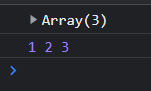

# ES6

摘自：[ES6 入门教程 - ECMAScript 6入门 (ruanyifeng.com)](https://es6.ruanyifeng.com/)

# let和const

**let：**块级作用域有效，不允许重复声明，不存在变量提升，会有暂时性死区（这导致typeof不再百分百安全）。

**块级作用域：**

1. 为什么要有块级作用域？为了解决一些不合理场景，例如使用var时存在的内层变量覆盖外层变量的情况（var是可以重复声明的，以最后声明为准，因此会造成覆盖）、用来计数的循环变量泄露为全局变量。
2. `let`实际上为 JavaScript 新增了块级作用域。
3. 块级作用域可以嵌套，每一层块级作用域内都可以使用let声明其他层的同名变量。
4. 块级作用域的出现，实际上使得获得广泛应用的匿名立即执行函数表达式（匿名 IIFE）不再必要了。

**const：**用于声明只读常量，变量指向的那个内存地址所保存的数据不得改动（基本类型是值本身，复合数据类型是是一个指针）。真的想将对象冻结，应该使用`Object.freeze(obj)`方法。


ES6变量声明有6种方式：var、function、let、const、import、class。

# 变量解构赋值

ES6 允许按照一定模式，**从数组和对象中提取值，对变量进行赋值**，这被称为解构赋值（Destructuring）。

1. 从数组中提取值，对变量赋值。

2. 从对象中取值，对变量赋值。

3. 默认值：解构赋值允许指定默认值。


应用场景： 频繁使用对象方法、数组元素，就可以使用解构赋值形式。事实上，只要某种数据结构具有 Iterator 接口，都可以采用数组形式的解构赋值。


# 字符串

## 字符串拓展

1. 只要将码点放入大括号，就能正确解读该字符，不再局限于码点在`\u0000`~`\uFFFF`之间的字符，有了这种表示法之后，JavaScript 共有 6 种方法可以表示一个字符。（`\u{20BB7}`；`'\u{1F680}' === '\uD83D\uDE80'`）

2. ES6 为字符串添加了遍历器接口（详见《Iterator》一章），使得字符串可以被`for...of`循环遍历。（除了遍历字符串，这个遍历器最大的优点是可以识别大于`0xFFFF`的码点，传统的`for`循环无法识别这样的码点。）

3. JavaScript 字符串允许直接输入字符，以及输入字符的转义形式。

4. 对`JSON.stringify()`的改造。

5. **模板字符串**（template string）是增强版的字符串，用反引号（`）标识，特点：

   - 字符串中可以出现换行符，反引号括起来的字符串是咋样输出就是咋样，模板字符串可以嵌套。

   - 可以使用 `${xxx}` 形式引用变量。

   - ```js
     // 模板字符串可以写成函数，在需要时执行	
     let func = (name) => `Hello ${name}!`;
     func('Jack') // "Hello Jack!"
     ```

   - 通过模板字符串，生成正式模板。

   - 标签模板。


应用场景： 当遇到字符串与变量拼接的情况使用模板字符串。

## 字符串新增API

String.fromCodePoint()
String.raw()
实例方法：codePointAt()
实例方法：normalize()
实例方法：includes(), startsWith(), endsWith()
实例方法：repeat()
实例方法：padStart()，padEnd()
实例方法：trimStart()，trimEnd()
实例方法：matchAll()
实例方法：replaceAll()
实例方法：at()

传统上，JavaScript 只有`indexOf`方法，可以用来确定一个字符串是否包含在另一个字符串中。ES6 又提供了三种新方法。

- **includes(xxx)**：返回布尔值，表示是否找到了参数字符串。
- **startsWith(xxx)**：返回布尔值，表示参数字符串是否在原字符串的头部。
- **endsWith(xxx)**：返回布尔值，表示参数字符串是否在原字符串的尾部。
- 三个方法都支持第二个参数，表示开始搜索的位置。
- `repeat(n)`：返回一个新字符串，表示将原字符串重复`n`次。
- `padStart(strLength, str)`用于头部补全，`padEnd(strLength, str)`用于尾部补全。
- trimStart()，trimEnd() ：消除头部、尾部空格，它们返回的都是新字符串，不会修改原始字符串。（浏览器还部署了额外的两个方法，`trimLeft()`是`trimStart()`的别名，`trimRight()`是`trimEnd()`的别名。）


# 函数拓展

## 对象方法的声明简化

ES6 允许在大括号里面，直接写入变量和函数，作为对象的属性和方法，使得书写更加简洁。

```js
// 原始写法
const isme = {
    myName : "陆拾陆",
    myAge : 22,
    reflect : function(){
    	alert("吾日三省吾身，一心向学~");
	}
}
console.log(isme.myName + isme.myAge);
isme.reflect();
```

```js
// 简化写法
let myName = "陆拾陆";
let myAge = 22;
let reflect1 = function(){
    alert("吾日三省吾身");
}
const isme = {
    myName,
    myAge,
    reflect1,
    reflect2(){
    	alert("一心向学~");
	}
}
console.log(isme.myName + isme.myAge);
isme.reflect1();
isme.reflect2();
```


## 函数参数默认值

ES6，允许给函数的参数赋初始值。

```js
// 参数是默认声明的，并且默认值是用到再计算（不为传入实参，那y=3）
function sum(x,y=3){
    // let y = 4;       // 不能在此使用let、const再次声明x或y，否则报错
    console.log(x+y);
}
sum(2);
```

```js
// 解析赋值的对象参数，如果不传入参数，那么就不会生成解构变量，如果方法内继续引用就会错误，解决方法是提供函数参数默认值
function connect({host="127.0.0.1", username,password, port}){
	console.log(host + ":"+ port +"/" + username + "/" + password);  // 报错
}
// 函数调用，如果不传任何参数，函数会报错
connect({host: 'lsl.com',username: 'root',password: '123456',port: 8080});

// 提供函数参数默认值，不传参时默认为空对象，注意此时参数是对象
function connect({host="127.0.0.1", username,password, port}={}){
	console.log(host + ":"+ port +"/" + username + "/" + password);
}
connect();
```

参数默认值设置的位置一般位于尾部，如果非尾部设置，那么设置了默认值的参数是无法忽略的，必须有值，如果是undefined就会触发默认值，null则不会：

```js
function fun(x,y=2,x){
    return [x,y,z];
}
fun(1,,3);     // 忽略了y，会报错
fun(1,null,3); // y=null，默认值不会生效
fun(1,undefined,3); // 触发默认值生效
```

指定了默认值以后，函数的`length`属性，将返回没有指定默认值的参数个数。也就是说，指定了默认值后，`length`属性将失真。这是因为`length`属性的含义是——该函数预期传入的参数个数。某个参数指定默认值以后，预期传入的参数个数就不包括这个参数了。同理，后文的 rest 参数也不会计入`length`属性。再者非尾部参数设置默认值，那么设置了默认值的参数的后面的参数也就不会再计入length了。

设置了默认值，函数会在声明初始化时生成一个单独的作用域，也就是说在参数声明处是一个作用域，函数体又是一个作用域。

默认值的应用：将默认值设置为一个函数抛出错误，表示此参数不得省略；将函数参数默认值设置为undefined，表示可忽略。


## rest参数

ES6 引入 rest 参数，用于获取函数的实参，用来代替 arguments。rest参数的作用是：**接收多余的传入函数的参数，并存放在一个数组中**。

- 函数的length属性，不包含rest参数。
- rest参数只能放在形参声明处的最后。

```js
// 使用rest参数的形式如下，theArgs是自定义的，但不能和前面形参名相同
function data(a,...theArgs){   
    console.log(theArgs);   
}
// theArgs 数组接收到了二号、三号、四号
data("一号","二号","三号","四号");
```

Rest参数和arguments对象的区别：

1. rest参数只包括那些没有给出名称的参数，arguments包含所有参数。
2. arguments 对象不是真正的数组，而rest 参数是数组实例，可以直接应用sort, map, forEach, pop等方法。
3. arguments 对象拥有一些自己额外的功能。 

rest参数可以被解构：

```java
function data(...[a,b,c]){
    return a + b + c;
}
alert(data("一"));   // 一undefinedundefined
alert(data("一","二")); // 一二undefined
alert(data("一","二","三")); // 一二三
```

## 严格模式

从 ES5 开始，函数内部可以设定为严格模式。

```js
function doSomething(a, b) {
  'use strict';
  // code
}
```

ES2016 做了一点修改，规定只要函数参数使用了默认值、解构赋值、或者扩展运算符，那么函数内部就不能显式设定为严格模式，否则会报错。

## name属性

函数的`name`属性，返回该函数的函数名。

ES6 对这个属性的行为做出了一些修改。如果将一个匿名函数赋值给一个变量，ES5 的`name`属性，会返回空字符串，而 ES6 的`name`属性会返回实际的函数名。

`Function`构造函数返回的函数实例，`name`属性的值为`anonymous`。


## 箭头函数

ES6允许使用箭头（`=>`）来定义函数，箭头函数提供了一种更加简洁的函数书写方式，箭头函数多用于匿名函数的定义。

```js
// 括号部分：指定传入参数，单个参数、多个参数或无参数，和函数时一致
// 语句部分：使用{}，表示代码块，单语句时可不使用{}—测试表示返回值语句，如果返回对象则需要括号()包住
var fun = 函数的括号部分 => 函数内部语句; 
```

注意：

1. 箭头函数没有自己的`this`对象。（箭头函数没有自己的`this`对象，内部的`this`就是定义时上层作用域中的`this`。）
2. 不可以当作构造函数。
3. 不可以使用`arguments`对象。（以下三个变量在箭头函数之中也是不存在的，指向外层函数的对应变量：`arguments`、`super`、`new.target`。）
4. 不可以使用`yield`命令，因此箭头函数不能用作 Generator 函数。
5. 可以使用解构传参。

## 尾调用优化

尾调用（Tail Call）是函数式编程的一个重要概念，本身非常简单，一句话就能说清楚，就是指**某个函数的最后一步是调用另一个函数**。（注意函数的最后一步操作）

“尾调用优化”（Tail call optimization），即只保留内层函数的调用帧，注意，目前只有 Safari 浏览器支持尾调用优化，Chrome 和 Firefox 都不支持。


## 函数参数尾道号

新的语法允许函数定义和调用时，参数尾部可以有一个逗号。这样的规定也使得，函数参数与数组和对象的尾逗号规则，保持一致了。


## Function.prototype.toString()

ES2019 对函数实例的toString()方法做出了修改。

toString()方法返回函数代码本身，以前会省略注释和空格。而修改后的toString()方法，明确要求返回一模一样的原始代码。

## catch 命令的参数省略

JavaScript 语言的`try...catch`结构，以前明确要求`catch`命令后面必须跟参数，接受`try`代码块抛出的错误对象。ES2019 做出了改变，允许catch语句省略参数。但是，为了保证语法正确，还是必须写。

```js
try {
  // ...
} catch {
  // ...
}
```

# 对象拓展

## 1、属性、方法简洁表示

对象内直接写入变量和函数，作为对象的属性和方法：

```js
foo = 'foo'
const obj = {foo} // const obj = {foo:foo}
```

```js
// 方法简写
const obj = {
    read(){}
}
// 相当于
const obj = {
    read:function(){}
}
```


## 2、属性名、方法名表达式

注意：属性名表达式与它的简写形式不能同时使用。

定义属性时可使用表达式定义：

```js
var v = 'h'
var v2 = 'v2';
var obj = {
    v1:'v1',
    // 注意v2是表达式，是能返回值的即是表达式，此时v2不能简写
    [v2]:'v2',  
    [v + 'ello']() {
    return '你好';
  }
}
obj['v1']; // v1
obj[v2];   //v2
obj.hello();
```

属性名表达式如果是一个对象，默认情况下会自动将对象转为字符串`[object Object]`，也就是说如果表达式是对象，那么有多个时，那么就会出现多个属性名为`[objext,object]`的属性，最后覆盖为一个。

```js
var obj1 = {v1:'v1'};
    var obj2 = {v2:'v2'};
    var obj = {
        [obj1]:'value1',
        [obj2]:'value2'
    };
    console.log(obj) // Object{[object,object]:"value2"}
```


## 3、方法的name属性

函数都基本有name属性，返回函数名称。

如果对象的方法使用了取值函数（getter）和存值函数（setter），则name属性不是在该方法上面，而是该方法的属性的描述对象的get和set属性上面，返回值是方法名前加上get和set。

```js
const obj = {
  get foo() {},
  set foo(x) {}
};

obj.foo.name
// TypeError: Cannot read property 'name' of undefined

const descriptor = Object.getOwnPropertyDescriptor(obj, 'foo');

descriptor.get.name // "get foo"
descriptor.set.name // "set foo"
```

如果是bind方法创造的函数，name属性的值是`bound`加上原函数名字：

```html
<script type="text/javascript">
    // 使用构造函数声明函数，其name为 "anonymous"
    console.log((new Function()).name)
    function test(){}
    var doSomething = function() {
        // ...
    };
     
    console.log(doSomething.bind().name) // "bound doSomething"
</script>
```


## 4、属性的可枚举性和遍历

可枚举性
对象的每个属性都有一个描述对象（Descriptor），用来控制该属性的行为。Object.getOwnPropertyDescriptor方法可以获取该**属性的描述对象**。

```js
var obj = {value:'value'};
const o = Object.getOwnPropertyDescriptor(obj, 'value')
console.log(o)
/*
{
    "value": "value",
    "writable": true,
    "enumerable": true,
    "configurable": true
}*/
```

属性的描述对象的enumerable属性，称为“可枚举性”，如果enumerable为false，就表示某些操作会忽略当前属性。目前，有四个操作会忽略enumerable为false的属性：

1. for...in循环：只遍历对象自身的和继承的可枚举的属性。
2. Object.keys()：返回对象自身的所有可枚举的属性的键名。
3. JSON.stringify()：只串行化对象自身的可枚举的属性。
4. Object.assign()： 忽略enumerable为false的属性，只拷贝对象自身的可枚举的属性。

实际上，引入“可枚举”（enumerable）这个概念的最初目的，就是让某些属性可以规避掉for...in操作，不然所有内部属性和方法都会被遍历到。比如，对象原型的toString方法，以及数组的length属性，就通过“可枚举性”，从而避免被for...in遍历到。

ES6 规定，所有 Class 的原型的方法都是不可枚举的。

总的来说，操作中引入继承的属性会让问题复杂化，大多数时候，我们只关心对象自身的属性。所以，尽量不要用for...in循环，而用Object.keys()代替。

## 4.1、属性遍历的5中方法

ES6 一共有 5 种方法可以遍历对象的属性。

**（1）for...in**

for...in循环遍历对象自身的和继承的可枚举属性（不含 Symbol 属性）。

**（2）Object.keys(obj)**

Object.keys返回一个数组，包括对象自身的（不含继承的）所有可枚举属性（不含 Symbol 属性）的键名。

**（3）Object.getOwnPropertyNames(obj)**

Object.getOwnPropertyNames返回一个数组，包含对象自身的所有属性（不含 Symbol 属性，但是包括不可枚举属性）的键名。

**（4）Object.getOwnPropertySymbols(obj)**

Object.getOwnPropertySymbols返回一个数组，包含对象自身的所有 Symbol 属性的键名。

**（5）Reflect.ownKeys(obj)**

Reflect.ownKeys返回一个数组，包含对象自身的（不含继承的）所有键名，不管键名是 Symbol 或字符串，也不管是否可枚举。


以上的 5 种方法遍历对象的键名，都遵守同样的属性遍历的次序规则：

1. 首先遍历所有数值键，按照数值升序排列。
2. 其次遍历所有字符串键，按照加入时间升序排列。
3. 最后遍历所有 Symbol 键，按照加入时间升序排列。


## 5、super

ES6 新增了另一个关键字super，用于指向当前对象的原型对象。

```js
const proto = {value:'value2'};
const obj = {
    getProp(){
        // 返回原型对象的value属性
        return  super.value;
        // super.value等同于Object.getPrototypeOf(this).value
    }
};
// 设置obj的原型属性为proto
Object.setPrototypeOf(obj,proto);
console.log(obj.getProp())
```

super关键字表示原型对象时，只能用在对象的方法之中，用在其他地方都会报错。

## 6、对象的拓展运算符

即`...`运算符。数组中可用，ES2018 将这个运算符引入了对象。

解构赋值：

```js
// ...只能出现在末尾且只能出现一个
let { x, y, ...z } = { x: 1, y: 2, a: 3, b: 4 };
x // 1
y // 2
z // { a: 3, b: 4 }
// let { x, ...y, ...z }  不行
```

注意，解构赋值的拷贝是浅拷贝，即如果一个键的值是复合类型的值（数组、对象、函数）、那么解构赋值拷贝的是这个值的引用，而不是这个值的副本。

另外，扩展运算符`...`的解构赋值，**不能复制继承自原型对象的属性。**

对象的扩展运算符（`...`）用于取出参数对象的所有可遍历属性，拷贝到当前对象之中：（只会返回参数对象自身的、可枚举的属性，）

```js
let z = { a: 3, b: 4 };
let n = { ...z };
n // { a: 3, b: 4 }
// 如果是 {...{}} 则没有效果   如果后面不是对象则会将其转为对象
{...1}  // 转为Number(1)，Number对象没有属性，因此返回一个空对象，boolean、undefined、null也同理返回空对象
// 如果...后面直接接字符，则返回伪数组
{...'he'} // {0："h",1:"e"}
```

数组是特殊的对象，拓展运算符也可以用于数组：

```js
let foo = { ...['a', 'b', 'c'] };
foo
// {0: "a", 1: "b", 2: "c"}
```

与数组的扩展运算符一样，对象的扩展运算符后面可以跟表达式。

```js
const obj = {
  ...(x > 1 ? {a: 1} : {}),
  b: 2,
};
```


扩展运算符的参数对象之中，如果有取值函数get，这个函数是会执行的。

```js
let a = {
  get x() {
    throw new Error('not throw yet');
  }
}

let aWithXGetter = { ...a }; // 报错
```

上面例子中，取值函数get在扩展a对象时会自动执行，导致报错。


## 7、AggregateError 错误对象

为了配合新增的Promise.any()方法。

AggregateError 本身是一个构造函数，用来生成 AggregateError 实例对象。`AggregateError(errors[, message])`：

1. errors：数组，它的每个成员都是一个错误对象。该参数是必须的。
2. message：字符串，表示 AggregateError 抛出时的提示信息。该参数是可选的。

```js
const error = new AggregateError([
  new Error('ERROR_11112'),
  new TypeError('First name must be a string'),
  new RangeError('Transaction value must be at least 1'),
  new URIError('User profile link must be https'),
], 'Transaction cannot be processed')
```

AggregateError()的第一个参数数组里面，一共有四个错误实例。第二个参数字符串则是这四个错误的一个整体的提示。

AggregateError的实例对象有三个属性。

1. name：错误名称，默认为“AggregateError”。
2. message：错误的提示信息。
3. errors：数组，每个成员都是一个错误对象。

## 8、Error对象的cause属性

Error 对象用来表示代码运行时的异常情况，但是从这个对象拿到的上下文信息，有时很难解读，也不够充分。ES2022 为 Error 对象添加了一个cause属性，**可以在生成错误时，添加报错原因的描述。**

它的用法是new Error()生成 Error 实例时，给出一个描述对象，该对象可以设置cause属性。

```js
const actual = new Error('an error!', { cause: 'Error cause' });
actual.cause; // 'Error cause'
```

上面示例中，生成 Error 实例时，使用描述对象给出cause属性，写入报错的原因。然后，就可以从实例对象上读取这个属性。

casue属性可以放置任意内容，不必一定是字符串。

# 新增对象方法

## 1、Object.is()

使用`==`时会自动转换数据类型，使用`===`时NaN不等于自身、+0等于-0，为了弥补这些缺陷，就有了Object.is()来使值相等的变量他们就是相等的

```js
// 比较两个值是否相等
Object.is(值1, 值2);
```

```js
// es5专用
Object.defineProperty(Object, 'is', {
  value: function(x, y) {
    if (x === y) {
      // 针对+0 不等于 -0的情况
      return x !== 0 || 1 / x === 1 / y;
    }
    // 针对NaN的情况
    return x !== x && y !== y;
  },
  configurable: true,
  enumerable: false,
  writable: true
});
```


## 2、Object.assign()

### 简单使用

拷贝源对象的自身属性（继承属性不会被拷贝）、拷贝可枚举的属性、属性名为Symbol值的属性也会拷贝

```js
const p1 = {name:'累死了'};
const p2 = {age:99};
// 将p2的属性拷贝给p1
Object.assign(p1,p2)
// 将p2、p3的属性拷贝给p1，如果有同名的则以最后一个复制的为准替换掉原来的
const p3 = {habit:'games',age=103};
Object.assign(p1,p2,p3)
```

注意：

1. 是浅拷贝。

2. 可处理数组，不过是将数组当作对象处理。

   ```js
   // 将数组视为属性名为0、1、2的对象
   Object.assign([1, 2, 3], [4, 5])
   // [4, 5, 3]
   ```

3. 对象里有函数，那么不会复制函数体，而是复制函数的返回值。

### 实际用途

1. 为对象添加属性。

2. 为对象添加方法。

   ```
   Object.assign(SomeClass.prototype, {
     someMethod(arg1, arg2) {
       ···
     },
     anotherMethod() {
       ···
     }
   });
   
   // 等同于下面的写法
   SomeClass.prototype.someMethod = function (arg1, arg2) {
     ···
   };
   SomeClass.prototype.anotherMethod = function () {
     ···
   };
   ```

   

3. 克隆对象。

   ```js
   function clone(origin) {
     return Object.assign({}, origin);
   }
   // 保留继承链
   function clone(origin) {
     let originProto = Object.getPrototypeOf(origin);
     return Object.assign(Object.create(originProto), origin);
   }
   ```

   

4. 合并对象。

5. 为属性指定默认值。


## 3、Object.getOwnPropertyDescriptors()

解决无法拷贝get、set方法的问题。

## 4、`__proto__`属性

`__proto__`属性，对应原型对象，可用以下方法对原型对象进行操作：

1. `Object.setPrototypeOf(obj, 对象)`（写操作）：为obj添加原型对象。
2. `Object.getPrototypeOf(obj)`（读操作）：获取某个对象的原型对象。
3. `Object.create()`（生成操作），对原型属性进行操作。

## 5、对象返回

Object.keys()，Object.values()，Object.entries()：
- Object.keys(obj)：返回一个包含对象自身所有可遍历的属性的键名的数组（继承的属性不算）。
- Object.values(obj)：obj对象自身可遍历的键值。
- `Object.entries(obj)`：返回一个数组，成员是参数对象自身的（不含继承的）所有可遍历（enumerable）属性的键值对数组。

## 6、Object.fromEntries()

Object.fromEntries()方法是Object.entries()的逆操作，用于将一个键值对数组转为对象。

```js
Object.fromEntries([
  ['foo', 'bar'],
  ['baz', 42]
])
// { foo: "bar", baz: 42 }
```


## 7、Object.hasOwn()

JavaScript 对象的属性分成两种：自身的属性和继承的属性。对象实例有一个hasOwnProperty()方法，可以判断某个属性是否为原生属性。ES2022 在Object对象上面新增了一个静态方法Object.hasOwn()，也可以判断是否为自身的属性。

```js
const foo = Object.create({ a: 123 });
foo.b = 456;

Object.hasOwn(foo, 'a') // false
Object.hasOwn(foo, 'b') // true
```

```js
//，对于不继承Object.prototype的对象不会报错，而hasOwnProperty()是会报错的。
const obj = Object.create(null);

obj.hasOwnProperty('foo') // 报错
Object.hasOwn(obj, 'foo') // false
```

# 其他拓展

## 运算符拓展

 扩展运算符（spread）也就是这三个点`...`，其能将数组转换为以逗号分隔的参数序列；它就像是 rest 参数的逆运算，对数组进行解包，将一个数组转为用逗号分隔的一个参数序列。

```js
let str = [1,2,3];
console.log(str);
console.log(...str);
```

上述输出：



应用：（数组合并、数组克隆、伪数组转换，对象同理）

```js
<div id = "d1"></div>
<div id = "d2"></div>

//1. 数组的合并 
const arr1 = ['v1','v2'];
const arr2 = ['v2','v4'];
// 传统的合并方式：const arr = arr1.concat(arr2);
const arr = [...arr1, ...arr2];
console.log(arr);
//2. 数组的克隆
const source = ['E','G','M'];
const copy = [...source]; // ['E','G','M']
console.log(copy);
//3. 将伪数组转为真正的数组
const divs = document.querySelectorAll('div');
const divArr = [...d];
console.log(divArr); // arguments
```


## 正则的拓展


## 数值的拓展


# 数组的拓展

数组的map方法：接收函数用于处理原数组数据，并将处理后的数据放入新数组并返回

```js
let arr = [1,4,7,9];
arr = arr.map(item => item*3);
```

数组的reduce方法：接收一个函数作为累加器，数组中的每个值（从左到右）开始缩减，最终计算为一个值（不包括数组中被删除或未被赋值的元素，对于空数组不会执行回调函数）

```js
// arr.reduce(回调函数, 初始值); 初始值可选，不指定初始值时是数组的第一个有值的元素
let arr = [1,4,7,9];
let result = arr.reduce(function(previousValue,currentValue,currentIndex,arr){
    return previousValue + currentValue;
});
// 上面的执行流程为：
// 1 + 4
// 5 + 7
// 12 + 9
// 最终返回21
// 如果指定初始值，那么第一个参数previousValue就是指定的初始值或每次经return处理后的的返回值
let result = arr.reduce(function(previousValue,currentValue,currentIndex,arr){
    return previousValue + currentValue;
},100);
// 上面的执行流程为：
// return 100 + 1
// return 101 + 4
// return 105 + 7
// return 112 + 9
// 最终返回121
```

对于回调函数的参数的说明：

1. previousValue：必需的参数。**是初始值， 或者每次计算结束后的返回值。**
2. currentValue：必需。当前要处理的元素值。
3. currentIndex：可选。当前元素的索引。
4. arr：可选。当前元素所属的数组对象。

reduce原理示例：累算

```js
let arr = [1,2,3,4];
arr.reduce(function(pv, cv){
    return pv + cv;
});
```


# Symbol

Symbol，表示独一无二的值，用于解决属性名的冲突问题，可以使属性名独一无二。凡是属性名属于 Symbol 类型，就都是独一无二的，可以保证不会与其他属性名产生冲突。

```js
let s = Symbol();   // 生成独一无二的值
```

 Symbol 值不是对象，所以也不能添加属性。基本上，它是一种类似于字符串的数据类型。

Symbol()函数可以接受一个字符串作为参数，**表示对 Symbol 实例的描述**（如果是对象也会通过toString方法转为字符串）。这主要是为了在控制台显示，或者转为字符串时，比较容易区分：

```js
let s1 = Symbol('foo');
let s2 = Symbol('bar');

s1 // Symbol(foo)
s2 // Symbol(bar)

s1.toString() // "Symbol(foo)"
s2.toString() // "Symbol(bar)"
```

Symbol的其他特性：

1. 不能与其他类型的值进行运算。

2. 可以显式转为字符串。

   ```js
   let sym = Symbol('My symbol');
   
   String(sym) // 'Symbol(My symbol)'
   sym.toString() // 'Symbol(My symbol)'
   ```

3. 可以转为布尔值，但是不能转为数值。

   ```js
   let sym = Symbol();
   Boolean(sym) // true
   !sym  // false
   
   if (sym) {
     // ...
   }
   
   Number(sym) // TypeError
   sym + 2 // TypeError
   ```


# Set和Map


# Proxy


# Reflect


# Promise

## 概述

异步编程解决方案：回调函数和事件、Promise（更加合理且功能强大）；Promise（承诺、保证）。

所谓Promise，简单说就是一个容器，里面保存着某个未来才会结束的事件（通常是一个异步操作）的结果。从语法上说，Promise 是一个对象，从它可以获取异步操作的消息。Promise 提供统一的 API，各种异步操作都可以用同样的方法进行处理。（容器、对象、API）

Promise对象特点：

1. 对象状态不受外界影响。
   - Promise对象代表一个异步操作，有三种状态：pending（进行中）、fulfilled（已成功）和rejected（已失败）。
   - 只有异步操作的结果，可以决定当前是哪一种状态，任何其他操作都无法改变这个状态。这也是Promise这个名字的由来，它的英语意思就是“承诺”，表示其他手段无法改变。
2. 一旦状态改变，就不会再变，任何时候都可以得到这个结果。
   - Promise对象的状态改变，只有两种可能：从pending变为fulfilled和从pending变为rejected。
   - 只要这两种情况发生，状态就凝固了，不会再变了，会一直保持这个结果，这时就称为 resolved（已定型）。
   - 如果改变已经发生了，你再对Promise对象添加回调函数，也会立即得到这个结果。这与事件（Event）完全不同，事件的特点是，如果你错过了它，再去监听，是得不到结果的。

总结：状态稳定、结果固定。

Promise的优缺点：

1. 优点：
   - 有了Promise对象，就可以将异步操作以同步操作的流程表达出来，避免了层层嵌套的回调函数。此外，Promise对象提供统一的接口，使得控制异步操作更加容易。
2. 缺点：
   1. 无法取消Promise，一旦新建它就会立即执行，无法中途取消。
   2. 如果不设置回调函数，Promise内部抛出的错误，不会反应到外部。
   3. 当处于pending状态时，无法得知目前进展到哪一个阶段（刚刚开始还是即将完成）。

如果**某些事件不断地反复发生**，一般来说，使用 Stream 模式是比部署Promise更好的选择。

## 基本使用

**使用步骤：**

1、创建Promise对象，Promise实例化完成就会立刻执行传入的函数：

```js
const promise = new Promise(function(resolve, reject) {
  // ... some code   你想要执行的代码

  if (/* 异步操作成功 */){
    resolve(value);
  } else {
    reject(error);
  }
});
```

1. resolve函数的作用：将Promise对象的状态从“未完成”变为“成功”（即从 pending 变为 resolved），在异步操作成功时调用，并将异步操作的结果，作为参数传递出去。（改变状态、结果传递）
2. reject函数的作用是，将Promise对象的状态从“未完成”变为“失败”（即从 pending 变为 rejected），在异步操作失败时调用，并将异步操作报出的错误，作为参数传递出去。（改变状态、错误传递）

2、使用then()来指定resolved状态和rejected状态的回调函数：（这些方法是在当前脚本所有同步任务执行完才会执行）

```js
promise.then(function(value) {  // 接收异步操作结果
  // success   
}, function(error) {   //接收异步操作失败的错误
  // failure
});
```

1. then方法可以接受两个回调函数作为参数。
2. 第一个回调函数是Promise对象的状态变为resolved时调用，第二个回调函数是Promise对象的状态变为rejected时调用。
3. 这两个函数都是可选的，不一定要提供。它们都接受Promise对象传出的值作为参数。

**简单案例：（异步加载图片）**

```js
function loadImageAsync(url) {
  return new Promise(function(resolve, reject) {
    const image = new Image();

    image.onload = function() {
      resolve(image);
    };
    image.onerror = function() {
      reject(new Error('Could not load image at ' + url));
    };
    image.src = url;
  });
}
```

**证明Promise的执行流程：**

```js
let promise = new Promise(function(resolve, reject) {
  console.log('Promise实例化完成立刻执行');
  resolve();
});

promise.then(function() {
  console.log('resolved.');
});

console.log('Hi!');

// Promise实例化完成立刻执行
// Hi!
// resolved
```

**用Promise对象实现的 Ajax 操作的例子：**

```js
const getJSON = function(url) {
  const promise = new Promise(function(resolve, reject){
    const handler = function() {
      if (this.readyState !== 4) {
        return;
      }
      if (this.status === 200) {
        resolve(this.response);
      } else {
        reject(new Error(this.statusText));
      }
    };
    const client = new XMLHttpRequest();
    client.open("GET", url);
    client.onreadystatechange = handler;
    client.responseType = "json";
    client.setRequestHeader("Accept", "application/json");
    client.send();

  });

  return promise;
};

getJSON("/posts.json").then(function(json) {
  console.log('Contents: ' + json);
}, function(error) {
  console.error('出错了', error);
});
```

**`resolve`函数的参数是另一个Promise 实例：**（一个异步操作的结果是返回另一个异步操作）

```js
const p1 = new Promise(function (resolve, reject) {
    setTimeout(() => reject(new Error('fail')), 3000);
})
p1.then(function (val) {console.log(val)}).catch(error => console.log(error));
//   Error: fail
// p2的resolve返回另一个Promise
const p2 = new Promise(function (resolve, reject) {
    setTimeout(() => resolve(p1), 1000)
})

p2.then(result => console.log(result)).catch(error => console.log(error));
//   Error: fail
```

注意，这时p1的状态就会传递给p2，也就是说，p1的状态决定了p2的状态。如果p1的状态是pending，那么p2的回调函数就会等待p1的状态改变；如果p1的状态已经是resolved或者rejected，那么p2的回调函数将会立刻执行。

调用resolve或reject并不会终结 Promise 的参数函数的执行：

```js
new Promise((resolve, reject) => {
  resolve(1);
  console.log(2);
}).then(r => {
  console.log(r);
});
// 2
// 1
```

## Promise原型方法


# Iterator和for...of循环


# Generator


# async函数


# Class


# Module

- 模块（module）体系：将一个大程序拆分成互相依赖的小文件，再用简单的方法拼装起来。
- ES6模块之前的模块加载方案，最主要的有 CommonJS 和 AMD 两种。
- 静态化，编译时便能确定模块的依赖关系。
- ES6 模块不是对象，而是通过`export`命令显式指定输出的代码，再通过`import`命令输入。


## 模块—语法

ES6 的模块自动采用严格模式。

### export 命令

`export`命令：用于规定模块的对外接口，ES6将一个独立的js文件视为一个模块，该js文件内部的所有变量，外部无法获取，如果你希望外部能够读取模块内部的某个变量，就必须使用`export`关键字输出该变量。

使用export输出变量：（两种写法，建议第二种，因为可以在尾部直接看出输出哪些对西）

```js
// profile.js
export var name = '零三零';
export var age = '33';
```

```js
// profile.js
var name = '零三零';
var age = '33';
export { name,age };
```

使用export输出类或函数：

```js
export function sum(x,y){
    return x + y;
}
```

as 关键字：重命名输出变量的变量名

```js
function f1(){};
function f2(){};
export {f1 as fun1,f2 as fun2};
```

**export 输出的是接口，而不是值，接口与对应的值是动态绑定关系，通过接口可以实时获取模块内部的值**：

```js
export 1; // 输出值，错误
var m = 1;
export m; // 通过变量m直接输出1，错误
export var m = 1; // 正确
export {m}; // 正确
```


### import 命令

`export`命令定义了模块的对外接口以后，其他的js文件就可以通过import 命令加载这些模块。

import命令是只读的，只读取模块信息，因此不要import后修改外部导入的信息（虽然导入对象的属性可以更改，但是不建议，建议凡是输入的都当作完全只读信息）。

```js
// 加载profile.js文件并输出变量，变量名要与被导入模块对外接口的名称相同
// 为输入变量重新命名则使用as关键字
// from后是相对路径指定的文件或模块名称，如果是模块名称则还需要额外的配置指定模块所在目录
import {name as myName,age} from './profile.js';
```

import命令具有提升效果，导入的会提升到整个模块的头部。

```js
foo();

import { foo } from 'my_module';
```

import是静态执行，所以不能使用表达式和变量：

```js
// 报错
import { 'f' + 'oo' } from 'my_module';

// 报错
let module = 'my_module';
import { foo } from module;

// 报错
if (x === 1) {
  import { foo } from 'module1';
} else {
  import { foo } from 'module2';
}
```

`import`语句会执行所加载的模块：

```js
// 仅执行lodash模块，不会导入数据；多次声明也只会执行一次
import 'lodash';
import 'lodash';
```

import 是单例模式：

```js
import { foo } from 'my_module';
import { bar } from 'my_module';

// 等同于
import { foo, bar } from 'my_module';
```


### 整体加载

将所需要加载的模块信息加载到一个对象上，再通过该对象读取信息，通过`*`指定对象来实现。

```js
import * as aObj from 'my_module';
// 然后就可以通过aObj.xxx读取模块内信息
```

注意：模块整体加载所在的那个对象（上例是`aObj`），应该是可以静态分析的，所以不允许运行时改变。（只读取不修改里面内容，为aObj新增属性也不允许）


### export default  命令

为模块指定默认输出：

```js
// export-default.js   默认输出一个函数
export default function () {
  console.log('foo');
}
// 或者写成
function foo() {
  console.log('foo');
}

export default foo;   // foo函数的函数名foo，在模块外部是无效的。加载的时候，视同匿名函数加载
```

加载模块：（可以用任意名称接收export-default.js输出的方法，注意此时不需要花括号，）

```js
// import-default.js
import customName from './export-default';
customName(); // 'foo'
```

`export default`命令用于指定模块的默认输出。显然，一个模块只能有一个默认输出，因此`export default`命令只能使用一次。所以，import命令后面才不用加大括号，因为只可能唯一对应`export default`命令。（本质上，`export default`就是输出一个叫做`default`的变量或方法，然后系统允许你为它取任意名字。`export default`命令其实输出一个叫做`default`的变量，所以它后面不能跟变量声明语句。）

```js
// modules.js
function add(x, y) {
  return x * y;
}
export {add as default};
// 等同于
// export default add;

// app.js
import { default as foo } from 'modules';
// 等同于
// import foo from 'modules';
```

```js
// 错误
export default var a = 1;
```

因为`export default`命令的本质是将后面的值，赋给`default`变量，所以可以直接将一个值写在`export default`之后。

```js
// 正确
export default 42;

// 报错
export 42;
```

同时输入默认方法和其他接口：

```js
export default function (obj) {
  // ···
}

export function each(obj, iterator, context) {
  // ···
}

export { each as forEach };
```

```js
import _, { each, forEach } from 'lodash';
```

`export default`也可以用来输出类：

```javascript
// MyClass.js
export default class { ... }

// main.js
import MyClass from 'MyClass';
let o = new MyClass();
```


### export 与import复合写法

```js
// 复合写法
export { foo, bar } from 'my_module';

// 复合写法可以简单理解为
import { foo, bar } from 'my_module';
export { foo, bar };
```

写成一行以后（复合写法），`foo`和`bar`实际上并没有被导入当前模块，只是相当于对外转发了这两个接口，导致当前模块不能直接使用`foo`和`bar`。

默认接口和具名接口之间可更改。

```js
export { xxx as default } from 'my_module';
export { default as xxx } from 'my_module';
```


### 模块继承

```js
// circleplus.js

export * from 'circle';
export var e = 2.71828182846;
export default function(x) {
  return Math.exp(x);
}
```

`export * `会忽略circle模块的export default

```js
// main.js
// 除默认方法外其他的全部方法导入
import * as math from 'circleplus';
// 默认方法导入
import exp from 'circleplus';
console.log(exp(math.e));
```

### 跨模块常量

const只在当前代码块内有效，如果要设置一个值被多个模块所共享：

```js
// constants.js 模块
export const A = 1;
export const B = 3;
export const C = 4;

// test1.js 模块
import * as constants from './constants';
console.log(constants.A); // 1
console.log(constants.B); // 3

// test2.js 模块
import {A, B} from './constants';
console.log(A); // 1
console.log(B); // 3
```

如果要使用的常量非常多，可以建一个专门的`constants`目录，将各种常量写在不同的文件里面，保存在该目录下：

```javascript
// constants/db.js
export const db = {
  url: 'http://my.couchdbserver.local:5984',
  admin_username: 'admin',
  admin_password: 'admin password'
};

// constants/user.js
export const users = ['root', 'admin', 'staff', 'ceo', 'chief', 'moderator'];
```

然后，将这些文件输出的常量，合并在`index.js`里面。

```javascript
// constants/index.js
export {db} from './db';
export {users} from './users';
```

使用的时候，直接加载`index.js`就可以了。

```javascript
// script.js
import {db, users} from './constants/index';
```


### import()函数

用于动态加载模块


# 编程风格


# 读懂规格


# 异步遍历器


# ArrayBuffer


# 装饰器（Decorator）


