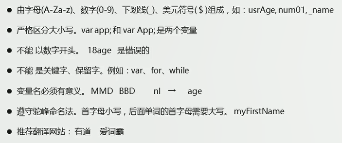
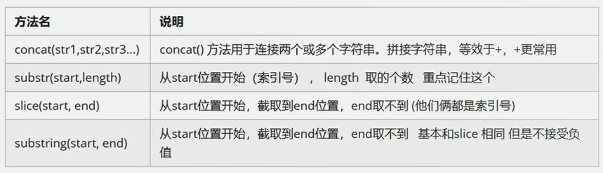
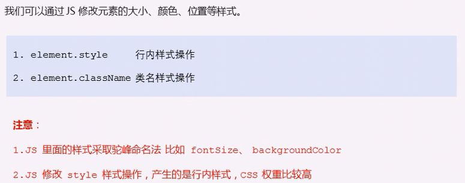
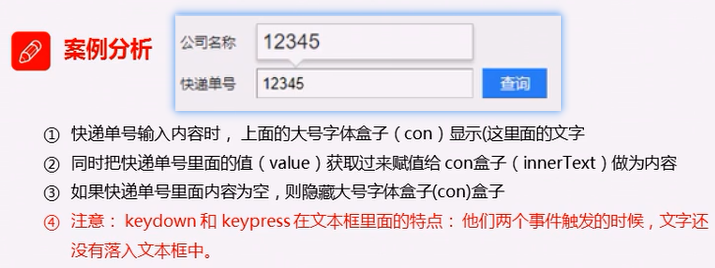
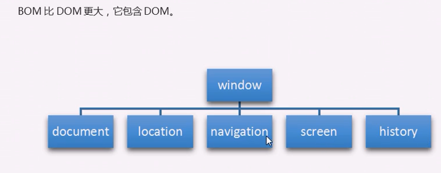
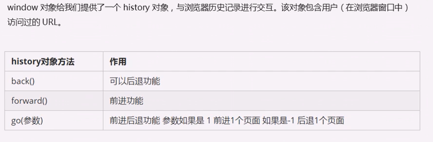
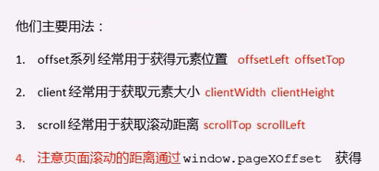
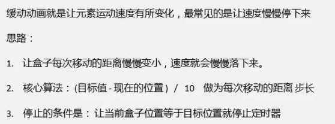

# JavaScript概述

[JavaScript 教程 - 网道 (wangdoc.com)](https://wangdoc.com/javascript/)

JavaScript：运行在客户端（浏览器）的编程语言，实现人机交互效果。主要用于网页特效、表单验证、数据交互（获取后台数据渲染到前端）。JavaScript是一种解释型语言。


浏览器分为两部分：渲染引擎和JS引擎

- 渲染引擎（内核）：解析HTML和CSS。
- JS引擎：读取网页中的JavaScript代码，对其进行处理，比如谷歌浏览器的 V8引擎。（执行代码时逐行解析每一句源码（转换为机器码），然后再由计算机执行——逐行解析执行）


# 语言基础

JavaScript（网景公司）、Jscript（微软），JavaScript最流行。ECMAScript规定了JS编程的基本语法和基础核心知识，是所有厂商共同遵守的一套JS语法工业标准。

## start

### 引入位置

三种引入JavaScript的方式，内嵌式、外部JS引入、行内(内联)JS。（执行顺序：外部 > 内嵌 > 行内(内联)）。

关于js资源：（阻塞、异步、动态加载）

1. 解释外部或内部js文件，页面会阻塞（阻塞时间包含下载js文件的时间）。
2. js文件的拓展名不是必须的。
3. 引入外部js文件时script标签内不要写js代码，写进去的不会生效。
4. 外部js文件引入不受浏览器同源策略的影响，但会受页面协议（http、https）的影响。
5. 没有使用defer和async属性时，浏览器会按`<script>`标签出现的顺序来依次解释，前一个解释完才轮到下一个。
6. 还有其他功能：比如推迟脚本执行、异步执行脚本、动态加载脚本等。


关于行内js：

1. 将单行或者少量JS代码写在HTML标签的事件属性中，例如事件属性onclick等。
2. 建议：HTML中使用双引号，JS中使用单引号。
3. 行内JS可读性差，大量JS代码时不方便阅读。


### 注释

1. 单行注释：`//`。（VScode快捷键：`ctrl + /`）
2. 多行注释：`/*  */`。（VScode快捷键：shift + alt + a）

### 输入输出


```html
<script type="text/javascript">
    prompt('输入信息'); // 输入框
    alert('弹窗显示信息'); // 警示框
    console.log('控制台打印输出日志'); // 控制台日志打印函数
    document.write("hello javascript"); // 页面中写入，脚本执行后追加到body中
</script>
```

## 变量与字面量

字面量：计算机中用于描述事物的数据，例如数字字面量、数组字面量、对象字面量。

变量，是用来存放数据的容器，本质是程序在内存中申请的一块用来存储数据的空间。

### 三种变量声明

**使用var关键字声明变量：**（默认值、重复性声明、声明提升、全局特性）

需要注意的是，var是函数作用域有效，如果不是在函数中声明变量，那基本上都是全局变量。

1、没赋值但声明了的变量有默认值 `undefined`（未定义），变量声明或变量赋值至少得符合一个，否则就会报错。

```js
var name; // 声明一个变量，未赋值的变量默认为undefined
name = '陆拾陆'; // 未声明但已经赋值，不会报错
var age = 21; // 声明变量并赋值
```

2、更新变量：变量被重新赋值后，原来的值被覆盖，以最后一次赋值为准。

```js
var a = 1;
var a = 2;
```

3、可以同时声明多个变量并赋值，使用`,`分割各个变量（`var v1=1, v2=2, v3=3;`）。

```js
// 相当于 var a = 9; b=9;c=9; 关键字var只影响到最先的一个，其他关键字同理
// 如果是严格模式下，相当于var a;b;c=9;  严格模式下不能缺少变量关键字,否则就会报错
var a = b = c = 9;
```

4、var声明的变量会有声明提升（变量声明会提升到作用域的最前面，函数也会声明提升，函数声明提升比变量的声明提升还靠前），详情见预解析。

```js
console.log(a); // 输出undefined
var a;
```

5、var定义的变量会成为包含它的函数的局部变量；在函数内省略var直接定义变量，则是一个全局变量，也将是window对象的属性。

```js
function show(){
    var a = 1;
    b=2;
}
show();   // 函数只有调用才会函数内部初始化
alert(b); // b是全局变量
alert(window.b);
alert(a); // 出错，a只在函数作用域内有效
```

6、全局作用域下不使用关键字声明的变量，也将是window对象的属性。


**使用let关键字声明变量：**

1. 与var的区别：（作用域、变量提升与暂时性死区、window对象、重复声明）
   - 与var作用相似，主要区别是var是函数作用域，而let是块作用域且没有声明提升。
   - var可以重复声明同一变量，而let不允许在同一作用域内重复声明同一变量（但可以在嵌套的块中重复声明）。
   - var在全局作用域声明的变量会成为window对象的属性，而let在全局域声明的则不会。
   - 因为let不会导致变量提升，在let声明前的执行瞬间称为暂时性死区，在此阶段如果引用后面才声明的都会抛出ReferenceError（简而言之就是let声明的变量只能在声明后调用）。
2. 使用let时，为了避免SyntaxError，要保证页面不会重复声明同一变量。

**使用const关键字声明变量：**

1. 与let基本相同，特殊的地方在于使用const时必须同时初始化变量，并且初始化后不能再修改变量的值。
2. const声明的限制只是限制引用，如果引用是对象，那么可以改变对象内部属性。

**声明风格与最佳实现：**

1. 不使用var。
2. const优先，let次之。


### 变量命名规范

（尽量不使用`name`作为变量名，其有特殊意义（直接`console.log(name)`不会报错））



标识符命名规范：

1. 变量、函数的命名尽量“见名知义”。
2. 变量的名称一般用名词。
3. 函数的名称一般用动词。


## 数据类型

不同的数据所需要占用的存储空间不同，为了充分利用存储空间，把数据分成所需内存大小不同的数据，于是就定义了不同的数据类型。

- JavaScript的变量的数据类型是在程序运行过程中，根据等号右边的值来确定的，当为变量赋值后，该变量的数据类型才能确定。

- js是动态语言，变量的数据类型是可变的。

  ```js
  var age = 21;
  age = '21';
  ```

JavaScript的数据类型：

| 数据类型  | 说明                         | 默认值                                                       |
| --------- | ---------------------------- | ------------------------------------------------------------ |
| Undefined | 未定义型，声明了但未赋值     | 只有一个值：undefined<br>未初始化的变量的默认值就是undefined，未定义不会造成覆盖 |
| Null      | 空类型，表示赋值了但内容为空 | 只有一个值：null；null值表示一个空指针对象，类型为object<br>null值表面上与undefined等价<br>console.log(null == undefined); // true |
| Boolean   | 布尔类型，可以进行运算       | 只有两个值：true、false（默认）                              |
| Number    | 数值，包含浮点型和整型       | 默认值是0                                                    |
| BigInt    | 任意大小整数                 |                                                              |
| String    | 不可变字符，Unicode字符      |                                                              |
| Symbol    | ES6新增                      |                                                              |
| Object    |                              |                                                              |

**Object、function、数组是引用数据类型。**

### 数值型

浮点数时，如果小数点后没有数字或者是0，将会转换为整型数来处理；浮动数的精度最高可达17位小数。（要注意的是，浮点数的计算并不精确）

科学计数法：3e3=3000；3e-3=0.003。（默认情况，小数点后至少包含6个0时，浮动值就会转换为科学计数法）

进制：`0x`开头表示十六进制数，`0`开头表示八进制数（严格模式下是`0o`）。

一些特殊值（了解）：

1. `Number.MAX_VALUE`：1.7976931348623157e+308。（10的308次方）
2. `Number.MIN_VALUE`：5e-324。（10的-324次方）
3. `Infinity`：无穷大。（`alert(Number.MAX_VALUE * 2);`）
4. `-Infinity`：无穷小。（` alert(-Number.MAX_VALUE * 2);`）
5. `NaN`：
   - not a number，表示非数字；任何与NaN的运算都是NaN，NaN不等于NaN。（`alert('hello' - 100);`）
   - 0、-0、+0之间相互做除法运算都会返回NaN。
   - 分母是有符号0或无符号0，而分子是非0值，则返回`Infinity`或`-Infinity`。


一个判断方——`isNaN(x)`：判断x是否是非数字，对于任何不能转换为数字的值都将返回true。

转换为数值的几种方式：

1. `Number(..)`：转换为数值型。
2. `parseInt(..)、parseInt(xxx, 进制)`：转换为数值型的整型。
3. `parseFloat(..)`：转换为数值型的浮点型，只解析十进制值。
4. `-、*、/、++、--`，这些运算符，在运算时会对不是数值的转换为数值。
5. 字符转换为数字型，会根据前面的进行转换，直到遇到不能转换的就终止转换。如`var num = parseInt('123aaa123px');`最终结果是数字型的123，如果`var num = parseInt(a123);`则是NaN；如果使用`parseInt()`转换`'12.94'`之类的字符，会去掉小数位。

```js
alert(typeof ('1' - 0));
alert(typeof ('12' - '10'));
var num = ('12' - '10'); // 尽量不要使用name为变量名，此时使用name变量名就会转换不成Number
alert(typeof num);
```


### 字符串

字符串用双引号或单引号括起来，**在JS里更推荐使用单引号**，因为HTML标签里面的属性使用的是双引号。

如果字符中有双引号来表示特殊意义，外双内单、或外单内双。（`let title = "我是'人'是我";`）

字符串转义符：


1. 字符串长度：`.length`属性。
2. 字符串拼接：使用`+`拼接字符串，都会是字符串。
3. 几乎所有值都有的`toString()`方法（null和undefined没有），该方法唯一用途就是返回当前值的字符串等价物；`toString()`方法可传入参数，表示进制。
4. `String(变量)`函数：如果该变量有toString()函数就调用该函数并返回结果，如果没有就返回null、或者undefined。

**模板字面量：**

1. 模板字符串使用反引号``来表示，模板字符串回保留字符串内的换行符、空格。

2. 字符串插值：使用插值表达式`${}`来进行插入，所有插入的值都会使用toString()强制转型为字符串

   ```js
   let lastName = '流芳';
   let str = `${lastName}是谁？`;
   console.log(`hello,${`word`}!`);
   ```

   插值表达式中可以调用变量、函数、方法，可以是模板字符串（注意插值表达式会将值转换为字符串，插值表达式中再有插值表达式是没有意义的）。


### 布尔类型

布尔类型只有两个值：true、false。

```js
var falg = true; 
// true 或 false可以进行运算（true代表1，false代表0）
var flag = true + 1;
console.log(typeof flag);
// 将值转换为Boolean类型  空字符、0、NaN、null、undefined都将转换为false
console.log(typeof Boolean(flag));
```

- NaN和数字相加为NaN，null和数字相加为数字本身。


### typeof

```js
var name = '陆拾陆';
alert(typeof name);   // 未声明的变量的类型为undefined
```

typeof返回值：undefined、boolean、string、number、object、function、symbol。

### Undefined类型

使用var或者let声明了变量但没有初始化时，就相当于给变量赋予了undefined值。

注意：未声明的变量使用typeof判断返回的也是undefined，但这并不表示这个未声明的变量存在这个默认值。


### Null类型

Null类型只有一个值——null，逻辑上null值表示一个空指针，也就是说给typeof传一个null返回的将是object。

undefined 值是由 null 值派生而来的，因此 ECMA-262 将它们定义为表面上相等，如下面的例子所示：

```js
console.log(null == undefined);  //  true
// ==操作符会转换其操作数
```


### Symbol类型

Symbol（符号）类型，符号实例是唯一的、不可变的，其用于确保对象属性的唯一性，避免发生属性冲突。符号类型变量用于对象属性，以确保对象属性的唯一性，即只需要创建Symbol实例，并将其作为对象的新属性，就可以保证它不会覆盖已有的对象属性，无论是符号属性还是字符串属性。

1、创建符号：无论如何创建，创建的符号实例都是不相同的。

```javascript
let sym1 = Symbol();
let sym2 = Symbol('sym');
console.log(sym2);   //  输出：Symbol(sym)
let sym3 = Symbol();
let sym4 = Symbol('sym');
console.log(sym1 == sym3);  // false
console.log(sym2 == sym4);  // false
```

创建符号实例不能使用new关键字，这是为了避免创建符号包装对象。如果想使用符号包装对象，可以这样做：

```javascript
let mySym = Symbol();
let myWrappedSym = Object(mySym);
```

2、全局的符号实例：

应用场景：运行时的不同部分需要共享和重用符号实例。

操作——用字符串为键，在全局符号注册表中创建并重用符号：

```javascript
let fooGlobalSym = Symbol.for('foo');            // 创建新符号
let otherFooGlobalSym = Symbol.for('foo');       // 重用已建符号
console.log(fooGlobalSym == otherFooGlobalSym);  // true，如果合Symbol('foo')的比较仍然不会相等
//  使用Symbol.for()，会对每个字符串键都执行幂等操作
// 1.第一次使用某个字符串调用，会检查全局运行时注册表，如果不存在对应符号，则生成新符号实例添加到这个表中
// 2.后续使用相同的字符串调用，会检查这个表，发现存在于该字符串对应的就返回
```

全局注册表中的符号必须使用字符串键来创建，因此作为参数传给 Symbol.for()的任何值都会被转换为字符串。  

```javascript
// 注册表中使用的键同时也用作符号描述
let globalSym = Symbol.for();
let fooGlobalSym = Symbol.for('foo');
console.log(globalSym);      // 输出：Symbol(undefined)
console.log(fooGlobalSym);   // 输出：Symbol(foo)
```

全局注册表查询——Symbol.keyFor()：

```javascript
let sym = Symbol();
let globalSym = Symbol.for();
let fooGlobalSym = Symbol.for('foo');
console.log(Symbol.keyFor(globalSym));      // 输出：undefined
console.log(Symbol.keyFor(fooGlobalSym));   // 输出：foo
console.log(Symbol.keyFor(sym));    // 输入普通符号，输出：undefined
```

3、使用符号作为对象属性：凡是可以使用字符串或数值作为属性的地方，都可以使用符号，这就包括了对象字面量属性和Object.defineProperty()/Object.defineProperties()定义的属性。  （对象字面量只能在计算属性语法中使用符号作为属性。  ）

```javascript
// 创建符号实例
let sym1 = Symbol('sym1');
let sym2 = Symbol('sym2');
let sym3 = Symbol('sym3');
let sym4 = Symbol('sym4');
// 使用符号作为对象属性
let obj = {
    sym1 : 'sym1 value'
}
// let obj[sym1] = 'sum1 value';
console.log(obj);  // 输出：{sym1: 'sym1 value'}
Object.defineProperty(obj, sym2, {value: 'sym2 value'});
console.log(obj);  //输出：{sym1: 'sym1 value', Symbol(sym2): 'sym2 value'}
Object.defineProperties(obj, {
	[sym3]: {value: 'sym3 value'},
	[sym4]: {value: 'sym4 value'}
});
console.log(obj);  // 输出：{sym1: 'sym1 value', Symbol(sym2): 'sym2 value', Symbol(sym3): 'sym3 value', Symbol(sym4): 'sym4 value'}

/* 取值 */
console.log(obj[sym1]);
console.log(obj.sym2);
```

四个方法：

1. Object.getOwnPropertyNames()  ：返回对象实例的常规属性数组。
2. Object.getOwnPropertySymbols()  ：返回对象实例的符号属性数组，与Object.getOwnPropertyNames()互斥。
3. Object.getOwnPropertyDescriptors()  ：返回同时包含常规和符号属性描述符的对象。
4. Reflect.ownKeys() ：返回常规属性、符号属性的键的数组。  

补充：符号属性是对内存中符号的一个引用，比如上面的obj对象的符号属性sym1，因为显式地保存了符号的引用——`let sym1 = Symbol('sym1 value')`，因此这个符号不会丢失。但是如果没有显式地保存符号的引用，那就得遍历对象的所有符号属性才能找到相应的属性键：

```javascript
let obj = {
    [Symbol('sym1')] : 'sym1 value',
    [Symbol('sym2')] : 'sym2 value'
};
console.log(obj);
// 找到对应的属性键
let sym2 = Object.getOwnPropertySymbols(obj).find((symbol) => symbol.toString().match(/sym2/));
console.log(sym2);
console.log(obj[sym2]);
```


4、常用内置符号：

5、Symbol的一些属性：


### Object类型

类似于Java中的java.lang.Object，是所有对象的基类，其所有属性和方法在其派生类对象上也存在。

```javascript
let obj = new Object();
```

Object实例的属性和方法：（任何对象都有的）

1. constructor，是用于创建当前对象的一个函数，例如Object()函数。
2. hasOwnProperty(propertyName)：用于判断当前对象实例（不是原型）上是否存在给定的属性。要检查的属性名必须是字符串（如 o.hasOwnProperty("name")）或符号。isPrototypeOf(object)：用于判断当前对象是否为另一个对象的原型。（第 8 章将详细介绍原型。）
3. propertyIsEnumerable(propertyName)：用于判断给定的属性是否可以使用 for-in 语句枚举。与 hasOwnProperty()一样，属性名必须是字符串。
4. toLocaleString()：返回对象的字符串表示，该字符串反映对象所在的本地化执行环境。toString()：返回对象的字符串表示。
5. valueOf()：返回对象对应的字符串、数值或布尔值表示。通常与 toString()的返回值相同。  


## 操作符

### 数值操作符

> +加、-减、*乘、/除、%取余、**指数

**【注意】浮点数的计算会有些精度问题，不要直接判断两个浮点数是否相等！**

```js
console.log(0.1 + 0.2); // 0.30000000000000004
console.log(0.07 * 00); // 7.000000000000001
```

1. 乘除法、取模运算`%`：可能出现的值——正负无穷、NaN、数值。
   1. 有NaN参与的都是NaN，有不是数值的操作数，则会使用Number()进行转换。
   2. 无穷、0之间的行为忽略。
2. 加减法：有NaN，则返回NaN；与字符相加相当于字符拼接；与字符相减会在后台将字符串转换为数值（不是纯数字的字符不能转换为数值，与这样的字符进行运算最终只会是NaN），再进行减法操作。
   - undefined与除字符串之外的相加都是NaN，undefined + 字符串=undefined字符串。

```javascript
let num = 16 ** 0.5;
let n = 16;
let n **= 0.5;
```


### 赋值操作符

> =、+=、-=、*=、/=、%=、<<=、>>=、>>>=   

复合赋值运算符仅仅是简化写法，不会提升性能。


### 一元操作符

只操作一个值的操作符。

1. +、-，一元加和减：其可以用来进行数据类型转换，用于变量前，相当于使用Number()函数。（例`var num = "01"; var n = -num;`）
2. ++、--：自增、自减，也会触发隐式数据类型转换。


### 条件操作符

`条件表达式1 ? 满足-执行表达式1 : 不满足-执行表达式2 `，和Java中语法一致。


### 比较操作符

在JavaScript中，比较运算符会**自动转换类型**进行比较：`==、>=、<=、>、<`、`!=`（不相等）。


建议使用`===`而不是`==`，使用`!==`（不全等，判断值和类型）而不是`!=`。

`>=、<=、>、<`、==：

1. 操作数都是数值则进行数值比较。
2. 操作数都是字符则逐个比较字符串对应字符编码，直到比较出结果。
3. 某一个是数值，则将另一个转换为数值再进行比较。
4. 某一个是对象，则调用`valueOf()`方法（没有该方法则调用toString()方法）取得结果后再根据以上规则来比较。
5. 布尔值都将转换为数值来比较。

| null == undefined  <br>"NaN" == NaN<br/>  5 == NaN<br/>  NaN == NaN  <br/>NaN != NaN  <br/>false == 0  <br/>true == 1  <br/>true == 2 <br/> undefined == 0 <br/> null == 0  <br/>"5" == 5 | true <br/>false <br/>false <br/>false <br/>true<br/> true <br/>true<br/> false <br/>false <br/>false <br/>true |
| ------------------------------------------------------------ | ------------------------------------------------------------ |

### 逻辑操作符

1. 逻辑非：`!`先将值转为布尔值再取反；js中可以使用`!!`，给出变量真正对应的布尔值。
2. 逻辑与：`&&`，短路与，与Java中使用一致，不过在js中特殊的地方在于——如果有操作数不是布尔值，那么就不一定返回布尔值了：
   1. 第一个操作数是对象，返回第二个操作数。
   2. 第二个操作数是对象，当第一个操作数能转为true时才会返回该对象，否则返回false。
   3. 两个操作数都是对象，直接返回第二个操作数。
   4. 有一个操作数是null、NaN或undefined，则直接返回null、NaN或undefined。
3. 逻辑或：与逻辑与类似：
   1. 第一个操作数是对象，则返回第一个操作数。
   2. 第一个操作数能求值为false，则返回第二个操作数。
   3. 两个操作数都是对象，就返回第一个。
   4. 两个操作数都是null、NaN、或undefined，则返回它们自身。
4. 总结：无论是`&&`还是`||`，运算结果都是最后被执行的那个表达式，符合短路条件时不会再执行后面的内容。

### 位操作符

位运算：JavaScript中所有的数值都以64位格式存储；位操作符则是先把值转换为32位整数，再进行位操作，之后再把结果转换为64位。对于我们开发者而言，**只需考虑32位即可**。位操作符运用到非数值，会先使用Number()函数，然后再进行位操作。

位操作是用于数值底层操作的。正数的原码、反码、补码都一样；负数的原码符号位不变其余取反后得到反码，反码低位加1得到补码。

与（&，全真则真）、或（|，有真则真）、非（~，取反）、异或（^，同假异真）。

- 左移<<：符号位保留，空位都用0补。
- 有符号右移>>：符号位保留，空位用符号位的来补。
- 无符号右移>>>：都往右移（包括符号位），空位都用0补。（正数的和有符号右移一样，负数的将相差特别大）


### 操作符优先级


## 语句

if语句、while语句、do...while语句、for语句和Java基本一致。

for循环有一特殊之处，那就是**设置循环变量的那部分是一个父作用域，而循环体内部是一个单独的子作用域**。（具体细节见ES6）

JavaScript中switch语句可以使用所有的类型，并且条件判断中可以使用表达式：

```javascript
switch(value){
    case value or expression :
        statment
        break;
    case value or expression :
        statment
        break;
    default:    // 上面匹配不上就执行default里面的语句
        statment
}
```

**for-in语句——用于枚举对象中非符号键属性：**

```js
// 显示BOM对象window的所有属性名  不能保证返回的对象属性的顺序
for (const objAttrName in window){ // const不是必须的，但是建议加上
    document.write(objAttrName);
}
```

如果迭代的变量是null或undefined，则不会执行循环体。

**for-of语句——遍历可迭代对象的元素：**

```js
for (const el of [2,4,6,8,10]){
    document.write(el);
}
```

标签语句：和Java中一样，也可以为语句添加标签。

- `continue`：跳出本次循环，执行下一次。
- `break`：跳出整个循环。

```javascript
s: for(let i = 0; i < 10; i++){
    if(i===5){
        console.log('结束，i的当前值为' + i);
        break s;
    }
}
```

with语句——将代码作用域设置为特定的对象：（严格模式下不能使用，并且不推荐使用with，简单了解一下）

```javascript
/* 读取location对象的属性 */
let qs = location.search.substring(1);
let hostName = location.hostname;
let url = location.href;
/*   */
with(location) {
    // 每个变量都先被认为是一个局部变量，如果没有找到这些局部变量，则去location对象里面找
    let qs = search.substring(1);
    let hostName = hostname;
    let url = href;
}
```


## 数组入门

数组创建方式：（数组内可以放任意的数据类型数据，下标从0开始）

```js
let array = new Array(); // 创建了一个空数组
let array = new Array(2); // 创建了一个长度为2的数组
let array = []; // 创建了一个空数组，长度为0
let array = ['值1','值2','值3','值4','值5']; // 创建并初始化，数组内可存储任意类型数据

alert(array[9]); // 可访问任意下标的值，如果不含数据的下标则返回undefined
array.length; // 数组长度
```

数组扩容是通过修改数组的长度，修改长度后，数组中扩出来的没有数据的位置默认是undefined。不像Java中那么严格。

```js
array.length = 10; // 更改数组长度来扩容，扩出来的位置默认是 undefined
```

数组操作：

1. 查：数组[下标]。
2. 改：数组[下标] = 新值。
3. 增：
   1. array.push(新增内容)——将一个或多个元素添加到数组末尾，并会返回数组的新长度。
   2. array.unshift(新增内容)——将一个或多个元素添加到数组开头，并会返回数组的新长度。
4. 删：
   1. array.pop()——删除最后一个元素。
   2. array.shift()——删除第一个元素。
   3. array.splice(开始下标，操作个数)——从指定下标元素开始删除多个元素。

## 类型总结

简单数据类型（也叫基本数据类型）：string、number、boolean、undefined、null。

- 基本数据类型在存储时变量中存储的是值本身，因此叫做值类型。
- 基本数据类型中特殊的是，null是返回一个空对象（object类型）（null是空对象的引用）。

复杂数据类型（也叫引用类型）：

- 通过new关键字创建的对象（系统对象、自定义对象），如Object、Array、Date等。
- 存储变量时存储的仅仅是地址（引用）。


# 函数

执行特定任务的代码块。

## 函数使用

### 函数声明和调用

```js
// 声明函数方式1：
function show(){
	alert("这是一个函数");
}

// 声明函数方式2：函数表达式（变量里存函数），此时函数为匿名函数，show是变量名
var show = function(arg){
    alert("传入的参数为" + arg);
}

// 都是这样调用函数
show();
```

函数命名规范：

1. 小驼峰，前缀应该为动词。
2. 常用动词：can：判断是否可执行某个动作。has：判断是否含某个值。is：判断是否是某个值。get：获取某个值。set：设置某个值。load：加载某些数据。

关于函数名：函数名代表函数的一个指针，而函数的name属性则是代表一个指向函数的变量或函数名。

```javascript
function f(){}   // f
let f1 = function(){}   // f1
console.log(function(){}.name);   // 空字符串
console.log((new Function()).name); // anonymous
```


### 函数的参数

参数个数：函数的形参个数无限制，传入的实参也不要求全部都和形参对应上。实际上调用函数时函数总是接收一个数组，所以参数个数没什么限制，可有可无，JavaScript中的函数也就没有重载一说，只是后定义的同名函数会覆盖前面定义的函数。

传入的参数可以是对象、函数等。

形参默认值：形参默认值为undefined。（ES6后，可自定义参数值）

```js
function fun(参数列表) {
    函数体
}
function show(v1,v2,v3){   // 开发中尽量保证形参和实参个数一致。
    alert("这是一个函数");
    console.log(v1 + v2 + v3);
}
show(22,33,44); // 传入实参
```

使用`arguments`获取参数：当不确定传入多少个参数时，使用arguments来获取参数。JavaScript中，arguments实际上是当前函数的一个内置对象，所有的函数都有的，其存储了要传递的所有实参。

```js
function testArg(){
    console.log(arguments);
    console.log(arguments.length);
    console.log(arguments[0])
}
testArg(1,2,3);
```

arguments是一个伪数组，只有函数才有arguments（函数表达式也有，但箭头函数定义的函数表达式没有）：

- 具有数据的.length属性。
- 按照索引的方式进行值的存储。
- 没有一些真正数组的方法，例如pop()、push()方法等。
- 可以通过数组的方式对里面存储的实参进行遍历。

ES6新特性——设置参数默认值：

```javascript
// 没有传入值或传入undefined时，对应形参位置上的默认值就会起作用，默认值在函数调用时才会起作用
function test(name = '小丑',age  = 99){
    console.log(`${name}:${age}岁`);
}
test();
test('小花丑',96);
test(undefined,88);
//不会影响到arguments，arguments中存的值是传入的值
```

默认参数值也可以是对象、函数返回值：

```javascript
function getVal(){
    return 100;
}
function test(name = '小丑',age  = getVal()){
    console.log(`${name}:${age}岁`);
}
test();
```

函数的默认参数只有在函数被调用时才会求值，不会在函数定义时求值。计算默认值的函数只有在调用函数但未传相应参数时才会被调用。
箭头函数同样也可以这样使用默认参数，只不过在只有一个参数时也得加上()了。

```javascript
// 后定义的可以调用前定义的，遵从暂时性死区
function test(name = '小丑', elseName  = name){
    console.log(`${name}:花${elseName}`);
}
// 类似于：
function test(){
    let name = '小丑',elseName  = name;
    console.log(`${name}:花${elseName}`);
}
```

ES6新特性——拓展参数与收集参数：

拓展操作符`...`：对可迭代对象应用扩展操作符，并将其作为一个参数传入，可以将可迭代对象拆分，并将迭代返回的每个值单独传入。

```javascript
let values = [1, 2, 3, 4];
function getSum() {
    let sum = 0;
    for (let i = 0; i < arguments.length; ++i) {
        sum += arguments[i];
    }
    return sum;
}
// 将`...values`传入，即像(1,2,3,4)一样
console.log(getSum(...values));
// 不影响其他值传入
console.log(getSum(-1, ...values)); // 9
console.log(getSum(...values, 5)); // 15
console.log(getSum(-1, ...values, 5)); // 14
console.log(getSum(...values, ...[5,6,7])); // 28
```

使用默认参数时，也可使用拓展操作符传入参数。

```javascript
function getProduct(a, b, c = 1) {
    return a * b * c;
}
console.log(getProduct(...[1,2])); // 2
```

拓展运算符也可以用来收集参数：（箭头函数也可以使用拓展操作符）

```javascript
function sum(...values) {
    return values.reduce((x, y) => x + y, 0);
}
let n = sum(1,2,3,4,5,6);  //  ...values ===> values = [1,2,3,4,5,6]
console.log(n);
```

### 函数传参赋值技巧

如果没有值就赋值。

```js
/** 防止无参数传入时出错 **/
// 方式一
function fn(x, y){
    x = x || 0;
    y = y || 0;
}
// 方式二：使用参数默认值，没有传入参数时就是 x=0，y=0
function fn(x = 0, y = 0){
	
}
```


### 函数的返回值

返回值：直接return就好。返回多个值：返回数组就好。可以返回函数。

```js
function show(v1,v2){
    return v1 + v2;  // return后，函数即立即结束
}
function f(){
    return function(){};  // 返回一个函数
}
f();
```

如果函数中return后不接数据或没有显式声明return时返回的是undefined：

```javascript
function fr(){
    return;
}
```


### 函数表达式

函数表达式——将匿名函数赋值给一个变量，并通过变量名称来调用函数。Web API中大量使用。

```js
// 函数表达式，这样创建的函数也叫匿名函数
let fun = function (){
    // 函数体
};
// 调用
fun();
```


### 立即执行函数

立即执行函数：不需要调用就执行的函数；主要作用就是，创建了一个独立的作用域。在原声明函数加上两个括号即可。

立即执行函数的写法：（第二个括号可以看作是调用该函数，可以传入参数，可以为函数命名）

```js
// 函数名不是必须的，可以传入参数
// 立即执行函数1
(function (){
    // 函数体
})();
// 立即执行函数2
(function (){
    // 函数体
}());
// 参数传入
// 立即执行函数2
(function (){
    // 函数体
}(1,2,3));
```

立即调用的匿名函数又被称作立即调用的函数表达式（会被解析成函数表达式）。


## 函数内部

1、arguments：

该对象只有`function xxx() {}`形式定义的函数才有，是一个类数组对象，包含调用函数时传入的所有参数 。

arguments对象的callee 属性，是一个指向 arguments 对象所在函数的指针。  

```javascript
// 使用递归实现阶乘
function factorial(num) {
    if (num <= 1) {
        return 1;
    } else {
        // 这里可以这样：return num * arguments.callee(num - 1);
        // 也就是实现了函数名称与函数逻辑的解耦
        return num * factorial(num - 1);
    }
}
```

2、this：

- 全局作用域下的函数中的this指向window对象。
- 对象方法中的this指向当前对象。
- 全局作用域下的箭头函数中this执行window对象。
- 构造函数中的this指向当前对象。

```javascript
function King() {
    this.royaltyName = 'Henry';
    // this 指向 King 的实例
    // 箭头函数会保留定义该函数时的上下文，因此此时指向的还是King实例
    setTimeout(() => console.log(this.royaltyName), 1000);
}
function Queen() {
    this.royaltyName = 'Elizabeth';
    // this 指向 window 对象
    setTimeout(function() { console.log(this.royaltyName); }, 1000);
}
```

3、caller：

函数对象的caller属性，指调用当前函数的函数。

```javascript
function outer() {
    inner();
}
function inner() {
    // inner.caller指调用inner函数的函数  ===>  outer()
    console.log(inner.caller);
    // console.log(arguments.callee.caller); // 降低耦合写法
}
outer();
```

4、new.target：

ECMAScript 中的函数始终可以作为构造函数实例化一个新对象，也可以作为普通函数被调用。

ES6新增new.target属性，用于检测函数是使用new关键字调用还是正常调用。

- 正常调用：new.target = undefined。
- 使用neww关键字调用：new.target = 调用的构造函数。

```javascript
// 定义一个函数必须使用new来调用
function King() {
    if (!new.target) {
        throw 'King must be instantiated using "new"'
    }
    console.log('King instantiated using "new"');
}
new King(); // King instantiated using "new"
// 直接正常调用，则抛出错误
King(); // Error: King must be instantiated using "new"
```


## 函数属性和方法

函数中都有两个属性：

1. length：保存函数定义的命名参数的个数 。
2. prototype：保存引用类型所有实例方法的地方  。（不可枚举的，使用for-in遍历不会返回该属性）

```javascript
// 定义了num1、num2，所以该函数的length=2
function sum(num1, num2) {
    return num1 + num2;
}
```

函数的两个方法：apply()和 call()  ，都会以指定的 this 值来调用函数 。

```javascript
// apply(this, Array实例或arguments)
function sum(num1, num2) {
    return num1 + num2;
}
function callSum1(num1, num2) {
    return sum.apply(this, arguments); // 传入 arguments 对象
}
function callSum2(num1, num2) {
    return sum.apply(this, [num1, num2]); // 传入数组
}
console.log(callSum1(10, 10)); // 20   全局作用域调用，this指向window
console.log(callSum2(10, 10)); // 20   全局作用域调用，this指向window
```

```javascript
// call(this, 形参列表)   作用与apply相同，不过call是以逐个形参方式传递参数
function sum(num1, num2) {
    return num1 + num2;
}
function callSum(num1, num2) {
    return sum.call(this, num1, num2);  // 全局作用域调用callSum，this指向window
}
console.log(callSum(10, 10)); // 20
```

apply()和 call()  用处：控制函数调用上下文即函数体内 this值的能力。（**将任意对象设置为任意函数的作用域** ）

```javascript
window.color = 'red';
let o = {
    color: 'blue'
};
function sayColor() {
    console.log(this.color);
}
sayColor(); // red
// 第一个参数指this，传入不同对象，也就控制函数内this的指向
sayColor.call(this); // red
sayColor.call(window); // red
sayColor.call(o); // blue
```

函数的bind()  方法：（ECMAScript 5 出于**将任意对象设置为任意函数的作用域**的目的而定义的一个方法）

 通过bind()方法，可以改变函数内this指向。

```javascript
window.color = 'red';
var o = {
    color: 'blue'
};
function sayColor() {
    console.log(this.color);
}
// 创建一个新的函数并赋给objectSayColor，创建的新函数的this将与传给build()的对象实参绑定
let objectSayColor = sayColor.bind(o); 
objectSayColor(); // blue
```


## 箭头函数

箭头函数，ES6新增的一种利用胖箭头来**定义函数表达式**的能力。（定义函数表达式的一种新方式）

```javascript
let show = () => {
    console.log('函数表达式');
}
// ()内是形参列表，没有形参或2个以上时需要括号，一个形参是括号可以省略
// {}内是函数体，省略{}时只能写一个语句或表达式并且隐式返回这个语句的值
```

```javascript
// 无效的箭头函数
let no = (a,b)=> return a + b; // a+b为表达式，return为一个语句，不符合去除{}的要求
```

箭头函数不能使用arguments、super、new.target等，不能用作构造函数，没有prototype属性。

箭头函数只能通过定义的形式来访问传入的实参。虽然没有arguments，但可以在包装函数中使用：

```javascript
function show(){
    let s = () => {
        console.log(arguments[0]);
    };
    s();
}
show(99);
```


## 尾调用优化

ECMAScript 6 规范新增了一项内存管理优化机制，让 JavaScript 引擎在**满足条件时可以重用栈帧**。具体来说，这项优化非常适合“尾调用”，即外部函数的返回值是一个内部函数的返回值。  

P307


## 闭包

闭包指的是那些**引用了另一个函数作用域中变量的**函数，通常是在嵌套函数中实现的。理解作用域链创建和使用的细节对理解闭包非常重要。  


## 私有变量

私有变量：如何定义在函数或块中的变量，都可认为是私有的。（JavaScript没有私有成员，对象的成员都是公有的）

# 预解析

问题引出：

```html
<script type="text/javascript"> 
    // 如果不声明就使用，就会报错
    console.log(num);
    // 当使用如下声明了，上述console结果为undefined  ---坑1
    var num = 10;
    // 此种声明函数方式，可以在函数声明前或后面进行调用
    f();
    function f(){}
    // 此种声明函数方式，是把函数放进变量里，此时只能在其声明后调用，否则报错 ---坑2
    fun();
    var fun = function(){};
</script>
```

```html
<script>
	// 坑1的两行代码相当于
    var num;
    console.log(num);
    // 坑2的两行代码相当于
    var fun;
    fun();
    fun = function(){};
</script>
```

JavaScript代码由浏览器中JavaScript解析器来执行，JavaScript解析器在运行js代码的时候分为——**预解析和代码执行：**

1. 预解析：浏览器在执行页面代码之前，会先把页面代码都扫描一遍，并把 **声明式的函数和变量** 都提升到源代码顶部（函数声明提升比变量声明提升更靠前），但不会提升变量赋值和函数调用操作。
2. 代码执行：从上往下执行代码。

**预解析：**

1. 变量提升：把所有的**用var声明的**变量都提升到**当前作用域最前面**，但**不提升赋值操作**。
2. 函数提升：把所有的函数声明提升到当前作用域最前面，但不提升函数调用操作。（首句使用function开始才算函数，其他只能算函数表达式，函数表达式只有当执行到其当前代码才会开始定义。）

```html
<script type="text/javascript"> 
    var num = 10;
    fun();
    function fun(){
        console.log(num); // （最后输出：undefined）
        var num = 20;
    }
    // 上面的相当于：
    function fun(){
        var num;
        console.log(num); 
        num = 20;
    }
    var num;
    num = 10;
    fun();
</script>
```

**关于预解析的优先级：**“函数会首先被提升，然后才是变量” -《你不知道的JavaScript》。

```html
<script>
    console.log(foo);
    // 函数声明提升优先级最高，如果后续有命名冲突，后来的会被忽略
    function foo(){ 
        console.log('函数声明');
    }
    var foo = '与函数同名的变量';
    console.log(foo);
</script>
```

上述代码最后的运行结果表明，**函数提升优先级高于变量提升，且不会被同名变量声明覆盖，但是当同名变量赋值后同名函数会被覆盖**。（不会被声明覆盖，但会被赋值覆盖）

```js
// 实际执行：
function foo(){console.log('函数声明')} // 可以看做是 var foo; foo = function(){};
var foo; // 变量名与函数名冲突，变量声明被忽略
console.log(foo); // 输出函数声明体
foo = '此时会覆盖它-那个与我同名的函数'; // 会覆盖掉函数，之后不能再执行调用foo()函数
console.log(foo); // 输出 '此时会覆盖它-那个与我同名的函数'
```

要注意的是，从一开始便用function开始的才能算作函数，其它只能算作函数表达式，而函数表达式不会被提升。

同时声明多个函数名相同的函数，先声明的会被后声明的覆盖。

# 面向对象编程

## 使用对象

### 对象声明与调用

前两种创建的都是Object对象。

**创建对象方式一：**通过字面量创建对象

```html
<script type="text/javascript">
    let o = {}; // 创建空对象
    o.age = 23; // 设置对象属性及值
    let obj = {
        // 属性名、方法名可以使用""或''，一般省略，但遇到空格、中横线时则需要加上
        username: '陆拾陆', 
        password: '123456',
        address: 'Beijing',
        saiHi: function(){
            alert('对象中的方法');
        }
    };
    // 使用对象属性 对象名.属性 对象名['属性名']
    alert(obj.username);
    // 必须加引号
    alert(obj['username']); 
    // 调用对象的方法
    obj.saiHi();
</script>   
```

**创建对象方式二：**通过new Object创建对象

```html
<script type="text/javascript"> 
    let obj = new Object(); // 创建了一个空对象
    obj.username = '陆拾陆';
    obj.password = '123456';
    obj.address = 'Beijing';
    obj.sayHi = function(){
        alert('这是对象的方法');
    }
</script>
```

**创建对象方式三：**

使用构造函数来创建对象：前面的方式一次只能创建一个对象，将创建对象的过程封装进函数，即构造函数，当需要对象的时候就调用方法并传参就能构造不同属性值的对象。

```html
<script type="text/javascript"> 
    // 声明构造函数 首字母要大写 不需要return，属性、方法前面必须要使用this
    function CreateObj(username,age){
        this.username = username;
        this.age = age;
        this.sayHi = function(message){
            alert(message);
        }
    }
    // 使用构造函数创建对象
    let obj = new CreateObj('陆拾陆',21);
    obj.sayHi('这是由构造函数创建的对象中的方法');
    alert(obj['username']);
</script>
```

`new`关键字的执行过程：

1. new 构造函数 ===> 就会在内存中创建了一个空的对象；
2. this 就会指向创建的空对象；
3. 执行构造函数里面的代码，给空对象添加属性和方法；
4. 返回对象。（new执行完就会自己返回对象，所以不需要return）

**for in 循环遍历对象属性：**

```html
<script type="text/javascript"> 
    // 声明构造函数 首字母要大写 不需要return 属性、方法前面必须要this
    function CreateObj(username,age){
        this.username = username;
        this.age = age;
        this.sayHi = function(message){
            alert(message);
        }
    }
    let obj = new CreateObj('陆拾陆','21');
    // 使用构造函数创建对象
    for (var key in obj) {
        alert(key); // 得到属性名
        alert(obj[key]); // 得到属性值
    }
</script>
```

### 操作和遍历

1. 调用：属性调用——`对象.属性、对象['属性']`；方法调用——`对象.方法()`。
2. 赋值：属性重新赋值——`对象.属性 = 值`；方法重新赋值——`对象.方法 = function(){};`。
3. 添加新属性：`对象.新属性 = 值`。（去对象里选找，有则修改，无则新增）
4. 删除对象属性：`delete 对象.属性 `。

遍历对象的语句——for...in语句：

```js
let stu = {
    name : '陆拾陆',
    age : 22,
    sayHi : function (){
        console.log('hello object');
    }
};
for (const stuKey in stu) {
    console.log(`对象属性名：${stuKey}`);
    console.log(`对象属性值：${stu[stuKey]}`);
}
```


## 对象属性

### 属性类型

两种属性——数据属性和访问器属性。

**数据顺序：**

描述数据属性行为的四个特性：（为了将某个特性标识为内部特性，规范会用两个中括号把特性的名称括起来，比如[[Enumerable]]）

1. `[[Configurable]]  `：默认为true，决定属性是否可通过delete删除和重定义，是否可可修改特性，是否可将其改为服务器属性。
2. `[[Enumerable]]  `：默认为true，表示是否可通过for-in循环返回。
3. `[[Writable]]  `：默认为true，表示是否可以被修改。
4. `[[Value]]  `：默认为undefined，表示属性实际的值。

修改属性的这些特性则需要通过Object.defineProperty()方法来修改：

```javascript
let person = {name : '小小怪'};
Object.defineProperty(person,'name',{
    configurable：true,
    enumerable: true,
    writable:false,
    value:'大大怪的好搭档'
});
console.log(person.name); // 输出：大大怪的好搭档
person.name = '大大怪';   // 不会报错，但修改不成功，严格模式下会抛出错误
console.log(person.name); // 输出：大大怪的好搭档，因为这个属性的writable是false，所以无法修改

/* 可通过Object.getOwnPropertyDescriptor(person,"name"); 获取person的name属性的特性的信息 */
```

需要注意的是，如果将 configurable设置为false，那么就不能再改回true了，设置了不可配置将不能修改特性了，否则将抛出错误。

在调用 Object.defineProperty()时， 如果没有指定configurable、 enumerable 和 writable 的值，那么它们都默认为 false。  

**访问器属性：**

访问器属性包含一个获取（ getter）函数和一个设置（ setter）函数，不过这两个函数不是必需的，示例：

```javascript
let person = {name : 'getter and setter'};
// 定义一个访问器属性 aname
Object.defineProperty(person,"aname",{
    get () {
        return this.name;
    },
    set (newValue) {
        this.name=newValue;
    }
});
person.aname = '测试'; // 赋值时会调用set()，读值时会调用get()
// {name: '测试'}
console.log(person.name);
// {enumerable: false, configurable: false, get: ƒ, set: ƒ}
Object.getOwnPropertyDescriptor(person,"aname");
```

服务器的四个特性：[[Configurable]]、[[Enumerable]]、[[Get]]、[[Set]]

- [[Get]]：获取函数，在读取属性时调用。默认值为 undefined。
- [[Set]]：设置函数，在写入属性时调用。默认值为 undefined。


### 定义多属性

```javascript
let person = {};
// 定义一个访问器属性 aname
Object.defineProperty(person,{
    name : {
        value: '好二'
    },
    age : {
        value: '99'
    },
    gname: {
        get(){return this.name;},
        set(newValue){this.name=newValue;}
    }
});
```

一次性定义多个属性，此时没显式设置的属性特性configurable、 enumerable 和 writable  为false。


### 读取属性特性

Object.getOwnPropertyDescriptor()方法 ，读取到属性的特性，返回的是一个对象。示例：

```javascript
let person = {name : 'getter and setter'};
// 定义一个访问器属性 aname
Object.defineProperty(person,"aname",{
    get () {
        return this.name;
    },
    set (newValue) {
        this.name=newValue;
    }
});

// {enumerable: false, configurable: false, get: ƒ, set: ƒ}
Object.getOwnPropertyDescriptor(person,"aname");
// 返回多个属性的特性：{name: {…}, aname: {…}}
console.log(Object.getOwnPropertyDescriptors(person));
```


## 合并对象

合并对象：把源对象所有的本地属性一起复制到目标对象上。  

ECMAScript 6 专门为合并对象提供了 Object.assign()方法：

```javascript
let dest, src, result;
/**
* 简单复制
*/
dest = {};
src = { id: 'src' };
// Object.assign(目标对象, 一个或多个源对象)，将一个或多个源对象和目标对象合并并返回合并后的目标对象
result = Object.assign(dest, src);
```

注意点：

1.  Object.assign()是浅复制，如果属性的值是对象，那么只会将这个对象的引用复制过去。
2. 如果多个源对象都有相同的属性，则使用最后一个复制的值。
3. 从源对象访问器属性取得的值，比如获取函数，会作为一个静态值赋给目标对象。换句话说，不能在两个对象间转移获取函数和设置函数。  
4. 如果赋值期间出错，则操作会中止并退出，同时抛出错误。   

```javascript
let dest, src, result;
dest = {};
src = {
    a: 'foo',
    get b() {
        // Object.assign()在调用这个获取函数时会抛出错误
        throw new Error();
    },
    c: 'bar'
};
try {
    Object.assign(dest, src);
} catch(e) {}
// Object.assign()没办法回滚已经完成的修改
// 因此在抛出错误之前，目标对象上已经完成的修改会继续存在：
console.log(dest); // { a: foo }
```

## 对象相等判断

ES6新增Object.is()方法：

```javascript
console.log(Object.is({},{}));
```

要检查超过两个值，递归地利用相等性传递即可：
```javascript
function recursivelyCheckEqual(x, ...rest) {
    return Object.is(x, rest[0]) &&
        (rest.length < 2 || recursivelyCheckEqual(...rest));
}  
```


## ES6-语法增强

1、属性值简写：可以使用变量当属性，变量名就是键，变量值就是属性值

```javascript
let name = "Tom";
let person = {name};
// 这样也可以，代码压缩程序会在不同作用域间保留属性名
function getPerson(name){
    return {name};
}
let p = getPerson('你是谁');
console.log(p);  // {name: '你是谁'}
```

2、可计算属性：使用变量的值当属性

```javascript
// 没有可计算属性前
let nameKey = 'name';
let p = {};
p[nameKey] = 'Tom';
// 可计算属性，会被当作JavaScript表达式求值，因此不仅可以是变量，也可以是函数调用等
let nameKey = 'name';
let p = {
    [nameKey] : 'Tom'
}
```

3、方法名简写：

```javascript
// 不使用方法名简写，属性值为函数表达式
let person = {
    showName: function(name){
        console.log(name);
    }
}
// 使用方法名简写
let person = {
    showName(name){
        console.log(name);
    }
}
```

简写方法名对获取函数和设置函数也是适用的：

```javascript
let person = {
    name_: '',
    get name() {
        return this.name_;
    },
    set name(name) {
        this.name_ = name;
    },
    sayName() {
        console.log(`My name is ${this.name_}`);
    }
};  
person.name = 'Matt';
person.sayName(); // My name is Matt
```

简写方法名与可计算属性键相互兼容：  

```javascript
const methodKey = 'sayName';
let person = {
    [methodKey](name) {
        console.log(`My name is ${name}`);
    }
}
person.sayName('Matt'); // My name is Matt
```


## ES6-对象解构

对象解构就是使用与对象匹配的结构来实现对象属性赋值。

解构赋值不一定与对象的属性匹配。赋值的时候可以忽略某些属性，而如果引用的属性不存在，该变量的值就是 undefined。

```javascript
let person = {name:'xxg',age:12};
let {name:pName,age:pAge} = person;
console.log(name);
// 简写
let {name,age} = person;
```

解构赋值的同时定义默认值，这适用于前面刚提到的引用的属性不存在于源对象中的情况：

```javascript
let person = {
    name: 'Matt',
    age: 27
};
let { name, job='Software engineer' } = person;
console.log(name); // Matt
console.log(job); // Software engineer
```

解构在内部使用函数 ToObject()（不能在运行时环境中直接访问）把源数据结构转换为对象。这意味着在对象解构的上下文中，原始值会被当成对象。这也意味着（根据 ToObject()的定义）， **null和 undefined 不能被解构**，否则会抛出错误。  

解构并不要求变量必须在解构表达式中声明。不过，如果是给事先声明的变量赋值，则赋值表达式必须包含在一对括号中：  

```javascript
let personName, personAge;
let person = {
    name: 'Matt',
    age: 27
};
({name: personName, age: personAge} = person);
console.log(personName, personAge); // Matt, 27
```

1、嵌套解构：

解构对于引用嵌套的属性或赋值目标没有限制。为此，可以通过解构来复制对象属性：

```javascript
let person = {
    name: 'Matt',
    age: 27,
    job: {
        title: 'Software engineer'
    }
};
let personCopy = {};
({
    name: personCopy.name,
    age: personCopy.age,
    job: personCopy.job
} = person);
// 因为一个对象的引用被赋值给 personCopy，所以修改
// person.job 对象的属性也会影响 personCopy
person.job.title = 'Hacker';  
```

使用嵌套结构：

```javascript
let person = {
    name: 'Matt',
    age: 27,
    job: {
        title: 'Software engineer'
    }
};
// 声明 title 变量并将 person.job.title 的值赋给它
let { job: { title } } = person;
console.log(title); // Software engineer
```

在外层属性没有定义的情况下不能使用嵌套解构。  

2、部分解构：解构赋值时出错，已完成的解构仍然有效。

3、函数列表中的解构：一个对象解构到参数列表中的一个对象形参中，对象形参中变量也就可以在函数内部使用。

```javascript
function printPerson2(foo, {name: personName, age: personAge}, bar) {
    console.log(arguments);
    console.log(personName, personAge);
}
```

## 对象创建


## 继承


类


# 变量、作用域链、内存

原始值和引用值：

- 原始值——最基本的数据，6种原始值：Undefined、 Null、 Boolean、 Number、 String 和 Symbol  。
- 引用值——对象，JavaScript不允许直接访问内存位置，操作对象时实际操作的是对象的引用而非对象本身，通过引用间接操作对象本身。

动态属性：对于引用值而言，可以随时添加、修改和删除其属性和方法。

 值的复制：

- 原始值赋予另一个变量，是复制一份给这个变量。
- 引用值从一个变量赋给另一个变量，复制的是指针，这样两个变量都指向同一个对象。

函数参数传递：ECMAScript 中函数的参数就是局部变量。J函数参数传参中只有值传递，没有引用传递，都是将值拷贝一份给函数的参数，对象传入也是拷贝一份指针。

类型判断：

typeof用于判断字符串、数值、布尔值或 undefined 这些类型好使，判断null那返回的就是object。

对应判断对象类型的，使用instanceof：

```javascript
let obj = new Object();
console.log(obj instanceof Object);  // true
```

上下文和作用域：

链接回收：


作用域：限定变量名的可用性范围

1. 全局作用域：整个script标签、或者一个单独的js文件。
2. 局部作用域（函数作用域）：在函数内部就是局部作用域，这个变量只在函数内部起作用。
3. es6新增块级作用域，就是`{ }`括起来的部分。

全局、局部变量：

1. 全局变量：
   - 全局作用域下的变量，局部作用域（函数内部）外声明的变量。
   - 【特殊】：在函数内部或块内没有声明，但直接赋值的变量将是全局变量（函数需要执行才会初始化）。
   - 浏览器关闭时销毁，比较消耗资源。
2. 局部变量：
   - 局部作用域（函数内部）的变量，只能在其声明处的函数内部使用。
   - 程序执行时创建，执行完毕就销毁，更加节约资源。

作用域链：

- 如果函数内部还有函数，就在这个作用域中又产生一个作用域。
- 内部函数可以访问外部函数变量，是根据链式查找来决定哪些数据能被内部函数访问，这种结构称作作用域链。

```js
function f1(){
    var num = 11;
    function f2(){
        alert(num);
    }
    f2();
}
var num = 33;
f1(); // 11
```


# 标准库

JavaScript的三种对象：自定义对象、内置对象、浏览器对象。

内置对象：JavaScript自带的对象，对象含有常用的或基本而必要功能（属性和方法），例如Math、Date、Array、String、Object、Global。

MDN文档查看：[JavaScript 标准内置对象 - JavaScript | MDN (mozilla.org)](https://developer.mozilla.org/zh-CN/docs/Web/JavaScript/Reference/Global_Objects)。

## Math对象

[Math - JavaScript | MDN (mozilla.org)](https://developer.mozilla.org/zh-CN/docs/Web/JavaScript/Reference/Global_Objects/Math)


- 传入参数，并返回值。
- 最大、最小值传入数组。

```js
// min - max 的随机函数
function getRandom(min,max) {
    return Math.floor(Math.random() * (max - min)) + min;
}
```


## Date对象

[Date - JavaScript | MDN (mozilla.org)](https://developer.mozilla.org/zh-CN/docs/Web/JavaScript/Reference/Global_Objects/Date)

内置的Date()构造函数，创建其对象来调用对象的方法，可以获取时间值。


获取时间戳（从1970年1月1日（世界标准世界）起的毫秒数）的四种方式：

```html
<script type="text/javascript"> 
    var date = new Date();
    // 方法1
    alert(date.valueOf());
    // 方法2
    alert(date.getTime());
    // 方法3 最常用的方法
    var date1 = +new Date();
    alert(date1);
    // 方法4 H5 新增
    alert(Date.now());
</script>
```

```html
<script type="text/javascript">
    function countDown(time){
        var nowTime = +new Date();
        var inputTime = +new Date(time);
        var times = (inputTime - nowTime) / 1000;
        var d = parseInt(times / 60 / 60 / 24);
        d = d < 10 ? '0' + d : d;
        var h = parseInt(times / 60 / 60 % 24); 
        h = h < 10 ? '0' + h : h;
        var m = parseInt(times / 60 % 60);
        m = m < 10 ? '0' + m : m;
        var s = parseInt(times % 60);
        s = s < 10 ? '0' + s : s;
        return d + '天' + h + '时' + m + '分' + s + '秒';
    }
    var t = countDown('2022-1-1 00:00:00');
    console.log(t); 
</script>   
```


## String对象

**基本包装类型：**

JavaScript提供了三个特殊的引用类型：String、Boolean、Number。基本包装类型就是把简单数据类型包装为复杂数据类型，这样基本数据类型就有了属性和方法。包装的执行过程如下：

```html
<script type="text/javascript">
    // 该基本数据类型会包装成复杂数据类型
    var str = 'string';
    alert(str.length);
    // 实际内部执行如下
    var temp = new String('string'); // 1.创建临时变量
    str = temp; // 2.赋给str
    temp = null; // 3.销毁
</script>
```

**字符串的不可变：**字符串改变时并不是原来的值发生了改变，而是一个新字符串的引用赋予了该字符串，只是字符串的引用地址发生了改变。


开始的位置是可选的，lastIndexOf也一样。

```html
<script type="text/javascript">
    function indexs(arr,str){
        var indexArray = [];
        var flag = arr.indexOf(str);
        while( flag !== -1){
            indexArray.push(flag);
            flag = arr.indexOf(str,flag + 1);
        }
        return indexArray;
    }
    var a  = indexs([1,1,1,3,4,6,1,3],1);
    alert(a);
</script>
```

**根据位置返回字符：**


获得重复次数最多的字符：（将字符作为属性放进对象，遍历字符并与对象中属性进行匹配，得到各个字符的数量，最后再遍历对象取出值最大的属性）

```html
<script type="text/javascript">
    // 出现次数最多的字符
    function maxShow(str){
        var obj = {};
        for(var i = 0; i < str.length; i++){
            var chars = str.charAt(i);
            if(obj[chars]){
                obj[chars]++;
            }else{
                obj[chars] = 1;
            }
        }
        var max = 0;
        var ch = '';
        for (var key in obj) {
            if(obj[key] > max){
                max = obj[key];
                ch = key;
            }
        }
        return ch;
    }
    alert(maxShow('asdffff'));
</script>
```

**字符串拼接及截取：**



**替换字符：**

```html
<script>
    var str = 'string';
    // 只会替换首次出现的那个
    alert(str.replace('s','a'));
    // 字符转换为数组
    var s = '1,2,3,4,5,6';
    console.log(s.split(',')); // [1,2,3,4,5,6]
    // 字符大小写转换
    alert(str.toUpperCase()); // 转换为大写
    alert('AaA'.toLowerCase()); // 转换为小写
</script>
```


## RegExp对象

正则表达式的应用场景有哪些？

通过RegExp类型来支持正则表达式。

```javascript
// 使用类似 Perl 的简洁语法来创建，通过字面量定义
let exp = /pattern/flags;
// 匹配第一个"bat"或"cat"，忽略大小写
let pattern1 = /[bc]at/i;
```

pattern：简单或复杂的正则表达式。

flags：标记，控制正则表达式行为

1. g：全局模式，表示查找字符串的全部内容，而不是找到第一个匹配的内容就结束。  
2. i：不区分大小写，表示在查找匹配时忽略 pattern 和字符串的大小写。  
3. m：多行模式，表示查找到一行文本末尾时会继续查找。  
4. y：粘附模式，表示只查找从 lastIndex 开始及之后的字符串。  
5. u：Unicode 模式，启用 Unicode 匹配。  
6. s：dotAll 模式，表示元字符.匹配任何字符（包括\n 或\r）。  

```javascript
// 通过RegExp定义
let pattern2 = new RegExp("[bc]at", "i");
```


## Global对象

Global是一个单例内置对象（另一个是Math），在全局作用域中定义的变量和函数都会变成 Global 对象的属性。isNaN()、 isFinite()、 parseInt()和 parseFloat()等，实际上都是 Global 对象的方法 。其他的Global对象方法如下。

1、URI编码方法：使用 URI 编码方法来编码 URI 可以让浏览器能够理解它们，同时又以特殊的 UTF-8 编码替换掉所有无效字符。  

- encodeURI()  ：不会编码属于 URL 组件的特殊字符，比如冒号、斜杠、问号、井号，只会将空格替换为%20。  
- encodeURIComponent()  ：会编码所有非标准字符。

```javascript
let uri = 'https://www.ilyd.top value.js#start';
// 输出：https://www.ilyd.top%20value.js#start
console.log(encodeURI(uri));
// 输出：https%3A%2F%2Fwww.ilyd.top%20value.js%23start
console.log(encodeURIComponent(uri));
```

解码方法：

- decodeURI()：将%20替换回空格。
- decodeURIComponent()  ：解码所有被encodeURIComponent()编码的字符。

```javascript
let uri = 'https%3A%2F%2Fwww.ilyd.top%20value.js%23start';
console.log(decodeURI(uri));
console.log(decodeURIComponent(uri));
```

2、eval()方法：一个完整的 ECMAScript 解释器，接收字符串参数并解析成实际的 ECMAScript 语句，然后将其插入到该位置。

```javascript
eval("console.log('这是一个eval方法解析后执行的结果')");
```

3、Global对象的属性：undefined、NaN等等等。

4、window对象：没有规定直接访问Global对象的方式，但window对象的实现为Global对象的代理。因此，所有全局作用域声明的变量、函数都成了window对象的属性。

获取 Global 对象的方式是使用如下的代码：

```javascript
let global = function() {
	return this;
}();  
```


## 集合引用类型

### Object对象

见对象入门。

适合存储和应用程序间交互数据。

使用字面量创建对象并不会调用Object的构造器。

### Array对象

JavaScript中的数组：有序的、可存储任意数据类型数据、数组长度是动态的。

1、数组创建：

```javascript
// 通过构造器创建
let arr1 = new Array();
let arr2 = new Array(10);
let arr2 = new Array('1','2','3');

```

```javascript
// 通过数组字面量创建（与对象一样，使用字面量创建不会调用构造器）
let arr1 = [];
let arr2 = [1,2,3];
```

```javascript
// 通过静态方法创建
// Array.from()：将类数组结构转换为数组实例
let arr1 = Array.from('Matt'); // ['M','a','t','t']
// Array.of()：将一组参数转换为数组实例
let arr2 = Array.of(1,2,3,4);  // [1,2,3,4]
```

2、数组空位：尽量避免使用，可显式地用undefined代替

```javascript
let arr = [,,,];   // 创建包含三个空位的数组，ES6之后这些空位有值——undefined   
```

3、数组索引：

```javascript
let arr = [1,2,3,4];
arr[0];
arr.length;   //  这个属性代表着数组长度，改变这个值数组长度也跟着改变，数组长度最大为2^32-1（即4294967295）
```

4、数组检测：使用instanceof或者Array.isArray()可以判断一个对象是不是数组。

```javascript
let arr = [];
console.log(Array.isArray(arr)); // true
```

5、数组的迭代器方法：（ES6）

- keys()：返回数组索引的迭代器。  
- values()：数组元素的迭代器。
- entries()  ：返回索引/值对的迭代器。

```javascript
const arr = ["foo", "bar", "baz", "qux"];
const aKeys = Array.from(arr.keys());
const aValues = Array.from(arr.values());
const aEntries = Array.from(arr.entries());

console.log(aKeys);    // [0, 1, 2, 3]
console.log(aValues);  // ['foo', 'bar', 'baz', 'qux']
console.log(aEntries); // [[0, "foo"], [1, "bar"], [2, "baz"], [3, "qux"]]
// 解构赋值
for (const [idx, element] of a.entries()) {
	alert(idx);
	alert(element);
}
```

6、复制和填充方法：批量复制方法 copyWithin()，以及填充数组方法 fill()  （ES6新增）

```javascript
let arr = [1,2,3,4,5];
arr.fill(0);        // 全部用0替换掉  结果：[0,0,0,0,0]
//ar、r.fill(0,1,3);    // 索引在[1,3)区间的都用0替换掉   结果：[1,0,0,4,5]
//arr.fill(0,-3,-1);  // 索引在[1,3)区间的都替换掉，负号可以看成是指倒数   结果：[1,2,0,0,5]
```

```js
let arr = [1,2,3,4,5,6,7,8,9];
arr.copyWithin(5);     // [1,2,3,4,5,1,2,3,4]，从0开始复制并将复制的从索引5开始放进去
//arr.copyWithin(0,5); // [6,7,8,9,5,6,7,8,9]，从索引5开始复制并从索引0开始放进去
//arr.copyWithin(4,0,3); // [1, 2, 3, 4, 1, 2, 3, 8, 9]，复制[0,3)的并从索引4	开始放进去
```

注意：这两个方法都不会改变数组的长度。

7、数组的字符串表示：

```javascript
let arr = ['red', 'green', 'blue'];
console.log(arr.toString());   // 返回string类型的：red,green,blue
console.log(arr.valueOf());    // 返回的是object类型的：['red', 'green', 'blue']
alert(arr.valueOf());          // alert期待的是字符串，所以后台会调用toString，最终返回的是：red,green,blue
console.log(arr.toLocaleString()); // red,green,blue
```

调用数组的toLocaleString()时，会调用数组的每个值的toLocaleString()。

所以对象都有toLocaleString()、 toString()和 valueOf()方法  。

数组转换为字符串：

- `toString()`方法：转换成的字符使用逗号分隔每个元素。
- `join()`方法：默认是使用逗号分隔，可以设置其他符号来分隔（`join('-')`使用-来分隔）。

8、栈方法：push()、pop()，以实现类似栈的行为

- push()：接收任意数量的参数，并将它们添加到数组末尾，返回数组的最新长度。  
- pop()：删除数组的最后一项，同时减少数组的 length 值，返回被删除的项  。

9、队列方法：shift()、unshift

- shift()：删除数组的第一项并返回它，然后数组长度减 1  。
- unshift()：在数组开头添加任意多个值，然后返回新的数组长度。  

shift()和push()组合将数组当成队列来使用。

10、排序方法：

- reverse()：将数组元素反向排列。
- sort()：默认按照数组数值的字符串形式重新排序，可以传入一个比较函数来决定哪个值排在前面。

```javascript
function compare(value1, value2) {
    if (value1 < value2) {
        return -1;
    } else if (value1 > value2) {
        return 1;
    } else {
        return 0;
    }
}
let values = [0, 1, 5, 10, 15];
values.sort(compare);
alert(values); // 0,1,5,10,15

//此外，这个比较函数还可简写为一个箭头函数：
let values = [0, 1, 5, 10, 15];
values.sort((a, b) => a < b ? 1 : a > b ? -1 : 0);
alert(values); // 15,10,5,1,0
```

reverse()和 sort()都返回调用它们的数组的引用。  

11、操作方法：

1. concat(xxx, xxxx, ....)：创建一个调用它的数组的副本，然后在这副本后插入其参数值（如果参数值是数组也把元素一个个插入），最后返回一个新数组。
2. slice(xxx, xxx)：创建一个包含原数组的一个或多个元素的新数组。可以接收一个或两个参数：开始索引和结束索引。 相当于截取数组元素并返回一个新数组，截取的不包括结束索引所指定的。 
3. splice()：可以用于删除、插入、替换操作。
   - 删除：传入两个参数，第一个是要删除的第一个元素的位置，第二个是要删除的元素的数量。
   - 插入：传入三个参，开始位置、 0（要删除的元素数量）和要插入的元素  。
   - 替换：传入三个参数，开始位置、要删除元素的数量和要插入的任意多个元素  。

```javascript
let arr1 = [3,3,3,3,3,3];
arr1.splice(0,2);     // 从0开始删除2个
arr1.splice(3,0,0);   // 从3开始，删除0个，插入一个0
arr1.splice(3,1,1,2,3,4); // 从3开始，删除一个，插入1，2，3，4
```


12、搜索：

严格相等的搜索方法： i

- indexOf(xxx)：从头开始检索，找到就返回索引位置，没找到就返回-1。
- lastIndexOf(xxx)：从尾部开始检索，找到就返回索引位置，没找到就返回-1。
- includes(xxx)：返回布尔值，表示是否找到匹配的项。

```javascript
let arr = [1,2,3,4,5,4,6,7,8,9];
arr.indexOf(4);        // 3
arr.indexOf(4, 4);     // 5
arr.lastIndexOf(4);    // 5
arr.lastIndexOf(4, 4); // 3
arr.includes(9);       // true
arr.includes(3,9);     // false
```

断言函数：find()和 findIndex()方法使用了断言函数。  断言函数接收 3 个参数：元素、索引和数组本身。  

- find()：返回第一个匹配的元素。
- findIndex()：返回第一个匹配的元素的索引。

```javascript
const people = [
    {
        name: "Matt",
        age: 27
    },
    {
        name: "Nicholas",
        age: 29
    }
];
// {name: "Matt", age: 27}
console.log(people.find((element, index, array) => element.age < 28)); 
// 0
console.log(people.findIndex((element, index, array) => element.age < 28));
```


13、迭代方法

5 个迭代方法如下：（这些方法都不改变调用它们的数组  ）

- every()： 对数组每一项都运行传入的函数，如果对每一项函数都返回 true， 则这个方法返回 true。（元素是否都符合某个条件）
- filter()：对数组每一项都运行传入的函数，函数返回 true 的项会组成数组之后返回。（筛选满足特定条件的元素）
- forEach()：对数组每一项都运行传入的函数，没有返回值。（相当于for循环遍历数组）
- map()：对数组每一项都运行传入的函数，返回由每次函数调用的结果构成的数组。（非常适合创建与原数组一一对应的新数组）
- some()：对数组每一项都运行传入的函数，如果有一项函数返回 true，则这个方法返回 true。（是否存在符合某个条件的元素）

```javascript
let arr = [1,2,3,4,5,6,7,8,9];
let v1 = arr.every((item,index,array) => item > 2); // false，数组所有的元素都大于2才会返回true
let v2 = arr.some((item,index,array) => item > 2);  // true，数组有元素大于2就会返回true
// [3, 4, 5, 6, 7, 8, 9]，返回一个所有元素都大于2的新数组
let v3 = arr.filter((item,index,array) => item > 2);  // 把大于2的元素筛选出来
console.log(v3);
let v4 = arr.map((item,index,array) => item * 2);
console.log(v4);
arr.forEach((item,index,array) => {
    console.log(item);
});
```


14、归并方法

reduce()和 reduceRight()。这两个方法都会迭代数组的所有项，并在此基础上构建一个最终返回值。 reduce()方法从数组第一项开始遍历到最后一项。而 reduceRight()从最后一项开始遍历至第一项。  

```javascript
let arr = [1, 2, 3, 4, 5];
/*第一次执行归并函数时， prev 是 1， cur 是 2，index 是 1。
  第二次执行时， prev 是 3（ 1 + 2的值）， cur 是 3（数组第三项），index 是 2。
  如此递进，直到把所有项都遍历一次，最后返回归并结果。
*/
let sum = arr.reduce((prev, cur, index, array) => prev + cur);
alert(sum); // 15
```

prev——上一个归并值，cur——当前项，index——当前项的索引，array——数组本身。  

reduceRight()类似，只是方向相反：

```javascript
let arr = [1, 2, 3, 4, 5];
/*第一次执行归并函数时， prev 是 5， cur 是 4，index 是 3。
  第二次执行时， prev 是 9（ 5 + 4的值）， cur 是 3（数组第三项），index 是 2。
  如此递进，直到把所有项都遍历一次，最后返回归并结果。
*/
let sum = arr.reduceRight((prev, cur, index, array) => prev + cur);
alert(sum); // 15
```


### 定型数组

定型数组：特殊的包含数值类型的数组，其存在的目的是为了提升向原生库传输数据的效率。


### Map对象

1、Map集合的创建和初始化：（可以使用任何类型作为键）

```javascript
const m = new Map();
const m1 = new Map([
    ['key1','value1'],['key2','value2'],['key3','value3']
]);
// 使用自定义迭代器初始化映射
const m2 = new Map({
    [Symbol.iterator] : function*() {
        yield ["key1", "val1"];
        yield ["key2", "val2"];
        yield ["key3", "val3"];
    }
});
```

基本方法：set()、get()、has()、delete()、clear()。

```javascript
const m = new Map([
    ['name','名人堂'],['age',12],['like','playing']
]);
m.get('name');  // 获取name键的值
m.has('age');   // 是否存在age键
m.set('address','北京');  //  往m添加一个键值对，或者修改键值对的值
m.clear();      // 清空
m.delete('like');  // 删除某个键值对
console.log(m.size); // 大小

m.set('k1','v1').set('k2','v2'); // set()方法返回映射实例，
```

2、顺序与迭代 

Map中键值对的顺序由插入顺序决定。Map实例有一个迭代器，这个迭代器能以[key, value]的形式生成数组：

```javascript
const m = new Map([
    ['k1','v1'],['k2','v2'],['k3','v3']
]);
console.log(m.entries === m[Symbol.iterator]); // true
// 通过m.entries()获取迭代器
for(let i of m.entries()){
    console.log(i);
}
/* 输出：
   ['k1', 'v1']
   ['k2', 'v2']
   ['k3', 'v3']
*/
for(let i of m[Symbol.iterator]()){
    console.log(i);
}
// 使用扩展操作，把映射转换为数组
console.log([...m]);
```

通过回调方式迭代：

```javascript
const m = new Map([
    ['k1','v1'],['k2','v2'],['k3','v3']
]);
m.forEach((val, key) => console.log(`${key} -> ${val}`));
```

keys()和 values()函数，分别返回以插入顺序生成键和值的迭代器：  

```javascript
const m = new Map([
    ['k1','v1'],['k2','v2'],['k3','v3']
]);
for (let key of m.keys()) {
	console.log(key);
}
for (let val of m.values()) {
	console.log(val);
}
```

注意：键的原始值不能被修改，

```javascript
const m = new Map([
    ['k1','v1'],['k2','v2'],['k3','v3']
]);
for (let key of m.keys()) {
    key = 'newKey';    //  不会影响到映射中的键
	console.log(key);
}
console.log(m);   // 仍然是初始化的键与值
```

```javascript
const m = new Map([
    [{id:1},'v1']
]);
for (let key of m.keys()) {
    key.id = 'newKey';    //  键位对象，可以修改到这个对象的属性，但不能修改对象本身
}
console.log(m);   // [{id:'newKey'},'v1']
```

Object与Map：

- 给定固定大小的内存， Map 大约可以比 Object 多存储 50%的键/值对。  
- 向 Object 和 Map 中插入新键/值对的消耗大致相当，不过插入 Map 在所有浏览器中一般会稍微快一点儿。如果代码涉及大量插入操作，那么显然 Map 的性能更佳。
- 与插入不同，从大型 Object 和 Map 中查找键/值对的性能差异极小，但如果只包含少量键/值对，则 Object 有时候速度更快。如果代码涉及大量查找操作，那么某些情况下可能选择 Object 更好一些。  
-   对大多数浏览器引擎来说， Map 的 delete()操作都比插入和查找更快。如果代码涉及大量删除操作，那么毫无疑问应该选择 Map。使用 delete 删除 Object 属性的性能没那么好。  


### WeakMap对象

ES6新增的类型，WeakMap 中的“weak”（弱），描述的是 JavaScript 垃圾回收程序对待“弱映射”中键的方式。  

WeakMap的键只能是Object 或者继承自 Object 的类型，否则就会抛出TypeError，值的类型则没有限制。

```javascript
const k1 = {id : 1};
const k2 = {id : 2};
const wm = new WeakMap([
    [k1,'v1'],[k2,v2]
]);
```

其方法是Map的子集，set()、get()、has()、delete()的使用同理。（没有clear()方法）

弱键：WeakMap中，如果其有的键没有被引用，那么这些键值就会被垃圾回收。

```javascript
const wm = new WeakMap();
const k1 = {id:1};
wm.set({},'v');  // 键的对象没有被引用，执行完毕后会被回收
```

不可迭代键：因为 WeakMap 中的键/值对任何时候都可能被销毁，所以没必要提供迭代其键/值对的能力。  

WeakMap的使用：私有变量和DOM节点元数据。（先跳过）


### Set对象

单列集合，可以包含如何数据类型作为值。

1、Set的初始化：

```javascript
const s = new Set();
const s1 = new Set(['v1','v2','v3']);
// 使用自定义迭代器初始化集合
const s2 = new Set({
    [Symbol.iterator]: function*() {
        yield "val1";
        yield "val2";
        yield "val3";
    }
});
```

方法：add()、has()、delete()、clear()，属性size获取元素数量。

```javascript
const s = new Set(['v1','v2','v3']);
console.log(s.size);
s.add('v4');
s.add('v5').add('v6');
s.has('v1');
s.delete('v4');
s.clear();
```

2、顺序和迭代

集合实例可以提供一个迭代器（ Iterator），能以插入顺序生成集合内容。以通过 values()、 keys()（或者 Symbol.iterator 属性，它引用 values()）取得这个迭代器： 

```javascript
const s = new Set(['v1','v2','v3']);
console.log(s.values === s[Symbol.iterator]); // true
console.log(s.keys === s[Symbol.iterator]); // true
for (let value of s.values()) {
    console.log(value);
}
for (let value of s[Symbol.iterator]()) {
    console.log(value);
}
for (let value of s.keys()) {
    console.log(value);
}
// 拓展操作，集合转数组
console.log([...s]); // ['v1', 'v2', 'v3']
```

集合的 entries()方法返回一个迭代器，可以按照插入顺序产生包含两个元素的数组，这两个元素是集合中每个值的重复出现：  

```javascript
const s = new Set(['v1','v2','v3']);
for (let pair of s.entries()) {
    console.log(pair);
}
// ["v1", "v1"]
// ["v2", "v2"]
// ["v3", "v3"]
```

回调方式，调用集合的 forEach()方法并传入回调  ：

```javascript
const s = new Set(['v1','v2','v3']);
s.forEach((val, dupVal) => console.log(`${val} -> ${dupVal}`));
// v1 -> v1
// v2 -> v2
// v3 -> v3
```

其元素不能被修改（如果元素是对象，那么可以修改对象的属性），只能删除。

集合操作的定义：P177

### WeakSet对象

1、初始化：

```javascript
const ws = new WeakSet();
const o1 = {id:1},o2 = {id:2},o3 = {id:3};
const ws1 = new WeakSet([o1,o2,o3]);

```

add()    has()  delete()  ，没有clear()。

弱值（无引用时被回收）、不可迭代。

弱引用集合使用示例：（）

```javascript
const disabledElements = new Set();
const loginButton = document.querySelector('#login');
// 通过加入对应集合，给这个节点打上“禁用”标签
disabledElements.add(loginButton);
```

```javascript
const disabledElements = new WeakSet();
const loginButton = document.querySelector('#login');
// 通过加入对应集合，给这个节点打上“禁用”标签
disabledElements.add(loginButton);
```

当WeakSet中任何元素从DOM中删除了，该元素就可以被垃圾回收了。


### 迭代与拓展操作

Map、Set、定型数组、Array有默认迭代器，因此可以使用for-of和拓展运算符（...）。

# 迭代器和生成器

迭代：按照顺序反复多次执行一段程序，通常会有明确的终止条件。循环是迭代的基础，for循环计算是一种最简单的迭代。

## 迭代器模式


## 生成器


# 期约和异步函数


# 代理和反射


# Document Object Model

DOM表示由节点构成的文档，通过DOM的API可以添加、修改、删除页面各个部分。DOM就是一套应用程序编程接口，文档对象模型中定义了文档的逻辑结构，以及程序访问和操作文档的方式。

Web API，由浏览器提供的一套操作浏览器功能和页面元素的API（DOM——操作HTML和CSS、BOM——操作浏览器）。


任何的HTML、XML文档都可以用DOM表示为由节点构成的层级结构，文档中所有的内容（标签、属性、文本、注释等）都是节点。节点共有12种类型，每种类型都对应着文档中的某一项内容，例如元素节点对应HTML文档的标签、属性节点表示属性。

根节点为document，其唯一直接子节点是html元素，即documentElement。

## Node类型节点

### 节点公共属性

Node接口是所有节点都必须实现的，因此所有节点都共享相同的基本属性和方法，基本的共同属性如下：

1. 节点类型：每个节点都有nodeType属性，其值由Node接口定义的12个数值常量表示，常用的三个如下：

   - 元素节点：Node.ELEMENT_NODE = 1。
   - 属性节点：Node.ATTRIBUTE_NODE = 2。
   - 文本节点：Node.TEXT_NODE = 3。

   ```js
   // 判断是否是元素节点
   if (document.documentElement.nodeType === Node.ELEMENT_NODE) {
       document.write('这是一个元素节点');
   }
   ```

   

2. 节点名称：nodeName、nodeValue属性，具体值取决于节点类型，对于元素节点，前者是标签名，后者始终为null。

   ```js
   if (document.documentElement.nodeType === Node.ELEMENT_NODE) {
       document.write(document.documentElement.nodeName);
       document.write(document.documentElement.nodeValue);
   }
   ```

3. 节点关系：children、childNodes、parentNode、firstChild、lastChild、firstElementChild、lastElementChild、nextSibling、previousSibling，都是只读。

   - childNodes：使用伪数组NodeList存储节点，该属性包含指定节点对象的所有的子节点（文本节点、元素节点等）；除了通过下标的方式获取子节点对象外还可以通过其`item(n)`方法来获取。
   - 将childNodes的NodeList转为数组的方法：`Array.prototype.slice()`、ES6的`Array.from(xxx.childNodes)`。
   - children属性是获取节点的全部子元素节点。
   - firstChild、lastChild指节点的第一个或最后一个字节点，firstElementChild、lastElementChild指节点的第一个或最后一个元素节点。
   - nextSibling、previousSibling是指childNodes的列表中的某个节点的前一个或者后一个节点。
   - 某节点对象只有一个子节点时nextSibling、previousSibling都是null，而此时firstChild、lastChild指向同一个节点。
   - `hasChildNodes()`：如果返回true，则存在一个或多个子节点。
   - parent——返回父节点；children——返回全部直接子元素节点。

4. Element Traversal API增加的五个属性：

   - `childElementCount`：子元素数量，不包括文本节点和注释节点。

   - `firstElementChild`：指向第一个Element类型的子元素。

   - `lastElementChild`：指向最后一个Element类型的子元素。

   - `previousElementSibling`：指向前一个Element类型的同胞元素。

   - `nextElementSibling`：指向后一个Element类型的同胞元素。

5. ownerDocument属性。

### 节点公共操作

**获取节点引用：**见Document类型节点中的获取节点引用。

**添加与替换节点：**

1. `appendChild(newNode)`：添加一个新节点，会在childNodes列表末尾添加上节点；对于把已经存在的节点传给该函数，因为DOM中一个节点在同一文档中不会同时出现在两个或更多个地方，因此此时相当于把已经存在的节点移动到childNodes列表末尾。
2. `insertBefore(newNode, someNode)`：插入到某个节点前，第一个参数为要插入的节点，第二个为参照节点；如果参照节点为null，则此时该方法与`appendChild(newNode)`效果一致。
3. `replaceChild(newNode, someNode)`：用newNode替换掉someNode，被替换的将从文档树中移除。

**移除节点：**

- `removeChild(someNode)`：移除someNode节点，移除后文档中不再有该节点的位置，该节点及其内部全部都将在DOM树消失。

**复制节点：**

- `cloneNode()`：返回与调用该方法的节点一模一样的节点。传入参数为true——深复制，复制节点及其整个子DOM树；传入false——只复制调用该方法的节点，不会复制该节点的子DOM树。

**处理文本节点：**

- `normalize()`：处理文档子树中的文本节点，会检查节点的所有后代，如果发现空文本节点就会将其删除，如果发现文本节点之间互为同胞关系则进行合并成一个文本节点。

## Document类型节点

HTMLDocument继承了Document，document则是HTMLDocument的实例。

**`document`——文档对象**，表示整个HTML页面，其是window对象的一个属性，其特征如下：

- `nodeType=9`；`nodeName='#document'`；nodeValue、parentNode、ownerNode都为null。
- 只有一个子节点：html。

### 获取特殊节点

1. 获取html元素节点：`document.documentElement`。
2. 获取body元素节点：`document.body`。
3. 获取文档信息：
   1. 获取与修改title标签的文本：`document.title`。
   2. 获取页面URL相关信息：`document.URL`——当前页面完整的url；`document.domain`——当前页面的域名；`document.referrer`——页面来源。
      - 可以对域名信息进行修改，但必须设置为URL中有的值，而且对`document.domain`一旦放松就不能再收紧。

### 获取节点引用

**获取元素节点的引用：**（也可以通过元素节点调用，只不过是在该节点内进行搜索）

**1.根据ID名获取：** `document.getElementById('id值');`。

```html
<body>
    <div id="time">2021-12-31</div>
    <script>
      // 返回一个元素对象，不存在有该id的元素则返回null
      var time = document.getElementById('time');
      // 使用dir可以打印对象的全部内容
      console.dir(time);
    </script>
</body>
```

**2.根据HTML标签名获取：** `document.getElementsByTagName('标签名');`

- 返回HTMLCollection对象，和NodeList类似，不过HTMLCollection有一个额外的方法——`namedItem('name属性值')`，通过标签的name属性获得某一项的引用。
- 可通过传入通配符`*`来获取全部节点对象。
- 传入的参数实际上不区分大小写

```html
<body>
    <div>
        <ul>
          <li>1</li>
          <li>2</li>
          <li>3</li>
        </ul>
        <ul>
          <li>4</li>
        </ul>
    </div>
    <script>
      // 返回获取到的元素对象的集合 以伪数组的形式存储  得到的元素对象是动态的
      // 如果页面中没有，则返回空的伪数组
      var li = document.getElementsByTagName('li');
      // 
      console.dir(li);
      // 获取某个标签下的某些对象
      var ul = document.getElementsByTagName('ul');
      console.dir(ul[1].getElementsByTagName('li')); // 获取到第二个ul里的li元素对象
    </script>
</body>
```

**3.通过标签的name属性获取元素对象：**`getElementsByName('name的值')`

**4.HTML5新增-通过类名获取元素对象：**`getElementsByClassName('类名')`

```html
<body>
    <div class="content">通过类名获取元素对象</div>
    <div class="content2">通过类名获取元素对象</div>
    <script>
      // 根据类名返回元素对象的集合
      var content = document.getElementsByClassName('content');
      console.dir(content);
      // 根据指定选择器返回第一个元素对象
      var s = document.querySelector('.content');
      // 根据指定选择器返回所有对应元素对象
      var all = document.querySelectorAll('div');
      console.dir(s);
    </script>
</body>
```

**5.通过选择器方式获取：**`querySelector()` `querySelectorAll()`（最常用）

```js
// document.querySelector(选择器);  根据选择器来获取到指定的元素
// 根据指定选择器返回第一个元素对象
var s = document.querySelector('.content');
// 根据指定选择器返回多个元素对象，返回的是存储对象的伪数组
var all = document.querySelectorAll('div');
var all = document.querySelectorAll('ul li');
```

### 特殊集合

document对象的几个特殊集合，这些集合都是HTMLCollection的实例。

1. `document.anchors`：文档中所有带name属性的a元素。
2. `document.forms`：文档中所有的from元素（返回结果和`getElementByTagName('form')`一样）。
3. `document.images`：文档中所有的img元素（返回结果和`getElementByTagName('img')`一样）。
4. `document.links`：文档中所有带href属性的a元素。

### 文档写入

向文档写入内容，写入在body标签中：

1. `document.write(string参数)`。
2. `document.writeln(string参数)`：会在字符串末尾追加一个换行符`\n`。
3. 注意：如果在页面加载完成后再进行写入，会重写整个页面，原来的内容将会被写入的都代替掉。

## Element类型节点

Element，表示HTML或XML元素，其nodeType=1、nodeName=标签名、nodeValue为null。

可通过元素节点对象的nodeName、tagName来获取元素的标签名，HTML中元素标签名以大写形式返回。

```js
// 不确定脚本运行在HTML还是XML，可这样以便便于比较
if (element.tagName.toLowerCase() == 'div') {
    
}
```

HTMLElement直接继承了Element并添加了一些属性，所有的HTML元素都通过HTMLElement类型表示。元素节点的属性：id、title、lang、dir、className等。

```js
let div = document.getElementById('mydiv');
console.log(div.title);
```

### 获取元素节点

见Document类型中的获取节点引用。

### 操作元素属性

元素的属性都是元素节点对象的属性。

操作元素节点对象的属性的主要的三个方法：

1. `getAttribute(属性名)`：通过属性名获取属性值，属性名不区分大小写；通常用该方法用于获取自定义属性的值。
2. `setAttribute(属性名, 属性值)`：设置属性值；适用于HTML属性及自定义属性。
3. `removeAttribute(属性名)`：把整个属性从元素中去除。

元素的attributes属性，其中包含了NamedNodeMap实例-类似NodeList，**元素的每个属性**都表示为一个Attr节点并保存到这个对象中。NamedNodeMap对象方法：

1. `getNamedItem(name)`：返回nodeName = name 的属性节点。
2. `removeNamedItem(name)`：删除nodeName = name 的属性节点，该方法会返回被删除属性的Attr节点。
3. `setNamedItem(node)`：添加新的Attr节点。
4. `item(index)`：返回某处节点。

### 自定义元素的属性


```html
<body>
    <div getTime="2" data-time-now="2022"></div>
    <script>
      var div = document.querySelector('div');
      var getTime = div.getAttribute('getTime');
      div.setAttribute('getTime','2022-1-1');
      // H5新增自定义获取属性的方法  ie11才开始支持
      // dataset是一个集合 里面存放了所有自定义的以data开头的属性
      div.dataset.timeNow = '2022-01-01';
      console.log('getTime:' + getTime);
      // data集合存储自定义属性 是以驼峰命名法存储key 如下：
      console.log('data-time-now:' + div.dataset.timeNow);
    </script>
</body>
```


### 修改元素中的HTML内容

元素内容的对应属性：

1. `innerHtml`：其值渲染到页面时，会解析值里面所存在的HTML标签。
2. `innerText`：其值渲染到页面时，只会去除空格和换行，不会对含有的HTML标签进行解析。

```html
<body>
    <button id="btn">显示当前系统时间</button>
    <div>某个时间1</div>
    <div>某个时间2</div>
    <script>
      // 使用元素对象的属性来更改元素内容
      var btn = document.getElementById('btn');
      var div = document.querySelectorAll('div');
      // div.innerText = '2021.12.31'; 不添加事件，会直接随着页面的加载而执行更改
      btn.onclick = function(){
        // innerText 不会识别HTML标签，内存中存在的标签也充当字符显示  非标准
        // 会去除内容中的空格和换行
        div[0].innerText = '<strong>2021</strong>.12.31';  
      }
      // 会识别HTML标签，解析内容中存在的标签 W3C标准
      // 不会去除内容中的空格和换行
      div[1].innerHTML = '<strong>2021</strong>.12.31';
      // innerText、innerHtml属性，可以读，即获取到标签内内容
      console.log(div[1].innerHtml);
    </script>
</body>
```


### 创建元素

```js
document.createElement('标签名'); // 创建某个元素
```

追加元素的操作：appendChild()、insertBefore()、replaceChild()。


- 使用document.write()重绘后，页面显示内容就只剩写入的了。
- innerHTML使用字符串拼接时效率慢。

```html
<body>
    <button>点我</button>
    <ul><li>123</li></ul>
    <script>
      var btn = document.querySelector('button');
      btn.onclick = function(){
        document.write('<div>重绘啦！</div>');
      }
    </script>
</body>
<!-- 重绘后的HTML页面会变为 -->
<html>
<head></head>
<body>
	<div>重绘啦！</div
</body>
</html>
```

### 操作元素样式



行内(内联)样式操作：直接修改元素样式，样式较少或功能简单的情况下使用

```html
<style>
    div {
        width: 100px;
        height: 100px;
        background-color: aqua;
    }
</style>
<body>
    <div></div>
    <script>
      var div = document.querySelector('div');
      div.onclick = function(){
        // 行内样式操作
        // div.style.backgroundColor = 'pink';
        this.style.backgroundColor = 'pink';
      }
    </script>
</body>
```

类名操作方式——通过修改类名来完成样式的添加：

```html
<style>
    div {
        width: 100px;
        height: 100px;
        background-color: salmon;
    }
    .change {
        background-color: pink;
    }
</style>
</head>
<body>
    <div class=""></div>
    <script>
        var div = document.querySelector('div');
        div.onclick = function(){
            // 赋值后会覆盖原先的类名
            div.className = 'change';
        }
    </script>
</body>
```

## 不常用节点

### Text类型

文本节点——nodeType=3、nodeName='#text'、nodeValue的值为其内容。文本节点的data属性和nodeValue值一致。

获取文本节点：通过节点关系可以获取到几乎全部节点对象。

文本节点操作——其内容的增、删、改：

1. `appendData(text)`：文本节点内容末尾追加文本text。
2. `deleteData(offset, count)`：从位置offset开始删除count个字符，删除区间——[offset, offset+count]。
3. `insertData(offset, text)`：将文本text插入到offset位置。
4. `replaceData(offset, count, text)`：用text替换[offset,count)区间的文本。
5. `splitText(offset)`：拆分成两个文本节点，[0,offset]为一个节点，其余的为一个节点；调用该方法的节点的nextSibling就是[0,offset]区间的节点。
6. `substringData(offset, count)`：从某位置起获取count个文本；获取[offset, count+offset]区间的文本。

注意：修改文本节点时，大于号、小于号、引号会被转义（为啥我没测出来？或者需要自己去完成转义？）。

文本节点的创建：`document.createTextNode(text)`——创建内容为text的文本节点。

normalize()方法的使用——合并文本节点：在相邻文本节点的父节点上调用该方法，所有的同胞文本节点就会合并成一个文本节点。

splitTest(偏移量)：指定偏移量来将一个文本节点拆分成两个文本节点，常用于从文本节点中提取数据的DOM解析技术。

### Comment类型

Comment，注释的节点类型，其nodeType=8、nodeValue=注释内容、nodeName='#comment'。

Comment类型与Text类型都继承自同一个基类——CharacterData，有除splitText()方法之外Text节点所有的字符串操作方法。

创建注释节点：`document.createComent(内容)`。

### DocumentType类型

DocumentType——包含文档类型信息。

### Attr类型

属性节点不被认为是DOM树的一部分。推荐使用操作属性的方法来操作属性而不是直接使用属性节点来操作属性。

Attr对象的三个属性：name——属性名、value——属性值、specified——一个布尔值，表示属性使用的是默认值还是被指定的值，


## 排他思想

```html
<body>
    <button>按钮1</button>
    <button>按钮2</button>
    <button>按钮3</button>
    <button>按钮4</button>
    <button>按钮5</button>
    <script>
        var btns = document.getElementsByTagName('button');
        // 为每个按钮都注册点击事件
        for(var i = 0; i < btns.length; i++){
            btns[i].onclick = function(){
                // 事件触发后，排他自身外的元素后再设置自身样式
                for(var i = 0; i < btns.length; i++){
                    btns[i].style.backgroundColor = '';
                }
                this.style.backgroundColor = 'pink';
            }
        }
    </script>
</body>
```

## DOM学习重点

针对元素的操作，增、删、改、获取、属性操作、事件操作。

# 事件

事件就是浏览器或用户执行的某种动作，为响应事件而调用的函数称为事件处理程序（事件监听器）。

**事件三要素：**1.事件源（被触发对象） 2.事件类型（如何触发） 3.事件处理程序（触发后的行为）。在添加事件时，要先确定事件添加的目标节点对象，然后再按需确定添加什么事件、事件触发后的行为。常见的鼠标事件有以下几个，事件处理程序的名字以on开头，如下示例：


```html
<body>
    <button id="btn">点一下</button>
    <script>
        var btn = document.getElementById('btn');
        btn.onclick = function(){
            alert('点击按钮触发的弹窗');
        }
    </script>
</body>
```

## 注册事件

事件的三要素之一是事件源，而给事件源的元素添加事件就是所谓的注册事件——注册事件处理程序。

**HTML事件处理程序：**

特定元素支持的每个事件都可以使用事件处理程序的名字以HTML属性的形式指定，属性值为必须能执行的JavaScript代码。如下：

```html
<!-- 注意此时的onclick属性值是JavaScript代码，并且可以访问全局作用域的一切 -->
<input type="button" value="Click ME" onclick="console.log('clicked');">
```

这种方式的事件处理程序：

1. 会创建一个函数用于封装属性值。该函数有一个特殊的局部变量event，其中保存了一个event对象；在创建的这个函数中，this相当于事件的目标元素对象。这个动态创建的包装函数的作用域被拓展了，在这函数中，document、**元素自身成员**都可以被当成局部变量来访问：

   ```js
   // 实现原理是通过with
   function() {
       with(document) {
       	with(this) {
               // 属性值——JavaScript代码
           }
       }
   }
   ```

   ```html
   <form action="">
       <input type="text" name="username" value="6">
       <!-- 元素自身为username，可直接访问到其值-username.value -->
       <input type="button" value="echo username" onclick="console.log(username.value);">
   </form>
   ```

2. 为避免错误，大多数HTML事件处理程序会封装进try-catch块内。

   ```html
   <input type="button" value="echo username" onclick="try{xxx}catch(ex) {}">
   ```

**DOM0事件处理程序：**

把一个函数赋值给一个事件处理程序属性。

```js
let btn = document.getElementById('myBtn');
btn.onclick = function () {
    console.log(this.id); // myBtn
}
// 移除事件处理程序
btn.onclick = null;
```

**注意：HTML事件处理程序和DOM0事件处理程序，在同一个元素同一个事件中只能设置一个处理函数，最后注册的处理函数将会覆盖前面注册的处理函数。**

**DOM2事件处理程序：**

DOM2 Events为事件处理程序的赋值和移除定义了两个方法：`addEventListener()`、`removeEventListener()`；这两个方法接收3个参数：事件名称、事件处理函数、布尔值；布尔值是true时表示是在捕获阶段调用事件处理函数，是false(默认)表示在冒泡阶段调用。

```js
let btn = document.getElementById('myBtn');
btn.addEventListener('click',function () {  // IE9之前使用attachEvent()
    console.log(this.id); // myBtn
},false);
btn.addEventListener('click',() => {
    console.log('hello');
});
```

DOM2方式的主要优势就是可以为同一事件添加多个事件处理程序，执行顺序按注册顺序依次执行。

一些事件名称：click、mouseover等。

删除事件监听器——`removeEventListener()`：

```html
<body>
    <button>点击删除事件监听器</button>
    <script>
      var btns = document.querySelectorAll('button');
      btns[0].addEventListener('click',fun); // 调用时不需要小括号和调用声明
      function fun(){
        alert(333);
        // 点击触发事件并执行后，重新加载页面前点击button不会再触发
        // 删除btns[0].addEventListener('click',fun);
        btns[0].removeEventListener('click',fun);
      }
    </script>
</body>
```

## 事件流

事件流，描述了页面接收事件的顺序，是指事件发生时事件在元素节点之间的传播顺序。

1. 事件冒泡，由IE开发团队提出，事件从最具体的元素开始触发，然后逐级向上传播到DOM最顶层节点。（现代浏览器中的事件会一直冒泡到window对象）
2. 事件捕获，网景公司提出，最不具体的节点最先收到事件，而最具体的节点最后收到事件。
   - （事件捕获中，document元素最先捕获，然后沿DOM树依次向下传播，直到到达实际的目标元素）。
   - 实际上所有浏览器都是从window对象开始捕获，而DOM2 Events规范规定是从document开始。
   - 实际开发中，几乎不会使用事件捕获。
   - 规范明确规定捕获阶段不命中事件目标，但实际上捕获阶段在事件目标上会触发事件。


注意事项：

1. js代码中只能执行捕获或者冒泡中的某个阶段，也就是说事件要么处于捕获阶段，要么处于冒泡阶段，不会同时处于两个阶段。
2. onclick 和 attachEvent只能到冒泡阶段。
3. 可通过事件监听器的第三个参数来决定在捕获阶段或者冒泡阶段调用事件处理程序。
4. 有些事件没有冒泡的：如onblur、onfocus、onmouseenter、onmouseleave等。

验证事件流：

```html
<body>
    <div class="father">
      <div class="son">son盒子</div>
    </div>
    <script>
      // dom事件流 三个阶段
      // 1.js代码中只能执行捕获或者冒泡其中一个阶段
      // 2.onclick 和 attachEvent（ie）只能得到冒泡阶段
      // 3.捕获阶段 如果addEventListener的第三个参数是true，则处于捕获阶段
      var son = document.querySelector('.son');
      son.addEventListener('click',function(){
        alert('son');
      },true);
      var father = document.querySelector('.father');
      father.addEventListener('click',function(){
        alert('father');
      },true);
      // 4.冒泡阶段 addEventListener的第三个参数缺省或false 则是冒泡阶段
      var sonB = document.querySelector('.son');
      sonB.addEventListener('click',function(){
        alert('son bubble');
      },false);
      var fatherB = document.querySelector('.father');
      fatherB.addEventListener('click',function(){
        alert('father bubble');
      },false);
    </script>
</body>
```

- 捕获阶段：document ===> html ===> body ===> father ===> son，依次触发。
- 冒泡阶段：son ===> father ===> body ===> html ===> document，依次触发。

## 事件对象与常用属性

**事件对象：**在DOM中发生事件时，所有相关信息都会被收集并存储在一个名为event的对象中，event对象是传给事件处理程序的唯一参数。如下：

```html
<body>
    <div>123</div>
    <script>
      var div = document.querySelector('div');
      // 1.有了事件后系统自动创建事件对象，在事件处理函数写入标识就可获取
      // 2.如下的event1、event2就是事件对象，事件对象名称可自己确定 常用event、evn、e
      // 3.事件对象是事件的一系列数据的集合 比如鼠标点击事件 ===> 包含鼠标坐标 
      
      div.onclick = function(event){
        console.log(event);
      }
      div.addEventListener('click',function(event2){
        console.log(event2);
      });
      // 4.兼容性问题：ie的6 7 8版本用window.event来获取 兼容性写法如下
      div.addEventListener('click',function(e){
        e = e || window.event;
        console.log(e);
      });
    </script>
</body>
```

**事件对象的常用属性方法：**


关于target、srcElement、this的说明：

```html
<body>
    <div>123</div>
    <ul><li>1</li><li>2</li><li>3</li></ul>
    <script>
      // 1. e.target 哪个元素触发事件就返回哪个元素 this 哪个绑定了事件就返回哪个
      // 2. currentTarget和this非常相似 但ie6、7、8不认识该属性
      var div = document.querySelector('div');
      div.addEventListener('click',function(e){
        console.log(e.target);
        console.log(this);
      });
      // this返回的是绑定了事件的元素 target返回的是触发了事件的元素
      var ul = document.querySelector('ul');
      ul.addEventListener('click',function(e){
        console.log(this);
        console.log(e.target);
      });
      // 兼容性写法
      ul.addEventListener('click',function(e){
        e = e || window.event;
        var target = e.target || e.srcElement;
        console.log(target);
      });
    </script>
</body>
```

关于type、preventDefault()、retuenValue的说明：

```html
<body>
    <div>123</div>
    <a href="https://www.baidu.com">baidu</a>
    <form action="https://www.baidu.com">
      <input type="submit" value="提交" name="sub">
    </form>
    <script>
      // 1.返回事件类型
      var div = document.querySelector('div');
      div.addEventListener('click',fun);
      div.addEventListener('mouseover',fun);
      div.addEventListener('mouseout',fun);
      function fun(e){
        console.log(e.type);
      }
      // 2.阻止默认行为或默认事件 例如：让链接不跳转或提交按钮不提交
      var a = document.querySelector('a');
      a.addEventListener('click',function(){
        e.preventDefault(); // dom标准写法
      });
      // 传统事件注册方式才能用的 addEventListener方式不能用：
      a.onclick = function(e){
        // 兼容低版本ie写法
        e.preventDefault();
        e.retuenValue;
        // 直接return false; 也可以阻止默认行为，没有兼容性问题
      }
    </script>
</body>
```

## 阻止冒泡的方式

```html
<body>
    <div class="father">
        <div class="son">son盒子</div>
    </div>
    <script>
        var sonB = document.querySelector('.son');
        sonB.addEventListener('click',function(e){
            alert('son bubble');
            // 方法1，存在兼容性问题
            e.stopPropagation();
            // 方法2：非标准，设置为true时禁止冒泡
            e.cancelBubble = true;
            // 兼容性写法
            if(e && e.stopPropagation){
                e.stopPropagation();
            }else{
                window.event.cancelBubble = true;
            }
        },false);
        var fatherB = document.querySelector('.father');
        fatherB.addEventListener('click',function(){
            alert('father bubble');
        },false);
    </script>
</body>
```

## 鼠标事件对象


```html
<body>
    <script>
        document.addEventListener('click',function(e){
            console.log(e.clientX);
            console.log(e.pageX);
            console.log(e.screenX);
        });
    </script>
</body>
```

示例——跟随鼠标的图片：


```html
<head>
    <style>
        img{
            position: absolute;
            width: 90px;
            height: 90px;
        }
    </style>
</head>
<body>
  
  <script>
    var pic = document.querySelector('img');
    // mousemove：鼠标移动1px就会触发
    document.addEventListener('mousemove',function(e){
      // 每次获取鼠标坐标值 把其赋予图片的top、left
      var x = e.pageX;
      var y = e.pageY;
      pic.style.top = y - 45 + 'px';
      pic.style.left = x - 45 + 'px';
    });
  </script>
</body>
```


## 常用键盘事件

**键盘触发事件：**


```html
<body>
  <script>
    // 执行顺序 keydown => keypress => keyup
    document.onkeyup = function(){
      console.log('键盘键弹起了 up');
    }
    document.onkeydown = function(){
      console.log('你按下键盘键了 down');
    }
    // 不能识别功能键 比如ctrl、左右箭头、shift
    document.onkeypress = function(){
      con.log('你按下键盘键了 press');
    }
  </script>
</body>
```

**键盘事件对象：**


```html
<body>
  <script>
    // 1.keyup、keydown事件不区分字母大小写 按a、A得到的都是65
    document.addEventListener('keyup',function(e){
      // 返回按下的键对应的ASCII码值
      console.log('keyup:' + e.keyCode);
      if(e.keyCode === 65){
        alert("您按下的是a键");
      }else{
        alert('您没有按下a键');
      }
    });
    // 2.keypress事件区分字母大小写 a-97 A-65
    document.addEventListener('keypress',function(e){
      console.log('press:' + e.keyCode);
    });
  </script>
</body>
```

案例：





## 事件委托


```html
<body>
  <ul>
    <li>点我，弹窗！</li>
    <li>点我，弹窗！</li>
    <li>点我，弹窗！</li>
  </ul>
  <script>
    // 事件委托原理：给父节点添加侦听器，利用事件冒泡影响每一个子节点 
    // 实现需求：点击每个li都会弹窗
    var ul = document.querySelector('ul');
    ul.addEventListener('click',function(e){
      //alert('弹弹弹！');
      e.target.style.backgroundColor = 'pink';
    });
  </script>
</body>
```

## 了解-禁止鼠标右键

```html
<body>
  我是一段不愿意分享的文字...
  <script>
    // contextmenu 禁用鼠标右键
    document.addEventListener('contextmenu',function(e){
      e.preventDefault();
    });
    // selectstart 禁止选中文字
    document.addEventListener('selectstart',function(e){
      e.preventDefault();
    });
  </script>
</body>
```

## 事件案例

### 复选框全选

```html
<body>
<form action="">
    <input type="checkbox" name="all" id="j_cbAll">
    <input type="checkbox" name="ex">
    <input type="checkbox" name="ex">
    <input type="checkbox" name="ex">
    <input type="checkbox" name="ex">
</form>
<script>
    let j_cbAll = document.getElementById('j_cbAll');
    let j_tbs = document.getElementsByName('ex');
    j_cbAll.onclick = function () {
        // 全选 this.checked
        console.log(this.checked);
        for (let i = 0; i < j_tbs.length; i++) {
            j_tbs[i].checked = this.checked;
        }
    }
    // 取消全选
    for (let i = 0; i < j_tbs.length; i++) {
        j_tbs[i].onclick = function (){
            let flag = true;
            for (let j = 0; j < j_tbs.length; j++) {
                if (!j_tbs[i].checked) {
                    flag = false;
                    break;
                }
            }
            j_cbAll.checked = flag;
        }
    }
</script>
```

### 动态生成表格

[详解a标签中href="javascript:"的几种用法 - hello_HON - 博客园 (cnblogs.com)](https://www.cnblogs.com/newones/p/12688580.html#:~:text=a标签的一种写法 <%2Fa> ，所以就来整理下a标签中href的几种用法。,这是常用的方法，但是这种方法在传递this等参数的时候很容易出问题，而且javascript%3A协议作为a的href属性的时候不仅会导致不必要的触发window.onbeforeunload事件，在IE里面更会使gif动画图片停止播放。 W3C标准不推荐在href里面执行javascript语句 这种方法是很多网站最常用的方法，也是最周全的方法，onclick方法负责执行js函数，而void是一个操作符，void (0)返回undefined，地址不发生跳转。)

```html
    <style>
        body {
            background-image: url("1.png");
        }
        table {
            margin: 100px auto;
            border-collapse: collapse;
            text-align: center;
        }
        table th,td {
            width: 160px;
            padding: 10px;
            border: 1px solid #000;
        }
    </style>
</head>
<body>
<table>
    <caption><h4>动态生成表格</h4></caption>
    <thead>
        <tr>
            <td>姓名</td>
            <td>学科</td>
            <td>成绩</td>
            <td>操作</td>
        </tr>
    </thead>
    <tbody>
    </tbody>
</table>
<script>
    let data = [
        {name:'陆拾陆',subject:'JavaScript',score:0},
        {name:'刘宇涵',subject:'哲学',score:90},
        {name:'吕文博',subject:'文学',score:80},
        {name:'林涛',subject:'法学',score:88},
        {name:'李子晨',subject:'逻辑学',score:93},
    ];
    let tbody = document.querySelector('tbody');
    for (let i = 0; i < data.length; i++) {
        let tr = document.createElement('tr');
        tbody.appendChild(tr);
        for (const dataKey in data[i]) {
            let td = document.createElement('td');
            td.innerText = data[i][dataKey];
            tr.appendChild(td);
        }
        // 创建删除单元格
        let td = document.createElement('td');
        td.innerHTML = '<a href="javascript:;">删除</a>';
        tr.appendChild(td);
    }
    // 删除实现
    let as = document.getElementsByTagName('table')[0].querySelectorAll('a');
    for (let i = 0; i < as.length; i++) {
        as[i].onclick = function () {
            tbody.removeChild(this.parentNode.parentNode);
        }
    }
</script>
</body>
```


# Browser Object Model

## 概述




window对象：

1. 是JavaScript访问浏览器窗口的一个接口。
2. 是一个全局对象，函数或使用var定义在全局作用域中的变量都会成为window对象的属性和方法；window对象有一个特殊属性-window.name。

## window对象常见事件

### 页面加载事件

window.onload——页面加载事件，当文档内容完全加载完成就会触发事件处理程序（图像、脚本文件、CSS文件等完全加载）。


```html
<script>
    window.onload = function(){
        var btn = document.querySelector('button');
        btn.addEventListener('click',function(){
            alert('OK');
        });
        alert('页面加载完毕就触发');
    }
    window.addEventListener('load',function(){
        alert('window1');
    });
    window.addEventListener('load',function(){
        alert('window2');
    });
    document.addEventListener('DOMContentLoaded',function(){
        alert(33);
    });
    // load 是等页面全部加载完毕才触发 包括页面dom元素、图片、flash、css等
    // DOMContentLoaded 是DOM加载完毕，不包含图片、flash、css等 加载速度会比load更快
</script>
```


### 调整窗口大小事件


## 定时器

**setTime()定时器的创建与停止：**只执行一次的定时器

1. 创建：`window.setTimeout(定时器执行函数,延迟ms数);`
2. 停止：`window.clearTimeout(定时器标识);`

```html
<script>
    // 1.window.setTimeout(调用函数,延迟ms数); 延迟毫秒数可以省略，省略时是0
    // 2.调用函数可以直接使用匿名函数，也可以外面声明函数后直接写函数名（不用带括号）
    // 3.调用函数可以是字符形式：'函数名()'，此时要加括号 ---不提倡
    // 4.页面中可能有多个定时器，可以为定时器加标识符（命名）
    // 5.只调用一次 
    setTimeout(function(){
        alert('文件加载2000ms后');
    },2000);
    var timer2 = setTimeout(function(){
        alert('文件加载3000ms后：bongbong');
    },3000);
    window.clearTimeout(timer2);
</script>
```

setTimeout()所调用的函数也被称为回调函数callback（需要等待时间的函数，时间到了再调用函数，因此称为回调函数），触发后调用的函数也可称为回调函数。也可以理解为，特定时机需要执行的行为。

**setInterval()定时器的创建与清除：**重复执行的定时器

1. 创建：`window.setInterval(定时器执行函数, 毫秒数)`，每隔多少毫秒就执行一次（可以实现倒计时效果）。
2. 清除：`window.clearInterval(定时器标识);`。

```js
// 后面的参数表示给定时器执行函数传入的参数 
// 毫秒数（默认0）和参数都是可选项    setTimeout()也一样
window.setInterval(定时器执行函数, 毫秒数, 参数1, 参数2, ...);
```


## this指向

this的指向只有在函数执行的时候才能确定this到底指向谁，一般情况下this最终指向的是那个调用它的对象。

```html
<body>
    <button>点我</button>
    
    <script>
        // 1.全局作用域或普通函数中指向全局对象window
        console.log(this);
        function fun(){
            console.log(this);
        }
        // 定时器内也指向window
        window.setTimeout(function(){
            console.log(this);
        },1000);
        fun(); // window.fun();
        // 2.对象方法中调用，是谁调用该方法就指向谁
        var obj = {
            sayHi : function(){
                console.log(this); // this指向obj这个对象
            } 
        }
        obj.sayHi();
        var btn = document.querySelector('button');
        btn.onclick = function(){console.log(this)} // 指向btn
        // 3.构造函数中this指向构造函数的实例
        function Person(){
            console.log(this);
        }
        var p = new Person();
    </script>
</body>
```


## JavaScript执行机制

1. JavaScript，单线程执行，所有任务都需要排队执行，前一个执行完成才会执行后一个。（问题：JS程序执行时间过长会造成渲染页面不连惯，导致页面渲染加载阻塞）
2. 同步与异步：
   - 同步任务：都在主线程上执行——执行栈。
   - 异步任务：JavaScript的异步通过回调函数实现，异步任务相关回调函数会添加到任务队列里。
   - 异步任务的三种类型：一是普通事件，如click、resize等；二是资源加载，如load、error等；三是定时器，如setTimeOut、setInterval等。
3. JavaScript程序执行机制：
   1. 先执行执行栈中的同步任务。
   2. 异步任务（回调函数）将放入任务队列中。
   3. 一旦执行栈中所有的同步任务执行完毕，系统就会按次序读取任务队列中的异步任务，于是被读取的异步任务结束等待状态而进入执行栈，然后开始执行。

js执行机制：


## window——属性

这些属性返回的都是对象。

### location对象

window对象下有一个属性——location，用于获取或设置窗体的URL，并且可以用于解析URL。这个属性返回的是一个对象，因此该属性也被称为location对象。

URL（统一资源定位符）：


location对象的属性：


- 可以通过herf属性和定时器实现页面跳转。
- search属性，可以获取到表单使用get方法提交的参数，`?v1=v&....`，通过一定处理就可跨页面获取到前一个页面提交的参数。

location对象的方法：


- location.assign()：会记录浏览历史，所以可以实现后退功能。

### navigator对象

navigator，也是window的属性之一，返回包含了浏览器的信息的navigator对象，常用的该对象的属性是userAgent——返回客户机发送服务器的user-agent头部的值。

使用navigator来判断用户从哪个终端打开页面并实行跳转：

```js
if((navigator.userAgent.match(/(phone|pad|pod|iPhone|iPod|ios|iPad|Android|Mobile|BlackBerry|IEMobile|MQQBrowser|JUC|Fennec|wOSBrowserNG|WebOS|Symbian|Windows Phone)/i))) {
  window.location.href = ''; // 手机
}else {
  window.location.href = ''; // 电脑
}
```


### history对象



## BOM案例

### 倒计时

时间倒计表：

```html
  <style>
    div {
      width: 400px;
      margin: 100px auto;
    }
    div span {
      display: inline-block;
      width: 60px;
      background-color: #24292e;
      color: #fff;
      text-align: center;
    }
  </style>
</head>
<body>
<div>
  <span class="hour">1</span>
  <span class="minute">2</span>
  <span class="second">3</span>
</div>
<script>
  let span = document.getElementsByTagName('span');
  let time = +new Date('2022-7-1 00:00:00');
  countDown();
  window.setInterval(countDown,1000);
  function countDown(){
    let nowTime = +new Date();
    let times = (time - nowTime) / 1000;
    let h = parseInt(times / 60 / 60 % 24);
    h = h < 10 ? '0' + h : h;
    let m = parseInt(times / 60 % 60);
    m = m < 10 ? '0' + m : m;
    let s = parseInt(times % 60);
    s = s < 10 ? '0' + s : s;
    span[0].innerHTML = h;
    span[1].innerHTML = m;
    span[2].innerHTML = s;
    return  h + '时' + m + '分' + s + '秒';
  }
</script>
</body>
```

允许再次发送——倒计时：

```html
<body>
<input type="number"> <button>点击发送</button>
<script>
  let btn = document.getElementsByTagName('button');
  let time = 10;
  // 点击事件
  btn[0].onclick = function (){
    btn[0].disabled = true;
    btn[0].innerHTML = '10秒后可再次发发送';
    let timer = setInterval(function (){
      if (time === 0){
        btn[0].innerHTML = '点击发送';
        btn[0].disabled = false;
        time = 10;
        window.clearInterval(timer);
      }else {
        time--;
        btn[0].innerHTML = time + '秒后可再次发发送';
      }
    },1000);
  }
</script>
</body>
```

### 页面跳转

```js
let time = 5;
let timer = setInterval(function (){
  time--;
  if (time === 0) {
    window.location.href = 'https://www.bilibili.com/';
  }
},1000);
```


# PC端网页特效

## 三系列属性

### 元素偏移量-offset系列


返回的偏移量都是相对带有定位的父元素，如果没有单位，则相对body。获取元素宽高时，不包括margin。

offset的方式获取值与通过style获取属性值的区别：（注意，style不能获取内嵌样式表的值）

1. offset系列：获取到元素的偏移量或元素大小——获取的是一个不带单位的数值，只能读不能赋值。
2. style：只能获取到行内样式的样式值，获取宽高之类的，获取的是样式属性的值——是带单位的字符串，可读可赋值。

**案例——获取鼠标在盒子内坐标：**

```html
<head>
    <style>
        .box {
            width: 200px;
            height: 200px;
            margin: 200px 0 0 200px;
            background-color: aqua;
        }
    </style>
</head>
<body>
    <div class="box"></div>
    <script>
        var box = document.querySelector('.box');
        box.addEventListener('click',function(e){
            var l = e.pageX - this.offsetLeft;
            var r = e.pageY - this.offsetTop;
            console.log('(' + l + ',' + r + ')');
        });
    </script>
</body>
```

**案例——模态框拖拽：**

利用事件对象的pageX、pageY；还有offsetLeft、offsetTop。

```html
<!DOCTYPE html>
<html lang="en">
    <head>
        <meta charset="UTF-8">
        <title>Title</title>
        <style>
            body {
                width: 100%;
                height: 1080px;
            }
            .login_header {
                position: absolute;
                top: 100px;
                left: 50%;
                margin-left: -50px;
                width: 100px;
                background-color: salmon;
                text-align: center;
            }
            .login {
                width: 720px;
                height: 400px;
                position: absolute;
                background-color: #fff;
            }
            .header {
                text-align: center;
            }
            .header button {
                position: absolute;
                width: 46px;
                height: 46px;
                line-height: 46px;
                text-align: center;
                right: -23px;
                top: -23px;
                background-color: #f8f2f7;
                border-radius: 50%;
                border: 0;
            }
            .content {
                text-align: right;
                z-index: 1;
            }
            .content input {
                width: 495px;
                height: 50px;
                margin-right: 82px;
                margin-top: 30px;
                border: 1px solid #ede8ed;
                font-size: 16px;
            }
            .sub a {
                display: block;
                width: 360px;
                height: 58px;
                line-height: 58px;
                text-align: center;
                text-decoration: none;
                color: #000;
                margin: 42px 0 0 180px;
                border: 1px solid #ede8ed;
            }
            #mask {
                width: 100%;
                height: 100%;
                background-color: #a7a5a7;
                z-index: 3;
            }
        </style>
    </head>
    <body>
        <div class="login_header"><a href="#">登陆</a></div>
        <div class="login" style="display: none;top: 50%;
                                  left: 50%;
                                  margin-top: -200px;
                                  margin-left: -360px;">
            <div class="header">
                <h4>登陆会员</h4>
                <button>关闭</button>
            </div>
            <div class="content">
                <div>
                    <label for="user">用户名：</label><input type="text" id="user" placeholder="请输出用户名">
                </div>
                <div>
                    <label for="passwd">登陆密码：</label><input type="password" id="passwd" placeholder="请输入密码">
                </div>
            </div>
            <div class="sub">
                <a href="">登录会员</a>
            </div>
        </div>
        <div id="mask" style="background-color: #a7a5a7;display: none"></div>
        <script>
            // 1.获取元素对象
            let link = document.querySelector('.login_header');
            let mask = document.getElementById('mask');
            let login = document.querySelector('.login');
            let close = document.querySelector('.header button');
            let header = document.querySelector('.header');
            // 2.点击弹出登录框
            link.addEventListener('click',function (){
                mask.style.display = 'block';
                login.style.display = 'block';
            });
            // 3.点击close就退出
            close.addEventListener('click',function (){
                mask.style.display = 'none';
                login.style.display = 'none';
            })
            // 4.拖拽事件
            login.addEventListener('mousedown',function (e){
                // 鼠标相对盒子内的位置
                let x = e.pageX - login.offsetLeft;
                let y = e.pageY - login.offsetTop;
                document.addEventListener('mousemove',move);
                function move(e){
                    // 移动到的位置减去相对位置，就是新的位置
                    login.style.marginLeft = '0';
                    login.style.marginTop = '0';
                    login.style.left = e.pageX - x  + 'px';
                    login.style.top = e.pageY - y   +'px';
                }
                document.addEventListener('mouseup',function (){
                    document.removeEventListener('mousemove',move);
                })
            })
        </script>
    </body>
</html>
```


### 元素可视区-client系列


可应用于内容自适应。


### 元素滚动-scroll系列

scroll属性：


scroll事件：当拖动滚动条时就会触发的事件。

```js
document.addEventListener('scroll',function(){
    
})
```

scroll应用案例——页面滚动到一定位置时将元素固定。


### 三大系列总结



## mouseenter和mouseover

mouseenter和mouseover的区别：mouseenter不会冒泡，mouseover会冒泡。


## 动画函数封装

动画实现原理：通过定时器使元素产生运动，停止时就移除定时器。

缓慢动画原理：



封装：函数封装、对象封装，将动画函数封装到单独的js文件。

```js
function animate(obj, target,callback){
    clearInterval(obj.timer);
    obj.timer = setInterval(function (){
        // 整数步长 不要出现小数
        //let step = Math.ceil((target - obj.offsetLeft) / 10);
        let step = (target - obj.offsetLeft) / 10;
        console.log(step)
        // 向上取整与向下取整
        step = step>0 ? Math.ceil(step):Math.floor(step);
        if (obj.offsetLeft === target){
            clearInterval(obj.timer);
            // 回调函数，动画执行完毕再执行
            if (callback){
                callback();
            }
        }
        obj.style.left = obj.offsetLeft + step + 'px';
    },15)
}
```


## 网页轮播图

### 页面构造

- 一个大盒子用于限定轮播图显示区域，盒子内的左按钮、右按钮和底部的小圆圈用于控制轮播图切换。


创建轮播区盒子并摆放好其位置，然后加入盒子内容再设置好位置和样式，图像要在轮播方向上横向摆放。代码如下：

```html
<!DOCTYPE html>
<html lang="en">
<head>
    <meta charset="UTF-8">
    <title>Title</title>
    <script src="index.js"></script>
    <style>
        *{
            margin: 0;
            padding: 0;
        }
        a{
            text-decoration: none;
            color: #000;
        }
        ul,ol {
            list-style: none;
        }
        .focus {
            position: relative;
            width: 600px;
            height: 337.5px;
            margin: 100px auto;
            background-color: salmon;
            overflow: hidden;
        }
        .focus ul{
            position: absolute;
            width: 3000px;
        }
        .focus ul li{
            float: left;
        }
        .focus ul img {
            width: 600px;
            vertical-align: bottom;
        }
        .arrow-left, .arrow-right {
            display: none;
            position: absolute;
            width: 30px;
            height: 30px;
            line-height: 30px;
            border-radius: 50%;
            background-color: aquamarine;
            text-align: center;
            z-index: 1;
        }
        .arrow-left {
            top: 50%;
            margin-top: -15px;
        }
        .arrow-right {
            right: 0;
            top: 50%;
            margin-top: -15px;
        }
        .focus ol {
            position: absolute;
            bottom: 0;
            margin-bottom: 10px;
            margin-left: 60px;
        }
        .focus ol li {
            float: left;
            margin-left: 10px;
            width: 10px;
            height: 10px;
            border: 2px solid #fff;
            border-radius: 50%;
        }
        .current {
            background-color: fuchsia;
        }
    </style>
</head>
<body>
<div class="focus">
    <a href="#" class="arrow-left">&lt;</a>
    <a href="#" class="arrow-right">></a>
    <ul>
        <li><a href="#"></a></li>
        <li><a href="#"></a></li>
        <li><a href="#"></a></li>
        <li><a href="#"></a></li>
    </ul>
    <ol class="circle">

    </ol>
</div>
</body>
</html>
```

### 需求

1. 鼠标聚焦到轮播区时，左侧、右侧按钮显现，鼠标移出了轮播区则隐藏。
2. 动态生成小圆圈，点击小圆圈时可以滚动图片。
3. 点击左侧、右侧按钮可以滚动图片。
4. 点击按钮时，图片滚动，小圆圈也跟着变化。
5. 自动轮播图播放。
6. 点击过快时，保证上一个动作完全执行完再执行xia'yi'g。

### 需求实现

1. 先实现左侧、右侧按钮的显示与隐藏——通过mouseenter、mouseleave事件。
2. 小圆圈动态生成（通过for循环和节点创建、节点插入）。
3. 为每个小圆圈添加点击事件——点击后小圆圈变色（通过排他思想实现单个变色），然后图片滚动。
4. 图片滚动的规律是图片排行乘以图片宽度，n*width，为每张图片加入自定义属性以便根据索引数值来计算移动总距离。
5. 滚动函数——封装：
   1. 传入移动对象、目标移动的距离、回调函数，通过定时器实现动态移动效果，移动步长一般设置为`(目标移动距离-移动方向上的位置)/10`。
6. 实现右侧按钮的滚动功能。
7. 实现左侧按钮的功能功能。
8. 自动播放功能。
9. 节流阀。

```js
window.addEventListener('load', function (){
    let arrow_l = document.querySelector('.arrow-left');
    let arrow_r = document.querySelector('.arrow-right');
    let focus = document.querySelector('.focus');
    // 点击按钮或者小圆圈的辅助变量
    let num=0;
    let circle = 0;
    // 1.左右按钮的显示与隐藏
    focus.addEventListener('mouseenter',function (){
        arrow_l.style.display = 'block';
        arrow_r.style.display = 'block';
        clearInterval(timer);
        timer = null;
    });
    focus.addEventListener('mouseleave',function (){
        arrow_l.style.display = '';
        arrow_r.style.display = '';
        timer = setInterval(function (){
            arrow_r.click();
        },2000);
    });
    // 2.动态生成小圆圈
    let ul = document.querySelector('.focus ul');
    let ol = document.querySelector('.focus ol');
    let focusWith = focus.offsetWidth;
    for (let i = 0; i < ul.children.length; i++) {
        let li = document.createElement('li');
        li.setAttribute('index',`${i}`);
        ol.appendChild(li);
        li.addEventListener('click',function (){
            // 3.点击小圆圈变色
            for (let j = 0; j < ol.children.length; j++) {
                ol.children[j].className = '';
            }
            this.className = 'current';
            // 4.点击小圆圈，图片移动
            let index = this.getAttribute('index');
            num = index;
            circle = index;
            animate(ul,-index*focusWith);
        });
    }
    // 5.点击小圆圈变色——排他
    ol.children[0].className = 'current';

    // 6.点击按钮，图片移动
    let firstChild = ul.children[0].cloneNode(true);
    ul.appendChild(firstChild);
    // 右侧按钮
    arrow_r.addEventListener('click',function (){
        if (num === ul.children.length-1) {
            // 无缝滚动：复制第一张图到最后，当滚动第一张图时快速滚动回第一张
            ul.style.left = '0';
            num = 0;
        }
        num++;
        animate(ul,-num*focusWith);
        circle++;
        // 小圆圈
        if (circle ===4){
            circle = 0;
        }
        for (let i = 0; i < ol.children.length; i++) {
            ol.children[i].className = '';
        }
        ol.children[circle].className = 'current';
    });
    // 左侧按钮
    arrow_l.addEventListener('click',function (){
        if (num === 0) {
            // 无缝滚动：复制第一张图到最后，当滚动第一张图时快速滚动回第一张
            num = ul.children.length-1;
            ul.style.left = -num * focusWith + 'px';
        }
        num--;
        animate(ul,-num*focusWith);
        circle--;
        // 小圆圈
        if (circle < 0){
            circle = ol.children.length-1;
        }
        for (let i = 0; i < ol.children.length; i++) {
            ol.children[i].className = '';
        }
        ol.children[circle].className = 'current';
    });
    // 7.自动播放
    let timer = setInterval(function (){
        arrow_r.click();
    },2000);

})
// 函数封装 功能：元素区域移动 animate(移动对象, 目标移动距离,回调函数)
function animate(obj, target,callback){
    clearInterval(obj.timer);
    obj.timer = setInterval(function (){
        // 步长是变化的，以达到一个较好的动态效果
        // 设置整数步长的方式一 
        //let step = Math.ceil((target - obj.offsetLeft) / 10);
        let step = (target - obj.offsetLeft) / 10;
        // 设置整数步长的方式二
        step = step>0 ? Math.ceil(step):Math.floor(step);
        // 移动距离与目标移动距离
        if (obj.offsetLeft === target){
            clearInterval(obj.timer);
            // 回调函数，动画执行完毕再执行
            if (callback){
                callback();
            }
        }
        obj.style.left = obj.offsetLeft + step + 'px';
        },15)
}
```

### 节流阀

节流阀目的：上一个函数动画执行完成完毕后，再去执行下一个函数动画，使得事件无法连续触发。

核心实现思路：通过回调函数，添加一个变量来控制函数，锁住函数和解锁函数。


# 移动端网页特效

移动端对js支持较好，不需要怎么考虑兼容性。

## 触屏事件

### 常见触摸事件


### 触摸事件对象

系统自动封装好触屏时的所有参数进事件对象，几个常用对象的属性如下：（第以伪数组存储）

- `touches`：正在触摸屏幕的所有手指的列表。
- `targetTouches`：正在触摸的当前的dom元素的手指列表。（经常使用）
- `changedTouches`：手指状态发生改变的列表（从无到有，从有到无的状态）。


## 常见特效


## 常用开发插件


## 常用开发框架


