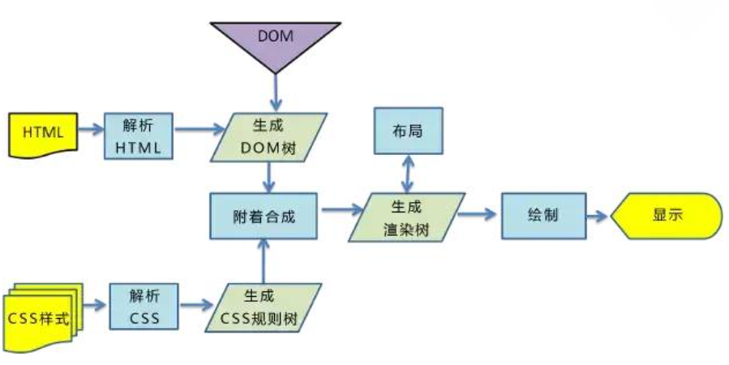
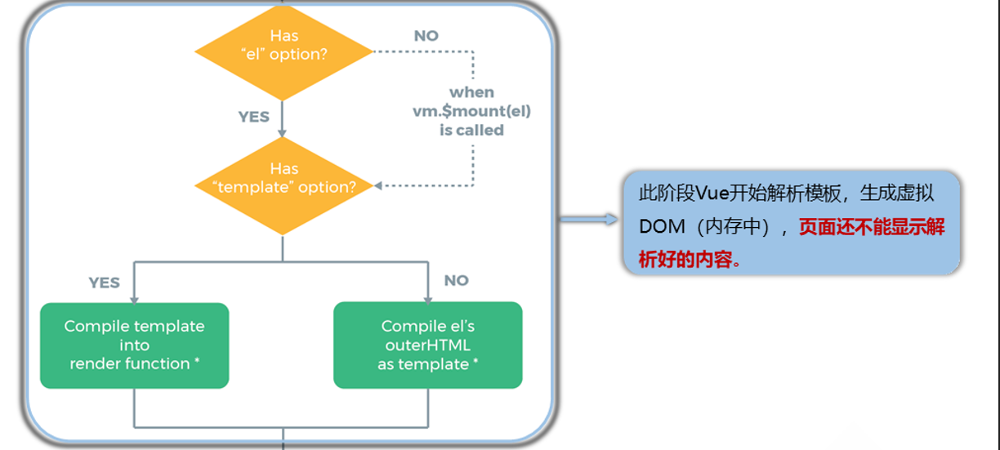
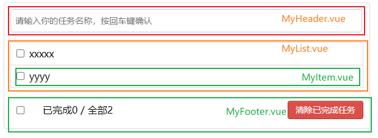
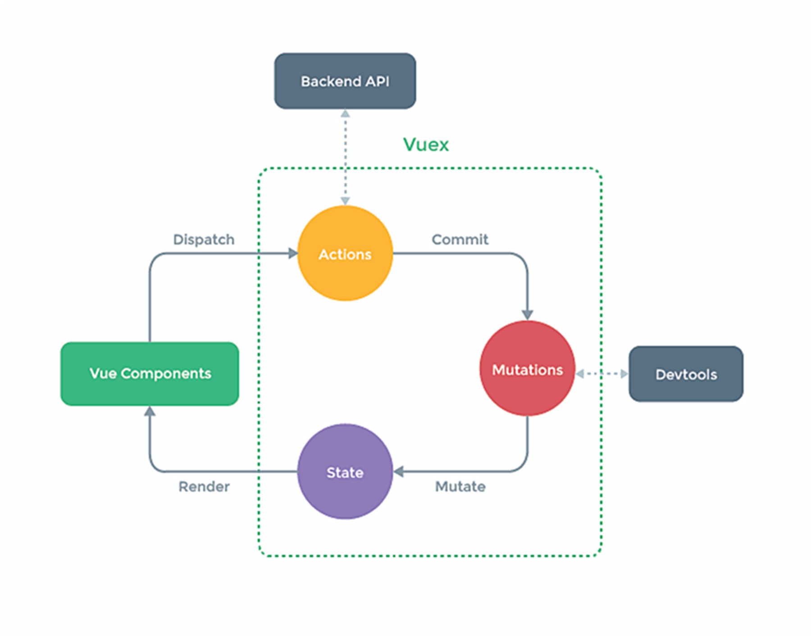

# Vue概述

Vue：构建用户界面的渐进式JavaScript框架。 （作用：将数据放于界面中展示，只关注如何进行数据展示；渐进式：逐渐、递进式地构建起应用，从轻量级简单应用到使用Vue插件构建起的复杂应用，自底向上逐层地实现引用）

特点：

1. 组件化。（结构、样式、交互都封装进一个.vue文件——组件——代码复用与便于维护）
2. 声明式编码。（只需声明，无需我们来直接操作DOM，开发效率提高）（what to do，声明好某处做什么，具体实现过程的逻辑已经进行封装，待运行时解析执行，表达与运行是分离的；命令式，how to do，表达了实现所需要的每一步，表达的也就是需要运行的）
3. 虚拟DOM + Diff算法。（数据转换为虚拟DOM后再转换为真实DOM，如果数据变化会使用 Diff算法 比较出变化的，再只将变化的转为真实DOM）

学习Vue前需要掌握的基础：ES6语法规范、ES6模块化、包管理器、原型和原型链、数组常用方法、axios、promise。

# Vue核心基础

## Vue开发环境与简单案例

Vue开发环境搭建：

1. 下载开发版的 vue.js文件。
2. 浏览器：下载Vue的开发者工具 Vue Devtools，允许其访问文件URL。
3. 关闭提示：`Vue.config.productionTip = false;`。

简单案例：

```html
<body>
    <!-- 容器 -->
    <div id="root">
        <h1>Hello {{name}}!</h1>
    </div>
    <script src="../js/vue.js"></script>
    <script>
        Vue.config.productionTip = false;
        // vue示例  容器与vue实例是一一对应的关系
        const x = new Vue({
            el:'#root',
            data:{
                name:'vue',
                age:22
            }
        })
    </script>
</body>
</html>
```

实现分析：

1. 使用Vue实现功能，需要创建Vue实例，且Vue实例与容器是一对一的关系。
2. `{{xxx}}`是Vue的语法，里面所填是js表达式，`{{}}`里可以读取到Vue实例的data属性里的值，实际上，Vue实例的属性都可以读取到。
   - js表达式就是特殊的js代码（语句），其是能产生值的js代码，比如变量、算术表达式、三元表达式等。
   - data里面的最终成为Vue实例的属性。

3. 容器引用Vue实例内数据，容器内数据也就随着Vue实例内数据变化而变化，Vue内数据变化会导致容器重新更新解析。

## 数据与容器

### 模板语法

插值语法：`{{插值}}`——用于标签体内容，可以直接读取到vue实例的data属性中的所有值。

指令语法：用于标签（标签属性、标签体内容、绑定事件......），指令形式多以`v-????`的形式

```html
<body>
    <div id="root">
        <!-- 指令语法示例   :是v-bind:的简写形式 -->
        <a v-bind:href="url" :val="hello">我的首页</a>
        <a :href="inner.url" v-bind:val="inner.hello">我的首页</a>
    </div>
    <script>
        Vue.config.productionTip = false;
        new Vue({
            el:'#root',
            data:{
                url:'https://www.ilyd.top',
                hello:'oh',
                inner:{
                    url:'https://www.baidu.com',
                    hello:'HI'
                }
            }
        })
    </script>
</body>
```

### 数据绑定

将标签与vue实例进行绑定，从而可以在绑定的标签中使用vue实例内的东西；有两种数据绑定方式：（和vue实例的data绑定）

1. 单向绑定：`v-bind:`。（vue实例影响绑定的标签）
2. 双向绑定：`v-model:`，**只能用于表单元素（可输入类元素）上**。（vue实例与绑定标签之间相互影响）

```html
<div id="root">
	<input type="text" v-model:value="data1">
    <!-- 简写形式 -->
	<input type="text" v-model="data2">
</div>
```


### 容器绑定与data写法

除了在Vue实例里通过`el:`来绑定容器，还可以通过`vm.$mount(' ')`来绑定容器：

```html
<div id="root">
    <input type="text" v-model:value="data1">
</div>
<script>
	const vm = new Vue({
        data:{data1:'数据1'}
    });
    vm.$mount('#root'); // mount——挂载；绑定容器
</script>
```

Vue实例中data的两种写法：对象式、函数式

```html
<script>
    Vue.config.productionTip = false;
    new Vue({
        el:'#root',
        // 对象式
        data:{
            url:'https://www.ilyd.top',
            hello:'oh',
            inner:{
                url:'https://www.baidu.com',
                hello:'HI'
            }
        }
    })
</script>
```

```html
<script>
    Vue.config.productionTip = false;
    new Vue({
        el:'#root',  
        // 函数式，组件时必须使用函数式，此函数由vue实例调用，不要写成箭头函数，箭头函数没有this
        data:function(){
            return{
                url:'https://www.ilyd.top',
            	hello:'oh',
            	inner:{
                	url:'https://www.baidu.com',
                	hello:'HI'
            	}
            }
        }
        /* 简写
        data(){
        
        }
        */
    })
</script>
```

### 数据代理

Object.defineProperty()方法：为对象添加属性。Object.defineProperty()使用及其配置项如下：

```html
<!-- 属性添加 -->
<script>
    let person = {
        name:'陆拾陆',
        sex:'男'
    };
    // 为person对象添加属性
    Object.defineProperty(person,'age',{
        value:19,        // 值
        enumerable:true, // 属性是否可被枚举 默认false
        writable:true,   // 属性是否能修改 默认false
        configurable:true // 是否能删除  默认false
    });
</script>
```

```html
<!-- getter与setter -->
<script>
    let num = 22;
    let person = {
        name:'陆拾陆',
        sex:'男'
    };
    Object.defineProperty(person,'age',{
        // 当读取person对象的age属性时就会调用get函数(我们称为getter)，并且返回值就是age的值
        // person.age时会被调用
        get:function(){
            return num;
        },
        // 当修改了person对象的age属性时就会调用set函数(我们称为setter)，且收到修改的具体值
        // person.age = 12 时会被调用
        set(value){
            console.log(value)
            num = value
        }
    });
</script>
```

数据代理：通过一个对象代理对另一个对象的读写操作。（利用了Object.defineProperty()的getter与setter实现）

```html
<!-- 数据代理简单示例 -->
<script>
    // 数据代理，通过一个对象可以对另一个对象进行读写操作
    let obj1 = {x:100};
    let obj2 = {y:200};
    // 为obj2添加x属性，对obj2的x属性修改、读取都是对obj1的x的修改与读取
    Object.defineProperty(obj2,'x',{
        get(){
            return obj1.x;
        },
        set(value){
            obj1.x = value;
        }
    });
</script>
```

Vue中的数据代理——方便操作data中数据：

- 原理：通过 Object.defineProperty() 把data对象中的所有属性添加到Vue实例对象中，并为每一个添加上去的属性都指定getter、setter。


## MVVM模型

**什么是MVVM?**

MVVM是**Model-View-ViewModel**的缩写。MVVM是一种设计思想。Model代表的是模型，也可以在Model中定义数据修改和操作业务逻辑，View代表的是视图，他负责将数据模型转成UI显示出来，ViewModel是一个同步View和Model的对象。

在MVVM架构下，View和Model之间是没有直接的联系，而是通过ViewModel来进行交互，Model和ViewModel之间的交互是双向的，因此View数据变化会同步到Model中，而Model的数据也会同步到View上。

ViewModel通过双向数据绑定，把View层和Model层连接起来，而View和Model之间的同步工作是完全自动的，不需要人为干涉，因此开发者只需要关注业务逻辑，不需要动手操作Dom，不需要关注数据状态的同步问题。复杂的数据状态维护完全由MVVM来统一管理。

**MVVM和MVC的区别？**

MVVM个MVC的区别其实不大。都是一种设计思想。主要是MVC中的controller演变成MVVM中的ViewModel。

MVVM主要解决了MVC大量的DOM操作使得页面渲染性能降低，加载的速度变慢，影响用户的体验，当Model频繁变化的时候，开发者需要主动更新View。

**Vue的优点：**

1. 低耦合。视图的View可以独立于Model变化和修改，一个ViewModel可以绑定到不同的View上，当View需要被修改的时候，不用动到Model的内容，当Model需要修改的时候，不用动到View的内容。
2. 可重用性。可以把一些视图逻辑放在一个ViewModel里面，让更多的View重用这段视图逻辑。
3. 独立开发。开发人员可以专注于业务逻辑和数据的开发，设计人员可以专注于页面的设计。
4. 可测试。界面素来比较难测试，但是现在测试可以针对ViewModel来进行编写。

Vue借鉴了MVVM思想：


## 事件

### Vue中事件的使用与注意事项：

1. 使用`v-on:xxx`或`@xxx`（简写形式）绑定事件，其中 xxx 是事件名称。
2. 事件的回调需要配置在methods对象中，最终会在vm上——成为vm对象的方法。
3. methods中配置的函数，不要用箭头函数，否则 this 就不是vm了。
4. methods中配置的函数，都是被 Vue所管理的函数，this 的指向是vue实例对象（vm）或组件实例对象（vc）。
5. `@click="demo"`和`@click="demo($event)"`效果一致，但后者可以传参，前者只会传入一个event——事件对象。
6. 注意：需要传参时加括号（`@click="demo(xxx)"`），但这样会导致事件对象无法传入，如果要传参数并且还需要传入事件对象，应该这样`示例：@click=demo(xxx,$event)`，用`$event`声明占位即可。

```html
<body>
    <div class="root">
        <button v-on:click="showInfo1">事件一，无传参</button>
        <button @click="showInfo2(6,$event)">事件二，有传参</button>
    </div>
    <script>
        Vue.config.productionTip = false;
        new Vue({
            el:'.root',
            data:{
                title:'事件的简单使用'
            },
            // 事件触发后的回调函数
            methods:{
                showInfo1(){
                    console.log('事件一被触发')
                },
                showInfo2(num,event){
                    console.log('事件二被触发');
                    console.log('num：' + num + "event：" + event.target);
                }
            }
        });
    </script>
</body>
```

### Vue中事件的修饰符：

1. prevent：阻止默认事件（常用）。
2. stop：阻止事件冒泡（常用）。
3. once：使事件只触发一次（常用）。
4. capture：使用事件的捕获模式。
5. self：只有event.target是当前操作的元素时才触发事件。
6. passive：事件的默认行为立即执行，无需等待事件回调执行完毕。
7. 修饰符可以连续写，比如可以这么用：`@click.prevent.stop="showInfo"`。

```html
<!-- 使用示例 -->
<div class="root">
    <a href="https://www.ilyd.top" @click.prevent>取消默认的点击链接时的跳转行为</a>
</div>
<script>
	new Vue({
        el:'.root'
    });
</script>
```

```html
<!-- self：只有event.target是当前操作的元素时才触发事件 -->
<div class="demo1" @click.self="showInfo">
    <button @click="showInfo">点我提示信息</button>
</div>
```

```html
<!-- 事件的默认行为立即执行，无需等待事件回调执行完毕 -->
<!-- scroll是滚动条滚动事件，passsive对其没有影响 -->
<!-- wheel是鼠标滚轮滚动事件，passive对其有影响 -->
<ul @wheel.passive="demo" class="list">
    <li>1</li>
    <li>2</li>
    <li>3</li>
    <li>4</li>
</ul>
<!-- 设置了 @wheel.passive后优先响应滚轮滚动，再执行demo -->
demo() {
	for (let i = 0; i < 100000; i++) {
		console.log('#')
	}
	console.log('累坏了')
}
```

### 键盘事件：

keyup、keydown等。

1、键盘上的每个按键都有自己的名称和编码，例如：Enter（13）。而Vue还对一些常用按键起了别名方便使用：

| 别名     | 说明                          |
| -------- | ----------------------------- |
| `enter`  | 回车键                        |
| `delete` | 删除，捕获“删除”和“退格”键    |
| `esc`    | 退出键                        |
| `space`  | 空格键                        |
| `tab`    | 换行键，必须配合keydown去使用 |
| `up`     | 上箭头键                      |
| `down`   | 下箭头键                      |
| `left`   | 左箭头键                      |
| `right`  | 右箭头键                      |

```html
<!-- 回车键释放时触发test回调函数 -->
<input type="text" @keyup.enter="test"> 
```

2、Vue未提供别名的按键，可以使用按键原始的key值去绑定，但注意要转为kebab-case（多单词小写短横线写法 ，例如NumLock键就是`num-lock`、 CapsLock键就是`caps-lock`。

3、系统修饰键（它们的用法特殊）：ctrl、alt、shift、meta（meta就是win键）

- 配合`keyup`使用：按下修饰键的同时，再按下其他键，随后释放其他键，事件才被触发。（示例：实现`ctrl+ y `触发——`@keyup.ctrl.y`）
- 配合`keydown`使用，则是正常触发事件。

4、也可以使用keyCode去指定具体的按键**（不推荐）**：例如`@keyup.13="xxx"`就是`@keyup.enter="xxx"`。（keyCode已被废弃，虽然有些浏览器仍然支持）

5、定制按键别名：`Vue.config.keyCodes.自定义键名 = 键码`。

```js
Vue.config.keyCodes.huiche = 13		// 定义回车按键的别名为 huiche
```

## vm属性—计算与侦听

### 计算属性

1. 定义：要用的属性不存在，要通过**Vue对象已有属性**计算得来。
2. 原理：底层借助了Objcet.defineProperty方法提供的getter和setter。
   - get函数什么时候执行？初次读取时会执行一次，当依赖的数据发生改变时会被再次调用。

3. 优势：与methods实现相比，内部有缓存机制（复用），效率更高，调试方便。
4. 备注：
   1. 计算属性最终会出现在vm上，直接读取使用即可。
   2. 如果计算属性要被修改，那必须写set函数去响应修改，且set中要引起计算时依赖的数据发生改变。
   3. 如果计算属性确定不考虑修改，可以使用计算属性的简写形式。

```html
<body>
    <div class="root">
        姓：<input type="text" v-model="firstName">
        名：<input type="text" v-model="lastName">
        <br>
        姓名：<span>{{fullname}}</span>
    </div>
    <script>
        Vue.config.productionTip = false;
        let vm = new Vue({
            el:'.root',
            data:{
                firstName:'张',
                lastName:'三'
            },
            // 计算属性
            computed:{
                fullname:{
                    // 计算属性的属性值会被缓存
                    // 当初次读取fullname时，或者fullname所依赖的数据发生改变时，该方法就会被调用
                    get(){
                        return this.firstName + '-' + this.lastName;
                    },
                    // set不是必须的，当fullname被修改时就会被调用
                    set(value){
                        const arr = value.split('-');
                        this.firstName = arr[0];
                        this.lastName = arr[1];
                    }
                }
            }
        });
    </script>
</body>
```

不考虑修改，使用计算属性的简写形式：

```html
<script>
    Vue.config.productionTip = false;
    let vm = new Vue({
        el:'.root',
        data:{
            firstName:'张',
            lastName:'三'
        },
        // 计算属性
        computed:{
            fullname(){
                return this.firstName + '-' + this.lastName;
            }
        }
    });
</script>
```


### 监视（侦听）属性

**监视属性watch：**

1. 当被监视的属性变化时，回调函数自动调用相关函数来进行相关操作。
2. 监视的属性在Vue实例中必须存在才能进行监视，既可以监视data的，也可以监视计算属性。
3. 配置项属性`immediate:false`，改为 true，则初始化时会调用一次`handler(newValue,oldValue)`，否则初始化时不会调用，当监视的属性变化时才会调用。
4. 监视的两种写法：
   1. new Vue时传入watch配置。
   2. 通过`vm.$watch`监视。

监视属性的使用示例——使用watch配置项：（可以使用简写形式`isHot(){xxx}`）

```html
<body>
    <div id="root">
        <h2>今天天气很{{info}}</h2>
        <button @click="changeWeather">切换天气</button>
    </div>
    <script>
        const vm = new Vue({
            el: '#root',
            data: {
                isHot: true,
            },
            computed: {
                // 计算属性 info
                info() {
                    return this.isHot ? '炎热' : '凉爽'
                }
            },
            methods: {
                // 点击事件的回调方法
                changeWeather() {
                    this.isHot = !this.isHot
                }
            },
            watch: {
                // 监视属性 isHot
                isHot: {
                    // 改为true表示初始化时就让handler调用一下，否则就是当监视属性变化时才调用
                    immediate: true,
                    // handler什么时候调用？当isHot发生改变时。
                    handler(newValue, oldValue) {
                        console.log('isHot被修改了', newValue, oldValue)
                    }
                }
            }
        })
    </script>
</body>
```

监视属性的使用示例——通过`vm.$watch`：

```html
<body>
    <div id="root">
        <h2>今天天气很{{info}}</h2>
        <button @click="changeWeather">切换天气</button>
    </div>
    <script>
        const vm = new Vue({
            el: '#root',
            data: {
                isHot: true,
            },
            computed: {
                // 计算属性 info
                info() {
                    return this.isHot ? '炎热' : '凉爽'
                }
            },
            methods: {
                // 点击事件的回调方法
                changeWeather() {
                    this.isHot = !this.isHot
                }
            },
        })
        vm.$watch('isHot', {
            // 改为true表示初始化时就让handler调用一下，否则就是当监视属性变化时才调用
            immediate: true,
            // handler什么时候调用？当isHot发生改变时。
            handler(newValue, oldValue) {
                console.log('isHot被修改了', newValue, oldValue)
            }
        })
    </script>
</body>
```

### 深度监视

Vue中的watch默认不监测对象内部值的改变，只会监视整个对象，当整个对象发生改变时才触发监视。

如果要监视对象内部某个属性，可以这样做：

```html
<body>
    <div id="root">
        <div>{{obj.a}}</div>
    </div>
    <script src="../js/vue.js"></script>
    <script>
        const vm = new Vue({
            el: '#root',
            data: {
                obj:{a:1,b:2}
            },
            methods: {
                change(){
                    this.obj.a=3;
                }
            },
        })
        // 监视obj对象的a属性
        vm.$watch('obj.a',{
            handler(newValue, oldValue) {
                console.log('obj对象内的属性a被修改了', newValue, oldValue)
            }
        })
    </script>
</body>
```

如果要监视对象内部所有属性，可以这样做：（添加deep）

```js
// 监视obj对象的所有属性
vm.$watch('obj',{
    // 添加depp
    deep:true,
    // newValue oldValue是obj的新与旧，当更改obj里的属性，obj的引用没有改变
	handler(newValue, oldValue) {
		console.log('obj对象内的属性被修改了', newValue, oldValue)
	}
})
```

### computed与watch的区别

watch能完成的功能 >= computed能完成的功能，能使用computed的就使用computed，有异步任务只能使用watch。

```js
new Vue({
  el:'#root',
  data:{
    firstName:'张',
    lastName:'三',
    fullName:'张-三'
  },
  watch:{
    firstName(val){
      setTimeout(()=>{
        this.fullName = val + '-' + this.lastName;
      },1000);
    },
    lastName(val){
      this.fullName = this.firstName + '-' + val;
    }
  }
})
```

Vue实例中函数的两个重要的小原则：

1. 所被Vue管理的函数，最好写成普通函数，这样this的指向才是vm 或 组件实例对象。

2. 所有不被Vue所管理的函数（定时器的回调函数、ajax的回调函数等、Promise的回调函数），最好写成箭头函数，这样this的指向才是vm 或 组件实例对象。

## 样式绑定

### class样式绑定

利用数据绑定，`:class=“xxx”`，xxx可以是字符串、对象、数组。		

**字符串写法：**（样式的类名不确定，需要动态指定类名的情况）

```html
<div id="root">
    <div class="basic" :class="mood" @click="changeMood">{{name}}</div>
</div>
<script>
	const vm = new Vue({
        el:'#root',
        data:{
            name:'xxx',
            mood:'normal'
        },
        methods:{
            changeMood(){
                this.mood=xxx;
            }
        }
    })
</script>
```

**数组写法：**（要绑定多个样式，个数不确定，名字也不确定）

```html
<div id="root">
	<div class="basic" :class="classArr">{{name}}</div>
</div>

<script>
	const vm = new Vue({
        el:'#root',
        data:{
            name:'xxx',
            // 操作数组来实现class里的个数、名称
            classArr: ['style1','style2','style3']
       }
    })
</script>
```

**对象写法：**（要绑定多个样式，个数确定，名字也确定，但不确定用不用）

```html
<div id="root">
	<div class="basic" :class="classObj">{{name}}</div>
</div>

<script>
	const vm = new Vue({
        el:'#root',
        data:{
            name:'xxx',
            classObj:{
                style1:false,
                style2:true
			}
        }
    })
</script>
```

### 行内style样式绑定

对象写法：

```html
<div id="root">
    <div class="basic" :style="styleObj">{{name}}</div>
</div>
<script>
    const vm = new Vue({
        el:'#root',
        data:{
            styleObj:{
                fontSize: '40px',
                color:'red',
            }
        }
    })
</script>
```

数组写法：

```html
<div id="root">
    <div class="basic" :style="styleArr">{{name}}</div>
</div>
<script>
    const vm = new Vue({
        el:'#root',
        data:{
            styleArr:[
                {
                    fontSize: '40px',
                    color:'blue',
                },
                {
                    backgroundColor:'gray'
                }
            ]
        }
    })
</script>
```

## 条件渲染

1. `v-if="表达式"`：如果表达式成立就显示当前元素，不成立就不显示，DOM的元素会移除或添加。
2. `v-else="表达式"`：可以与`v-if="表达式"`结合使用，相当于if-else。
3. `v-else-if`：可以与`v-if="表达式"`结合使用，相当于if-else if；可以与`v-else="表达式"`使用，相当于else if-else。
4. 使用场景：会对DOM进行操作，使用频率低的场景使用。

```html
<div id="root">
    <!-- 使用v-if做条件渲染 -->
    <h2 v-if="false">欢迎来到{{name}}</h2>
    <h2 v-if="1 === 1">欢迎来到{{name}}</h2>
    
    <!-- v-else和v-else-if -->
    <div v-if="n === 1">Angular</div>
    <div v-else-if="n === 2">React</div>
    <div v-else-if="n === 3">Vue</div>
    <div v-else>哈哈</div>
    
    <!-- v-if与template的配合使用 -->
    <!-- 就不需要写好多个判断，写一个就行 这里的思想就像事件代理的使用 -->
    <!-- template标签不影响结构，页面html中不会有此标签，但其只能配合v-if使用 -->
    <template v-if="n === 1">
        <h2>你好</h2>
        <h2>北京</h2>
        <h2>北京</h2>
    </template>
</div>

<script>
	const vm = new Vue({
        el:'#root',
        data:{
            styleArr:[
                {
                    fontSize: '40px',
                    color:'blue',
                },
                {
                    backgroundColor:'gray'
                }
            ]
        }
    })
</script>
```

`v-show="表达式"`：不展示的DOM元素未被移除，仅仅是使用样式隐藏掉（display:none），因此适用于切换频率较高的场景

```html
<div id="root">
    <!-- 使用v-show做条件渲染 -->
    <!-- 隐藏 -->
    <h2 v-show="false">欢迎来到{{name}}</h2>
    <!-- 显示 -->
    <h2 v-show="1 === 1">欢迎来到{{name}}</h2>
</div>
```

## 列表渲染

### v-for

**（类似for-in、for-of遍历，用于展示列表数据，与of或in搭配使用）**

1. 语法一：`v-for="obj of objs" :key="xxx"`，遍历objs将里面的值取出到obj，并且为当前节点添加一个身份标识key。（in同理）
2. 语法二：`v-for="(obj,index) of objs" :key="index"`，括号第二个就是遍历的对象的唯一标识，是自增的自然数，此时可以不指定`:key`，或者前面括号不指定index。（in同理）
3. 可用于：数组、对象、字符串（用的很少）、指定次数（用的很少）。

```html
<title>基本列表</title>
<script type="text/javascript" src="../js/vue.js"></script>
<div id="root">
    <!-- 遍历数组 -->
    <h3>人员列表（遍历数组）</h3>
    <ul>
        <li v-for="(p,index) in persons" :key="index">{{ p.name }}-{{ p.age }}</li>
    </ul>
    <!-- 遍历对象 -->
    <h3>汽车信息（遍历对象）</h3>
    <ul>
        <!-- 括号内第一个是属性值，第二个是属性名称  可以使用属性名称当做key -->
        <li v-for="(value,k) of car" :key="k">{{ value }}--{{ k }}</li>
    </ul>

    <!-- 遍历字符串 -->
    <h3>测试遍历字符串（用得少）</h3>
    <ul>
        <li v-for="(char,index) of str" :key="index">{{ char }}-{{ index }}</li>
    </ul>

    <!-- 遍历指定次数 -->
    <h3>测试遍历指定次数（用得少）</h3>
    <ul>
        <li v-for="(number,index) of 5" :key="index">{{ number }}--{{ index }}</li>
    </ul>
</div>

<script type="text/javascript">
    Vue.config.productionTip = false
    new Vue({
        el: '#root',
        data: {
            persons: [
                { id: '001', name: '张三', age: 18 },
                { id: '002', name: '李四', age: 19 },
                { id: '003', name: '王五', age: 20 }
            ],
            car: {
                name: '奥迪A8',
                price: '70万',
                color: '黑色'
            },
            str: 'hello'
        }
    })
</script>
```

**react、vue中key的作用：**

1. 虚拟DOM中的key有什么作用？（key的内部原理）
   key是虚拟DOM对象的标识，当状态中数据发生变化，vue会根据新数据生成新的虚拟DOM，随后Vue进行新虚拟DOM和旧虚拟DOM的差异比较：

   1. 旧虚拟DOM找到和新虚拟DOM相同的key，再进行内容比较：

      ①.虚拟DOM中内容不变部分则直接使用之前的真实DOM。

      ②.若虚拟DOM中某部分内容改变了，则为该部分生成新的真实DOM，随后替换页面中之前的该部分的真实DOM。

   2. 若没有找到相同的key，则直接创建真实DOM。随后渲染到页面。

2. 使用index作为key可能引发的问题：

   1. 若对数据进行逆序添加、逆序删除等破坏顺序的操作，会产生没有必要的真实DOM更新，虽然不响应页面效果但效率低。
   2. 如果结构中还包括输入类的DOM，那就会导致产生错误的DOM更新，导致页面效果出现偏差。

3. 如何选择key？

   1. 每条数据的唯一标识（例如id、手机号、学号等）。
   2. 不存在对数据的逆序添加、逆序删除等操作，仅用于展示数据，那可以使用index。

### 真实DOM与虚拟DOM

[深入剖析：Vue核心之虚拟DOM - 掘金 (juejin.cn)](https://juejin.cn/post/6844903895467032589)

啥是真实 DOM？真实 DOM 和 虚拟 DOM 有啥区别？如何用代码展现真实 DOM 和 虚拟 DOM



所有的浏览器渲染引擎工作流程大致分为5步：`1、创建 DOM树 ==> 2、创建 Style Rules ==> 3、构建Render树 ==> 4、布局Layout ==> 5、绘制Painting`。

1. 第一步，构建 DOM 树：当浏览器接收到来自服务器响应的HTML文档后，会遍历文档节点，生成DOM树。需要注意的是在DOM树生成的过程中有可能会被CSS和JS的加载执行阻塞，渲染阻塞：
   - 渲染阻塞：当浏览器遇到一个script标签时，DOM构建将暂停，直到脚本加载执行，然后继续构建DOM树。每次去执行Javascript脚本都会严重阻塞DOM树构建，如果JavaScript脚本还操作了CSSOM，而正好这个CSSOM没有下载和构建，那么浏览器甚至会延迟脚本执行和构建DOM，直到这个CSSOM的下载和构建。所以，script标签引入很重要，实际使用时可以遵循下面两个原则：
     - css优先：引入顺序上，css资源先于js资源
     - js后置：js代码放在底部，且js应尽量少影响DOM构建
     - 补充——当解析html时，会把新来的元素插入dom树里，同时去查找css，然后把对应的样式规则应用到元素上，查找样式表是按照从右到左的顺序匹配的例如：`div p { … }`，会先寻找所有p标签并判断它的父标签是否为div之后才决定要不要采用这个样式渲染。所以平时写css尽量用`class`或者`id`，不要过度层叠。
2. 第二步，生成样式表：用 CSS 分析器，分析 CSS 文件和元素上的 inline 样式，生成页面的样式表；

3. 第三步，构建渲染树：通过DOM树和CSS规则我们可以构建渲染树。浏览器会从DOM树根节点开始遍历每个可见节点(注意是可见节点)对每个可见节点，找到其适配的CSS规则并应用。渲染树构建完后，每个节点都是可见节点并且都含有其内容和对应的规则的样式。这也是渲染树和DOM树最大的区别所在。渲染是用于显示，那些不可见的元素就不会在这棵树出现了。除此以外，display none的元素也不会被显示在这棵树里。visibility hidden的元素会出现在这棵树里。

4. 第四步，渲染布局：布局阶段会从渲染树的根节点开始遍历，然后确定每个节点对象在页面上的确切大小与位置，布局阶段的输出是一个盒子模型，它会精确地捕获每个元素在屏幕内的确切位置与大小。

5. 第五步，渲染树绘制：在绘制阶段，遍历渲染树，调用渲染器的paint()方法在屏幕上显示其内容。渲染树的绘制工作是由浏览器的UI后端组件完成的。


**注意点：**

1、DOM 树的构建是文档加载完成才开始的？ 并不是，构建 DOM 树是一个渐进过程，为达到更好的用户体验，渲染引擎会尽快将内容显示在屏幕上，它不必等到整个 HTML 文档解析完成之后才开始构建 render 树和布局。

2、Render 树是 DOM 树和 CSS 样式表构建完毕后才开始构建的？ 这三个过程在实际进行的时候并不是完全独立的，而是会有交叉，会一边加载，一边解析，以及一边渲染。

3、CSS 的解析注意点？ CSS 的解析是从右往左逆向解析的，嵌套标签越多，解析越慢。

**4、JS 操作真实 DOM 的代价？**传统DOM结构操作方式对性能的影响很大，原因是频繁操作DOM结构 会引起页面的重排(reflow)和重绘(repaint)，浏览器不得不频繁地计算布局，重新排列和绘制页面元素，导致浏览器产生巨大的性能开销。直接操作真实DOM的性能特别差，我们可以来演示一遍。

```html
<div id="app"></div>
<script>
    // 获取 DIV 元素
    let box = document.querySelector('#app');
    console.log(box);

    // 真实 DOM 操作
    console.time('a');
    for (let i = 0; i <= 10000; i++) {
        box.innerHTML = i;
    }
    console.timeEnd('a');

    // 虚拟 DOM 操作
    let num = 0;
    console.time('b');
    for (let i = 0; i <= 10000; i++) {
        num = i;
    }
    box.innerHTML = num;
    console.timeEnd('b');
</script>
```

虚拟 DOM 的好处:

虚拟 DOM 就是为了解决浏览器性能问题而被设计出来的。如前，若一次操作中有 10 次更新 DOM 的动作，虚拟 DOM 不会立即操作 DOM，而是将这 10 次更新的 diff 内容保存到本地一个 JS 对象中，最终将这个 JS 对象一次性 attch 到 DOM 树上，再进行后续操作，避免大量无谓的计算量。所以，用 JS 对象模拟 DOM 节点的好处是，页面的更新可以先全部反映在 JS 对象(虚拟 DOM )上，操作内存中的 JS 对象的速度显然要更快，等更新完成后，再将最终的 JS 对象映射成真实的 DOM，交由浏览器去绘制。

虽然这一个虚拟 DOM 带来的一个优势，但并不是全部。虚拟 DOM 最大的优势在于抽象了原本的渲染过程，实现了跨平台的能力，而不仅仅局限于浏览器的 DOM，可以是安卓和 IOS 的原生组件，可以是近期很火热的小程序，也可以是各种GUI。

 回到最开始的问题，虚拟 DOM 到底是什么，说简单点，就是一个普通的 JavaScript 对象，包含了 tag、props、children 三个属性。


### 列表过滤

使用watch实现：

```html
<div id="root">
  <h2>人员列表</h2>
  <input type="text" placeholder="请输入名字" v-model="keyWord">
  <ul>
    <li v-for="(p,index) of filPersons" :key="p.id">
      {{ p.name }}-{{ p.age }}-{{ p.sex }}
    </li>
  </ul>
</div>

<script type="text/javascript">
  Vue.config.productionTip = false
  // 用 watch 实现 
   new Vue({
			el: '#root',
			data: {
				keyWord: '',
				persons: [
					{ id: '001', name: '马冬梅', age: 19, sex: '女' },
					{ id: '002', name: '周冬雨', age: 20, sex: '女' },
					{ id: '003', name: '周杰伦', age: 21, sex: '男' },
					{ id: '004', name: '温兆伦', age: 22, sex: '男' }
				],
				filPersons: []
			},
			watch: {
				keyWord: {
					immediate: true,
					handler(val) {
                        // 注意:indexOf对于空串的结果是0，这样上面代码初始过滤就是全部数据
						this.filPersons = this.persons.filter((p) => {
							return p.name.indexOf(val) !== -1
						})
					}
				}
			}
		}) 
</script>
```

使用computed实现：

```html
<div id="root">
    <h2>人员列表</h2>
    <input type="text" placeholder="请输入名字" v-model="keyWord">
    <ul>
        <li v-for="(p,index) of filPersons" :key="p.id">
            {{ p.name }}-{{ p.age }}-{{ p.sex }}
        </li>
    </ul>
</div>

<script type="text/javascript">
    Vue.config.productionTip = false
    // 用 computed 实现
    new Vue({
        el: '#root',
        data: {
            keyWord: '',
            persons: [
                { id: '001', name: '马冬梅', age: 19, sex: '女' },
                { id: '002', name: '周冬雨', age: 20, sex: '女' },
                { id: '003', name: '周杰伦', age: 21, sex: '男' },
                { id: '004', name: '温兆伦', age: 22, sex: '男' }
            ]
        },
        computed: {
            filPersons() {
                return this.persons.filter((p) => {
                    return p.name.indexOf(this.keyWord) !== -1
                })
            }
        }
    }) 
</script>
```


### 列表排序

有时为了减少服务器压力，能在前端做的尽量在前端做。

```html
<div id="root">
  <h2>人员列表</h2>
  <input type="text" placeholder="请输入名字" v-model="keyWord">
  <button @click="sortType = 2">年龄升序</button>
  <button @click="sortType = 1">年龄降序</button>
  <button @click="sortType = 0">原顺序</button>
  <ul>
    <li v-for="(p,index) of filPersons" :key="p.id">
      {{p.name}}-{{p.age}}-{{p.sex}}
      <input type="text">
    </li>
  </ul>
</div>

<script type="text/javascript">
  Vue.config.productionTip = false
  new Vue({
    el: '#root',
    data: {
      keyWord: '',
      sortType: 0, // 0原顺序 1降序 2升序
      persons: [
        { id: '001', name: '马冬梅', age: 30, sex: '女' },
        { id: '002', name: '周冬雨', age: 31, sex: '女' },
        { id: '003', name: '周杰伦', age: 18, sex: '男' },
        { id: '004', name: '温兆伦', age: 19, sex: '男' }
      ]
    },
    computed: {
      filPersons() {
        const arr = this.persons.filter((p) => {
          return p.name.indexOf(this.keyWord) !== -1
        })
        //判断一下是否需要排序
        if (this.sortType) {
          arr.sort((p1, p2) => {
            return this.sortType === 1 ? p2.age - p1.age : p1.age - p2.age
          })
        }
        return arr
      }
    }
  })
</script>
```

## Vue数据监视原理

数据改变了但Vue并没有监测到数据已经发生改变的案例如下：

```html
<!-- 准备好一个容器-->
<div id="root">
    <h2>人员列表</h2>
    <button @click="updateMei">更新马冬梅的信息</button>
    <ul>
        <li v-for="(p,index) of persons" :key="p.id">
            {{p.name}}-{{p.age}}-{{p.sex}}
        </li>
    </ul> 
</div>
<script type="text/javascript">
    Vue.config.productionTip = false
    const vm = new Vue({
        el:'#root',
        data:{
            persons:[
                {id:'001',name:'马冬梅',age:30,sex:'女'},
                {id:'002',name:'周冬雨',age:31,sex:'女'},
                {id:'003',name:'周杰伦',age:18,sex:'男'},
                {id:'004',name:'温兆伦',age:19,sex:'男'}
            ]
        },
        methods: {
            updateMei(){
                // this.persons[0].name = '马老师';  //奏效
                // this.persons[0].age = 50;        //奏效
                // this.persons[0].sex = '男';      //奏效
                // persons的数据被改变了，但Vue没有监测到，导致页面数据更新不奏效
                this.persons[0] = {id:'001',name:'马老师',age:50,sex:'男'};
                // this.persons.splice(0,1,{id:'001',name:'马老师',age:50,sex:'男'}); // 奏效
            }
        }
    }) 
</script>
```

那为什么会这样呢？

### Vue监测对象的原理

Vue实例里的data，进行加工后再转为_data，对数据的监测依赖于getter、setter，只要数据更改就会触发页面模板更新，也就是说Vue监测对象数据依赖于getter、setter。如下，简单模拟对象监测：

```html
<script>
    let data = {
        name: '尚硅谷',
        address: '北京',
    };
    // vue也有一个Observer
    function Observer(obj) {
        // 汇总对象中所有的属性形成一个数组
        const keys = Object.keys(obj)
        // 遍历
        keys.forEach((k) => {
            Object.defineProperty(this, k, {
                get() {
                    return obj[k]
                },
                set(val) {
                    console.log(`${k}被改了，我要去解析模板，生成虚拟DOM.....我要开始忙了`)
                    obj[k] = val
                }
            })
        })
    }
    // 创建一个监视的实例对象，用于监视data中属性的变化
    const obs = new Observer(data);
    console.log(obs);
    // 准备一个vm实例对象
    let vm = {};
    vm._data = data = obs;
</script>
```


### 关于Vue.set()方法

1. `Vue.set(targetObj, 属性名或index, value) `。
2. `vm.$set(targetObj,  属性名或index, value)`。

Vue.set()方法用于向响应式对象中添加一个属性，并确保这个新对象同样是响应式的，且触发视图更新。它必须用于向响应式对象上添加新属性，因为 Vue 无法探测普通的新增属性（比如 `vm.myObject.newProperty = 'hi'`）。

```html
<!-- 准备好一个容器-->
<div id="root">
    <h1>学生信息</h1>
    <button @click="addSex">添加性别属性，默认值：男</button> <br/>
</div>
<script type="text/javascript">
    Vue.config.productionTip = false // 阻止 vue 在启动时生成生产提示。
    const vm = new Vue({
        el:'#root',
        data:{
            student:{
                name:'tom',
                age:18,
                hobby:['抽烟','喝酒','烫头'],
                friends:[
                    {name:'jerry',age:35},
                    {name:'tony',age:36}
                ]
            }
        },
        methods: {
            addSex(){
                // Vue.set(this.student,'sex','男')
                // 为响应式对象student添加属性——sex
                this.$set(this.student,'sex','男')
            }
        }
    })
</script>
```

需要注意的是`Vue.set() `或 `vm.$set `不能对Vue实例或者Vue实例的根数据对象（data对象或_data对象）进行属性添加。

### Vue监测数组

```html
<!-- 准备好一个容器-->
<div id="root">
    <h2>爱好</h2>
    <ul>
        <li v-for="(h,index) in student.hobby" :key="index">
            {{h}}
        </li>
    </ul>
    <h2>朋友们</h2>
    <ul>
        <li v-for="(f,index) in student.friends" :key="index">
            {{f.name}}--{{f.age}}
        </li>
    </ul>
</div>
<script src="../js/vue.js"></script>
<script type="text/javascript">
    Vue.config.productionTip = false //阻止 vue 在启动时生成生产提示。
    const vm = new Vue({
        el:'#root',
        data:{
            student:{
                name:'tom',
                age:{
                    rAge:40,
                    sAge:29,
                },
                hobby:['抽烟','喝酒','烫头'],
                friends:[
                    {name:'jerry',age:35},
                    {name:'tony',age:36}
                ]
            }
        },
        methods: {
            
        }
    })
</script>
```

没有发现为数组服务的getter、setter，如下：


所以案例中我们通过 `vm._data.student.hobby[0] = 'play' ` 修改数据并不会使页面重新解析奏效，Vue 没有为数组添加 getter 和 setter，所以监测不到数组数据的更改，也就不会引起页面模板的重新解析。

既然 vue 对数组不是通过 getter 和 setter 进行数据监视，那 vue 到底如何监视数组数据的变化呢？

vue对数组的监测是通过包装数组上常用的用于修改的方法来实现的，执行这些方法将会触发视图更新：


通过`Vue.set(targetArr, 数组索引, value) `也可以对数组进行操作并触发视图更新。

### 练习

```html
<style>button {margin-top: 10px;}</style>

<div id="root">
    <h1>学生信息</h1>
    <button >年龄+1岁</button> <br />
    <button >添加性别属性，默认值：男</button> <br />
    <button >修改性别</button> <br />
    <button >在列表首位添加一个朋友</button> <br />
    <button >修改第一个朋友的名字为：张三</button> <br />
    <button >添加一个爱好</button> <br />
    <button >修改第一个爱好为：开车</button> <br />
    <button >过滤掉爱好中的抽烟</button> <br />
    <h3>姓名：</h3>
    <h3>年龄：</h3>
    <h3 >性别：</h3>
    <h3>爱好：</h3>
    <ul>
        <li ></li>
    </ul>
    <h3>朋友们：展示朋友的名字和年龄</h3>
    <ul>
        <li >{{  }}--{{  }}</li>
    </ul>
</div>

<script type="text/javascript">
    Vue.config.productionTip = false

    const vm = new Vue({
        el: '#root',
        data: {
            student: {
                name: 'tom',
                age: 18,
                hobby: ['抽烟', '喝酒', '烫头'],
                friends: [
                    { name: 'jerry', age: 35 },
                    { name: 'tony', age: 36 }
                ]
            }
        },
        methods: {
            
        }
    })
</script>
```


### 总结

Vue监视数据的原理：

1. Vue会监视data中所有层次的数据。

2. Vue如何监测对象中的数据？

   通过setter实现监视，且要在new Vue时就传入要监测的数据。

   1. 对象中后追加的属性，Vue默认不做响应式处理
   2. 如需给后添加的属性做响应式，请使用如下API：`Vue.set(target，propertyName/index，value)` 或`vm.$set(target，propertyName/index，value)`。

3. 如何监测数组中的数据？

   通过包裹数组更新元素的方法实现，本质就是做了两件事：调用原生对应的方法对数组进行更新；重新解析模板，进而更新页面。

4. 在Vue修改数组中的某个元素一定要用如下方法：使用这些API：`push()、pop()、shift()、unshift()、splice()、sort()、reverse()、
   Vue.set() 或 vm.$set()`。

5. 特别注意：`Vue.set()` 和 `vm.$set() `不能给vm 或 vm的根数据对象 添加属性！！！例：`Vue.set(this,...,...)`或`this.$set(this, ..., ...)`。

## 使用v-model收集表单数据

**对于不同表单元素v-model所绑定的数据收取到的值：**

1. 若：`<input type="text"/>`，则`v-model`收集的是`value`值，用户输入的就是`value`值。
2. 若：`<input type="radio"/>`，则`v-model`收集的是`value`值，且要给标签配置`value`值。
3. 若：`<input type="checkbox"/>`
   1. 如果没有配置value属性，那么收集的就是checked（勾选 or 未勾选，是布尔值，true 或false）。
   2. 如果配置有value属性：
      ① v-model绑定的数据的初始值是非数组，那么收集的就是checked（勾选 or 未勾选，是布尔值）。
      ② v-model绑定的数据的初始值是数组，那么收集的的就是value组成的数组。

【备注】v-model的三个修饰符：

1. lazy：失去焦点再收集数据。（（例：`<textarea type="number" v-model.number="phone">`）
2. number：输入字符串转为有效的数字。（例：`<input type="number" v-model.number="phone">`）
3. trim：输入首尾空格过滤。（例：`<input type="number" v-model.number="phone">`）

**具体实例如下：**

```html
<body>
    <div id="root">
        <form @submit.prevent="demo">
            账号：<input type="text" v-model.trim="userInfo.account"> <br/><br/>
            密码：<input type="password" v-model="userInfo.password"> <br/><br/>
            年龄：<input type="number" v-model.number="userInfo.age"> <br/><br/>
            性别：
            男<input type="radio" name="sex" v-model="userInfo.sex" value="male">
            女<input type="radio" name="sex" v-model="userInfo.sex" value="female"><br/><br/>
            爱好：
            学习<input type="checkbox" v-model="userInfo.hobby" value="study">
            打游戏<input type="checkbox" v-model="userInfo.hobby" value="game">
            吃饭<input type="checkbox" v-model="userInfo.hobby" value="eat">
            <br/><br/>
            所属校区
            <select v-model="userInfo.city">
                <option value="">请选择校区</option>
                <option value="beijing">北京</option>
                <option value="shanghai">上海</option>
                <option value="shenzhen">深圳</option>
                <option value="wuhan">武汉</option>
            </select>
            <br/><br/>
            其他信息：
            <textarea v-model.lazy="userInfo.other"></textarea> <br/><br/>
            <input type="checkbox" v-model="userInfo.agree">阅读并接受<a href="http://www.atguigu.com">《用户协议》</a>
            <button>提交</button>
        </form>
    </div>
    <script type="text/javascript">
        Vue.config.productionTip = false

        new Vue({
            el:'#root',
            data:{
                userInfo:{
                    account:'',
                    password:'',
                    age:18,
                    sex:'female',
                    hobby:[],
                    city:'beijing',
                    other:'',
                    agree:''
                }
            },
            methods: {
                demo(){
                    console.log(JSON.stringify(this.userInfo))
                }
            }
        })
    </script>
</body>
```

v-model实现模拟：

```html
<h2>v-model实现原理(vue2)</h2>
<!-- 
原生DOM当中是有oninput事件,它经常结合表单元素一起使用,当表单元素文本内容发生变化的时候就会发出一次回调
Vue2:可以通过value与input事件实现v-model功能
原生DOM标签身上的 :value是v-bind单项数据绑定
-->
<input type="text" :value="msg" 
       @input="msg = $event.target.value">
<span>{{msg}}</span>
```


## 过滤器

了解：过滤器，对传入参数进行一个处理，并不会改变原来数据。

```html
<body>
    <div id="root">
        <!-- 通过管道符使用过滤器 -->
        <div>{{time | timeFromater}}</div>
        <div>{{time | timeFromaters("YYYY-MM-DD")}}</div>
        <div>{{time | timeFromaters("YYYY-MM-DD") | mySlice}}</div>
    </div>
    <script type="text/javascript">
        Vue.config.productionTip = false
		// 全局过滤器
        Vue.filter('',function(){
            
            retuen xxx;
        });
        new Vue({
            el:'#root',
            data:{
                time:Date.now()
            },
            // 局部过滤器
            filters:{
                // 设置过滤器，默认的第一个参数是管道符前的数据
                timeFromater(val){
                    return Math.floor(val / 1000) + 's';
                },
                timeFromater(val,str){
                    
                },
                mySlice(){
                    
                }
            }
        })
    </script>
</body>
```

总结：通过filters配置项来配置的对象内函数就是用于过滤的函数，其用于对某个数据进行过滤操作，使用时通过管道符`|`来把管道符前的数据存入到过滤函数中，且第一个接收到的都是管道符前的数据。


## Vue内置指令

之前学过的指令：

| 指令      | 说明                                 |
| --------- | ------------------------------------ |
| v-bind    | 单向绑定解析表达式，可简写为`:`      |
| v-model   | 双向数据绑定，用于表单等可输入元素上 |
| v-for     | 遍历数组 / 对象 / 字符串             |
| v-on      | 绑定事件监听，可简写为@              |
| v-show    | 条件渲染（动态控制节点是否展示）     |
| v-if      | 条件渲染（用于动态控制节点的存在）   |
| v-else-if | 条件渲染（用于动态控制节点的存在）   |
| v-else    | 条件渲染（用于动态控制节点的存在）   |


### v-text 、v-html

v-text指令和v-html指令（使用的比较少）。

1. 作用：
   - v-text指令：向其所在的节点中渲染文本内容。（类似于innerText的效果）
   - v-html指令：向指定节点中渲染包含html结构的内容。（类似于innerHtml的效果）
2. 与插值语法的区别：v-text、v-html会替换掉节点中的内容，`{{xxx}}`则不会，v-html可以识别html结构。
3. 严重注意：v-html有安全性问题！！！！
   - 在网站上动态渲染任意HTML是非常危险的，容易导致XSS攻击。一定要在可信的内容上使用v-html，永不要用在用户提交的内容上！

```html
<div id="root">
    <div>你好，{{author}}</div>
    <div v-text="author"></div>
    <div v-html="str"></div>
</div>
<script type="text/javascript">
    Vue.config.productionTip = false 
    new Vue({
        el:'#root',
        data:{
            author:'尤雨溪',
            str:'<h3>你好啊，Vue的作者</h3>'
        }
    })
</script>
```

### v-cloak

- 本质是一个特殊属性，`Vue`实例创建完毕并接管容器后，会删掉`v-cloak`属性。
- 使用`css`配合`v-cloak`可以解决网速慢时数据无法及时加载导致页面展示出`{{xxx}}`的问题。

```html
<html lang="en">

<head>
    <meta charset="UTF-8">
    <meta http-equiv="X-UA-Compatible" content="IE=edge">
    <meta name="viewport" content="width=device-width, initial-scale=1.0">
    <title>Document</title>
    <style>
        // 解决模板解析延时的问题
        [v-cloak]{
            display:none;
        }
    </style>
</head>
<body>
    <div id="root">
        <h2 v-cloak>{{content}}</h2>
    </div>
    <!-- 模拟加载vue.js超时 -->
    <script type="text/javascript" src="http://localhost:8080/resource/5s/vue.js"></script>
    <script src="../js/vue.js"></script>
    <script type="text/javascript">
        console.log(1)
        Vue.config.productionTip = false;
        new Vue({
            el:'#root',
            data:{
                content:'加载完成，我出来了！'
            }
        })
    </script>
</body>
</html>
```

### v-once

使用较少。v-once所在节点在初次动态渲染后，就视为静态内容了，以后数据的改变不会引起v-once所在结构的更新，可以用于优化性能。

```html
<body>
    <div id="root">
        <!-- 加载完成后变为静态内容 -->>
        <h2 v-once>初始化的n值是:{{ n }}</h2>
        <h2>当前的n值是:{{ n }}</h2>
        <button @click="n++">点我n+1</button>
    </div>
    <script src="../js/vue.js"></script>
    <script type="text/javascript">
        Vue.config.productionTip = false;
        new Vue({
            el: '#root',
            data: {
                n: 1
            }
        })
    </script>
</body>
```

### v-pre

跳过其所在节点的编译过程，可利用它跳过没有使用指令语法、没有使用插值语法的节点，使得编译加快。（备注：Django中模板语法也是`{{}}`，使用这个是防止冲突）

```html
<body>
    <div id="root">
        <h2 v-pre>Vue其实很简单</h2>
        <h2>当前的n值是:{{n}}</h2>
        <button @click="n++">点我n+1</button>
    </div>
    <script src="../js/vue.js"></script>
    <script type="text/javascript">
        Vue.config.productionTip = false
        new Vue({ el: '#root', data: { n: 1 } })
    </script>
</body>
```


## 自定义指令

自定义指令都是通过**directives**配置项来配置。

 **自定义指令——函数式：**

```html
<body>
    <div id="root">
        <h2>当前n=<span v-text="n"></span></h2>
        <h2>使用自定义指令：n=<span v-big="n"></span></h2>
    </div>
    <script src="../js/vue.js"></script>
    <script type="text/javascript">
        Vue.config.productionTip = false
        new Vue({ 
            el: '#root', 
            data: { n: 1 },
            directives:{
                // 将值放大20倍
                // big函数何时被调用？1.指令与元素绑定成功时就会调用 2.指令所在模板被重新解析时会调用
                big:function(element,binding){
                    console.dir(element)
                    console.dir(binding)
                    element.innerText = binding.value * 20;
                }
            }
        })
    </script>
</body>
```

自定义函数中参数：

1. element就是当前DOM元素。
2. binding就是绑定元素的对象，它包含自定义指令信息及绑定元素相关信息，其属性有：`name`、`rawName`、`value`、`oldValue`、`expression`、`arg`、`modifiers`等。

**自定义指令——对象式：**

有一需求：页面一加载就使输入框获取到焦点。如下的实现方式中，第一个input不能实现该需求的原因在于自定义函数执行完成了，但input元素还没有加载进页面，就会导致第一次的自定义指令执行没有意义（达不到目标效果）。因此可以通过对象式的自定义指令来指定元素插入完成阶段执行来实现需求。如下：

```html
<body>
    <div id="root">
        <h2>当前n=<span v-text="n"></span></h2>
        <!-- 此时当绑定完成就会调用，但因为绑定时input还没加载进页面，
            因此自定义函数fbind的element.focus()在页面首次加载时并不会有效 -->
        <input v-fbind="n">
        <!-- 通过objfbind，设置元素成功插入页面时需要执行的代码 -->
        <input v-obj-fbind="n">
        <button @click="n++">n+1</button>
    </div>
    <script src="../js/vue.js"></script>
    <script type="text/javascript">
        Vue.config.productionTip = false
        const vm = new Vue({ 
            el: '#root', 
            data: { n: 1 },
            directives:{
                fbind(element,binding){
                    element.value = binding.value;
                    element.focus()
                },
                // 使用对象式自定义指令
                'obj-fbind':{
                    // 指令与元素成功绑定时会调用
                    bind(element,binding){
                        element.value = binding.value;
                    },
                    // 指令所在元素被插入页面时会调用
                    inserted(element,binding){
                        element.focus();
                    },
                    // 指令所在模板被重新解析时会调用
                    update(element,binding){
                        element.value = binding.value;
                    }
                }
            }
        })
    </script>
</body>
```

配置对象中常用的3个回调：（element、binding两个参数和函数式时的一样）

- **bind：指令与元素成功绑定时调用。**
- **inserted：指令所在元素被插入页面时调用。**
- **update：指令所在模板结构被重新解析时调用。**

定义全局的自定义指令：（局部自定义指令在Vue实例里配置）

```js
// 定义全局指令——其他容器也能使用，不再局限于单一vue实例单一容器
Vue.directive('obj-fbind', {
    // 指令与元素成功绑定时（一上来）
    bind(element, binding){
        element.value = binding.value
    },
    // 指令所在元素被插入页面时
    inserted(element, binding){
        element.focus()
    },
    // 指令所在的模板被重新解析时
    update(element, binding){
        element.value = binding.value
    }
});
// 函数式
Vue.directive('big',function(element,binding){
    element.value = binding.value;
    element.focus()
});
```

**注意：**

1. 指令定义时不用加`v-`，在使用时则有加`v-`。
2. 指令名如果是多个单词，要使用`kebab-case`命名方式（以`-`来间隔开单词，小写），不要用`camelCase`（驼峰式）命名。


## 生命周期

**生命周期**

1. 又名**生命周期回调函数**、生命周期函数、生命周期钩子。
2. 是什么：Vue在关键时刻帮我们调用的一些特殊名称的函数。
3. **生命周期函数的名字不可更改**，但函数的具体内容是程序员根据需求编写的。
4. 生命周期函数中的`this `指向是`vm`或`组件实例对象`。

```html
<body>
    <div id="root">
        <h2 :style="{opacity}">欢迎学习Vue</h2>
    </div>
    <script src="../js/vue.js"></script>
    <script>
        Vue.config.productionTip = false;
        const vm = new Vue({
            el:'#root',
            data:{
                opacity:1
            },
            // Vue 完成模板的解析并把初始的真实 DOM 元素放入页面后（挂载完毕）就会调用 mounted
            mounted(){
                setInterval(() => {
                    this.opacity -= 0.01; 
                    if(this.opacity <= 0) this.opacity = 1;
                },16);
            }
        });
    </script>
</body>
```

生命周期：


```html
<body>
    <script type="text/javascript" src="../js/vue.js"></script>

    <div id="root" :x="n">
        <h2 v-text="n"></h2>
        <h2>当前的n值是：{{ n }}</h2>
        <button @click="add">点我n+1</button>
        <button @click="bye">点我销毁vm</button>
    </div>
    <script src="../js/vue.js"></script>
    <script type="text/javascript">
        Vue.config.productionTip = false
        new Vue({
            el: '#root',
            // template:`
            // 	<div>
            // 		<h2>当前的n值是：{{n}}</h2>
            // 		<button @click="add">点我n+1</button>
            // 	</div>
            // `,
            data: {
                n: 1
            },
            methods: {
                add() {
                    console.log('add')
                    this.n++
                },
                bye() {
                    console.log('bye')
                    this.$destroy()
                }
            },
            watch: {
                n() {
                    console.log('n变了')
                }
            },
            beforeCreate() { console.log('beforeCreate') },
            created() { console.log('created') },
            beforeMount() { console.log('beforeMount') },
            mounted() { console.log('mounted') },
            beforeUpdate() { console.log('beforeUpdate') },
            updated() { console.log('updated') },
            beforeDestroy() { console.log('beforeDestroy') },
            destroyed() { console.log('destroyed') },
        })
    </script>
</body>
```



先判断有没有` el` 这个配置项，没有就调用 `vm.$mount(el)`，如果两个都没有就一直卡着，显示的界面就是最原始的容器的界面。有`el`这个配置项，就再判断有没有`template`这个配置项，没有` template` 那就将`el`绑定的容器编译为 `vue `模板。（没编译前vue指令及数据不会应用到页面上，也就是不发挥作用）

template 的作用

1. 第一种情况，有 template：如果 el 绑定的容器没有任何内容，就一个空壳子，但在 Vue 实例中写了 template，就会编译解析这个 template 里的内容，生成虚拟 DOM，最后将 虚拟 DOM 转为 真实 DOM 插入页面（其实就可以理解为 template 替代了 el 绑定的容器的内容）。

   ```js
   new Vue({
       el:'#root',
       template:`
       	<div>
       		<h2>n={{n}}</h2>
       		<button @click="add">n+1</button>
       	</div>
       `,
       data:{n:3}
   });
   ```

   

2. **第二种情况，没有 template：**没有 template，就编译解析 el 绑定的容器，生成虚拟 DOM，后面就顺着生命周期执行下去。

**总结生命周期：**（创建   挂载   更新   销毁）

1. beforeCreate（创建前）：数据监测(getter和setter)和初始化事件还未开始，此时 data 的响应式追踪、event/watcher 都还没有被设置，也就是说不能访问到data、computed、watch、methods上的方法和数据。
2. created（创建后）：实例创建完成，实例上配置的 options 包括 data、computed、watch、methods 等都配置完成，但是此时渲染得节点还未挂载到 DOM，所以不能访问到 $el属性。
3. beforeMount（挂载前）：在挂载开始之前被调用，相关的render函数首次被调用。此阶段Vue开始解析模板，生成虚拟DOM存在内存中，还没有把虚拟DOM转换成真实DOM，插入页面中。所以网页不能显示解析好的内容。
4. mounted（挂载后）：在el被新创建的 vm.$el（就是真实DOM的拷贝）替换，并挂载到实例上去之后调用（将内存中的虚拟DOM转为真实DOM，真实DOM插入页面）。此时页面中呈现的是经过Vue编译的DOM，这时在这个钩子函数中对DOM的操作可以有效，但要尽量避免。一般在这个阶段进行：开启定时器，发送网络请求，订阅消息，绑定自定义事件等等
5. beforeUpdate（更新前）：响应式数据更新时调用，此时虽然响应式数据更新了，但是对应的真实 DOM 还没有被渲染（数据是新的，但页面是旧的，页面和数据没保持同步）。
6. updated（更新后） ：在由于数据更改导致的虚拟DOM重新渲染和打补丁之后调用。此时 DOM 已经根据响应式数据的变化更新了。调用时，组件 DOM已经更新，所以可以执行依赖于DOM的操作。然而在大多数情况下，应该避免在此期间更改状态，因为这可能会导致更新无限循环。该钩子在服务器端渲染期间不被调用。
7. beforeDestroy（销毁前）：实例销毁之前调用。这一步，实例仍然完全可用，this 仍能获取到实例。在这个阶段一般进行关闭定时器，取消订阅消息，解绑自定义事件。
8. destroyed（销毁后）：实例销毁后调用，调用后，Vue 实例指示的所有东西都会解绑定，所有的事件监听器会被移除，所有的子实例也会被销毁。该钩子在服务端渲染期间不被调用。

常用的生命周期钩子应用场景：

- **mounted**：发送ajax请求、启动定时器、绑定自定义事件、订阅消息等初始化操作。
- **beforeDestroy**：清除定时器、解绑自定义事件、取消订阅消息等收尾工作。

关于销毁Vue实例：

- 销毁后借助Vue开发者工具看不到任何信息。
- 销毁后自定义事件会失效，但原生DOM事件依然有效。
- 一般不会在`beforeDestroy`操作数据，因为即便操作数据，也不会再触发更新流程了。

```html
<body>
    <script type="text/javascript" src="../js/vue.js"></script>
    <div id="root">
        <h2 :style="{opacity}">欢迎学习Vue</h2>
        <button @click="opacity = 1">透明度设置为1</button>
        <button @click="stop">点我停止变换</button>
    </div>
    <script type="text/javascript">
        Vue.config.productionTip = false
        new Vue({
            el: '#root',
            data: {
                opacity: 1
            },
            methods: {
                stop() {
                    //摧毁整个Vue实例，直接停掉还能通过别人方法修改，使用这个就是完全摧毁
                    this.$destroy()
                }
            },
            // Vue完成模板的解析并把初始的真实DOM元素放入页面后（挂载完毕）调用mounted
            mounted() {
                console.log('mounted', this)
                this.timer = setInterval(() => {
                    console.log('setInterval')
                    this.opacity -= 0.01
                    if (this.opacity <= 0) this.opacity = 1
                }, 16)
            },
            beforeDestroy() {
                clearInterval(this.timer)
                console.log('vm即将驾鹤西游了')
            },
        })
    </script>
</body>
```

# Vue组件化编程

传统方式编写前端应用：

1. 依赖关系混乱，不好维护。（HTML页面依赖各个CSS、JS文件，关系混乱）
2. 代码复用率不高（例如HTML结构代码就没有复用）。

组件化编程方式：

- 将页面的各个整体性结构进行样式、结构、交换的封装，按需引入，提高了对代码的复用率。（例如将头部header、尾部footer的样式、结构、交换进行封装成一个整体，需要时直接用指令引入）
- 组件的定义：实现应用的局部功能代码和资源的集合（组件以功能去划分）。

概念：

1. 模块：向外提供特定功能的 js 程序，一般就是一个 js 文件。（一个功能 对应 一个js文件）
2. 组件：用来实现应用局部功能的**代码和资源的集合**（样式、交换、结构、图片等）。Vue中的两种组件：
   1. **非单文件组件**：一个文件中包含有 n 个组件。
   2. **单文件组件**：一个文件中只包含有 1 个组件。
3. 模块化：当应用中的 js 都以模块来编写的，那这个应用就是一个模块化的应用。
4. 组件化：当应用中的功能都是多组件的方式来编写的，那这个应用就是一个组件化的应用。

## 非单文件组件

### 使用

Vue中使用组件的三大步骤：

1. 定义组件（创建组件）。
2. 注册组件。
3. 使用组件（写组件标签）。

定义组件：使用**Vue.extend(options)**创建，**其中options和new Vue(options)时传入的那个options几乎一样，但也有点区别**，区别如下：

1. el不要写，为什么？ ——— 最终所有的组件都要经过一个vm的管理，由vm中的el决定服务哪个容器。
2. data必须写成函数，为什么？ ———— 避免组件被复用时，数据存在引用关系，保证组件数据的独立性。

面试小问题：为什么data必须写成函数？

```js
/** 对象 **/
let data = {a: 99,b: 100};
let x = data;
let y = data;
// x 和 y 引用的都是同一个对象，修改 x 的data， y 的data也会改变
x.a = 66;
console.loh(x); // a:66 b:100
console.log(y); // a:66 b:100
/** 函数 **/
function data() {
    return {a: 99,b: 100}
}
// 调用函数返回的是不同的对象
let x = data();
let y = data();
console.log(x === y); // false
```

非单文件组件的使用示例：

1. 组件创建：通过Vue.extend(options)。
2. 组件注册：通过new Vue实例对象的components选项或`Vue.component();`。
3. 组成使用：容器内引用。

```html
<body>
    <div id="root">
        <!-- 3.使用组件 -->
        <xuexiao></xuexiao>
        <xuesheng></xuesheng>
        <hello></hello>
    </div>
    <div id="root2">
        <hello></hello>
    </div>
    <script src="../js/vue.js"></script>
    <script>
        Vue.config.productionTip = false;
        // 1.组件的创建 组件定义时不能使用el配置项
        const school = Vue.extend({
            template:`
                <div>
                    <h2>学校名称：{{shchoolName}}</h2>
                    <h2>学校地址：{{schoolAdress}}</h2>    
                </div>
            `,
            data() {
                return {
                    shchoolName: '秋水大学',
                    schoolAdress: '番斗大街番斗花园256号'
                }
            }
        });
        // 1.组件的创建 组件定义时不能使用el配置项
        const student = Vue.extend({
            template:`
                <div>
                    <h2>学生名称：{{studentName}}</h2>
                    <h2>家庭地址：{{studentAdress}}</h2>    
                </div>
            `,
            data() {
                return {
                    studentName: '零零',
                    studentAdress: '番斗大街番斗花园111号'
                }
            }
        });
        // 1.组件创建
        const hello = Vue.extend({
            template:
                `<h2>你好啊</h2>`,
        });
        // 2.全局注册组件
        Vue.component('hello',hello);
        // 2.注册组件(局部注册)
        new Vue({
            el:'#root',
            components:{
                xuexiao:school,
                xuesheng:student
            }
        });
        new Vue({el:'#root2'});
    </script>
</body>
```

### 组件使用注意事项

**关于组件名：**

1. 一个单词组成：

   - 第一种写法（首字母小写）：school
   - 第二种写法（首字母大写）：School（推荐）

2. 多个单词组成：

   - 第一种写法（kebab-case命名）：my-school
   - 第二种写法（CamelCase命名）：MySchool （需要Vue脚手架支持)(推荐）

3. (1).组件名尽可能回避HTML中已有的元素名称，例如：h2、H2。

   (2).可以使用`name`配置项指定组件在开发者工具中呈现的名字。

**关于组件标签：**

1. 第一种写法：`<school></school>`。
2. 第二种写法：`<school/>`。（不用使用脚手架时，`<school/>`会导致后续组件不能渲染）

简写形式的组件创建——`const school = Vue.extend(options) `可简写为：`const school = {options}`，如下示例：

```html
<body>
    <div id="root">
        <!-- 使用组件 -->
        <school></school>
    </div>
    <script src="../js/vue.js"></script>
    <script>
        Vue.config.productionTip = false;
        // 简写形式的组件创建方式
        const school = {
            name:'aname',
            template:`
                <div>
                    <h2>学校名称：{{shchoolName}}</h2>
                    <h2>学校地址：{{schoolAdress}}</h2>    
                </div>
            `,
            data() {
                return {
                    shchoolName: '秋水大学',
                    schoolAdress: '番斗大街番斗花园256号'
                }
            }
        };
        // 创建vm，注册组件(局部注册)
        new Vue({
            el:'#root',
            components:{
                // 可直接声明组件注册，此时组件名就是组件标签名
                school,
            }
        });
    </script>
</body>
```

### 组件嵌套

在组件内通过components选项来注册嵌套进去的组件，再在该组件里引用注册的组件，示例如下：

```html
<body>
    <div id="root">
        <!-- 3.使用组件 -->
        <app></app>
    </div>
    <script src="../js/vue.js"></script>
    <script>
        Vue.config.productionTip = false;
        // 1.组件的创建 组件定义时不能使用el配置项
        const student = Vue.extend({
            template:`
                <div>
                    <h2>学生名称：{{studentName}}</h2>
                    <h2>家庭地址：{{studentAdress}}</h2>    
                </div>
            `,
            data() {
                return {
                    studentName: '零零',
                    studentAdress: '番斗大街番斗花园111号'
                }
            }
        });
        // 1.组件的创建 组件定义时不能使用el配置项
        const school = Vue.extend({
            template:`
                <div>
                    <h2>学校名称：{{shchoolName}}</h2>
                    <h2>学校地址：{{schoolAdress}}</h2>
                    <!-- 使用子组件 -->
                    <xuesheng></xuesheng>
                </div>
            `,
            data() {
                return {
                    shchoolName: '秋水大学',
                    schoolAdress: '番斗大街番斗花园256号'
                }
            },
            // components 为该组件注册子组件
            components:{
                xuesheng:student,
            }
        });
        const app = Vue.extend({
            template:`<div><xuexiao></xuexiao></div>`,
            // components 为该组件注册子组件
            components:{
                xuexiao:school,
            }
        });
        // 2.注册组件(局部注册)
        new Vue({
            el:'#root',
            components:{
                app
            }
        });
    </script>
</body>
```


### VueComponent与Vue.extend()

1. school组件本质是一个名为VueComponent的构造函数，且不是程序员定义的，是Vue.extend()生成的。

2. 我们只需要写`<school/>`或`<school></school>`，Vue解析时会帮我们创建school组件的实例对象，即Vue帮我们执行的：new VueComponent(options)。

3. 特别注意：每次调用Vue.extend，返回的都是一个全新的VueComponent，即不同组件是不同的对象。

4. 关于this指向：

   ①组件配置中：data函数、methods中的函数、watch中的函数、computed中的函数，它们的this均是VueComponent实例对象。

   ②new Vue(options)配置中：data函数、methods中的函数、watch中的函数、computed中的函数，它们的this均是Vue实例对象。

5. VueComponent的实例对象，以后简称vc（也可称之为：组件实例对象）。Vue的实例对象，以后简称vm。


### 内置关系

**组件实例对象是可复用的Vue实例，但组件实例对象没有el配置项，且组件实例内data必须是函数式。**

JavaScript中，`构造函数.prototype`（显式原型属性）和使用该构造函数所创建的对象的`__proto__`对象都指向同一个对象，我们称这个对象为原型对象：

```html
<script>
    function Demo(){
        this.a = 1;
        this.b = 2;
    }
    // 构造函数指向的原型对象
    console.log(Demo.prototype);
    let demo = new Demo();
    // 构造实例指向的原型对象
    console.log(demo.__proto__);
    // 为构造函数指向的原型对象设置属性，如果通过构造实例指向的原型对象能获取到，说明两个对象是一致的
    Demo.prototype.x = 33;
    console.log(demo.__proto__.x);
    // 再判断   结果为true
    console.log(Demo.prototype === demo.__proto__);
</script>
```

Vue中也有这个关系：

- 一个重要的内置关系：`VueComponent.prototype.proto === Vue.prototype`。
- **为什么要有这个关系：让组件实例对象（vc）可以访问到 Vue原型上的属性、方法。**

验证`VueComponent.prototype.proto === Vue.prototype`：

```html
<script src="../js/vue.js"></script>
<script>
    const vc = Vue.extend({

    });
    new Vue({
        el:'',
        components:{
            vc
        }
    });
    // 判断  结果为true
    console.log(vc.prototype.__proto__ === Vue.prototype);
</script>
```


## 单文件组件

单文件组件就是将一个组件的代码写在 `.vue` 这种格式的文件中，webpack 会将 `.vue` 文件解析成 html、css、js等这些形式的文件。单文件组件命名建议都命名为首字母大写的，无论单个单词或多个单词，每个单词都首字母大写。

单文件组件（.vue文件 ）组成：

1. template：模板，实际的HTML和vue表达式模板。（非单文件里的vue实例的template抽取出来）
2. script：JavaScript代码——vue组件注册代码等，并使用ES6的模块化将接口暴露。
3. style：css样式。

**创建两个组件——Student.vue和School.vue：**

Student.vue：

```html
<template>
	<div class="demo">
		<h2>学校名称：{{name}}</h2>
		<h2>学校地址：{{address}}</h2>
		<button @click="showName">点我提示学校名</button>	
	</div>
</template>

<script>
	 export default {
		name:'School',
		data(){
			return {
				name:'尚硅谷',
				address:'北京昌平'
			}
		},
		methods: {
			showName(){
				alert(this.name)
			}
		},
	}
    //上面是下面的精简版
    // import Vue from "vue"
    // const school = Vue.extend({
	// 	name:'School',
	// 	data(){
	// 		return {
	// 			name:'尚硅谷',
	// 			address:'北京昌平'
	// 		}
	// 	},
	// 	methods: {
	// 		showName(){
	// 			alert(this.name)
	// 		}
	// 	},
	// })
    // export default school; // ES6模块化  暴露方式，常用默认暴露；分别暴露、统一暴露不常用
</script>

<style>
	.demo{
		background-color: orange;
	}
</style>
```

Student.vue：

```html
<template>
	<div>
		<h2>学生姓名：{{name}}</h2>
		<h2>学生年龄：{{age}}</h2>
	</div>
</template>

<script>
	 export default {
		name:'Student',
		data(){
			return {
				name:'张三',
				age:18
			}
		}
	}
</script>
```

**创建App.vue，整合所有的组件：**

```html
<template>
	<div>
		<School></School>
		<Student></Student>
	</div>
</template>

<script>
	//引入组件
	import School from './School.vue'
	import Student from './Student.vue'

	export default {
		name:'App',
		components:{
			School,
			Student
		}
	}
</script>
```

**创建main.js，在这个文件里面创建 vue 实例：**

```javascript
import App from './App.vue'

new Vue({
	el:'#root',
	template:`<App></App>`,//因为这里没有多个标签，App就是根标签
	components:{App},
})
```

**创建index.html，在这写 vue 要绑定的容器：**

```html

<!DOCTYPE html>
<html>
	<head>
		<meta charset="UTF-8" />
		<title>练习一下单文件组件的语法</title>
	</head>
	<body>
		<!-- 准备一个容器 -->
		<div id="root"></div>
        <script type="text/javascript" src="../js/vue.js"></script>
		<script type="text/javascript" src="./main.js"></script>
	</body>
</html>
```

使用脚手架配合解析。

# vue-cli使用和Vue拓展

cli——command line interface，命令行接口工具。用于快速开发。

## vue-cli

### vue-cli使用及项目结构

1. 安装NodeJS，并配置npm淘宝镜像：`npm config set registry http://registry.npm.taobao.org`。
2. 全局安装vue-cli：`npm install -g @vue/cli`。
3. 切换到创建项目的目录，使用命令创建项目`vue create my_first_vuecli_project`，然后在界面中选择需要使用的vue的版本。
4. 进入vue create my_first_vuecli_project启动项目：`npm run serve`。（启动成功后访问： http://localhost:8080/）
5. 进入vue create my_first_vuecli_project打包项目：`npm run build`。
6. 暂停项目：`Ctrl+C`。
7. 注意：Vue脚手架隐藏了所有webpack相关的配置，若想查看具体的webpack配置，请执行`vue inspect > output.js`。

```properties
.文件目录 my_first_vuecli_project
├── node_modules 
├── public
│   ├── favicon.ico: 页签图标
│   └── index.html: 主页面
├── src
│   ├── assets: 存放静态资源
│   │   └── logo.png
│   │── component: 存放组件
│   │   └── HelloWorld.vue
│   │── App.vue: 汇总所有组件
│   └── main.js: 入口文件
├── .gitignore: 配置git版本管理需要忽略的文件
├── babel.config.js: babel的配置文件
├── package.json: 应用包配置文件 
├── README.md: 应用描述文件
└── package-lock.json: 包版本控制文件
```

如果main.js、App.vue文件里首行报错：`Parsing error: No Babel config file detected for D:\learning_coding\frontend_learning\veu-cli-project\my_first_vuecli_project\src\main.js. Either disable config file checking with requireConfigFile: false, or configure Babel so that it can find the config files`，那就需要去`package.json`文件里添加一个配置：（找到如下添加requireConfigFile配置）

```json
"parserOptions": {
	"parser": "@babel/eslint-parser",
	"requireConfigFile":false
},
```

main.js是入口文件，其内容说明如下：

```js
// main.js——项目入口文件
// 引入vue
import Vue from 'vue'
// 引入组件，App.vue是所有组件的父组件
import App from './App.vue'
// 关闭vue的生产提示
Vue.config.productionTip = false
// 创建vue实例对象
new Vue({
    // 将App组件放入容器中
  render: h => h(App),
}).$mount('#app')
```

```js
// 上面的new Vue等同于：
new Vue({
    el:'#app'
    // 将App组件放入容器中
  render: h => h(App),
})
```

public目录的index.html的说明：

```html
<!DOCTYPE html>
<html lang="">
  <head>
    <meta charset="utf-8">
    <!-- 针对IE浏览器的特殊配置，含义是让IE浏览器以最高渲染级别渲染页面 -->
    <meta http-equiv="X-UA-Compatible" content="IE=edge">
     <!-- 开启移动端的理想端口 -->
    <meta name="viewport" content="width=device-width,initial-scale=1.0">
    <!-- 配置页签图标 <%= BASE_URL %>是public所在路径，使用绝对路径 -->
    <link rel="icon" href="<%= BASE_URL %>favicon.ico">
    <!-- 引入第三方样式 -->
    <link rel="stylesheet" href="<%= BASE_URL %>css/bootstrap.css"/>
    <!-- 配置网页标题，使用webpack的插件从package.json取得name来作为标题 -->
    <title><%= htmlWebpackPlugin.options.title %></title>
  </head>
  <body>
      <!-- 当浏览器不支持js时，noscript中的元素就会被渲染 -->
    <noscript>
      <strong>We're sorry but <%= htmlWebpackPlugin.options.title %> doesn't work properly without JavaScript enabled. Please enable it to continue.</strong>
    </noscript>
      <!-- 容器 -->
    <div id="app"></div>
    <!-- built files will be auto injected -->
  </body>
</html>
```

### 单文件组件放入脚手架

1、将单文件组件的School.vue、Student.vue放入项目的components目录里；将App.vue替换掉脚手架自动生成App.vue，并更改组件引入路径，如下：

```html
<template>
	<div>
		<School></School>
		<Student></Student>
	</div>
</template>

<script>
	// 更改为以下
	import School from './components/School.vue'
	import Student from './components/Student.vue'

	export default {
		name:'App',
		components:{
			School,
			Student
		}
	}
</script>
```

2、找到vue.config.js文件，配置关闭语法检查，否则运行会出错，操作如下：

```js
const { defineConfig } = require('@vue/cli-service')
module.exports = defineConfig({
  transpileDependencies: true,
  lintOnSave:false  // 关闭语法检查
})
```

3、`npm run serve`。

总结：

1. App.vue是用于整合所有组件的，通过import引入单文件组件，通过export暴露接口。
2. main.js是用于引入vue.js及App.vue的，初始化与容器绑定的vue实例并注册好组件。

### main.js里的render函数

main.js作为人口文件，按照一般写法应该如下：

```js
import Vue from 'vue'; // 引入vue.js
import App from './App.vue' // 引入全部组件
Vue.config.productionTip = false;
new Vue({
    el:'#app',
    template:`<App></App>`,
    components:{
        App
    }
});
```

但是此种方法会报错——引入了没有模板解析器的Vue：


并且其中也给出了两种解决方案：一是引入完整版的Vue，二是使用render函数。

```js
import Vue from 'vue/dist/vue'    // 引入完整版vue
// 使用render函数
new Vue({
    // 将App组件放入容器中
  render: h => h(App),
}).$mount('#app')
```

关于不同版本的Vue：vue.js与vue.runtime.xxx.js的区别：前者是完整版，包含了核心功能、模板解析器；后者是运行版，不含模板解析器。


### 修改默认配置

不建议改的：

1. public文件夹及其里面的index.html、favicon.ico。
2. src文件夹不能改及main.js不能改；其他的都可改。

可以使用vue.config.js对脚手架进行个性化定制，需要配置时查看文档：[配置参考 | Vue CLI (vuejs.org)](https://cli.vuejs.org/zh/config/)。


## Vue的其他操作

### ref属性

在单文件组件里，我们仍然可以操作原始的DOM结构，但是不建议这么做，Vue提供了一个ref属性来获取到结构信息。

ref属性：

1. 用来给原始或者子组件注册引用信息，即在组件中使用就是指向组件实例对象。（id的替代者）	
2. 应用在HTML标签元素上获取到的是真实的DOM元素，应用在组件原始标签上获取到的是组件实例对象（vc）。
3. 使用方式——直接打标识：`<h1 ref="test"></h1>`、`<School></School>`，然后通过`this.$refs.test`获取到。

ref的使用示例：

```html
<template>
    <div class="demo">
        <!-- 使用ref获取真实DOM -->
        <h1 ref="test">{{sname}}-{{address}}</h1>
        <button @click="test">点我</button>
    </div>
</template>

<script>
    import Vue from "vue";
    const school = Vue.extend({
        name:'School',
        data(){
            return {
                sname:'路是路大学',
                address:'大路上100里'
            };
        },
        methods:{
            test(){
                // 获取到使用ref注册的引用
                console.log(this.$refs.test)
            }
        }
    }); 
    export default school;
</script>
```


### props配置项

组件实例对象中，如果在data内声明了数据，那么组件复用时数据就写死了，没有达到任意复用组件的数据由复用组件本身决定，而props配置项就是解决这个问题的，props配置项就是用于让组件接收外部传来的数据的。

```html
<script>
    import Vue from "vue";
    const school = Vue.extend({
        name:'School',
        // 数据确定，每一个复用组件的sname、address都将一致
        data(){
            return {
                sname:'路是路大学',
                address:'大路上100里'
            };
        },
    }); 
    export default school;
</script>
```

当声明了props配置项，那就可以在组件标签内使用属性来传入数据，props就作为接收方，使用如下：

```html
<script>
    import Vue from "vue";
    const school = Vue.extend({
        name:'School',
        data(){
            return {
            };
        },
        // 接收组件中sname、address、age属性的属性值
        props:['sname','address','age']
    }); 
    export default school;
</script>
```

```html
<template>
    <!-- 传入的都是字符形式 -->
    <School sname="斯里兰卡国立大学" address="斯里兰卡政府附近" age="88"></School>
    <!-- 传入的都是字符形式，age使用v-bind来绑定，里面的是表达式，此时age的就是Number的88 -->
    <School sname="斯里兰卡国立大学" address="斯里兰卡政府附近" :age="88"></School>
</template>
```

props配置项的另外两种声明方式，可用于限定传入数据的数据类型、设置默认值等，两种方式如下：

```html
<!-- 方式一 -->
<script>
    import Vue from "vue";
    const school = Vue.extend({
        name:'School',
        data(){
            return {
            };
        },
        // 限定接收的属性值的数据类型，如果不符合则报错以告知
        props:{
            sname:String,
            address:String,
            age:Number
        }
    }); 
    export default school;
</script>
```

```html
<!-- 方式一 -->
<script>
    import Vue from "vue";
    const school = Vue.extend({
        name:'School',
        data(){
            return {
            };
        },
        // 指定规则：数据类型、是否必须、默认值设置
        props:{
            sname:{
                type:String,
                required:true, // 必须
            },
            address:{
                type:String,
                default:'hello斯里兰卡大道' // 设置默认值
            },
            age:{
                type:Number,
                required:true
            }
        }
    }); 
    export default school;
</script>
```

需要注意的是，接收到的值是不允许修改的（Vue会监视修改，一旦修改就会发出警告），无法再使用方法对接收到的这些值进行修改，接收到的值都将以属性方式放进组件实例对象中，props的比data的优先级高。

如果需要修改这些数据怎么办？那就可以将需要修改的属性值赋给data里面声明的某个属性，修改时修改这个data属性即可：

```html
<script>
    import Vue from "vue";
    const school = Vue.extend({
        name:'School',
        data(){
            return {
                // 将接收到的age的值给myAge，然后修改myAge即可
                myAge:this.age
            };
        },
        // 接收组件中sname、address、age属性的属性值
        props:['sname','address','age']
    }); 
    export default school;
</script>
```

最后需要注意的是，key不能作为props的prop。


### mixin 混入

mixin 混入：多个组件共享一个配置，那么就可以将这些配置提取成一个混入对象。

使用方式：

1. 第一步：定义混合，其实就是定义一个js文件，暴露接口，`new Vue({})`中可以写的配置项，在该文件里都可以写；除生命周期函数外，以组件的配置为先，混入对象作为补充。
2. 第二步：使用混入。

**示例：（局部混入）**

创建一个js文件：（mix.js）

```js
export const m = {
    data(){
        return {
            sage:111,
            age:11
        };
    },
    methods:{
        sayHello(){
            alert('Hello!');
        }
    },
    mounted(){
        console.log('混入啦');
    }
}
```

组件一：（Student.vue）

```html
<template>
    <div @click='sayHello'>
        <h2>学生姓名：{{ name }}</h2>
        <h2>学生年龄：{{ age }}</h2>
    </div>
</template>

<script>
<!-- 引入混入对象所在文件 -->
import { m } from '../mix'
export default {
    name: 'Student',
    data() {
        return {
            name: '张四',
            age: 18
        }
    },
    // 混入
    mixins:[m]
}
</script>
```

组件二：（School.vue）

```html
<template>
    <div @click='sayHello'>
        <h2>学校姓名：{{ sname }}</h2>
        <h2>学校年龄：{{ sage }}</h2>
    </div>
</template>

<script>
<!-- 引入混入对象所在文件 -->
import { m } from '../mix'
export default {
    name: 'School',
    data() {
        return {
            sname: '吹毛求疵大学',
            sage: 180
        }
    },
    // 混入
    mixins: [m]
}
</script>
```

组件整合：（App.vue）

```html
<template>
    <div>
        <School />
        <Student />
    </div>
</template>
<script>
import School from "./components/School.vue";
import Student from "./components/Student.vue";

export default {
    name: 'App',
    components: {
        School,
        Student,
    }
}

</script>
```

**全局混入：**（main.js里配置）

```js
import {m} from './mix.js';     // 导入混入配置文件
// 使用混入，所有组件、vue实例都将混入
Vue.mixin(m);
// Vue.mixin(xxx)   // 混入第二个
```


### Vue插件

插件的使用：

1. 插件定义。
2. 插件引入。
3. 插件使用。

1、定义插件：（plugins.js）

```js
export  default {
    install(Vue){
        // 可以定义全局过滤器、全局自定义指令、全局混入、实例方法等
        Vue.mixin({
            data:function(){
                return {test:'插件的使用'}
            }
        })
    }
}
```

2、main.js中引入插件：（示例）

```js
import plugins from './plugins'
Vue.use(plugins)
```

3、使用。

使用插件可以增强Vue；插件本质——包含install方法的对象，install方法由Vue调用；install方法有两个参数，第一个是Vue，第二个是使用者传递的数据。

```js
import plugins from './plugins'
Vue.use(plugins,1,2,3,4,5)     // 传入参数
```

### scoped样式

scoped用于限定样式只在当前组件有效，防止冲突，使用如下：（注意：App.vue使用scoped，将会使样式在全组件有限）

```vue
<!-- 使用scoped，限定当前样式只在当前组件有效 -->
<style scoped>

</style>
```

原理是为元素加了一个特殊的标签属性，然后通过选择器和属性选择器来实现。

lang属性：指定css编写语言

```vue
<style lang="css">

</style>
<style lang="less">

</style>
```


## 案例—TodoList

### 案例

通过TodoList案例了解组件化编码流程（通用流程）：

1. 实现静态组件：抽取组件，使用组件实现静态页面效果。
2. 展示动态数据：
   - 数据类型、名称？
   - 数据保存于哪个组件？
3. 交互：从绑定事件监听开始。

**案例—TodoList：**

原始的HTML和CSS：

```html
<div id="root">
  <div class="todo-container">
    <div class="todo-wrap">
      <div class="todo-header">
        <input type="text" placeholder="请输入你的任务名称，按回车键确认"/>
      </div>
      <ul class="todo-main">
        <li>
          <label>
            <input type="checkbox"/>
            <span>xxxxx</span>
          </label>
          <button class="btn btn-danger" style="display:none">删除</button>
        </li>
        <li>
          <label>
            <input type="checkbox"/>
            <span>yyyy</span>
          </label>
          <button class="btn btn-danger" style="display:none">删除</button>
        </li>
      </ul>
      <div class="todo-footer">
        <label>
          <input type="checkbox"/>
        </label>
        <span>
          <span>已完成0</span> / 全部2
        </span>
        <button class="btn btn-danger">清除已完成任务</button>
      </div>
    </div>
  </div>
</div>
```

```css
/*base*/
body {
  background: #fff;
}

.btn {
  display: inline-block;
  padding: 4px 12px;
  margin-bottom: 0;
  font-size: 14px;
  line-height: 20px;
  text-align: center;
  vertical-align: middle;
  cursor: pointer;
  box-shadow: inset 0 1px 0 rgba(255, 255, 255, 0.2), 0 1px 2px rgba(0, 0, 0, 0.05);
  border-radius: 4px;
}

.btn-danger {
  color: #fff;
  background-color: #da4f49;
  border: 1px solid #bd362f;
}

.btn-danger:hover {
  color: #fff;
  background-color: #bd362f;
}

.btn:focus {
  outline: none;
}

.todo-container {
  width: 600px;
  margin: 0 auto;
}
.todo-container .todo-wrap {
  padding: 10px;
  border: 1px solid #ddd;
  border-radius: 5px;
}

/*header*/
.todo-header input {
  width: 560px;
  height: 28px;
  font-size: 14px;
  border: 1px solid #ccc;
  border-radius: 4px;
  padding: 4px 7px;
}

.todo-header input:focus {
  outline: none;
  border-color: rgba(82, 168, 236, 0.8);
  box-shadow: inset 0 1px 1px rgba(0, 0, 0, 0.075), 0 0 8px rgba(82, 168, 236, 0.6);
}

/*main*/
.todo-main {
  margin-left: 0px;
  border: 1px solid #ddd;
  border-radius: 2px;
  padding: 0px;
}

.todo-empty {
  height: 40px;
  line-height: 40px;
  border: 1px solid #ddd;
  border-radius: 2px;
  padding-left: 5px;
  margin-top: 10px;
}
/*item*/
li {
  list-style: none;
  height: 36px;
  line-height: 36px;
  padding: 0 5px;
  border-bottom: 1px solid #ddd;
}

li label {
  float: left;
  cursor: pointer;
}

li label li input {
  vertical-align: middle;
  margin-right: 6px;
  position: relative;
  top: -1px;
}

li button {
  float: right;
  display: none;
  margin-top: 3px;
}

li:before {
  content: initial;
}

li:last-child {
  border-bottom: none;
}

/*footer*/
.todo-footer {
  height: 40px;
  line-height: 40px;
  padding-left: 6px;
  margin-top: 5px;
}

.todo-footer label {
  display: inline-block;
  margin-right: 20px;
  cursor: pointer;
}

.todo-footer label input {
  position: relative;
  top: -1px;
  vertical-align: middle;
  margin-right: 5px;
}

.todo-footer button {
  float: right;
  margin-top: 5px;
}
```

1、以功能来划分好组件，将静态结构抽出进组件，整合好组件：



MyFooter.vue、MyHeader.vue、MyItem.vue、MyList.vue。

2、初始化列表，通过props传递数据：

```js
// 数据类型和数据  done用于多选框状态
[
                { id: '001', name: '吃饭', done: true },
                { id: '002', name: '睡觉', done: false },
                { id: '003', name: '学习', done: true },
            ]
```

```js
// 数据传递
<MyItem v-for="todoObj in todos" :key="todoObj.id" :todo='todoObj'/>
```

3、功能实现——添加：

安装nanoid：`npm i nanoid`。

此时遇到一个问题：数据存放在MyList组件，而MyHeader是MyList的兄弟组件，凭已有的知识无法进行兄弟组件之间的数据传递。

解决方法：将数据存放在App.vue，MyHeader的数据传递给App.vue。（任何实现子组件向父组件传递数据？父组件声明好函数并传递给子组件，由子组件传入参数并调用该函数，即可实现子向父的数据传递）

keyup.enter事件。

实现：

```js
// 父
:addToDo="addToDo"

addToDo(data){
    this.todos.unshift(data);
}
```

```js
// 子
@keyup.enter="add"

add(){
    // 数据校验
    if(!this.title) return alert('输入不能为空');
    const todoObj = {id:nanoid(),title:this.title,done:false};
    this.addToDo(todoObj);
    this.title='';
}
```


4、功能实现：勾选

逻辑：子组件调用父组件方法并传入参数来修改指定数据，通过点击（@click）或改变（@change）事件来触发回调函数，

实现：父组件向子组件传递函数，然后子组件接收并调用函数。

```js
:checkToDo="checkToDo"   // 函数传递
 
checkToDo(id){
    this.todos.forEach(todo => {
        if(todo.id === id) todo.done = !todo.done;
    });
}
```

```js
handleChange(id){
	this.checkToDo(id);
}
```

不建议使用v-model，虽然也可以实现，但由于不建议修改props的数据的值；v-model绑定对象，此时修改对象里属性值不会被Vue监测报错，但仍不建议使用 ，违反原则——修改了props的prop。

5、功能实现——删除：

MyItem.vue添加样式：（删除button标签的style）

```css
li:hover {
    background-color: #ddd;
}
li:hover button {
    display: block;
}
```

逻辑：点击删除按钮触发回调，调用父类传入的方法并传入id完成删除。

6、底部统计：

传入数据，统计长度，可利用数组的length属性、数组的reduce方法、数组的filter方法。

7、底部交互实现：

①点击底部复选框选取或取消全选：将底部复选框的状态（true、false）传给App组件，然后遍历使done的值和复选框状态值一致。

②点击清楚按钮清楚所选的：点击触发回调函数来过滤掉done为true的数据。


### 案例总结

组件化编码流程（通用流程）：

1. 拆分静态组件：组件按功能要点分，命名不能用HTML元素标签冲突。
2. 实现动态组件：考虑好数据存放位置，数据是一个组件在用还是多个组件在用。
   - 一个组件在用，放于自身。
   - 多个组件在用，放在它们共同的父组件上。
3. 实现交互：从绑定事件开始写起。

props适用于：

1. 父组件 ===> 子组件 的数据通信。
2. 子组件 ===> 父组件 的数据通信（需要父组件为子组件传递函数）。

v-model：绑定的值不应该是props传过来的值，因为props的值不可以修改。

props：如果传过来的值是对象，那么可以修改对象的属性而不报错，但不推荐这样做。


### JS—浏览器本地存储

统称WebStorage，存储的内容大小一般支持5mb左右（不同浏览器不同），通过window.localStorage或window**.**sessionStorage来实现本地存储机制。

**localStorage：**

```html
<body>
    <h2>localStorage</h2>
    <button onclick="saveData()">保存数据</button>
    <button onclick="readData()">读取数据</button>
    <button onclick="deleteData()">删除数据</button>
    <button onclick="clearData()">清空数据</button>
    <script>

        // 浏览器开发者工具的 application 下的  Local Storage可查看本地存储的数据
        // 清除浏览器缓存或者执行localStorage.clear()后数据消失
        function saveData(){
            window.localStorage.setItem('msg','浏览器本地存储的使用');
            window.localStorage.setItem('msg2',333);
        }
        function readData(){
            let msg = window.localStorage.getItem('msg');
            console.log(msg);
            // 读取没有的数据会返回null
            console.log(localStorage.getItem('noData'))
            // JSON.parse()输入null,输出还是null
            console.log(JSON.parse(null))
        }
        function deleteData(){
            window.localStorage.removeItem('msg');
        }
        function clearData(){
            window.localStorage.clear();
        }
    </script>
</body>
```

**sessionStorage：**

```html
<body>
    <h2>sessionStorage</h2>
    <button onclick="saveData()">保存数据</button>
    <button onclick="readData()">读取数据</button>
    <button onclick="deleteData()">删除数据</button>
    <button onclick="clearData()">清空数据</button>
    <script>

        // 浏览器开发者工具的 application 下的  Session Storage可查看会话存储的数据
        // 浏览器关闭后失效
        function saveData(){
            window.sessionStorage.setItem('msg','浏览器本地存储的使用');
            window.sessionStorage.setItem('msg2',333);
        }
        function readData(){
            let msg = window.sessionStorage.getItem('msg');
            console.log(msg);
            // 读取没有的数据会返回null
            console.log(sessionStorage.getItem('noData'))
            // JSON.parse()输入null,输出还是null
            console.log(JSON.parse(null))
        }
        function deleteData(){
            window.sessionStorage.removeItem('msg');
        }
        function clearData(){
            window.sessionStorage.clear();
        }
    </script>
</body>
```

将todoList案例修改为本地存储：（App.vue里修改data，并添加watch）

```js
watch:{
    todos:{
        deep:true,
            handler(value){
            window.localStorage.setItem('todos',JSON.stringify(value));
        }
    }
}
```

```js
data() {
    return {
        todos:JSON.parse(window.localStorage.getItem('todos')) || []
    }
}
```

### 案例完整代码

安装 nanoid：`npm i nanoid`。

#### MyHeader.vue

```vue
<template>
    <div class="todo-header">
        <input type="text" placeholder="请输入你的任务名称，按回车键确认" v-model="title" @keyup.enter="add"/>
    </div>
</template>

<script>
import {nanoid} from 'nanoid'
export default {
    name: 'MyHeader',
    props:['addToDo'],
    data(){
        return {
            title:''
        }
    },
    methods:{
        add(){
            // 数据校验
            if(!this.title) return alert('输入不能为空');
            const todoObj = {id:nanoid(),title:this.title,done:false};
            this.addToDo(todoObj);
            this.title='';
        }
    }
}
</script>

<style scoped>
/*header*/
.todo-header input {
    width: 560px;
    height: 28px;
    font-size: 14px;
    border: 1px solid #ccc;
    border-radius: 4px;
    padding: 4px 7px;
}

.todo-header input:focus {
    outline: none;
    border-color: rgba(82, 168, 236, 0.8);
    box-shadow: inset 0 1px 1px rgba(0, 0, 0, 0.075), 0 0 8px rgba(82, 168, 236, 0.6);
}
</style>
```

#### MyFooter.vue

```vue
<template>
    <div class="todo-footer" v-show="total">
        <label>
            <input type="checkbox" :checked="isAll" @change="checkedAll"/>
        </label>
        <span>
            <span>已完成{{doneTotal}}</span> / 全部{{total}}
        </span>
        <button class="btn btn-danger" @click="clearAll">清除已完成任务</button>
    </div>
</template>

<script>
export default {
    name: 'Footer',
    props:['todos','checkedAllToDo','clearAllToDo'],
    computed:{
        total(){
            return this.todos.length;
        },
        doneTotal(){
            return this.todos.filter((todo) => {
                return todo.done !== false;
            }).length;
        },
        // 可通过其他计算属性再进行计算
        isAll(){
            return this.doneTotal === this.todos.length && this.total > 0;  
        }
    },
    methods:{
        checkedAll(e){
            this.checkedAllToDo(e.target.checked);
        },
        clearAll(){
            this.clearAllToDo();
        }
    }
}
</script>

<style scoped>
/*footer*/
.todo-footer {
    height: 40px;
    line-height: 40px;
    padding-left: 6px;
    margin-top: 5px;
}

.todo-footer label {
    display: inline-block;
    margin-right: 20px;
    cursor: pointer;
}

.todo-footer label input {
    position: relative;
    top: -1px;
    vertical-align: middle;
    margin-right: 5px;
}

.todo-footer button {
    float: right;
    margin-top: 5px;
}
</style>
```

#### MyList.vue

```vue
<template>
    <ul class="todo-main">
        <MyItem
         v-for="todoObj in todos" 
         :key="todoObj.id" 
         :todo='todoObj'
         :checkToDo="checkToDo"
         :deleteToDo="deleteToDo"
         />
    </ul>
</template>

<script>
import MyItem from '../components/MyItem.vue'
export default {
    name: 'MyList',
    components: {
        MyItem,
    },
    props:['todos','checkToDo','deleteToDo']
}
</script>

<style scoped>
/*main*/
.todo-main {
    margin-left: 0px;
    border: 1px solid #ddd;
    border-radius: 2px;
    padding: 0px;
}

.todo-empty {
    height: 40px;
    line-height: 40px;
    border: 1px solid #ddd;
    border-radius: 2px;
    padding-left: 5px;
    margin-top: 10px;
}
</style>
```

#### MyItem.vue

```vue
<template>
    <li>
        <label>
            <input type="checkbox" :checked='todo.done' @change="handleChange(todo.id)"/>
            <span>{{todo.title}}</span>
        </label>
        <button class="btn btn-danger" @click="handleDelete(todo.id)">删除</button>
    </li>
</template>

<script>
export default {
    name: 'MyItem', 
    props:['todo','checkToDo','deleteToDo'],
    methods:{
        handleChange(id){
            this.checkToDo(id);
        },
        handleDelete(id){
            if(confirm('确定删除吗？')){
                this.deleteToDo(id);
            }
        }
    }
}
</script>

<style scoped>
/*item*/
li {
    list-style: none;
    height: 36px;
    line-height: 36px;
    padding: 0 5px;
    border-bottom: 1px solid #ddd;
}

li label {
    float: left;
    cursor: pointer;
}

li label li input {
    vertical-align: middle;
    margin-right: 6px;
    position: relative;
    top: -1px;
}

li button {
    float: right;
    display: none;
    margin-top: 3px;
}

li:before {
    content: initial;
}

li:last-child {
    border-bottom: none;
}
li:hover {
    background-color: #ddd;
}
li:hover button {
    display: block;
}
</style>
```

#### App.vue

```html
<template>
    <div id="root">
        <div class="todo-container">
            <div class="todo-wrap">
                <MyHeader :addToDo="addToDo"></MyHeader>
                <MyList :todos="todos" :checkToDo="checkToDo" :deleteToDo="deleteToDo"></MyList>
                <MyFooter :todos="todos" :checkedAllToDo="checkedAllToDo" :clearAllToDo="clearAllToDo"></MyFooter>
            </div>
        </div>
    </div>
</template>
<script>
import MyHeader from './components/MyHeader.vue'
import MyList from './components/MyList.vue'
import MyFooter from './components/MyFooter.vue'

export default {
    name: 'App',
    components: {
        MyHeader,
        MyList,
        MyFooter
    },
    data() {
        return {
            todos:JSON.parse(window.localStorage.getItem('todos')) || []
        }
    },
    methods:{
        // 添加
        addToDo(data){
            this.todos.unshift(data);
        },
        // 勾选与取消
        checkToDo(id){
            this.todos.forEach(todo => {
                if(todo.id === id) todo.done = !todo.done;
            });
        },
        // 删除
        deleteToDo(id){
            this.todos = this.todos.filter((todo) => {
                return todo.id !== id;
            });
        },
        // 全选与取消
        checkedAllToDo(done){
            this.todos.forEach((todo) => {
                todo.done = done;
            });
        },
        // 清除所选 filter函数会返回return为true的数据
        clearAllToDo(){
            this.todos = this.todos.filter((todo) => {
                return !todo.done;
            });
        }
    },
    watch:{
        todos:{
            deep:true,
            handler(value){
                window.localStorage.setItem('todos',JSON.stringify(value));
            }
        }
    }
}

</script>
<style>
/*base*/
body {
    background: #fff;
}

.btn {
    display: inline-block;
    padding: 4px 12px;
    margin-bottom: 0;
    font-size: 14px;
    line-height: 20px;
    text-align: center;
    vertical-align: middle;
    cursor: pointer;
    box-shadow: inset 0 1px 0 rgba(255, 255, 255, 0.2), 0 1px 2px rgba(0, 0, 0, 0.05);
    border-radius: 4px;
}

.btn-danger {
    color: #fff;
    background-color: #da4f49;
    border: 1px solid #bd362f;
}

.btn-danger:hover {
    color: #fff;
    background-color: #bd362f;
}

.btn:focus {
    outline: none;
}

.todo-container {
    width: 600px;
    margin: 0 auto;
}

.todo-container .todo-wrap {
    padding: 10px;
    border: 1px solid #ddd;
    border-radius: 5px;
}
</style>
```

#### main.js

```js
import Vue from "vue";
import App from './App.vue'

Vue.config.productionTip=false

new Vue({
    render: h => h(App)
}).$mount('#app');
```


## 组件自定义事件

组件自定义事件是一种组件间通信的方式，适用于：**子组件 ===> 父组件** 的数据传输，通常要在父组件为子组件定义事件。

引用场景就是：子组件要传递数据到父组件的场景。

### 绑定自定义事件

**第一种写法：**通过自定义事件给父组件传递数据，先在父组件里通过`v-on`或`@`为指定的子组件绑定自定义事件并指定回调函数，然后在该子组件内使用`this.$emit('自定义事件名称',参数1,参数2,...)`来触发自定义事件。使用示例如下：

```vue
<!-- App.vue 父组件 -->
<template>
  <div>
    <School></School>
    <!-- 通过父组件为子组件绑定自定义事件：使用@或者v-on -->
    <Student v-on:test="demo"></Student>
    <!-- <Student @test="demo"></Student> -->
  </div>
</template>
<script>
import Vue from 'vue'
import School from './components/School.vue'
import Student from './components/Student.vue'
Vue.config.productionTip = false;
export default {
  name: 'App',
  components: {School,Student,
  },
  methods:{
    <!-- 定义自定义事件test的回调函数 -->
    demo(name){
      console.log('我被调用了');
      console.log(name);
    }
  }
}
</script>
```

```vue
<!-- Student.vue -->
<template>
    <div>
        <div>{{name}}-{{age}}岁-住址：{{address}}</div>
        <button @click="sendData">给父组件传信息</button>
    </div>
</template>

<script>
    import Vue from "vue";
    const student = Vue.extend({
        name:'Student',
        data:function(){
            return {name:'零三零',age:23,address:'番斗大街番斗路258号'};
        },
        methods:{
            sendData(){
                // 触发Student组件实例身上的自定义事件test，自定义事件在父组件中定义；后面可以传参
                this.$emit('test',this.name);
            }
        }
    });
    export default student;
</script>
```

**第二种写法：**通过ref属性，ref属性应用在组件原始标签上获取到的是组件实例对象（vc），然后再通过vc的`$on('组件名称',回调方法)`方法来为当前组件注册自定义事件，自定义事件触发也是通过在该子组件内使用`this.$emit('自定义事件名称',参数1,参数2,...)`来触发调用自定义事件。使用示例如下：

```vue
<!-- App.vue -->
<template>
  <div>
    <School></School>
    <Student ref="student"></Student>
  </div>
</template>
<script>
import Vue from 'vue'
import School from './components/School.vue'
import Student from './components/Student.vue'
Vue.config.productionTip = false;
export default {
  name: 'App',
  components: {School,Student,
  },
  methods:{
    demo(name){
      console.log('我被调用了');
      console.log(name);

    }
  },
  mounted(){
    this.$refs.student.$on('test',this.demo) // 绑定自定义事件
	// this.$refs.student.$once('atguigu',this.getStudentName) // 绑定自定义事件（一次性）
  }
}
</script>
```

注意：通过`this.$refs.xxx.$on('atguigu',回调函数)`绑定自定义事件时，回调函数要么配置在methods中，要么直接用箭头函数，因为使用`function(){}`来声明将会导致this指向会出问题，`function(){}`里面的this将会指向自定义事件所绑定的vc实例——也就是子组件实例！

### 解绑自定义事件

解绑自定义事件，通过`$off()`方法或直接注销掉组件实例、vm实例就可，自定义事件在哪个组件上就在哪个组件上使用`$off()`等解绑。示例：

```vue
<!-- Student.vue -->
<template>
    <div>
        <div>{{name}}-{{age}}岁-住址：{{address}}</div>
        <button @click="sendData">给父组件传信息</button>
        <button @click="unbind">解绑</button>
        <button @click="death">销毁vc</button>
    </div>
</template>

<script>
    import Vue from "vue";
    const student = Vue.extend({
        name:'Student',
        data:function(){
            return {
                name:'零三零',
                age:23,
                address:'番斗大街番斗路258号'
            };
        },
        methods:{
            sendData(){
                this.$emit('test',this.name);
            },
            unbind(){
                // 只适合单独解绑某个事件
                this.$off('test');
                // 同时解绑多个事件
                // this.$off(['test1','test2']);
                // 解绑所有的自定义事件
                // this.$off();
            },
            death(){
                this.$destroy(); // 销毁当前vc，销毁后该vc相关都失效
            }
        }
    });
    export default student;
</script>
```


### 几个注意点

1、通过`this.$refs.xxx.$on('atguigu',回调函数)`绑定自定义事件时，回调函数不能直接写为`function(){}`，因为里面的this指向的是自定义事件所绑定的组件。

2、组件上也可以绑定原生DOM事件，但需要使用`native`修饰符（如果不用`native`修饰符就会被当成自定义事件）。示例：

```vue
<!-- 为该组件绑定一个click事件，需要native修饰符 -->
<Event1 @click.native="handler1"></Event1>
```

利用native触发——原理是事件委派，是为当前组件的template里面的根节点绑定事件。

3、给原生DOM绑定自定义事件没有任何意义，因为没有办法触发`$emit`函数，一般是给组件绑定自定义事件。

4、在自定义组件中的使用`$event`：（自定义组件的回调函数既要接收子组件的数据又要接收父组件的数据，此时就得使用`$event`）

```vue
<!-- 子组件触发自定义事件并向自定义事件的回调函数传值 -->
<template>
    <div>
        <div>{{name}}-{{age}}岁-住址：{{address}}</div>
        <button @click="sendData">给父组件传信息</button>
    </div>
</template>
<script>
    import Vue from "vue";
    const student = Vue.extend({
        name:'Student',
        data:function(){
            return {
                name:'零三零',
                age:23,
                address:'番斗大街番斗路258号'
            };
        },
        methods:{
            sendData(){
                this.$emit('test',this.name);
            },
        }
    });
    export default student;
</script>
```

```html
<!-- 父组件 -->
<template>
  <div>
    <!-- 使用$event来接收子组件传递的值 -->
    <Student v-on:test="demo(age,$event)"></Student>
  </div>
</template>
<script>
import Vue from 'vue'
import Student from './components/Student.vue'
Vue.config.productionTip = false;
export default {
  name: 'App',
  data(){
    return {age:22};
  },
  components: {Student,
  },
  methods:{
    // e就是接收到的子组件的值，不再是事件对象
    demo(age,e){
      console.log('我被调用了');
      console.log(age);
      console.log(e);
    }
  },
}
</script>
```


## 全局事件总线

全局事件总线，**是一种可以在任意组件间通信的方式**，本质上就是一个对象，它必须满足以下条件：

1. 所有的组件对象都必须能看见它。
2. 这个对象必须能够使用`$on()`、`$emit()`、`$off()`方法去绑定、触发、解绑事件。

使用原理：利用到了Vue原型对象的特性，往原型上注册vm或vc，以便所以组件都可访问到。

使用步骤如下——通过示例展示：

1、安装全局事件总线：

```js
<!-- main.js -->
import Vue from 'vue'
import App from './App.vue'

Vue.config.productionTip = false

new Vue({
  render: h => h(App),
  beforeCreate(){
    // 安装全局事件总线（向Vue原型注册$bus属性），将当前应用的vm赋予$bus
    Vue.prototype.$bus = this;
  }
}).$mount('#app')
```

2、为需要接收数据的组件的`$bus`属性绑定自定义组件：

```vue
<template>
    <div>
        <div>{{sname}}_{{sage}}周年校庆</div>
    </div>
</template>
<script>
    import Vue from "vue";
    const school = Vue.extend({
        name:'School',
        data:function(){
            return {
                sname:'咕噜咕噜大学',
                sage:200
            };
        },
        mounted(){
            // 1、为当前的vc的`$bus`绑定自定义事件
            this.$bus.$on('test',this.getData);
        },
        methods:{
            // 2、自定义事件的回调函数
            getData(v){
                console.log('获得通过总线传递的数据：'+ v);
            }
        },
        // 3、在vc销毁前解绑，注意只为当前vc的自定义组件解绑，最好
        beforeDestroy(){
            this.$bus.$off('test');
        }
        
    })
    export default school;
</script>
```

3、为需要传递数据的组件触发`$bus`属性的自定义事件：

```vue
<template>
    <div>
        <div>{{name}}-{{age}}岁-住址：{{address}}</div>
        <!-- 1、点击触发 -->
        <button @click="sendData">给任意组件传信息</button>
    </div>
</template>

<script>
    import Vue from "vue";
    const student = Vue.extend({
        name:'Student',
        data:function(){
            return {
                name:'零三零',
                age:23,
                address:'番斗大街番斗路258号'
            };
        },
        methods:{
            // 2、点击触发，往自定义事件test的回调函数中传递数据
            sendData(){
                this.$bus.$emit('test',this.name);
            },
        }
    });
    export default student;
</script>
```


## 消息订阅与发布pubsub-js

```js
import pubsub from 'pubsub-js';
```

适用于场景：万能

vue当中几乎不用（因为vue中的全局事件总线会和这个第三方提供的库功能重复）。

在React框架中使用比较多（发布与订阅）。

## ToDoList—编辑与$nextTick()

**$nextTick()是一个生命周期钩子**

1. 语法：`this.$nextTick(回调函数)`
2. 作用：在下一次 DOM 更新结束后执行其指定的回调。
3. 什么时候用：当改变数据后，要基于更新后的新DOM进行某些操作时，就可以在nextTick中指定回调函数。比如编辑按钮使文本变成表单且自动获取焦点。

ToDoList—编辑功能的实现：

1、添加全局事件总线。

2、MyItem.vue：

```vue
<template>
    <li>
        <label>
            <input type="checkbox" :checked='todo.done' @change="handleChange(todo.id)"/>
            <span v-show="!todo.isEdit">{{todo.title}}</span>
            <input 
            v-show="todo.isEdit" 
            type="text" 
            :value="todo.title" 
            @blur="handleBlur($event,todo)"
            ref="inputTitle"/>
        </label>
        <button class="btn btn-danger" @click="handleDelete(todo.id)">删除</button>
        <button class="btn btn-edit" @click="handleEdit(todo)">编辑</button>
    </li>
</template>

<script>
export default {
    name: 'MyItem', 
    props:['todo','checkToDo','deleteToDo'],
    methods:{
        handleChange(id){
            this.checkToDo(id);
        },
        handleDelete(id){
            if(confirm('确定删除吗？')){
                this.deleteToDo(id);
            }
        },
        handleEdit(todo){
            if(this.todo.hasOwnProperty('isEdit')){
                todo.isEdit= true;
            }else{
                this.$set(todo,'isEdit',true);
            }
            // 使用$nextTick
            this.$nextTick(function(){
                this.$refs.inputTitle.focus()
            });
        },
        handleBlur(e,todo){
            todo.isEdit = false;
            if(!e.target.value.trim()) return alert('输入不能为空');
            this.$bus.$emit('updateToDo',todo.id,e.target.value);
        }
    }
}
</script>
```

3、App.vue新增：

```js
mounted(){
    this.$bus.$on('updateToDo',this.updateToDo);
},
beforeDestroy(){
    this.$bus.$off('updateToDo');    
},
methods:{
    updateToDo(id,title){
        console.log(title)
        this.todos.forEach(todo => {
            if(todo.id === id) todo.title = title;
        });
    },
},
```


## 过渡与动画

先去熟悉css再来。

### 利用animation实现动画

Animation.vue：（transition标签的使用）

```vue
<template>
    <div>
        <button @click="isShow = !isShow">显示与隐藏</button>
        <!-- 用transition包住，设置好name属性，将会去匹配到.moveandgo-enter-active和 .moveandgo-leave-active-->
        <!-- 如果不设置name属性，那么默认的name就是v，也就是匹配的将要是.v-enter-active和 .v-leave-active -->
        <transition name="moveandgo" appear>
            <h1 v-show="isShow">你好啊！</h1>
        </transition>
    </div>
</template>
<script>
export default {
    name: 'Anim',
    data() {
        return { isShow: 'true' };
    }
}
</script>
<style>
 /* 进入时激活，moveandgo要与transition的name对应 */
.moveandgo-enter-active {
    /* 指定动画 */
    animation: hello 0.5s linear;
}
/* 离开时激活 */
.moveandgo-leave-active {
    animation: hello 0.5s linear reverse;
}
/* 定义关键帧 */
@keyframes hello {
    from {
        transform: translateX(-100%);
    }

    to {
        transform: translateX(0px);
    }
}
</style>
```


### 利用过渡实现动画

Trans.vue：

```vue
<template>
    <div>
        <button @click="isShow = !isShow">显示与隐藏</button>
        <transition name="trans" appear>
            <h1 v-show="isShow">你好啊！</h1>
        </transition>
    </div>
</template>
<script>
export default {
    name: 'Trans',
    data() {
        return { isShow: 'true' };
    }
}
</script>
<style>
h1{
    background-color: aqua;
    transition: 0.5s linear;
}
/* 过渡_谁做动画给谁加,但也可以这样做
.trans-enter-active,.trans-leave-active {
        transition: 0.5s linear;
}
*/

/* 进入的起点 */
.trans-enter {
    transform: translateX(-100%);
}
/* 进入的终点 */
.trans-enter-to {
    transform: translateX(0);
}
/* 离开的起点 */
.trans-leave {
    transform: translateX(0);
}
/* 离开的终点 */
.trans-leave-to {
    transform: translateX(-100%);
}
/* 简化: 相同样式的使用群组选择器合并*/

</style>
```

```css
/* 简化形式 */
.trans-enter-active,.trans-leave-active {
        transition: 0.5s linear;
}
.trans-enter,.trans-leave-to {
    transform: translateX(-100%);
}
.trans-enter-to,.trans-leave {
    transform: translateX(0);
}
```

### 多个元素过渡

transition标签内只能对应一个元素；而使用transition-group则可以对应多个元素。（当然也可以使用div包起多个元素来实现，但当一些元素的效果是相反的时候，那就的使用transition-group了）

```vue
<template>
    <div>
        <button @click="isShow = !isShow">显示与隐藏</button>
        <transition-group name="trans" appear>
            <h1 v-show="isShow" :key="1">你好啊！</h1>
            <h1 v-show="!isShow" :key="2">你好啊！</h1>
        </transition-group>
    </div>
</template>

<script>
export default {
    name: 'Trans',
    data() {
        return { isShow: 'true' };
    }
}
</script>
<style>
h1{
    background-color: aqua;
}
/* 此时不能将transition: 0.5s linear;加在h1里,否则动画将从右上角飘下来 */
.trans-enter-active,.trans-leave-active {
    transition: 0.5s linear;
}
.trans-enter,.trans-leave-to {
    transform: translateX(-100%);
}
.trans-enter-to,.trans-leave {
    transform: translateX(0);
}
</style>
```


### 集成第三方动画库

以Animate.css库（[Animate.css | A cross-browser library of CSS animations.](https://animate.style/)）为例：

1. 安装：`npm install animate.css --save`。
2. 导入：`import 'animate.css';`
3. 使用。（按官方来）

使用示例：

```vue
<template>
    <div>
        <button @click="isShow = !isShow">显示与隐藏</button>
        <!-- 3.使用 -->
        <transition-group 
        name="animate__animated animate__bounce" 
        appear
        enter-active-class="animate__swing"
        leave-active-class="animate__backOutUp">
            <h1 v-show="isShow" :key="1">你好啊！</h1>
            <h1 v-show="!isShow" :key="2">你好啊！</h1>
        </transition-group>
    </div>
</template>

<script>
/* 2.导入库 */
import 'animate.css' 
export default {
    name: 'Three',
    data() {
        return { isShow: 'true' };
    }
}
</script>
<style>
h1{
    background-color: aqua;
}
</style>
```

### 总结

Vue封装的过渡与动画，是在插入、更新或移除` DOM`元素时，在合适的时候给元素添加样式类名，从而使指定元素得到动画或过渡效果。

1. 样式的编写只能是以下几个：
   1. 元素进入的样式：v-enter——进入的起点、v-enter-active——进入过程中、v-enter-to——进入的终点。
   2. 元素离开的样式：v-leave——离开的起点、v-leave-active——离开过程中、v-leave-to——离开的终点。
2. 得使用`<transition>`包裹要过度的元素，并配置name属性，此时需要将上面样式名的v换为name值。
3. 要让页面一开始就显示动画，需要添加`appear`。
4. 备注：若有多个元素需要过度，则需要使用：`<transition-group>`，且每个元素都要指定`key`值。
5. 示例见上面animation与过渡实现动画效果。


## Vue中配置代理

用于解决Ajax的请求跨域问题。


## vue-resource

Ajax请求：xhr、jQuery、axios、fetch、vue-resource（了解，vue的一个插件）。

1、安装：`npm i vue-resource`。

2、导入：

```js
import vueRescource from 'vue-resource'
Vue.use(vueRescource)
```

4、使用：（和axios使用类似）

```js
this.$http.get(`url`).then(
	response => {
        
    },
    error => {
        
    }
)
```


## 插槽(slot)

插槽是什么？

插槽就是子组件中的提供给父组件使用的一个占位符——`<slot></slot> `，父组件可以在这个占位符中填充任何模板代码，如 HTML、组件等，填充的内容会替换子组件的`<slot></slot>`标签。简单理解就是子组件中留下个“坑”，父组件可以使用指定内容来补“坑”。示例如下：

```vue
<!-- Father.vue -->
<template>
	<Son>
        <!-- 这里写插槽内容 -->
    	<p>插槽内容，只要Son组件内声明了slot标签，那么该内容将会替换掉slot标签</p>
    </Son>
</template>
```

```vue
<!-- Son.vue -->
<template>
	<div>
        <!-- 父组件内，<Son>元素内的内容将会替换该slot标签 -->
        <slot></slot>
    </div>
</template>
```

作用：让父组件可以向子组件指定位置插入html结构，也是一种组件间通信的方式，适用于 父组件 ===> 子组件 。

分类：默认插槽、具名插槽、作用域插槽；具名插槽可与作用域插槽一起使用。


### 后备(默认)内容

有时为一个插槽设置具体的后备 (也就是默认的) 内容是很有用的，**它只会在没有提供内容的时候被渲染**。

我们可能希望这个B组件内绝大多数情况下都渲染文本“我是B组件”。为了将“我是B组件”作为后备内容，我们可以将它放在 `<slot>` 标签内：

```vue
<!-- B.vue -->
<template>
  <div>
    <slot><p>我是B组件</p></slot>
  </div>
</template>
```

即当在一个父级组件中使用B组件并且不提供任何插槽内容时，如下：

```vue
<B></B>
```

那这就将会渲染为：

```html
<div>
    <slot><p>我是B组件</p></slot>
</div>
```

而如果是以下这样，那么默认的内容就不会出现：

```vue
<B>
    <p>我是插槽内容</p>
</B>
```

### 默认插槽

默认插槽，即最简单的slot标签。

```vue
<!-- Father.vue -->
<template>
	<Son>
        <!-- 这里写插槽内容 -->
    	<p>插槽内容，只要Son组件内声明了slot标签，那么该内容将会替换掉slot标签</p>
    </Son>
</template>
```

```vue
<!-- Son.vue -->
<template>
	<div>
        <!-- 父组件内，<Son>元素内的内容将会替换该slot标签 -->
        <slot></slot>
    </div>
</template>
```

### 具名插槽

具名插槽，有name属性的slot标签，用于有多个插槽但各插槽内容不同时。

```vue
<!-- Father.vue -->
<template>
	<Son>
        <!-- 需要使用slot属性指定内容插入哪个插槽 -->
        
        <p slot="footer">插槽内容，只要Son组件内声明了slot标签，那么该内容将会替换掉slot标签</p>
    </Son>
</template>
```

```vue
<!-- Son.vue -->
<template>
	<div>
        <!-- 父组件内，<Son>元素内的内容将会替换该slot标签 -->
        <slot name="center"></slot>
        <slot name="footer"></slot>
    </div>
</template>
```

Tips：具名插槽在项目中比较常用，可以当成一个复用（通用）模板组件。如多个组件的布局使用相似模板，只是具体内容不同，那么我们可以使用这种插槽方式封装成一个通用组件，在其他组件使用的时候只需要传对应的内容到对应名字的插槽即可，不需要将该模板在每个组件重新写一遍，减少代码冗余，大大提高开发效率。


### 作用域插槽

作用域插槽，用于父组件往子组件插槽放入的html结构中接收到子组件的数据。（数据在组件自身，但根据数据生成的结构需要组件的使用者来决定，那么就可以通过作用域插槽将子组件的数据传到往插槽放入的结构中）

```vue
<!-- Father.vue -->
<template>
	<Son>
         <!-- havedata将会接收到作用域插槽传进来的数据对象 -->
		<template scope="havedata">
            <ul><li v-for="(g,index) in havedata.datas" :key="index"></li></ul>
		</template>
    </Son>
	<Son>
         <!-- havedata将会接收到作用域插槽传进来的数据对象 -->
		<template scope="{datas}">
			<h4 v-for="(g,index) in datas" :key="index"></h4>
		</template>
    </Son>
	<Son>
         <!-- havedata将会接收到作用域插槽传进来的数据对象 -->
		<template slot-scope="datas">
			<ol><li v-for="(g,index) in datas" :key="index"></li></ol>
		</template>
    </Son>
</template>
```

```vue
<!-- Son.vue -->
<template>
	<div>
        <!-- 作用域插槽，datas数据将会作为对象的属性 -->
        <slot :datas="datas"></slot>
    </div>
</template>
<script>
	export default {
        name:'Son',
        data(){
            return {datas:['数据1','数据2']};
        }
    }
</script>
```

可与具名插槽一起使用。

# vuex

vuex：专门在Vue中实现集中式状态（状态就是指数据）管理的一个Vue插件，对Vue应用中多个组件的共享数据进行集中式的管理（读/写），vuex也是一种组件间通信的方式，且适用于任意组件间通信。（全局事件数据总线存在局限性，那就是如果组件多且组件间通信频繁，那么就会有大量的`$on`、`$emit`）

vuex文档：[开始 | Vuex (vuejs.org)](https://vuex.vuejs.org/zh/guide/)

vuex——Github：[GitHub - vuejs/vuex: 🗃️ Centralized State Management for Vue.js.](https://github.com/vuejs/vuex)

官方说明——vuex的使用场景：（有共享数据时）

1. 多个组件依赖于同一状态。
2. 来自不同组件的行为需要变更同一状态。

vuex：可以将其看作是一个全局数据容器，里面的数据供所有组件修改与读取


## vuex工作原理



action：动作，行为。mutation：修改，加工，维护。state：状态。dispatch：调度，分发。

1. Actions：一个对象，里面写好各种函数（功能），也就是声明了有什么行为，并实现了行为的要求，但并没有实现行为的最终结果。（类似于餐厅服务员，有什么要求都交给服务员处理，但最终结果（吃的成品）不是服务员做的））
2. Mutations：一个对象，action提交后，就拿到提交的数据并取得action的key，然后根据key匹配指定函数，mutations的函数接收两个参数——一个是state对象、一个是提交的数据，其函数用于执行具体操作来完成对state内数据的操作。（数据是什么、要什么操作，我来接收数据和操作，有着操作的进一步加工行为并得出结果）（类似餐厅大厨做菜）
3. State：一个对象，vuex管理的数据都交由该对象管理，其有很多API。
4. DevTools：与mutations在一块的开发工具（vue的开发工具里就有vuex的开发工具）。
5. 注意：
   1. 允许直接在Vue Components直接commit到Mutations。
   2. Actions、Mutations、State由store管理（store目录下的js文件管理）。


## vuex环境搭建

1、下载安装 ：`npm i vuex@3`。

2、创建文件——`src/store/index.js`：

```js
import Vue from 'vue'
import Vuex from 'vuex'	 // 引入Vuex
Vue.use(Vuex)			// 应用Vuex插件

const actions = {}		// 准备actions——用于响应组件中的动作
const mutations = {}	// 准备mutations——用于操作数据（state）
const state = {}	  	// 准备state——用于存储数据

// 创建并暴露store
export default new Vuex.Store({
    actions,
    mutations,
    state,
})
```

3、在`main.js`中创建`vm`时传入`store`配置项：

```js
import Vue from 'vue'
import App from './App.vue'
import store from './store'	// 引入store
Vue.config.productionTip = false
new Vue({
	el: '#app',
	render: h => h(App),
	store,	// 配置项添加store
	beforeCreate() {
		Vue.prototype.$bus = this
	}
})
```

## 求和案例—vuex实现

求和案例：

1、搭建好vuex工作环境，见上面环境搭建。

2、组件并引入App.vue：（声明要执行哪些行为——这些行为是在vuex中的）

```vue
<!-- Count.vue -->
<template>
	<div>
        <!-- 读取vuex中的数据 -->
		<h1>当前求和为：{{$store.state.sum}}</h1>
		<select v-model.number="n">
			<option value="1">1</option>
			<option value="2">2</option>
			<option value="3">3</option>
		</select>
		<button @click="increment">+</button>
		<button @click="decrement">-</button>
		<button @click="incrementOdd">当前求和为奇数再加</button>
		<button @click="incrementWait">0.5s后再加1</button>
	</div>
</template>
<script>
	export default {
		name:'Count',
		data() {
			return {
				n:1, //用户选择的数字
			}
		},
		methods: {
			increment(){
				this.$store.dispatch('incre',this.n);
			},
			decrement(){
				this.$store.dispatch('decre',this.n);
			},
			incrementOdd(){
				this.$store.dispatch('increOdd',this.n);
				
			},
			incrementWait(){
				this.$store.dispatch('increWait',this.n);
			},
		},
	}
</script>
<style lang="css">
	button{
		margin-left: 5px;
	}
</style>
```

3、store目录的js文件：（行为与共享数据）

```js
import Vue from 'vue'
import Vuex from 'vuex'
Vue.use(Vuex)
// actions——用于响应组件中的动作,实现功能要求（可能会处理数据），但并不操作数据
const actions = {
    // 第一个参数接收的是迷你版的store，官方称为context，第二个是参数
    incre:function(context,value){
        console.log('actions中的incre被调用了',context,value);
        // 为了便于区分actions的行为类型与mutations中的，一般将这个写为actions中类别的大写
        context.commit('INCRE',value);
    },
    decre(context,value){
        context.commit('DECRE',value);
    },
    increOdd(context,value){
        // 处理数据再提交
        if(context.state.sum % 2){
            context.commit('INCREODD',value);
        }
    },
    increWait(context,value){
        setTimeout(()=>{
            context.commit('INCREWAIT',value);
        },500)
    },
}		
// mutations——用于操作数据（state中数据）
const mutations = {
    // 第一个参数接收到的是state对象，第二个是传入的参数
    INCRE(state,value){
        console.log('mutations中的INCRE被调用了',state,value);
        state.sum += value;
    },
    DECRE(state,value){
        state.sum -= value;
    },
    INCREODD(state,value){
        state.sum += value;
    },
    INCREWAIT(state,value){
        state.sum += value;
    },
}	
// state——用于存储数据
const state = {         
    sum:0
}			

// 创建并暴露store
export default new Vuex.Store({
    actions,
    mutations,
    state,
})
```

总结：`this.$store.dispatch(行为类型,数据);` （数据与行为传入）   ===>    actions内 匹配行为并对数据进行要求处理   ===>   mutations 内匹配行为并对数据进行操作。

1. 组件调用`this.#store.dispatch(行为类型, 数据)`函数，将数据与行为类型传递到actions。
2. actions匹配相应行为类型并执行对应函数来对数据的要求进行实现，然后通过一个`commit(行为类型, 数据)`方法将经要求处理的数据提交到mutations中。
3. mutations匹配到相应行为类型并对数据进行加工操作完成最终实现。

如上案例中，actions中的incre、decre并没有对数据进行要求的处理，只是充当了一个数据转送的角色，那么我为什么不直接提交给mutations呢？vuex是运行直接提交给mutations的，修改如下：

```js
<!-- 只修改这里即可，然后可以删除actions里的incre、decre -->
methods: {
    increment(){
        this.$store.commit('INCRE',this.n);
    },
    decrement(){
        this.$store.commit('DECRE',this.n);
},
```


## 求和案例—vue实现

Count.vue：

```vue
<template>
	<div>
		<h1>当前求和为：{{sum}}</h1>
		<select v-model.number="n">
			<option value="1">1</option>
			<option value="2">2</option>
			<option value="3">3</option>
		</select>
		<button @click="increment">+</button>
		<button @click="decrement">-</button>
		<button @click="incrementOdd">当前求和为奇数再加</button>
		<button @click="incrementWait">0.5s后再加1</button>
	</div>
</template>

<script>
	export default {
		name:'Count',
		data() {
			return {
				n:1, //用户选择的数字
				sum:0 //当前的和
			}
		},
		methods: {
			increment(){
				this.sum += this.n
			},
			decrement(){
				this.sum -= this.n
			},
			incrementOdd(){
				if(this.sum % 2){
					this.sum += this.n
				}
			},
			incrementWait(){
				setTimeout(()=>{
					this.sum += this.n
				},500)
			},
		},
	}
</script>
```

App.vue：

```vue
<template>
<div>
    <Count/>
    </div>
</template>
<script>
    import Count from './components/Count.vue';
    export default {
        name: 'App',
        components: {
            Count
        }
    }
</script>
```


## store的getters 配置项

1. 当state中的数据需要经过加工后再使用时，可以使用getters配置项来进行加工操作。（state就好像vue的data，getters就像是computed，getters是用state内已经存在的数据进行加工并得到一个新的数据）

2. 配置项的使用：

   ```js
   // 声明配置项，用于将state中数据进行加工
   const getters = {
       bigSum(state){
           return state.sum * 10;
       }
   }
   
   // 创建并暴露store
   export default new Vuex.Store({
       actions,
       mutations,
       state,
       getters
   })
   ```

3. 组件中读取getters配置项内的数据：示例—`$store.getters.bigSum`。


## map方法

1、**mapState方法：**用于帮助我们映射`state`中的数据为计算属性

需要导入：`import {mapState} from 'vuex'`

```js
// 对象写法中：属性名称是计算属性名称，属性值是this.#store.state里面的xxx，属性值记得加上''
// 数组写法中：数组值既当计算属性、也当this.#store.state里面的xxx
computed: {
    //借助mapState生成计算属性：sum、school、subject（对象写法）;  
     ...mapState({sum:'sum',school:'school',subject:'subject'}),
         
    //借助mapState生成计算属性：sum、school、subject（数组写法）
    ...mapState(['sum','school','subject']),
},
```

`...mapState({sum:'sum',school:'school',subject:'subject'})`、`...mapState(['sum','school','subject'])`相当于：

```js
computed: {
    sum(){
        return this.#store.state.sum;
    },
    school(){
        return this.#store.state.school;
    },
    subject(){
        return this.#store.state.subject;
    },
},
```


2、**mapGetters方法：**用于帮助我们映射`getters`中的数据为计算属性

需要导入：`import {mapGetters} from 'vuex'`

```js
computed: {
    // 借助mapGetters生成计算属性：bigSum（对象写法）
    ...mapGetters({bigSum:'bigSum'}),

    // 借助mapGetters生成计算属性：bigSum（数组写法）
    ...mapGetters(['bigSum'])
},
```

解释，上面两个相当于：

```js
computed: {
    bigSum(){
        return this.$store.getters.bigSum;
    }
},
```


3、**mapActions方法：**用于帮助我们生成与`actions`对话的方法，即：包含`$store.dispatch(xxx)`的函数

需要导入：`import {mapActions} from 'vuex'`

```js
// 需要注意的是，此时的参数传入必须在incrementOdd、incrementWait方法触发调用处写明传入参数（incrementOdd(value)）
methods:{
    //靠mapActions生成：incrementOdd、incrementWait（对象形式）
    ...mapActions({incrementOdd:'increOdd',incrementWait:'increWait'}),

    //靠mapActions生成：incrementOdd、incrementWait（数组形式）
    ...mapActions(['increOdd','increOdd'])
}
```

`...mapActions({incrementOdd:'increOdd',incrementWait:'increWait'})`相当于：（只不过必须在incrementOdd、incrementWait方法触发调用处写明传入参数）

```js
methods:{
    incrementOdd(){
        this.$store.dispatch('increOdd',this.n);
    },
    incrementWait(){
        this.$store.dispatch('increWait',this.n);
    },
}
```

`...mapActions(['increOdd','increOdd'])`相当于：（只不过必须在incrementOdd、incrementWait方法触发调用处写明传入参数）

```js
methods:{
    increOdd(){
        this.$store.dispatch('increOdd',this.n);
    },
    increWait(){
        this.$store.dispatch('increWait',this.n);
    },
}
```


4、**mapMutations方法：**用于帮助我们生成与`mutations`对话的方法，即：包含`$store.commit(xxx)`的函数

需要导入：`import {mapMutations} from 'vuex'`

```js
// 参数传入也要在调用处传入
methods:{
    //靠mapMutations生成：increment、decrement（对象形式）
    ...mapMutations({increment:'INCRE',decrement:'DECRE'}),
    
    //靠mapMutations生成：INCRE、DECRE（对象形式）
    ...mapMutations(['INCRE','DECRE']),
}
```

`...mapMutations({increment:'INCRE',decrement:'DECRE'})`相当于：

```js
methods:{
    increment(){
        this.$store.commit('INCRE',this.n);
    },
    decrement(){
        this.$store.commit('DECRE',this.n);
    },
}
```

`...mapMutations(['INCRE','DECRE'])`相当于：

```js
methods:{
    INCRE(){
        this.$store.commit('INCRE',this.n);
    },
    DECRE(){
        this.$store.commit('DECRE',this.n);
    },
}
```


## 多组件共享数据

新建一组件：Person.vue，放入求和案例——vuex实现的案例中

```vue
<!-- Person.vue -->
<template>
	<div>
		<h1>人员列表</h1>
		<h3 style="color:red">Count组件求和为：{{sum}}</h3>
		<input type="text" placeholder="请输入名字" v-model="name">
		<button @click="add">添加</button>
		<ul>
			<li v-for="p in personList" :key="p.id">{{p.name}}</li>
		</ul>
	</div>
</template>

<script>
	import {nanoid} from 'nanoid'
	export default {
		name:'Person',
		data() {
			return {
				name:''
			}
		},
		computed:{
			personList(){
				return this.$store.state.personList;
			},
			sum(){
				return this.$store.state.sum;
			}
		},
		methods: {
			add(){
				const personObj = {id:nanoid(),name:this.name};
				this.$store.commit('ADD_PERSON',personObj);
				this.name = '';
			}
		},
	}
</script>
```

在store目录的js文件中增加这些方法与数据：

```js
const mutations = {
    ADD_PERSON(state,value){
		console.log('mutations中的ADD_PERSON被调用了')
		state.personList.unshift(value)
	}

}	
const state = {         
    school:'联合大学',
	subject:'电子信息',
	personList:[
		{id:'001',name:'张三'}
	]
}	
```

总结：通过`this.$store.state.xxx`获取state里的数据，完成数据共享。

## vuex模块化与命名空间

目的：让代码更好维护，让多种数据分类更加明确。

### 操作步骤

如何使用vuex模块化与命名空间？在store的js文件里进行操作。操作步骤如下：

1. 将actions、mutations、state、getters都封装进一个对象中，示例如下：

   ```js
   const personOptions = {
       // 开启命名空间，写上后在不同页面中引入getter、actions、mutations时，需要加上所属的模块名
       namespaced:true,
       actions:{    },
       mutations:{    },
       state:{    },
       getters:{    }
   };
   ```

2. 暴露接口：

   ```js
   export default new Vuex.Store({
       modules:{
           mc:countOptions,
           mp:personOptions
       }
   })
   ```

3. 开启命名空间后，组件中读取state数据：（state）

   ```js
   //方式一：自己直接读取，加上模块名
   this.$store.state.mp.list
   //方式二：借助mapState读取，指定模块名
   ...mapState('mc',['sum','school','subject']),
   ```

4. 开启命名空间后，组件中读取getters数据：（getters）

   ```js
   //方式一：自己直接读取，加上模块名与/
   this.$store.getters['mp/firstPersonName']
   //方式二：借助mapGetters读取，指定模块名
   ...mapGetters('mc',['bigSum'])
   ```

5. 开启命名空间后，组件中调用dispatch：（actions）

   ```js
   //方式一：自己直接dispatch，加上模块名与/
   this.$store.dispatch('mp/addPersonWang',person)
   //方式二：借助mapActions，需要指定模块名
   ...mapActions('mc',{incrementOdd:'increOdd',incrementWait:'increWait'})
   ```

6. 开启命名空间后，组件中调用commit：（mutations）

   ```js
   //方式一：自己直接commit，加上模块名与/
   this.$store.commit('mp/ADD_PERSON',person)
   //方式二：借助mapMutations，需要指定模块名
   ...mapMutations('mc',{increment:'INCRE',decrement:'DECRE'}),
   ```


### 模块化js示例

不使用模块化和命名空间的store里的index.js文件：

```js
import Vue from 'vue'
import Vuex from 'vuex'
Vue.use(Vuex)
const actions = {
    incre:function(context,value){
        console.log('actions中的incre被调用了',context,value);
        context.commit('INCRE',value);
    },
    decre(context,value){
        context.commit('DECRE',value);
    },
    increOdd(context,value){
        if(context.state.sum % 2){
            context.commit('INCREODD',value);
        }
    },
    increWait(context,value){
        setTimeout(()=>{
            context.commit('INCREWAIT',value);
        },500)
    },
}		
const mutations = {
    INCRE(state,value){
        console.log('mutations中的INCRE被调用了',state,value);
        state.sum += value;
    },
    DECRE(state,value){
        state.sum -= value;
    },
    INCREODD(state,value){
        state.sum += value;
    },
    INCREWAIT(state,value){
        state.sum += value;
    },
    ADD_PERSON(state,value){
		console.log('mutations中的ADD_PERSON被调用了')
		state.personList.unshift(value)
	}

}	
const state = {         
    sum:0,
    school:'联合大学',
	subject:'电子信息',
	personList:[
		{id:'001',name:'张三'}
	]
}			
const getters = {
    bigSum(state){
        return state.sum * 10;
    }
}
export default new Vuex.Store({
    actions,
    mutations,
    state,
    getters
})
```

使用模块化和命名空间：

```js
import Vue from 'vue'
import Vuex from 'vuex'
Vue.use(Vuex)

const countOptions = {
    // 开启命名空间
    namespaced:true,
    actions: {
        incre: function (context, value) {
            console.log('actions中的incre被调用了', context, value);
            context.commit('INCRE', value);
        },
        decre(context, value) {
            context.commit('DECRE', value);
        },
        increOdd(context, value) {
            if (context.state.sum % 2) {
                context.commit('INCREODD', value);
            }
        },
        increWait(context, value) {
            setTimeout(() => {
                context.commit('INCREWAIT', value);
            }, 500)
        },
    },
    mutations: {
        INCRE(state, value) {
            console.log('mutations中的INCRE被调用了', state, value);
            state.sum += value;
        },
        DECRE(state, value) {
            state.sum -= value;
        },
        INCREODD(state, value) {
            state.sum += value;
        },
        INCREWAIT(state, value) {
            state.sum += value;
        },
    },
    state: { sum: 1 },
    getters: {
        bigSum(state) {
            return state.sum * 10;
        }
    }
};

const personOptions = {
    // 开启命名空间
    namespaced:true,
    actions:{

    },
    mutations:{
        ADD_PERSON(state, value) {
            console.log('mutations中的ADD_PERSON被调用了')
            state.personList.unshift(value)
        }
    },
    state:{
        school: '联合大学',
    subject: '电子信息',
    personList: [
        { id: '001', name: '张三' }
    ]
    },
    getters:{

    }
};
export default new Vuex.Store({
    modules:{
        mc:countOptions,
        mp:personOptions
    }
})
```

# vue-routetr

## 理解路由

SPA应用：

1. 整个应用只有一个完整的页面。
2. 点击页面中的导航链接不会刷新页面，只会做页面的局部更新。
3. 数据需要通过ajax请求获取。

路由就是一组key-value对应关系（key为路径，value`可能是`function 或 component），多个路由由路由器进行管理。

vue-router 是Vue的一个插件库，专门用来实现SPA应用（Single page web application，单页面web应用）。多页面web应用：有多个HTML页面，页面之间通过连接跳来跳去。

路由分类：

1. 后端路由
   理解：value是function，用于处理客户端提交的请求
   工作过程：服务器接收到一个请求时，根据请求路径找到匹配的函数来处理请求，返回响应数据

2. 前端路由

   - 理解：value是component，用于展示页面内容

   - 工作过程：当浏览器的路径改变时，对应的组件就会显示

     ① 用户点击了页面上的路由链接（本质是a链接）

     ② 导致了 URL 地址栏中的 Hash 值发生了变化

     ③ 前端路由监听了到 Hash 地址的变化

     ④ 前端路由把当前 Hash 地址对应的组件渲染到浏览器中


**结论**：前端路由，指的是 Hash 地址与组件之间的对应关系！（地址不同，渲染到页面的组件不同）

## 基本路由

以一个简单案例展示基本路由的使用步骤：

1、安装vue-router：`npm i vue-router@3`。

2、应用插件，在main.js中引入vue-router插件及创建好的路由器：

```js
import Vue from 'vue'
import App from './App.vue'
import VueRouter from 'vue-router'
import router from './router'  // 引入路由器，router目录下index.js文件中创建路由器
Vue.config.productionTip = false
Vue.use(VueRouter)
new Vue({
  render: h => h(App),
  router:router
}).$mount('#app')
```

3、编写router配置项：（router目录下index.js文件，创建路由器并暴露，为路由器编写好路径与组件的映射）

```js
import VueRouter from 'vue-router'
import About from '../components/About'
import Home from '../components/Home'
// 创建并暴露路由器
const router = new VueRouter({
    routes:[
        {path:'/about',component:About}, // 指定路径与组件的映射关系——路由规则
        {path:'/home',component:Home},
    ]
})
export default router
```

4、实现切换：`<router-link></router-link>`——浏览器会将其替换为a标签（当这些标签触发后会有一个router-link-exact-active的class样式）、`active-class`——设置链接激活时添加的 CSS 类名（不会对已有css造成影响）

5、指定组件的呈现位置：`<router-view></router-view>`

```vue
<!-- App.vue：4、5操作如下 -->
<template>
  <div>
    <div class="row">
      <div class="col-xs-offset-2 col-xs-8">
        <div class="page-header">
          <h2>Vue Router Demo</h2>
        </div>
      </div>
    </div>
    <div class="row">
      <div class="col-xs-2 col-xs-offset-2">
        <div class="list-group">
          <!-- 原始html中我们使用a标签实现页面的跳转 -->
          <!-- <a class="list-group-item active" href="./about.html">About</a> -->
          <!-- <a class="list-group-item" href="./home.html">Home</a> -->
          <!-- Vue中借助router-link标签实现路由的切换 -->
          <router-link class="list-group-item" active-class="active" to="/about">About</router-link>
          <router-link class="list-group-item" active-class="active" to="/home">Home</router-link>
        </div>
      </div>
      <div class="col-xs-6">
        <div class="panel">
          <div class="panel-body">
            <!-- 指定组件的呈现位置 -->
            <router-view></router-view>
          </div>
        </div>
      </div>
    </div>
  </div>
</template>
<script>
export default {
  name: 'App',
  components: {

  }
}
</script>
```

```vue
<!-- About.vue -->
<template>
	<h2>我是About的内容</h2>
</template>

<script>
	export default {
		name:'About'
	}
</script>
```

```vue
<!-- Home.vue -->
<template>
	<h2>我是Home的内容</h2>
</template>

<script>
	export default {
		name:'Home'
	}
</script>
```

此外此案例用到了bootstrap.css，因此需要下载好bootstrap.css并放入到public/css目录下，并在index.html中引入：

```css
/*!-- 引入第三方样式,可以使用CDN */
<link rel="stylesheet" href="<%= BASE_URL %>css/bootstrap.css"/>
```

点击切换路径时会把组件销毁，即会触发组件的销毁生命周期函数。（如何证明？在由路由管理的组件中配置好beforeDestory（）函数，路径切换时如果该销毁生命周期函数成功执行，那就表示路由会被销毁）

注意事项：

1. 路由组件通常存放在pages文件夹，一般组件通常存放在components文件夹。
2. 通过切换，“隐藏”了的路由组件，默认是被销毁掉的，需要的时候（url路由成功时）再重新挂载。
3. 每个组件都有自己的`$route`(路由)属性，里面存储着自己的路由信息。
4. 整个应用只有一个router，可以通过组件的$router(路由器)属性获取到。


## 嵌套(多级)路由

### 步骤

1、配置路由规则，使用children配置项：

```js
import VueRouter from 'vue-router'
import About from '../pages/About'
import Home from '../pages/Home'
import News from '../pages/News'
import Message from '../pages/Message'
// 创建并保留路由器
const router = new VueRouter({
    routes: [
        // 一级路由
        {
            path: '/about',
            component: About
        },
        {
            path: '/home',
            component: Home,
            // 子路由的path前会默认添加上 / 不要多加了/
            children: [
                {
                    path: 'news',        // /home/
                    component: News
                },
                {
                    path: 'message',
                    component: Message
                }
            ]
        }
    ]
})
export default router
```

2、链接跳转要写完整路径：`<router-link to="/home/news">News</router-link>`。

3、指定组件展示位置：`<router-view></router-view>`。

### 示例

src/pages目录下的四个组件：（注意Home.vue）

```vue
<!-- About.vue -->
<template>
	<h2>我是About的内容</h2>
</template>

<script>
export default {
	name: 'About'
}
</script>
```

```vue
<!-- Home.vue -->
<template>
	<div>
		<h2>Home组件内容</h2>
		<div>
			<ul class="nav nav-tabs">
				<li>
					<!-- 子级路由，的带上父级路由 -->
					<router-link class="list-group-item" active-class="active" to="/home/news">News</router-link>
				</li>
				<li>
					<router-link class="list-group-item" active-class="active" to="/home/message">Message</router-link>
				</li>
			</ul>
             <!-- 组件展示位置 -->
			<router-view></router-view>
		</div>
	</div>
</template>

<script>
export default {
	name: 'Home',
}
</script>
```

```vue
<!-- Message.vue -->
<template>
    <ul>
        <li>
            <a href="/message1">message001</a>&nbsp;&nbsp;
        </li>
        <li>
            <a href="/message2">message002</a>&nbsp;&nbsp;
        </li>
        <li>
            <a href="/message/3">message003</a>&nbsp;&nbsp;
        </li>
    </ul>
</template>

<script>
export default {
    name: 'Message'
}
</script>
```

```vue
<!-- News.vue -->
<template>
    <ul>
        <li>news001</li>
        <li>news002</li>
        <li>news003</li>
    </ul>
</template>

<script>
export default {
    name: 'News'
}
</script>
```

2、App.vue：

```vue
<template>
  <div>
    <div class="row">
      <div class="col-xs-offset-2 col-xs-8">
        <div class="page-header">
          <h2>Vue Router Demo</h2>
        </div>
      </div>
    </div>
    <div class="row">
      <div class="col-xs-2 col-xs-offset-2">
        <div class="list-group">
          <!-- 原始html中我们使用a标签实现页面的跳转 -->
          <!-- <a class="list-group-item active" href="./about.html">About</a> -->
          <!-- <a class="list-group-item" href="./home.html">Home</a> -->
          <!-- Vue中借助router-link标签实现路由的切换 -->
          <router-link class="list-group-item" active-class="active" to="/about">About</router-link>
          <router-link class="list-group-item" active-class="active" to="/home">Home</router-link>
        </div>
      </div>
      <div class="col-xs-6">
        <div class="panel">
          <div class="panel-body">
            <!-- 指定组件的呈现位置 -->
            <router-view></router-view>
          </div>
        </div>
      </div>
    </div>
  </div>
</template>

<script>

export default {
  name: 'App',
  components: {

  }
}
</script>
```

3、main.js：

```js
import Vue from 'vue'
import App from './App.vue'
import VueRouter from 'vue-router'
import router from './router'
Vue.config.productionTip = false
Vue.use(VueRouter)
new Vue({
  render: h => h(App),
  router:router
}).$mount('#app')
```

4、router/index.js：

```js
import VueRouter from 'vue-router'
import About from '../pages/About'
import Home from '../pages/Home'
import News from '../pages/News'
import Message from '../pages/Message'
// 创建并保留路由器
const router = new VueRouter({
    routes: [
        // 一级路由
        {
            path: '/about',
            component: About
        },
        {
            path: '/home',
            component: Home,
            // 子路由的path前会默认添加上 / 不要多加了/
            children: [
                {
                    path: 'news',        // /home/
                    component: News
                },
                {
                    path: 'message',
                    component: Message
                }
            ]
        }
    ]
})
export default router
```

5、index记得加入`<link rel="stylesheet" href="<%= BASE_URL %>css/bootstrap.css"/>`（也可直接引用CDN）。

## 命名路由

简化`<router-link to="">`中to的写法。

1. 在路由器中配置路由组件——URL映射时配置name属性。

   ```js
   const router = new VueRouter({
       routes: [
           // 一级路由
           {
               name:'r-about',
               path: '/about',
               component: About
           }
   })
   ```

2. 在router-link标签内使用：

   ```html
   <router-link class="list-group-item" active-class="active" :to="{name:'r-about'}">About</router-link>
   <!-- 多级路由设置了name：以三级路由为例 http://localhost:8080/#/home/message/details-->
   <!-- 使用三级路由的name，就可以替代 /home/message/details 从而实现简化-->
   <router-link class="list-group-item" active-class="active" :to="{name:'r-details'}">About</router-link>
   ```

示例：

给路由命名：

```js
{
	path:'/demo',
	component:Demo,
	children:[
		{
			path:'test',
			component:Test,
			children:[
				{
                      name:'hello' //给路由命名
					path:'welcome',
					component:Hello,
				}
			]
		}
	]
}

```

简化跳转：

```html
<!--简化前，需要写完整的路径 -->
<router-link to="/demo/test/welcome">跳转</router-link>

<!--简化后，直接通过名字跳转 -->
<router-link :to="{name:'hello'}">跳转</router-link>

<!--简化写法配合传递参数 -->
<router-link 
	:to="{
		name:'hello',
		query:{
		   id:666,
            title:'你好'
		}
	}"
>跳转</router-link>
```


## 路由传参

### query参数

传递参数：

```vue
<!-- 跳转并携带query参数，字符串写法 -->
<!-- 往该路径所触发的路由组件传递参数 -->
<router-link :to="/home/message/details?id=666&title=你好" v-for="m in message" :key="m.id">跳转并传参</router-link>
<router-link :to="`/home/message/details?id=${m.id}&title=${m.title}`" v-for="m in message" :key="m.id">跳转并传参</router-link>
				
<!-- 跳转并携带query参数，对象写法 -->
<router-link :to="{
	path: '/home/message/details',
	query: {
		id: m.id,
		title: '你好'
	}
}" v-for="m in message" :key="m.id">{{ m.title }}<br></router-link>
```

路由组件中接收参数：

```js
$route.query.id
$route.query.title
```


### params参数

配置路由，声明接收`params`参数：

```js
{
	path:'/home',
	component:Home,
	children:[
		{
			path:'news',
			component:News
		},
		{
			component:Message,
			children:[
				{
					name:'r-detail',
                      // 使用占位符声明接收params参数
					path:'details/:id/:title', 
					component:Details
				}
			]
		}
	]
}
```

参数传递：（**路由携带params参数时，若使用对象写法，则不能使用path配置项，必须使用name配置！**）

```html
<!-- 跳转并携带params参数，字符串写法 -->
<router-link :to="`/home/message/details/${m.id}/${m.title}`" v-for="m in message" :key="m.id">跳转</router-link>
				
<!-- 跳转并携带params参数，对象写法 -->
<router-link 
	:to="{
		name:'r-detail',
		params:{
		   id:m.id,
            title:'你好'
		}
	}"
v-for="m in message" :key="m.id">跳转</router-link>
```

参数接收：

```
$route.params.id
$route.params.title
```

### params传参问题

**1、如何指定params参数可传可不传**

如果路由path要求传递params参数，但是实际没有传递，那就会导致URL跳转有问题，解决方法如下：

```css
/*可以通过改变path来指定params参数可传可不传*/
path: "/search/:keyword?"  /*?表示该参数可传可不传*
```

**2、解决params参数传入了空字符串**

```html
<!-- 加入 ||undefined，当我们传递的参数为空串时地址栏url也可以保持正常 -->
<router-link :to="{name:"Search",params:{keyword:this.keyword||undefined}}" v-for="m in message" :key="m.id">跳转</router-link>
```


### props参数

让路由组件更方便的收到多个参数，用于多参数传入时。

#### 使用一

```js
// 第一种写法：props值为对象，该对象中所有的key-value的组合最终都会通过props传给Details组件
{
	name:'r-detail',
	path:'details/:id/:title',
	component:Details,
	props:{a:900,b:'信息900'}
}
// 跳转
<router-link :to="`/home/message/details/${m.id}/${m.title}`" v-for="m in message" :key="m.id">{{ m.title }}<br></router-link>
// 路由组件接收数据，接收到的是props的固定的数据，因此该种props参数方式不常用
<template>
	<ul>
		<li>消息编号：{{a}}</li>
		<li>消息标题：{{b}}</li>
	</ul>
</template>

<script>
	export default {
		name:'Detail',
		mounted() {
			console.log(this.$route)
		},
        props:['a','b']
	}
</script>
```

#### 使用二

```js
// 第二种写法：props值为布尔值，布尔值为true，则把路由收到的所有params参数通过props传给Details组件
{
	name:'r-detail',
	path:'details/:id/:title',
	component:Details,
	props:true
}
// 跳转
<router-link :to="`/home/message/details/${m.id}/${m.title}`" v-for="m in message" :key="m.id">{{ m.title }}<br></router-link>
// 路由组件接收数据，此时传入的参数当作props处理，因此props接收的为['id','title']  （path:'details/:id/:title',）
<template>
	<ul>
		<li>消息编号：{{id}}</li>
		<li>消息标题：{{title}}</li>
	</ul>
</template>

<script>
	export default {
		name:'Detail',
		mounted() {
			console.log(this.$route)
		},
        props:['id','title']
	}
</script>
```

#### 使用三

```js
// 第三种写法：props值为函数，该函数返回的对象中每一组key-value都会通过props传给Details组件，其有三种形式
{
	name:'r-detail',
    // path:'details'
	path:'details/:id/:title',
	component:Details,
    // 第一种形式：将query参数通过props传递
    props({query:{id,title}}){
		return {
			id,title
        }
	},
   	// 第二种形式：将params参数通过props传递
    props({params:{id,title}}){
		return {
			id,title
		}
	},
    // 第三种形式：将参数通过props传递
    props(){
		return {id:'616',title:'你好啊'};
	},
}
// 跳转
<!-- params -->
<router-link :to="`/home/message/details/${m.id}/${m.title}`" v-for="m in message" :key="m.id">{{ m.title }}<br></router-link>
<!-- query -->
<router-link :to="`/home/message/details" v-for="m in message" :key="m.id">{{ m.title }}<br></router-link>
// 路由组件接收数据，此时传入的参数当作props处理，因此props接收的为['id','title']
<template>
	<ul>
		<li>消息编号：{{id}}</li>
		<li>消息标题：{{title}}</li>
	</ul>
</template>

<script>
	export default {
		name:'Detail',
		mounted() {
			console.log(this.$route)
		},
        props:['id','title']
	}
</script>
```

上面的第一种形式、第二种形式其实是以下的简写形式（利用解构赋值）：

```js
 // 第一种形式
props($route){
	return {id:$route.query.id,title:$route.query.title}
}
 // 第二种形式
props($route){
	return {id:$route.params.id,title:$route.params.title}
}
```


## router-link的replace属性

1. replace属性的作用：控路由跳转时，操作浏览器历史记录的模式。
2. 浏览器的历史记录模式有两种：分别为push和replace，push是追加历史记录，replace是替换当前记录。路由跳转时候默认为push。
3. 开启replace模式：`<router-link replace  >News</router-link>`，加上replace即可（或者加上`:replace="true"`）。
4. 总结：浏览记录存储的本质是存入一个栈，默认push方式存入，点开新页面就会在栈顶追加地址，后退则栈顶指针向下移动；改为replace记录模式后就是不追加，而是将栈顶地址替换为当前跳转到的地址。


## 路由跳转方式—编程式路由导航

应用：`不借助<router-link>实现路由跳转，让路由跳转更加灵活`

1. `this.$router.push({})`：内传的对象与`<router-link>`中的to相同，跳转到指定 hash 地址，并增加一条历史记录。
2. `this.$router.replace({})`：跳转到指定的 hash 地址，并替换掉当前的历史记录。
3. `this.$router.forward()`：前进。
4. `this.$router.back()`：后退。
5. `this.$router.go(n)`：可前进也可后退，n为正数时表示前进n步，为负数则是后退n步。

```js
this.$router.push({
    name:'',
    query:{},
    params:{},
    path:{}
    等等等.....
})
```

多次执行相同的push，控制台会出现警告：

1. 原因：push是一个promise，promise需要传递成功和失败两个参数，我们的push中没有传递。

2. 方法一：`this.$router.push({name:‘Search’,params:{keyword:“…”||undefined}},()=>{},()=>{})`后面两项分别代表执行成功和失败的回调函数。
   这种写法治标不治本，将来在别的组件中push或replace，编程式导航还是会有类似错误。（也就是此种解决方法太麻烦）

3. 方法二：push是VueRouter.prototype的一个方法，在router中的index重写该方法即可：（前端面试题）

   ```js
   //1、先把VueRouter原型对象的push，保存一份
   let originPush = VueRouter.prototype.push;
   //2、重写push|replace
   //第一个参数：告诉原来的push，跳转的目标位置和传递了哪些参数
   VueRouter.prototype.push = function (location,resolve,reject){
       if(resolve && reject){
           //因为函数是被window调用，这里函数内部的this得是vuerouter实例
           originPush.call(this,location,resolve,reject)
       }else{
           originPush.call(this,location,() => {},() => {})
       }
   }
   ```


## 缓存路由组件

让不展示的路由组件保持挂载，不被销毁，使用`<keep-alive>`标签将`<router-view>`包住即可。

```html
<!-- 缓存一个路由组件 --> 
<!-- include中写想要缓存的组件名，不写表示缓存所有组件 --> 
<keep-alive include="News">
    <router-view></router-view>
</keep-alive>

<!-- 缓存多个路由组件 -->
<keep-alive :include="['News','Message']"> 
    <router-view></router-view>
</keep-alive>
```


## 新生命周期钩子

1. 作用：**路由组件**所独有的两个钩子，用于捕获路由组件的激活状态。
2. 具体名字：
   - `activated`：路由组件被激活时触发。
   - `deactivated`：路由组件失活时触发。


## 路由守卫

作用：对路由进行权限控制

分类：全局守卫、独享守卫、组件内守卫

路由守卫总共有7个：

1. 全局路由守卫：
   1.  beforeEach  前置守卫。

   2.  affterEach 后置守卫。

   3.  beforeResolve 解析守卫。

2. 路由的守卫：
   -  beforeRouterEnter 进入组件之前触发，在Created前面。

   -  beforeRouterUpdated 路由更新但是内容不会改变。

   -  beforeRouterLeave 离开之前触发，在beforeDestory之前触发。

3. 路由独享守卫：beforeEnter 读取路由的信息。
   


### 全局路由守卫

**全局前置路由守卫**

**每次发生路由的导航跳转时**，都会触发全局前置守卫。因此，在全局前置守卫中，程序员可以对每个路由进行访问权限的控制：

可以使用 router.beforeEach 注册一个全局前置守卫：

```js
//创建路由的实例对象
const router = new VueRouter({...})
 
//为router实例对象，声明全局前置路由守卫，只要发生了路由的跳转，必然会触发beforeEach指定的回调函数
// 回调函数接收到三个数据：to是将要访问的路由的信息对象
// from是将要离开的路由的信息对象
// next是一个函数，调用next()表示放行，允许这次路由导航
router.beforeEach((to, from, next)=>{
    console(to,from);
	next(); // 放行 next(false)——不放行
})
 
export default router
```

每个守卫方法接收三个参数：（根据得到的这些信息来进行进一步操作）

1. `to`：Route，即将要**进入**的目标路由对象
2. `from`： Route，当前导航正要**离开**的路由对象
3. `next`：Function，钩子函数，里面定义参数，确认下一步路由要做什么

`next('/')`或者 `next({ path: '/' })` 跳转到另一个地址。当前的导航被中断，然后需要跳转到另一个URL，那就可以向 next 传递任意位置对象（`next({name: 'home'}) `）来实现跳转。

new VueRouter({...})里有一个配置项用于配置自定义的数据：

```js
const router = new VueRouter({
	routes:[
        {
            name:'guanyv',
            path:'/about',
            component:About,
            // 配置自定义数据
            meta:{isAuth:false}
        },
    ]
})
router.beforeEach((to, from, next)=>{
    // 获取自定义数据
    to.meta.isAuth;
    console(to,from);
	next(); // 放行
})
```

**全局后置路由守卫**

```js
//创建路由的实例对象
const router = new VueRouter({
	routes:[
        {
            meta:{title:'关于'}
        }
    ]
})
 
// 声明全局后置路由守卫，初始化时、每次切换路由后被调用
// 回调函数接收到三个数据：to是将要访问的路由的信息对象
// from是将要离开的路由的信息对象
router.afterEach((to, from)=>{
    console(to,from);
	document.title = to.meta.title || 'xxx';
})
 
export default router
```


### 独享路由守卫

在路由配置上直接定义 beforeEnter 守卫：

```js
const router = new VueRouter({
  routes: [
    {
      path: '/foo',
      component: Foo,
      beforeEnter: (to, from, next) => {
        // ...
      }
    }
  ]
})
```

例：

```js
//该文件专门用于创建整个应用的路由器
import VueRouter from "vue-router";
//引入组件

//创建一个路由器
const router = new VueRouter({
    routes:[
        {
            name:'zhuye',
            path:'/home',
            component:Home,
            meta:{title:'主页'},
            children:[
                {
                    name:'xinwen',
                    path:'news',
                    component:News,
                    meta:{title:'新闻'},
                    // 独享守卫，特定路由切换之后被调用
                    beforeEnter(to,from,next){
                        console.log('beforeEnter',to,from)
                        if(to.meta.isAuth){ //判断当前路由是否需要进行权限控制
                            if(localStorage.getItem('school') === 'atguigu'){
                                next()
                            }else{
                                alert('暂无权限查看')
                                // next({name:'guanyu'})
                            }
                        }else{
                            next()
                        }
                    }
                },
            ]
        }
    ]
})

//全局后置路由守卫————初始化的时候被调用、每次路由切换之后被调用
router.afterEach((to,from)=>{
	console.log('后置路由守卫',to,from)
	document.title = to.meta.title || '硅谷系统'
})

//导出路由器
export default router
```


### 组件内路由守卫

在路由组件内直接定义以下路由守卫：

1. 进组组件前的守卫：beforeRouteEnter
2. 路由更新时的守卫：beforeRouteUpdate (2.2 新增)
3. 离开组件时的守卫：beforeRouteLeave

```js
beforeRouteEnter(to, from, next) {
// 在渲染该组件的对应路由被 confirm 前调用
// 不！能！获取组件实例 this
// 因为当守卫执行前，组件实例还没被创建
},
beforeRouteUpdate(to, from, next) {
// 在当前路由改变，但是该组件被复用时调用
// 举例来说，对于一个带有动态参数的路径 /foo/:id，在 /foo/1 和 /foo/2 之间跳转的时候，
// 由于会渲染同样的 Foo 组件，因此组件实例会被复用。而这个钩子就会在这个情况下被调用。
// 可以访问组件实例 this
},
beforeRouteLeave(to, from, next) {
// 导航离开该组件的对应路由时调用
// 可以访问组件实例 this
}
```

`beforeRouteEnter `守卫 不能 访问 this，因为守卫在导航确认前被调用，因此即将登场的新组件还没被创建。不过，你可以通过传一个[回调](https://so.csdn.net/so/search?q=回调&spm=1001.2101.3001.7020)给 next来访问组件实例，在导航被确认的时候执行回调，并且把组件实例作为回调方法的参数：

```js
beforeRouteEnter (to, from, next) {
  next(vc => {
  vc.$store.state.token
    // 通过 `vc` 访问组件实例
  })
}
```

注意 beforeRouteEnter 是支持给 next传递回调的唯一守卫。对于 beforeRouteUpdate和beforeRouteLeave 来说，this 已经可用了，所以不支持传递回调，因为没有必要了。

```js
beforeRouteUpdate (to, from, next) {
  this.name = to.params.name
  next()
}
```

离开守卫通常用来禁止用户在还未保存修改前突然离开。该导航可以通过 next(false) 来取消：

```js
beforeRouteLeave (to, from, next) {
  const answer = window.confirm('你真的要离开吗？你还没有保存！')
  if (answer) {
    next()
  } else {
    next(false)
  }
}
```

### 总结

完整的导航解析流程

1. 导航被触发。
2. 在失活的组件里调用beforeRouteLeave守卫。
3. 调用全局的 beforeEach 守卫。
4. 在重用的组件里调用beforeRouteUpdate守卫 (2.2+)。
5. 在路由配置里调用 beforeEnter。
6. 解析异步路由组件。
   在被激活的组件里调用 beforeRouteEnter。
7. 调用全局的 beforeResolve 守卫 (2.5+)。
8. 导航被确认。
9. 调用全局的 afterEach 钩子。
10. 触发 DOM 更新。
11. 调用 beforeRouteEnter 守卫中传给 next 的回调函数，创建好的组件实例会作为回调函数的参数传入。

## 路由懒加载

当打包构建应用时，JavaScript 包会变得非常大，影响页面加载。如果我们能把不同路由对应的组件分割成不同的代码块，然后当路由被访问的时候才加载对应组件，这样就能更加高效。

按需加载路由组件：

```js
{
        path: '/center',
        component: () => import('@/views/Center'),   // 组件懒加载
        redirect: '/center/myOrder'  // 重定向
}

```


## 路由器的两种工作模式

对于一个url来说，什么是hash值？—— #及其后面的内容就是hash值。hash值不会包含在 HTTP 请求中，即：hash值不会带给服务器。

hash模式：

1. 地址中永远带着#号，不美观 。
2. 若以后将地址通过第三方手机app分享，若app校验严格，则地址会被标记为不合法。
3. 兼容性较好。

history模式：

1. 地址干净，美观 。
2. 兼容性和hash模式相比略差。
3. 应用部署上线时需要后端人员支持，解决刷新页面服务端404的问题。

设置路由器模式：

```js
const router = new VueRouter({
    mode:'history',   // history 或 hash，hash——http://localhost:8080/#/  history——http://localhost:8080/
    routes: []
})
```

## 监听路由

**复用组件时，想对路由参数的变化作出响应的话，你可以简单地 watch（监测变化） $route 对象：**

最佳方法：我们每次进行新的搜索时，我们的query和params参数中的部分内容肯定会改变，而且这两个参数是路由的属性。我们可以通过监听路由信息的变化来动态发起搜索请求。

```js
watch:{
      $route(newValue,oldValue){
 		// 对路由变化作出响应...
        Object.assign(this.searchParams,this.$route.query,this.$route.params)
        this.searchInfo()
        //如果下一次搜索时只有params参数，拷贝后会发现searchParams会保留上一次的query参数
        //所以每次请求结束后将相应参数制空
        this.searchParams.category1Id = '';
        this.searchParams.category2Id = '';
        this.searchParams.category3Id = '';
        this.$route.params.keyword = '';
      }
    },
```


## 滚动行为

https://router.vuejs.org/zh/guide/advanced/scroll-behavior.html

# Vue-UI

移动端常用组件库：Vant、Cube UI、Mint UI。

PC端常用组件库：element-ui、IView UI。

element-ui文档：[Element - 网站快速成型工具](https://element.eleme.cn/#/zh-CN)

# 打包

vue.config.js：

```js
module.exports = {
  //打包时不生成map文件(用来进行错误提示的文件，很占用空间)
  productionSourceMap: false,
  // 关闭ESLINT校验工具
  lintOnSave: false,
}
```

```
pnpm run build
```

# vue3


